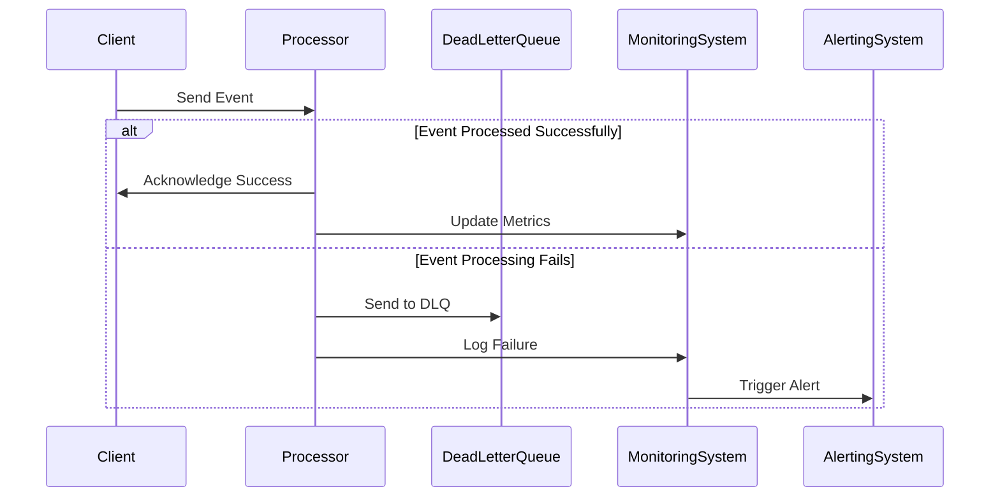

## 9.7 Resilient Event Processing

In the world of reactive programming, event-driven architectures are pivotal for building scalable and responsive systems. However, ensuring the resilience of these systems is crucial, especially when dealing with failures and unprocessable events. In this section, we will delve into resilient event processing in Scala, focusing on implementing dead letter queues, handling unprocessable events, and monitoring and alerting on event failures.

### Introduction to Resilient Event Processing

Resilient event processing is about designing systems that can gracefully handle failures, ensuring that events are not lost and that the system can recover from errors. This involves strategies for dealing with events that cannot be processed due to various reasons, such as data corruption, system errors, or unexpected conditions.

#### Key Concepts

- **Dead Letter Queues (DLQs):** These are special queues used to store events that cannot be processed successfully. They act as a safety net, ensuring that unprocessable events are not lost and can be analyzed or retried later.
- **Unprocessable Events:** Events that cannot be handled by the system due to errors or exceptions. Identifying and managing these events is crucial for system resilience.
- **Monitoring and Alerting:** Keeping track of event processing, identifying failures, and alerting relevant stakeholders to take corrective actions.

### Implementing Dead Letter Queues

Dead letter queues are an essential component of resilient event processing. They provide a mechanism to capture and store events that fail to be processed, allowing for later analysis and reprocessing.

#### Setting Up Dead Letter Queues

To implement a dead letter queue in Scala, we can use libraries like Akka, which provides built-in support for dead letter handling. Let's explore how to set up a dead letter queue using Akka.

```scala
import akka.actor.{Actor, ActorSystem, Props, DeadLetter}

// Define an actor that processes messages
class MessageProcessor extends Actor {
  def receive: Receive = {
    case message: String =>
      if (message.contains("error")) throw new RuntimeException("Processing error")
      else println(s"Processed message: $message")
  }
}

// Define an actor that handles dead letters
class DeadLetterHandler extends Actor {
  def receive: Receive = {
    case deadLetter: DeadLetter =>
      println(s"Dead letter received: ${deadLetter.message}")
  }
}

object DeadLetterQueueExample extends App {
  val system = ActorSystem("DeadLetterQueueSystem")
  val processor = system.actorOf(Props[MessageProcessor], "processor")
  val deadLetterHandler = system.actorOf(Props[DeadLetterHandler], "deadLetterHandler")

  // Subscribe the dead letter handler to the dead letter channel
  system.eventStream.subscribe(deadLetterHandler, classOf[DeadLetter])

  // Send messages to the processor
  processor ! "Hello, World!"
  processor ! "This will cause an error"
}
```

In this example, we define a `MessageProcessor` actor that processes messages. If a message contains the word "error," it throws an exception, simulating a processing failure. The `DeadLetterHandler` actor subscribes to the dead letter channel and logs any dead letters received.

#### Key Considerations

- **Subscription to Dead Letters:** Ensure that the dead letter handler is subscribed to the dead letter channel to capture all unprocessable events.
- **Logging and Analysis:** Log dead letters for analysis and debugging. This helps in understanding why certain events could not be processed.
- **Retries and Recovery:** Consider implementing retry mechanisms to attempt reprocessing of dead letters after a certain period or under specific conditions.

### Handling Unprocessable Events

Unprocessable events are those that cannot be handled by the system due to errors or exceptions. Proper handling of these events is crucial to maintain system stability and resilience.

#### Strategies for Handling Unprocessable Events

1. **Validation and Preprocessing:**
   - Validate events before processing to ensure they meet the required criteria.
   - Use preprocessing steps to clean or transform events into a suitable format.

2. **Error Handling and Logging:**
   - Implement robust error handling to catch exceptions and prevent system crashes.
   - Log errors with sufficient context to facilitate debugging and analysis.

3. **Fallback Mechanisms:**
   - Use fallback mechanisms to provide alternative processing paths for unprocessable events.
   - Consider using default values or alternative logic to handle exceptions gracefully.

4. **Circuit Breakers:**
   - Implement circuit breakers to prevent cascading failures in case of repeated errors.
   - Use libraries like Akka or Resilience4j to integrate circuit breakers into your system.

#### Example: Handling Unprocessable Events with Akka

```scala
import akka.actor.{Actor, ActorSystem, Props}
import akka.pattern.CircuitBreaker
import scala.concurrent.duration._
import scala.util.{Failure, Success}

class ResilientProcessor extends Actor {
  import context.dispatcher

  // Define a circuit breaker with a max failure count and reset timeout
  val breaker = new CircuitBreaker(
    scheduler = context.system.scheduler,
    maxFailures = 5,
    callTimeout = 10.seconds,
    resetTimeout = 1.minute
  )

  def receive: Receive = {
    case message: String =>
      breaker.withCircuitBreaker(processMessage(message)).onComplete {
        case Success(_) => println(s"Successfully processed message: $message")
        case Failure(ex) => println(s"Failed to process message: $message, error: ${ex.getMessage}")
      }
  }

  def processMessage(message: String): Unit = {
    if (message.contains("error")) throw new RuntimeException("Processing error")
    else println(s"Processed message: $message")
  }
}

object UnprocessableEventExample extends App {
  val system = ActorSystem("ResilientSystem")
  val processor = system.actorOf(Props[ResilientProcessor], "resilientProcessor")

  // Send messages to the processor
  processor ! "Hello, World!"
  processor ! "This will cause an error"
}
```

In this example, we use a circuit breaker to handle unprocessable events. The `ResilientProcessor` actor uses the circuit breaker to wrap the `processMessage` method, preventing repeated failures from overwhelming the system.

### Monitoring and Alerting on Event Failures

Monitoring and alerting are critical components of resilient event processing. They enable proactive identification of issues and facilitate timely intervention to prevent system degradation.

#### Implementing Monitoring and Alerting

1. **Metrics Collection:**
   - Use libraries like Kamon or Prometheus to collect metrics on event processing.
   - Track metrics such as processing time, error rates, and throughput.

2. **Logging and Visualization:**
   - Implement structured logging to capture detailed information about event processing.
   - Use visualization tools like Grafana to create dashboards for real-time monitoring.

3. **Alerting Mechanisms:**
   - Set up alerting mechanisms to notify stakeholders of critical failures or anomalies.
   - Use tools like PagerDuty or OpsGenie to manage alerts and escalations.

#### Example: Monitoring with Kamon

```scala
import kamon.Kamon
import kamon.metric.MeasurementUnit
import kamon.prometheus.PrometheusReporter
import akka.actor.{Actor, ActorSystem, Props}

class MonitoringProcessor extends Actor {
  // Define a counter metric for processed messages
  val processedCounter = Kamon.counter("processed_messages").withoutTags()

  def receive: Receive = {
    case message: String =>
      processedCounter.increment()
      println(s"Processed message: $message")
  }
}

object MonitoringExample extends App {
  Kamon.init()
  Kamon.addReporter(new PrometheusReporter())

  val system = ActorSystem("MonitoringSystem")
  val processor = system.actorOf(Props[MonitoringProcessor], "monitoringProcessor")

  // Send messages to the processor
  processor ! "Hello, World!"
  processor ! "Another message"
}
```

In this example, we use Kamon to monitor event processing. The `MonitoringProcessor` actor increments a counter metric for each processed message. The PrometheusReporter is used to expose metrics for collection and visualization.

### Visualizing Resilient Event Processing

To better understand the flow of resilient event processing, let's visualize the architecture using a sequence diagram.



This diagram illustrates the flow of events in a resilient event processing system. The client sends an event to the processor. If the event is processed successfully, the processor acknowledges the success and updates the monitoring system. If the processing fails, the event is sent to the dead letter queue, and the failure is logged, triggering an alert.

### Try It Yourself

To deepen your understanding of resilient event processing, try modifying the code examples provided:

- **Experiment with Different Error Conditions:** Modify the message processing logic to simulate different types of errors and observe how the system handles them.
- **Implement Retry Logic:** Add retry mechanisms to the dead letter handler to attempt reprocessing of unprocessable events.
- **Enhance Monitoring:** Extend the monitoring example to track additional metrics, such as error rates or processing latency.

### Knowledge Check

- **What is a dead letter queue, and why is it important in resilient event processing?**
- **How can circuit breakers help in handling unprocessable events?**
- **What are some key metrics to monitor in an event processing system?**

### Conclusion

Resilient event processing is a critical aspect of building robust reactive systems. By implementing dead letter queues, handling unprocessable events, and setting up effective monitoring and alerting, we can ensure that our systems remain stable and responsive even in the face of failures. Remember, resilience is not just about preventing failures but also about recovering gracefully when they occur.

## Quiz Time!



### What is the primary purpose of a dead letter queue in event processing?

- [x] To store events that cannot be processed successfully
- [ ] To increase the throughput of event processing
- [ ] To prioritize certain events over others
- [ ] To log all processed events

> **Explanation:** A dead letter queue is used to store events that cannot be processed successfully, allowing for later analysis and reprocessing.

### How does a circuit breaker contribute to resilient event processing?

- [x] It prevents repeated failures from overwhelming the system
- [ ] It increases the speed of event processing
- [ ] It logs all successful events
- [ ] It ensures all events are processed in order

> **Explanation:** A circuit breaker prevents repeated failures from overwhelming the system by temporarily halting processing when a certain failure threshold is reached.

### Which library can be used in Scala for monitoring event processing metrics?

- [x] Kamon
- [ ] Log4j
- [ ] Apache Commons
- [ ] JUnit

> **Explanation:** Kamon is a library used in Scala for monitoring event processing metrics, providing tools for metrics collection and visualization.

### What is a key benefit of using structured logging in event processing?

- [x] It captures detailed information for debugging and analysis
- [ ] It reduces the size of log files
- [ ] It increases the speed of log processing
- [ ] It ensures logs are stored in a database

> **Explanation:** Structured logging captures detailed information for debugging and analysis, making it easier to understand the context of events.

### Which tool can be used for alerting on event failures in a Scala application?

- [x] PagerDuty
- [ ] GitHub
- [ ] IntelliJ IDEA
- [ ] ScalaTest

> **Explanation:** PagerDuty is a tool that can be used for alerting on event failures in a Scala application, helping manage alerts and escalations.

### What is the role of a dead letter handler in an Akka-based system?

- [x] To process messages that could not be handled by the main actor
- [ ] To increase the speed of message processing
- [ ] To prioritize messages based on their content
- [ ] To log all successful message deliveries

> **Explanation:** A dead letter handler processes messages that could not be handled by the main actor, ensuring they are logged and analyzed.

### How can you ensure that unprocessable events are not lost in a system?

- [x] By using a dead letter queue
- [ ] By increasing the system's processing speed
- [ ] By logging all events to a file
- [ ] By prioritizing certain events over others

> **Explanation:** Using a dead letter queue ensures that unprocessable events are not lost, allowing for later analysis and reprocessing.

### What is a common use case for implementing fallback mechanisms in event processing?

- [x] To provide alternative processing paths for unprocessable events
- [ ] To increase the speed of event processing
- [ ] To log all processed events
- [ ] To ensure events are processed in order

> **Explanation:** Fallback mechanisms provide alternative processing paths for unprocessable events, helping maintain system stability.

### Which metric is important to track for understanding the performance of an event processing system?

- [x] Processing time
- [ ] Number of actors
- [ ] Size of the codebase
- [ ] Number of developers

> **Explanation:** Tracking processing time is important for understanding the performance of an event processing system, as it indicates how quickly events are handled.

### True or False: Circuit breakers can be used to prevent cascading failures in event processing systems.

- [x] True
- [ ] False

> **Explanation:** Circuit breakers can be used to prevent cascading failures in event processing systems by temporarily halting processing when a certain failure threshold is reached.



Remember, this is just the beginning. As you progress, you'll build more complex and interactive systems. Keep experimenting, stay curious, and enjoy the journey!
