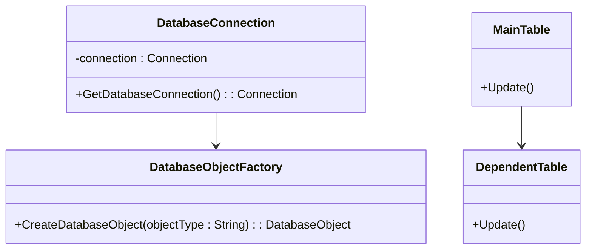

## 1.1 What are SQL Design Patterns?

In the realm of software engineering, design patterns are well-established solutions to common problems that arise during software development. SQL design patterns, specifically, are reusable solutions that address frequent challenges encountered in SQL database design and querying. These patterns are instrumental in enhancing the efficiency, maintainability, and scalability of SQL code, making them a vital tool for expert software engineers and architects.

### Definition and Purpose

**Definition**: SQL design patterns are standardized, reusable solutions to common problems in SQL database design and querying. They provide a blueprint for solving specific issues, allowing developers to apply proven strategies rather than reinventing the wheel.

**Purpose**: The primary purpose of SQL design patterns is to streamline the development process by offering pre-defined solutions that improve code efficiency, maintainability, and scalability. By adopting these patterns, developers can ensure that their SQL code is robust, optimized, and easier to manage over time.

### Scope and Applicability

SQL design patterns are applicable across various SQL dialects and database systems, including MySQL, PostgreSQL, Oracle, and SQL Server. They are versatile and can be adapted to suit the specific requirements of different projects and environments. Whether you are working on a small-scale application or a large enterprise system, SQL design patterns can help you achieve better results.

### Key Concepts and Terminology

Before diving into specific SQL design patterns, it's essential to understand some key concepts and terminology that underpin these patterns:

- **Normalization**: The process of organizing data in a database to reduce redundancy and improve data integrity. Normalization involves dividing a database into tables and defining relationships between them.

- **Denormalization**: The process of combining tables to improve read performance at the expense of write performance and data integrity. Denormalization is often used in data warehousing and analytical applications.

- **Indexing**: A technique used to improve the speed of data retrieval operations on a database table. Indexes are created on columns to allow quick lookups and efficient query execution.

- **Transactions**: A sequence of database operations that are treated as a single unit of work. Transactions ensure data integrity by adhering to the ACID properties (Atomicity, Consistency, Isolation, Durability).

- **Joins**: SQL operations that combine rows from two or more tables based on a related column. Joins are used to retrieve data from multiple tables in a single query.

### Common SQL Design Patterns

Let's explore some of the most common SQL design patterns and their applications:

#### 1. The Singleton Pattern

**Intent**: Ensure that a database connection is created only once and reused throughout the application.

**Applicability**: Use this pattern when you need to manage a single instance of a database connection to improve resource utilization and performance.

**Sample Code Snippet**:

```sql
-- Pseudocode for Singleton Pattern in SQL
CREATE PROCEDURE GetDatabaseConnection()
BEGIN
    IF connection IS NULL THEN
        SET connection = CreateNewConnection();
    END IF;
    RETURN connection;
END;
```

**Design Considerations**: The Singleton pattern is particularly useful in environments where database connections are expensive to create and manage. However, it can lead to issues in multi-threaded applications if not implemented correctly.

#### 2. The Factory Pattern

**Intent**: Provide an interface for creating database objects without specifying their concrete classes.

**Applicability**: Use this pattern when you need to create different types of database objects dynamically based on specific criteria.

**Sample Code Snippet**:

```sql
-- Pseudocode for Factory Pattern in SQL
CREATE PROCEDURE CreateDatabaseObject(objectType VARCHAR)
BEGIN
    CASE objectType
        WHEN 'Table' THEN
            RETURN CreateTable();
        WHEN 'View' THEN
            RETURN CreateView();
        WHEN 'Index' THEN
            RETURN CreateIndex();
    END CASE;
END;
```

**Design Considerations**: The Factory pattern is beneficial for managing complex object creation logic and promoting code reusability. However, it can increase the complexity of the codebase if not managed properly.

#### 3. The Observer Pattern

**Intent**: Define a one-to-many dependency between objects so that when one object changes state, all its dependents are notified and updated automatically.

**Applicability**: Use this pattern when you need to maintain consistency between related database objects or when changes in one object should trigger updates in others.

**Sample Code Snippet**:

```sql
-- Pseudocode for Observer Pattern in SQL
CREATE TRIGGER UpdateDependentObjects
AFTER UPDATE ON MainTable
FOR EACH ROW
BEGIN
    UPDATE DependentTable
    SET column = NEW.value
    WHERE related_id = OLD.id;
END;
```

**Design Considerations**: The Observer pattern is useful for maintaining data consistency and automating updates. However, it can lead to performance issues if not implemented carefully, especially in systems with high update frequencies.

### Visualizing SQL Design Patterns

To better understand how SQL design patterns work, let's visualize the relationships and interactions between different components using a Mermaid.js diagram.



**Diagram Description**: This diagram illustrates the interactions between different components in a database system using SQL design patterns. The `DatabaseConnection` class manages a singleton connection, while the `DatabaseObjectFactory` class creates different database objects. The `MainTable` and `DependentTable` classes demonstrate the Observer pattern, where changes in the `MainTable` trigger updates in the `DependentTable`.

### Try It Yourself

To gain a deeper understanding of SQL design patterns, try experimenting with the code examples provided. Modify the patterns to suit your specific use cases and observe how they impact the performance and maintainability of your SQL code.

### References and Further Reading

- [SQL Design Patterns: Expert Solutions for Database Developers](https://www.oreilly.com/library/view/sql-design-patterns/9780596009762/)
- [Database Design Patterns](https://www.tutorialspoint.com/database_design_patterns/index.htm)
- [SQL Performance Explained](https://sql-performance-explained.com/)

### Knowledge Check

To reinforce your understanding of SQL design patterns, consider the following questions:

1. What are SQL design patterns, and why are they important?
2. How does the Singleton pattern improve database connection management?
3. In what scenarios would you use the Factory pattern in SQL?
4. What are the potential drawbacks of using the Observer pattern in a high-frequency update environment?

### Embrace the Journey

Remember, mastering SQL design patterns is a journey that requires practice and experimentation. As you progress, you'll discover new ways to optimize your SQL code and build more efficient and scalable database solutions. Keep exploring, stay curious, and enjoy the process!

## Quiz Time!



### What is the primary purpose of SQL design patterns?

- [x] To provide reusable solutions to common database design and querying problems
- [ ] To replace SQL dialects with a new standard
- [ ] To eliminate the need for database normalization
- [ ] To automate database indexing

> **Explanation:** SQL design patterns offer standardized solutions to frequent challenges in database design and querying, enhancing efficiency and maintainability.

### Which SQL design pattern ensures a single instance of a database connection?

- [x] Singleton Pattern
- [ ] Factory Pattern
- [ ] Observer Pattern
- [ ] Decorator Pattern

> **Explanation:** The Singleton pattern is used to manage a single instance of a database connection, improving resource utilization.

### When would you use the Factory pattern in SQL?

- [x] When you need to create different types of database objects dynamically
- [ ] When you need to ensure a single instance of a database connection
- [ ] When you need to maintain consistency between related database objects
- [ ] When you need to automate database indexing

> **Explanation:** The Factory pattern provides an interface for creating database objects without specifying their concrete classes.

### What is a potential drawback of the Observer pattern?

- [x] It can lead to performance issues in high-frequency update environments
- [ ] It eliminates the need for database normalization
- [ ] It complicates the creation of database objects
- [ ] It prevents the use of transactions

> **Explanation:** The Observer pattern can cause performance issues if not implemented carefully, especially in systems with high update frequencies.

### Which of the following is NOT a key concept related to SQL design patterns?

- [ ] Normalization
- [ ] Indexing
- [ ] Transactions
- [x] Machine Learning

> **Explanation:** While machine learning is a significant field, it is not directly related to SQL design patterns.

### What does the Singleton pattern help manage in SQL?

- [x] Database connections
- [ ] Index creation
- [ ] Query optimization
- [ ] Data normalization

> **Explanation:** The Singleton pattern helps manage database connections by ensuring a single instance is used throughout the application.

### Which pattern is used to maintain consistency between related database objects?

- [ ] Singleton Pattern
- [ ] Factory Pattern
- [x] Observer Pattern
- [ ] Strategy Pattern

> **Explanation:** The Observer pattern is used to define a one-to-many dependency, ensuring consistency between related objects.

### What is the role of indexing in SQL design patterns?

- [x] To improve the speed of data retrieval operations
- [ ] To automate database normalization
- [ ] To create database objects dynamically
- [ ] To manage database connections

> **Explanation:** Indexing is a technique used to enhance the speed of data retrieval operations in a database.

### How does the Factory pattern benefit SQL development?

- [x] By promoting code reusability and managing complex object creation logic
- [ ] By ensuring a single instance of a database connection
- [ ] By automating database indexing
- [ ] By eliminating the need for transactions

> **Explanation:** The Factory pattern benefits SQL development by promoting code reusability and managing complex object creation logic.

### True or False: SQL design patterns are only applicable to MySQL databases.

- [ ] True
- [x] False

> **Explanation:** SQL design patterns are applicable across various SQL dialects and database systems, not limited to MySQL.


