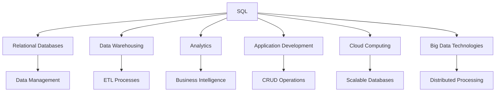

## 1.2 The Role of SQL in Modern Data Architecture

In the ever-evolving landscape of data management, SQL (Structured Query Language) remains a cornerstone of modern data architecture. As the standard language for relational databases, SQL plays a crucial role in data warehousing, analytics, and application development. Furthermore, its adaptability to cloud computing and big data technologies underscores its enduring relevance. In this section, we will explore the foundational aspects of SQL, its integration into various data systems, and its evolution in response to emerging technological trends.

### Foundation of Data Management

SQL is the lingua franca of relational databases, providing a standardized way to interact with data. Its declarative nature allows users to specify what they want to achieve without detailing how to accomplish it, making it accessible yet powerful. Let's delve into the key aspects that establish SQL as the foundation of data management.

#### Declarative Language

SQL's declarative syntax enables users to focus on the "what" rather than the "how." This abstraction simplifies complex operations, allowing developers to write queries that are both efficient and easy to understand. For example, consider a simple query to retrieve customer names from a database:

```sql
SELECT name FROM customers WHERE active = true;
```

This query succinctly expresses the desired outcome without requiring the user to specify the underlying data retrieval mechanisms.

#### Standardization

SQL's standardization across various database management systems (DBMS) ensures consistency and interoperability. The SQL standard, maintained by the International Organization for Standardization (ISO), provides a common framework that vendors extend with proprietary features. This standardization facilitates the migration of applications across different platforms and promotes a unified approach to data management.

#### Robustness and Flexibility

SQL's robustness is evident in its comprehensive set of features, including data manipulation, transaction control, and data definition. Its flexibility allows for complex queries, data transformations, and integration with other programming languages. SQL's ability to handle diverse data types and structures makes it suitable for a wide range of applications, from simple data retrieval to complex analytical processing.

### Integration with Data Systems

SQL's integration capabilities extend beyond traditional databases, playing a pivotal role in data warehousing, analytics, and application development. Let's explore how SQL integrates with these systems to enhance data management and analysis.

#### Data Warehousing

Data warehousing involves the consolidation of data from multiple sources into a central repository for analysis and reporting. SQL is integral to this process, providing the tools necessary for data extraction, transformation, and loading (ETL). In a data warehouse, SQL is used to:

- **Extract** data from various sources, such as transactional databases, flat files, and external APIs.
- **Transform** data into a consistent format, applying business rules and aggregations.
- **Load** data into the warehouse, ensuring data integrity and consistency.

SQL's role in data warehousing is further enhanced by its support for complex queries, aggregations, and analytical functions, enabling users to derive insights from large datasets.

#### Analytics

SQL's analytical capabilities are leveraged in business intelligence (BI) and data analytics platforms to perform complex data analysis. SQL supports various analytical functions, such as:

- **Window Functions**: Allow for calculations across a set of table rows related to the current row, enabling advanced analytics like running totals and moving averages.
- **Common Table Expressions (CTEs)**: Simplify complex queries by breaking them into manageable parts.
- **Set Operations**: Facilitate data comparison and combination through operations like UNION, INTERSECT, and EXCEPT.

These features make SQL an indispensable tool for data analysts and scientists, enabling them to extract actionable insights from data.

#### Application Development

In application development, SQL serves as the bridge between applications and databases. It provides a standardized way to perform CRUD (Create, Read, Update, Delete) operations, ensuring data consistency and integrity. SQL's integration with application development frameworks and ORM (Object-Relational Mapping) tools streamlines database interactions, allowing developers to focus on business logic rather than data management.

### Evolving Landscape

As technology evolves, so too does SQL. Its adaptation to cloud computing and big data technologies demonstrates its resilience and versatility in the face of new challenges.

#### Cloud Computing

The rise of cloud computing has transformed the way organizations manage and store data. SQL's adaptability to cloud environments is evident in the proliferation of cloud-based SQL databases, such as Amazon RDS, Google Cloud SQL, and Azure SQL Database. These platforms offer scalable, managed database services that leverage SQL's strengths while providing the benefits of cloud infrastructure, such as:

- **Scalability**: Automatically adjust resources to meet demand.
- **High Availability**: Ensure data is accessible and resilient to failures.
- **Cost Efficiency**: Pay for only the resources used.

SQL's role in cloud computing extends to serverless architectures, where it powers data processing in serverless databases like Amazon Aurora Serverless and Azure SQL Database Serverless. These solutions offer on-demand scalability and reduced operational overhead, making them ideal for dynamic workloads.

#### Big Data Technologies

SQL's integration with big data technologies highlights its adaptability to handle large-scale data processing. SQL-on-Hadoop engines, such as Apache Hive and Apache Impala, enable SQL queries on distributed data stored in Hadoop Distributed File System (HDFS). These engines provide a familiar SQL interface for big data processing, allowing organizations to leverage existing SQL skills and tools.

Moreover, SQL's role in big data extends to real-time data processing platforms like Apache Kafka and Apache Flink, where SQL is used to define streaming data transformations and analytics. This integration empowers organizations to process and analyze data in real-time, driving timely decision-making and insights.

### Visualizing SQL's Role in Modern Data Architecture

To better understand SQL's role in modern data architecture, let's visualize its integration with various data systems and technologies.



**Diagram Description**: This diagram illustrates SQL's central role in modern data architecture, highlighting its integration with relational databases, data warehousing, analytics, application development, cloud computing, and big data technologies.

### Conclusion

SQL's enduring relevance in modern data architecture is a testament to its robustness, flexibility, and adaptability. As the foundation of data management, SQL provides a standardized language for interacting with data, ensuring consistency and interoperability across diverse systems. Its integration with data warehousing, analytics, and application development underscores its versatility, while its adaptation to cloud computing and big data technologies highlights its resilience in the face of new challenges.

As we continue to explore the role of SQL in modern data architecture, remember that this is just the beginning. SQL's evolution is ongoing, and its potential is vast. Stay curious, keep experimenting, and embrace the journey of mastering SQL design patterns.

## Quiz Time!



### What is the primary advantage of SQL's declarative nature?

- [x] It allows users to focus on the "what" rather than the "how."
- [ ] It requires detailed procedural instructions.
- [ ] It limits SQL's flexibility.
- [ ] It complicates query writing.

> **Explanation:** SQL's declarative nature allows users to specify what they want to achieve without detailing how to accomplish it, simplifying complex operations.

### How does SQL standardization benefit developers?

- [x] It ensures consistency and interoperability across different DBMS.
- [ ] It restricts SQL to a single platform.
- [ ] It complicates migration between databases.
- [ ] It limits SQL's functionality.

> **Explanation:** SQL standardization provides a common framework that facilitates migration across platforms and promotes a unified approach to data management.

### In data warehousing, what role does SQL play?

- [x] It is used for data extraction, transformation, and loading (ETL).
- [ ] It only supports data visualization.
- [ ] It is not involved in data warehousing.
- [ ] It only handles data storage.

> **Explanation:** SQL is integral to data warehousing, providing tools for ETL processes and supporting complex queries and analytics.

### Which SQL feature supports advanced analytics like running totals?

- [x] Window Functions
- [ ] Set Operations
- [ ] Common Table Expressions
- [ ] Subqueries

> **Explanation:** Window functions allow for calculations across a set of table rows related to the current row, enabling advanced analytics.

### How does SQL integrate with application development?

- [x] It provides a standardized way to perform CRUD operations.
- [ ] It replaces application logic.
- [ ] It only supports data visualization.
- [ ] It is not used in application development.

> **Explanation:** SQL serves as the bridge between applications and databases, providing a standardized way to perform CRUD operations.

### What is a benefit of cloud-based SQL databases?

- [x] Scalability and high availability
- [ ] Limited resource allocation
- [ ] Manual resource management
- [ ] Fixed pricing models

> **Explanation:** Cloud-based SQL databases offer scalability, high availability, and cost efficiency, leveraging cloud infrastructure benefits.

### How does SQL adapt to big data technologies?

- [x] Through SQL-on-Hadoop engines and real-time processing platforms
- [ ] By replacing Hadoop
- [ ] By limiting data processing capabilities
- [ ] By only supporting batch processing

> **Explanation:** SQL adapts to big data through SQL-on-Hadoop engines and real-time processing platforms, enabling SQL queries on distributed data.

### What is a key feature of serverless SQL databases?

- [x] On-demand scalability and reduced operational overhead
- [ ] Fixed resource allocation
- [ ] Manual scaling
- [ ] High operational overhead

> **Explanation:** Serverless SQL databases offer on-demand scalability and reduced operational overhead, making them ideal for dynamic workloads.

### Which SQL feature simplifies complex queries by breaking them into manageable parts?

- [x] Common Table Expressions (CTEs)
- [ ] Set Operations
- [ ] Subqueries
- [ ] Window Functions

> **Explanation:** CTEs simplify complex queries by breaking them into manageable parts, improving readability and maintainability.

### True or False: SQL is only relevant for traditional relational databases.

- [ ] True
- [x] False

> **Explanation:** SQL is relevant beyond traditional relational databases, integrating with cloud computing, big data technologies, and more.


