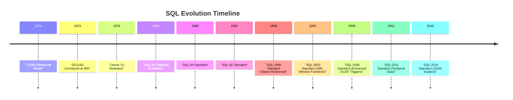

## 1.3 History and Evolution of SQL and Its Variants

Structured Query Language, commonly known as SQL, is the cornerstone of relational database management systems (RDBMS). Its evolution from a research project at IBM to a standardized language with numerous variants is a fascinating journey that reflects the broader evolution of data management technologies. In this section, we will delve into the history of SQL, its standardization, and the development of its various dialects, including T-SQL, PL/SQL, PL/pgSQL, MySQL, and SQLite. We will also explore modern extensions that have kept SQL relevant in today's data-driven world.

### Origins: The Development of SQL at IBM in the 1970s

The story of SQL begins in the early 1970s at IBM's San Jose Research Laboratory. The development of SQL was closely tied to the creation of the relational database model by Edgar F. Codd, an IBM researcher. Codd's groundbreaking paper, "A Relational Model of Data for Large Shared Data Banks," published in 1970, laid the theoretical foundation for relational databases. His work proposed a new way of organizing data using tables, which allowed for more flexible and efficient data retrieval compared to hierarchical and network models.

#### The Birth of SEQUEL

In response to Codd's relational model, IBM initiated a project to develop a practical implementation. This led to the creation of SEQUEL (Structured English Query Language), designed to allow users to interact with relational databases using a language that resembled English. The SEQUEL project was led by Donald D. Chamberlin and Raymond F. Boyce, who aimed to create a language that was both powerful and easy to use.

SEQUEL was first implemented as part of IBM's System R, a prototype relational database management system. System R demonstrated the feasibility of the relational model and the potential of SEQUEL as a query language. However, due to trademark issues, SEQUEL was later renamed SQL.

#### The Rise of SQL

By the late 1970s, SQL had gained significant attention in the database community. Its ability to express complex queries in a concise and readable manner made it an attractive choice for database management. IBM's success with System R and SQL paved the way for the commercialization of relational databases.

In 1979, Oracle Corporation released the first commercially available SQL-based RDBMS, Oracle V2. This marked the beginning of SQL's widespread adoption in the industry. Other companies, such as Sybase and Microsoft, soon followed suit, further solidifying SQL's position as the standard language for relational databases.

### Standardization: ANSI and ISO Standards for SQL

As SQL gained popularity, the need for standardization became apparent. Different vendors were implementing their own versions of SQL, leading to compatibility issues and fragmentation. To address this, the American National Standards Institute (ANSI) and the International Organization for Standardization (ISO) began working on a standardized version of SQL.

#### SQL-86: The First Standard

In 1986, ANSI published the first SQL standard, known as SQL-86 or SQL1. This standard provided a formal specification for the core features of SQL, including data definition, data manipulation, and data control. SQL-86 laid the groundwork for future enhancements and ensured a degree of consistency across different implementations.

#### SQL-89 and SQL-92: Expanding the Standard

The SQL standard underwent several revisions in the following years. SQL-89 introduced minor improvements and clarifications, while SQL-92, also known as SQL2, represented a significant expansion of the language. SQL-92 added support for new data types, enhanced query capabilities, and introduced features such as integrity constraints and transaction management.

#### SQL:1999 and Beyond: Embracing New Technologies

The SQL:1999 standard, also known as SQL3, marked a major evolution in SQL's capabilities. It introduced object-relational features, allowing for more complex data structures and relationships. SQL:1999 also added support for recursive queries, triggers, and procedural extensions, making SQL a more versatile language for application development.

Subsequent standards, including SQL:2003, SQL:2006, SQL:2008, SQL:2011, and SQL:2016, continued to build on this foundation. These standards introduced features such as XML integration, window functions, and JSON support, reflecting the growing importance of data interchange and analytics in modern applications.

### Variants: Overview of T-SQL, PL/SQL, PL/pgSQL, MySQL, and SQLite

While the SQL standard provides a common foundation, different database vendors have developed their own dialects to extend SQL's functionality and optimize performance. Let's explore some of the most prominent SQL variants and their unique features.

#### T-SQL (Transact-SQL)

Transact-SQL, or T-SQL, is Microsoft's proprietary extension of SQL used in Microsoft SQL Server and Azure SQL Database. T-SQL enhances standard SQL with additional procedural programming capabilities, including control-of-flow language, error handling, and support for variables and functions.

```sql
-- Example of a T-SQL stored procedure
CREATE PROCEDURE GetEmployeeDetails
    @EmployeeID INT
AS
BEGIN
    SELECT FirstName, LastName, JobTitle
    FROM Employees
    WHERE EmployeeID = @EmployeeID;
END;
```

T-SQL is particularly well-suited for building complex business logic within the database, allowing developers to create robust and efficient applications.

#### PL/SQL (Procedural Language/SQL)

PL/SQL is Oracle's procedural extension to SQL, designed to provide a seamless integration of SQL with procedural constructs. PL/SQL allows developers to write complex scripts and stored procedures that can be executed within the Oracle Database environment.

```sql
-- Example of a PL/SQL block
DECLARE
    v_employee_name VARCHAR2(100);
BEGIN
    SELECT first_name || ' ' || last_name
    INTO v_employee_name
    FROM employees
    WHERE employee_id = 101;
    DBMS_OUTPUT.PUT_LINE('Employee Name: ' || v_employee_name);
END;
```

PL/SQL is known for its strong integration with Oracle's database features, making it a powerful tool for developing enterprise applications.

#### PL/pgSQL (Procedural Language/PostgreSQL)

PL/pgSQL is PostgreSQL's procedural language, designed to extend SQL with procedural capabilities. It allows developers to create functions and triggers that can be executed within the PostgreSQL database.

```sql
-- Example of a PL/pgSQL function
CREATE FUNCTION get_employee_salary(emp_id INT) RETURNS NUMERIC AS $$
DECLARE
    emp_salary NUMERIC;
BEGIN
    SELECT salary INTO emp_salary
    FROM employees
    WHERE employee_id = emp_id;
    RETURN emp_salary;
END;
$$ LANGUAGE plpgsql;
```

PL/pgSQL is highly flexible and supports a wide range of data types and operations, making it a popular choice for developers working with PostgreSQL.

#### MySQL

MySQL is an open-source relational database management system that has gained widespread popularity due to its ease of use and performance. While MySQL adheres to the SQL standard, it also includes several proprietary extensions to enhance functionality.

```sql
-- Example of a MySQL query with a user-defined variable
SET @total_salary = 0;
SELECT SUM(salary) INTO @total_salary
FROM employees;
SELECT @total_salary AS TotalSalary;
```

MySQL is known for its scalability and is often used in web applications and large-scale data processing environments.

#### SQLite

SQLite is a lightweight, self-contained SQL database engine that is widely used in embedded systems and mobile applications. Unlike other RDBMSs, SQLite does not require a separate server process, making it ideal for applications with limited resources.

```sql
-- Example of an SQLite query
CREATE TABLE employees (
    id INTEGER PRIMARY KEY,
    name TEXT,
    position TEXT
);
INSERT INTO employees (name, position) VALUES ('Alice', 'Developer');
SELECT * FROM employees;
```

SQLite's simplicity and portability have made it a popular choice for developers looking to integrate a database into their applications without the overhead of a full-fledged RDBMS.

### Modern Extensions: JSON Support, Window Functions, and Procedural Extensions

As data management needs have evolved, so too has SQL. Modern extensions have been introduced to address the growing demand for data interchange, analytics, and complex application logic.

#### JSON Support

JSON (JavaScript Object Notation) has become a ubiquitous format for data interchange, and SQL databases have adapted to support it. Many modern SQL databases, including PostgreSQL, MySQL, and SQL Server, offer native JSON support, allowing developers to store, query, and manipulate JSON data directly within the database.

```sql
-- Example of JSON support in PostgreSQL
CREATE TABLE orders (
    id SERIAL PRIMARY KEY,
    order_data JSONB
);
INSERT INTO orders (order_data) VALUES ('{"customer": "John Doe", "items": [{"product": "Laptop", "quantity": 1}]}');
SELECT order_data->>'customer' AS customer_name FROM orders;
```

JSON support in SQL databases enables seamless integration with web applications and APIs, facilitating data exchange and processing.

#### Window Functions

Window functions are a powerful feature introduced in SQL:2003 that allow developers to perform calculations across a set of rows related to the current row. Unlike aggregate functions, window functions do not collapse rows into a single result, making them ideal for complex analytical queries.

```sql
-- Example of a window function in SQL
SELECT employee_id, salary,
       RANK() OVER (ORDER BY salary DESC) AS salary_rank
FROM employees;
```

Window functions have become an essential tool for data analysis and reporting, enabling developers to perform sophisticated calculations with ease.

#### Procedural Extensions

Procedural extensions, such as stored procedures and user-defined functions, have been a part of SQL for many years. These extensions allow developers to encapsulate complex logic within the database, improving performance and maintainability.

Modern SQL databases continue to enhance their procedural capabilities, offering features such as error handling, control-of-flow constructs, and support for complex data types. These enhancements enable developers to build robust applications that leverage the full power of the database.

### SQL Evolution

To better understand the evolution of SQL, let's visualize its development and the introduction of key features over time.



This timeline illustrates the key milestones in SQL's history, highlighting the continuous evolution of the language to meet the changing needs of the industry.

### References and Links

For further reading on the history and evolution of SQL, consider exploring the following resources:

- [IBM's System R Project](https://www.ibm.com/ibm/history/ibm100/us/en/icons/systemr/)
- [Oracle's History of SQL](https://www.oracle.com/database/what-is-sql/)
- [PostgreSQL Documentation on PL/pgSQL](https://www.postgresql.org/docs/current/plpgsql.html)
- [MySQL Documentation](https://dev.mysql.com/doc/)
- [SQLite Documentation](https://www.sqlite.org/docs.html)

### Knowledge Check

To reinforce your understanding of SQL's history and evolution, consider the following questions and exercises:

- Explain the significance of Codd's relational model in the development of SQL.
- Describe the key differences between T-SQL and PL/SQL.
- Provide an example of how JSON support can be used in a modern SQL database.
- Discuss the impact of SQL standardization on the database industry.
- Experiment with creating a simple SQLite database and executing basic queries.

### Embrace the Journey

Remember, understanding the history and evolution of SQL is just the beginning. As you continue to explore SQL design patterns and best practices, you'll gain the skills needed to build efficient, scalable, and secure database solutions. Keep experimenting, stay curious, and enjoy the journey!

## Quiz Time!



### Who developed the relational model that led to the creation of SQL?

- [x] Edgar F. Codd
- [ ] Donald D. Chamberlin
- [ ] Raymond F. Boyce
- [ ] Larry Ellison

> **Explanation:** Edgar F. Codd developed the relational model, which laid the foundation for SQL.

### What was the original name of SQL?

- [ ] Structured Query Language
- [x] SEQUEL
- [ ] System R
- [ ] SQL-86

> **Explanation:** SQL was originally named SEQUEL, which stood for Structured English Query Language.

### Which company released the first commercially available SQL-based RDBMS?

- [ ] IBM
- [x] Oracle Corporation
- [ ] Microsoft
- [ ] Sybase

> **Explanation:** Oracle Corporation released the first commercially available SQL-based RDBMS, Oracle V2, in 1979.

### What is the purpose of SQL standardization?

- [x] To ensure consistency across different implementations
- [ ] To create proprietary extensions
- [ ] To limit SQL's capabilities
- [ ] To replace relational databases

> **Explanation:** SQL standardization aims to ensure consistency and compatibility across different implementations.

### Which SQL standard introduced window functions?

- [ ] SQL-92
- [ ] SQL:1999
- [x] SQL:2003
- [ ] SQL:2011

> **Explanation:** SQL:2003 introduced window functions, enhancing SQL's analytical capabilities.

### What is T-SQL?

- [x] Microsoft's proprietary extension of SQL
- [ ] Oracle's procedural extension to SQL
- [ ] PostgreSQL's procedural language
- [ ] A lightweight SQL database engine

> **Explanation:** T-SQL is Microsoft's proprietary extension of SQL, used in SQL Server and Azure SQL Database.

### Which SQL variant is known for its strong integration with Oracle's database features?

- [ ] T-SQL
- [x] PL/SQL
- [ ] PL/pgSQL
- [ ] MySQL

> **Explanation:** PL/SQL is known for its strong integration with Oracle's database features.

### What is a key feature of SQLite?

- [ ] It requires a separate server process
- [ ] It is designed for large-scale data processing
- [x] It is a lightweight, self-contained SQL database engine
- [ ] It is primarily used in web applications

> **Explanation:** SQLite is a lightweight, self-contained SQL database engine, ideal for embedded systems and mobile applications.

### Which SQL standard introduced JSON support?

- [ ] SQL:1999
- [ ] SQL:2003
- [ ] SQL:2008
- [x] SQL:2016

> **Explanation:** SQL:2016 introduced JSON support, reflecting the growing importance of data interchange.

### True or False: SQL has remained unchanged since its inception.

- [ ] True
- [x] False

> **Explanation:** SQL has evolved significantly since its inception, with numerous standards and extensions introduced over the years.


