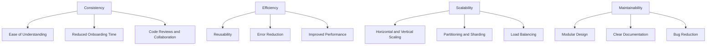

## 1.4 Importance of Design Patterns in SQL Development

In the realm of software engineering, design patterns serve as a cornerstone for crafting robust, scalable, and maintainable systems. SQL development is no exception. As databases form the backbone of most applications, understanding and applying design patterns in SQL is crucial for expert software engineers and architects. Let's delve into the importance of design patterns in SQL development, focusing on key aspects such as consistency, efficiency, scalability, and maintainability.

### Consistency: Promoting Uniform Coding Practices Across Teams

Consistency in SQL development is vital for ensuring that all team members adhere to the same coding standards and practices. Design patterns provide a shared vocabulary and a set of best practices that guide developers in writing SQL code. This uniformity is essential for several reasons:

- **Ease of Understanding**: When SQL code follows a consistent pattern, it becomes easier for team members to read and understand each other's work. This is particularly important in large teams where multiple developers may work on the same database schema or query logic.

- **Reduced Onboarding Time**: New team members can quickly get up to speed with the existing codebase when it adheres to well-known design patterns. This reduces the learning curve and accelerates the onboarding process.

- **Code Reviews and Collaboration**: Consistent coding practices streamline code reviews and facilitate collaboration. Reviewers can focus on the logic and functionality of the code rather than getting bogged down by stylistic differences.

#### Example: Consistent Naming Conventions

Consider a scenario where a team adopts a design pattern for naming database tables and columns. By following a consistent naming convention, such as using singular nouns for table names and snake_case for column names, the team ensures that everyone understands the structure and purpose of the database elements.

```sql
-- Consistent Naming Convention Example
CREATE TABLE customer (
    customer_id INT PRIMARY KEY,
    first_name VARCHAR(50),
    last_name VARCHAR(50),
    email VARCHAR(100)
);
```

### Efficiency: Streamlining Development Through Proven Solutions

Design patterns encapsulate proven solutions to common problems, allowing developers to avoid reinventing the wheel. By leveraging these patterns, SQL developers can streamline the development process and focus on solving more complex challenges.

- **Reusability**: Design patterns promote reusability by providing templates that can be adapted to different contexts. This reduces the time and effort required to develop new solutions from scratch.

- **Error Reduction**: By following established patterns, developers can minimize the risk of introducing errors. Patterns have been tested and refined over time, making them reliable choices for solving specific problems.

- **Improved Performance**: Some design patterns are specifically geared towards optimizing performance. By applying these patterns, developers can ensure that their SQL queries and database designs are efficient and performant.

#### Example: Using Indexes for Query Optimization

Indexes are a classic example of a design pattern that enhances query performance. By creating indexes on frequently queried columns, developers can significantly reduce query execution time.

```sql
-- Creating an Index for Query Optimization
CREATE INDEX idx_customer_email ON customer(email);
```

### Scalability: Designing Databases That Can Handle Growth

Scalability is a critical consideration in SQL development, especially for applications expected to handle increasing amounts of data and user traffic. Design patterns provide strategies for designing databases that can scale effectively.

- **Horizontal and Vertical Scaling**: Design patterns offer guidance on how to scale databases both horizontally (by adding more servers) and vertically (by upgrading existing hardware).

- **Partitioning and Sharding**: These patterns involve dividing a database into smaller, more manageable pieces, which can be distributed across multiple servers to improve performance and scalability.

- **Load Balancing**: Design patterns can help distribute the load evenly across database servers, ensuring that no single server becomes a bottleneck.

#### Example: Database Sharding

Database sharding is a design pattern that involves splitting a large database into smaller shards, each of which can be hosted on a separate server. This approach allows for horizontal scaling and improved performance.

```sql
-- Example of Sharding Strategy
-- Assume we have a large customer table that we want to shard based on customer_id

-- Shard 1: customer_id 1-1000
CREATE TABLE customer_shard_1 (
    customer_id INT PRIMARY KEY,
    first_name VARCHAR(50),
    last_name VARCHAR(50),
    email VARCHAR(100)
);

-- Shard 2: customer_id 1001-2000
CREATE TABLE customer_shard_2 (
    customer_id INT PRIMARY KEY,
    first_name VARCHAR(50),
    last_name VARCHAR(50),
    email VARCHAR(100)
);
```

### Maintainability: Simplifying Updates and Reducing Bugs

Maintainability is a key factor in the long-term success of any software system. Design patterns contribute to maintainability by providing clear, well-structured solutions that are easy to modify and extend.

- **Modular Design**: Design patterns encourage modular design, where different components of the database are decoupled and can be modified independently. This makes it easier to implement changes without affecting the entire system.

- **Clear Documentation**: Patterns often come with documentation that explains their purpose and usage. This documentation serves as a valuable resource for developers who need to understand and modify the code.

- **Bug Reduction**: By following established patterns, developers can avoid common pitfalls and reduce the likelihood of introducing bugs. Patterns provide a roadmap for implementing solutions that have been tested and proven to work.

#### Example: Using Stored Procedures for Business Logic

Stored procedures encapsulate business logic within the database, making it easier to maintain and update. By using stored procedures, developers can ensure that changes to business logic are centralized and consistent.

```sql
-- Example of a Stored Procedure for Business Logic
CREATE PROCEDURE update_customer_email(
    IN p_customer_id INT,
    IN p_new_email VARCHAR(100)
)
BEGIN
    UPDATE customer
    SET email = p_new_email
    WHERE customer_id = p_customer_id;
END;
```

### Visualizing SQL Design Patterns

To better understand the role of design patterns in SQL development, let's visualize some of the key concepts using Mermaid.js diagrams.



### Try It Yourself

To reinforce your understanding of SQL design patterns, try modifying the code examples provided in this section. For instance, experiment with creating different types of indexes or implementing a sharding strategy for a different table. Consider how these changes impact the performance and scalability of your database.

### References and Links

- [SQL Design Patterns: Expert Solutions for Database Developers](https://www.oreilly.com/library/view/sql-design-patterns/9780596009762/)
- [Database Sharding: Concepts and Examples](https://www.digitalocean.com/community/tutorials/database-sharding-explained)
- [Indexing in SQL: Best Practices and Examples](https://www.sqlshack.com/sql-indexing-and-best-practices/)

### Knowledge Check

- What are the benefits of using design patterns in SQL development?
- How do design patterns contribute to the consistency of SQL code?
- What is the role of design patterns in improving the scalability of databases?
- How can design patterns enhance the maintainability of SQL code?

### Embrace the Journey

Remember, mastering SQL design patterns is a journey. As you continue to explore and apply these patterns, you'll gain a deeper understanding of how to build efficient, scalable, and maintainable database solutions. Keep experimenting, stay curious, and enjoy the process!

### Summary

In this section, we've explored the importance of design patterns in SQL development, focusing on their role in promoting consistency, efficiency, scalability, and maintainability. By understanding and applying these patterns, expert software engineers and architects can craft robust database solutions that stand the test of time.

## Quiz Time!



### What is one of the primary benefits of using design patterns in SQL development?

- [x] Promoting consistency across teams
- [ ] Increasing the complexity of code
- [ ] Making code harder to understand
- [ ] Reducing the need for documentation

> **Explanation:** Design patterns promote consistency by providing a shared vocabulary and best practices for SQL development.

### How do design patterns contribute to the efficiency of SQL development?

- [x] By providing proven solutions to common problems
- [ ] By increasing the time required for development
- [ ] By making code more complex
- [ ] By reducing the need for testing

> **Explanation:** Design patterns streamline development by offering proven solutions, reducing the need to reinvent the wheel.

### What is a key advantage of using design patterns for scalability?

- [x] They provide strategies for horizontal and vertical scaling
- [ ] They make databases less scalable
- [ ] They increase the complexity of scaling
- [ ] They reduce the need for scaling

> **Explanation:** Design patterns offer strategies for scaling databases effectively, both horizontally and vertically.

### How do design patterns enhance the maintainability of SQL code?

- [x] By promoting modular design and clear documentation
- [ ] By making code harder to modify
- [ ] By increasing the likelihood of bugs
- [ ] By reducing the need for updates

> **Explanation:** Design patterns enhance maintainability by encouraging modular design and providing clear documentation.

### What is the role of indexes in SQL design patterns?

- [x] To optimize query performance
- [ ] To make queries slower
- [ ] To increase the complexity of queries
- [ ] To reduce the need for queries

> **Explanation:** Indexes are a design pattern that enhances query performance by allowing faster data retrieval.

### What is database sharding?

- [x] A design pattern for splitting a database into smaller shards
- [ ] A method for making databases less scalable
- [ ] A technique for reducing database performance
- [ ] A way to increase database complexity

> **Explanation:** Database sharding is a design pattern that involves splitting a database into smaller shards for improved scalability.

### How do stored procedures contribute to maintainability?

- [x] By encapsulating business logic within the database
- [ ] By making business logic harder to update
- [ ] By increasing the complexity of business logic
- [ ] By reducing the need for business logic

> **Explanation:** Stored procedures encapsulate business logic, making it easier to maintain and update.

### What is the benefit of using consistent naming conventions in SQL development?

- [x] It makes the database structure easier to understand
- [ ] It increases the complexity of the database
- [ ] It reduces the need for documentation
- [ ] It makes the database harder to understand

> **Explanation:** Consistent naming conventions make the database structure easier to understand and navigate.

### How do design patterns reduce the risk of introducing errors in SQL code?

- [x] By providing tested and refined solutions
- [ ] By increasing the complexity of code
- [ ] By making code harder to understand
- [ ] By reducing the need for testing

> **Explanation:** Design patterns reduce errors by offering solutions that have been tested and refined over time.

### True or False: Design patterns in SQL development are only useful for large teams.

- [ ] True
- [x] False

> **Explanation:** Design patterns are beneficial for teams of all sizes, as they promote consistency, efficiency, scalability, and maintainability.


