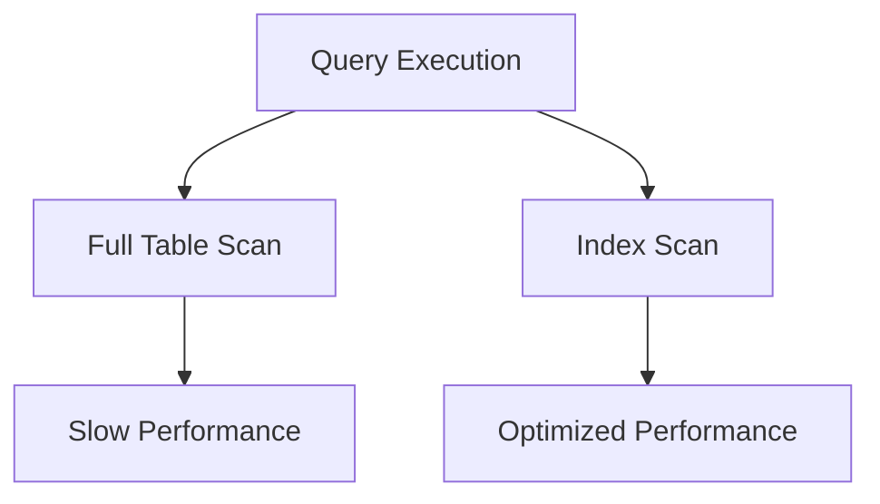
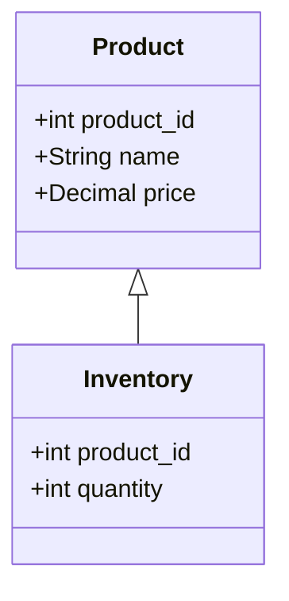

## 1.5 Benefits of Using SQL Design Patterns

In the realm of software engineering, design patterns serve as a crucial tool for solving recurring problems with proven solutions. SQL design patterns, in particular, offer a structured approach to database design and query optimization, enabling developers to build efficient, scalable, and maintainable systems. In this section, we will delve into the manifold benefits of using SQL design patterns, focusing on improved performance, reduced complexity, knowledge sharing, and rapid development. 

### Improved Performance

SQL design patterns are instrumental in optimizing queries and database structures, leading to enhanced performance. By adhering to these patterns, developers can ensure that their databases operate efficiently, even under heavy loads.

#### Query Optimization

One of the primary benefits of SQL design patterns is their ability to optimize queries. By using patterns such as indexing strategies, developers can significantly reduce query execution time. For instance, consider a scenario where a database needs to retrieve records based on a specific column frequently. Implementing an indexing pattern can drastically improve the retrieval speed.

```sql
-- Example of creating an index to optimize query performance
CREATE INDEX idx_customer_name ON customers (name);

-- Query using the index
SELECT * FROM customers WHERE name = 'John Doe';
```

In this example, the index on the `name` column allows the database to quickly locate records, reducing the need for a full table scan.

#### Efficient Data Retrieval

Design patterns also facilitate efficient data retrieval by promoting the use of best practices such as normalization and denormalization. Normalization reduces data redundancy and improves data integrity, while denormalization can enhance read performance by reducing the number of joins required.

```sql
-- Example of a normalized table structure
CREATE TABLE orders (
    order_id INT PRIMARY KEY,
    customer_id INT,
    order_date DATE
);

CREATE TABLE customers (
    customer_id INT PRIMARY KEY,
    name VARCHAR(100),
    email VARCHAR(100)
);

-- Denormalized structure for faster reads
CREATE TABLE order_details (
    order_id INT,
    customer_name VARCHAR(100),
    order_date DATE
);
```

By choosing the appropriate pattern based on the use case, developers can strike a balance between data integrity and performance.

### Reduced Complexity

SQL design patterns help in breaking down complex problems into manageable components, making it easier for developers to design and maintain databases.

#### Simplifying Complex Queries

Complex queries can be simplified using patterns such as Common Table Expressions (CTEs) and subqueries. These patterns allow developers to break down intricate queries into simpler, more understandable parts.

```sql
-- Example of using a CTE to simplify a complex query
WITH OrderSummary AS (
    SELECT customer_id, COUNT(*) AS order_count
    FROM orders
    GROUP BY customer_id
)
SELECT c.name, os.order_count
FROM customers c
JOIN OrderSummary os ON c.customer_id = os.customer_id;
```

In this example, the CTE `OrderSummary` encapsulates the logic for counting orders, making the main query more readable and maintainable.

#### Modular Database Design

Design patterns encourage modular database design, where each component is responsible for a specific function. This modularity reduces complexity and enhances maintainability.

```sql
-- Example of modular table design
CREATE TABLE products (
    product_id INT PRIMARY KEY,
    name VARCHAR(100),
    price DECIMAL(10, 2)
);

CREATE TABLE inventory (
    product_id INT,
    quantity INT,
    FOREIGN KEY (product_id) REFERENCES products(product_id)
);
```

By separating product information from inventory details, the database design becomes more organized and easier to manage.

### Knowledge Sharing

SQL design patterns facilitate knowledge sharing among developers, enabling teams to communicate effectively and collaborate efficiently.

#### Standardized Solutions

Design patterns provide standardized solutions to common problems, allowing developers to share knowledge and experiences. This standardization fosters a common language among team members, making it easier to discuss and implement solutions.

```sql
-- Example of a standardized approach to handling null values
SELECT COALESCE(email, 'No Email') AS email
FROM customers;
```

Using the `COALESCE` function is a common pattern for handling null values, and its use can be easily communicated across teams.

#### Documentation and Training

SQL design patterns serve as valuable documentation and training resources. By documenting the patterns used in a project, teams can ensure that new members quickly understand the system's architecture and design decisions.

```sql
-- Example of documenting a design pattern
-- Pattern: Indexing Strategy
-- Purpose: Improve query performance for frequent searches on the 'name' column
-- Implementation: CREATE INDEX idx_customer_name ON customers (name);
```

Such documentation helps in preserving institutional knowledge and aids in onboarding new developers.

### Rapid Development

SQL design patterns accelerate project timelines by providing ready-made solutions that developers can quickly implement.

#### Reusability

Design patterns promote reusability, allowing developers to apply proven solutions to new problems without reinventing the wheel. This reusability speeds up development and reduces the risk of errors.

```sql
-- Example of a reusable stored procedure
CREATE PROCEDURE GetCustomerOrders (IN customerId INT)
BEGIN
    SELECT * FROM orders WHERE customer_id = customerId;
END;
```

This stored procedure can be reused across different parts of the application, saving development time and effort.

#### Prototyping and Iteration

SQL design patterns enable rapid prototyping and iteration by providing a foundation upon which developers can build and refine their solutions.

```sql
-- Example of a prototype query using a design pattern
SELECT p.name, SUM(i.quantity) AS total_quantity
FROM products p
JOIN inventory i ON p.product_id = i.product_id
GROUP BY p.name;
```

This query can serve as a prototype for more complex reporting features, allowing developers to quickly iterate and improve upon the initial design.

### Visualizing SQL Design Patterns

To further illustrate the benefits of SQL design patterns, let's visualize some of the concepts discussed using diagrams.

#### Visualizing Query Optimization



**Diagram Description:** This diagram illustrates the impact of indexing on query execution. Without an index, a full table scan leads to slow performance. With an index, the query execution is optimized, resulting in faster performance.

#### Visualizing Modular Database Design



**Diagram Description:** This class diagram represents a modular database design, where the `Product` and `Inventory` tables are separate entities, promoting organization and maintainability.

### References and Links

For further reading on SQL design patterns and their benefits, consider exploring the following resources:

- [SQL Design Patterns](https://www.sqlpatterns.com)
- [Database Optimization Techniques](https://www.databasedesign.com/optimization)
- [Normalization and Denormalization](https://www.databasejournal.com/normalization)

### Knowledge Check

To reinforce your understanding of the benefits of SQL design patterns, consider the following questions and exercises:

1. Explain how indexing can improve query performance in a database.
2. Describe the role of Common Table Expressions (CTEs) in simplifying complex queries.
3. Discuss the importance of modular database design in reducing complexity.
4. Provide an example of how SQL design patterns facilitate knowledge sharing among developers.
5. Demonstrate how reusability in SQL design patterns can accelerate development timelines.

### Embrace the Journey

Remember, mastering SQL design patterns is a journey that involves continuous learning and experimentation. As you progress, you'll discover new patterns and techniques that will enhance your database design and development skills. Stay curious, keep experimenting, and enjoy the journey!

## Quiz Time!



### How do SQL design patterns improve performance?

- [x] By optimizing queries and database structures
- [ ] By increasing data redundancy
- [ ] By complicating database design
- [ ] By reducing data integrity

> **Explanation:** SQL design patterns improve performance by optimizing queries and database structures, leading to faster execution and efficient data retrieval.

### What is the benefit of using Common Table Expressions (CTEs)?

- [x] Simplifying complex queries
- [ ] Increasing query execution time
- [ ] Reducing data integrity
- [ ] Complicating query logic

> **Explanation:** CTEs simplify complex queries by breaking them down into more manageable parts, making them easier to read and maintain.

### How do SQL design patterns facilitate knowledge sharing?

- [x] By providing standardized solutions
- [ ] By increasing code complexity
- [ ] By reducing documentation
- [ ] By promoting proprietary solutions

> **Explanation:** SQL design patterns facilitate knowledge sharing by providing standardized solutions that can be easily communicated and understood among developers.

### What is a key advantage of modular database design?

- [x] Reduced complexity and enhanced maintainability
- [ ] Increased data redundancy
- [ ] Complicated database structure
- [ ] Reduced data integrity

> **Explanation:** Modular database design reduces complexity and enhances maintainability by organizing the database into separate, manageable components.

### How do SQL design patterns accelerate development?

- [x] By providing ready-made solutions
- [ ] By increasing development time
- [ ] By complicating code logic
- [ ] By reducing code reusability

> **Explanation:** SQL design patterns accelerate development by providing ready-made solutions that developers can quickly implement, reducing the need to reinvent the wheel.

### What is the role of indexing in query optimization?

- [x] Reducing query execution time
- [ ] Increasing data redundancy
- [ ] Complicating query logic
- [ ] Reducing data integrity

> **Explanation:** Indexing plays a crucial role in query optimization by reducing query execution time, allowing for faster data retrieval.

### How does normalization benefit database design?

- [x] By reducing data redundancy and improving data integrity
- [ ] By increasing data redundancy
- [ ] By complicating database structure
- [ ] By reducing data integrity

> **Explanation:** Normalization benefits database design by reducing data redundancy and improving data integrity, leading to a more efficient and reliable database.

### What is a benefit of using stored procedures in SQL design patterns?

- [x] Reusability across different parts of the application
- [ ] Increasing code complexity
- [ ] Reducing code maintainability
- [ ] Complicating database logic

> **Explanation:** Stored procedures offer reusability across different parts of the application, allowing developers to implement consistent logic efficiently.

### How do SQL design patterns enhance rapid prototyping?

- [x] By providing a foundation for building and refining solutions
- [ ] By increasing development time
- [ ] By complicating code logic
- [ ] By reducing code reusability

> **Explanation:** SQL design patterns enhance rapid prototyping by providing a foundation upon which developers can build and refine their solutions quickly.

### True or False: SQL design patterns only benefit large-scale databases.

- [ ] True
- [x] False

> **Explanation:** SQL design patterns benefit databases of all sizes by optimizing performance, reducing complexity, facilitating knowledge sharing, and accelerating development.


