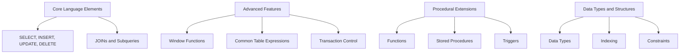

## 1.6 Overview of SQL Features Relevant to Design Patterns

In the realm of database design and management, SQL (Structured Query Language) stands as a cornerstone technology. As expert software engineers and architects, understanding the intricacies of SQL features is crucial for implementing effective design patterns. This section delves into the core language elements, advanced features, procedural extensions, and data types and structures that are pivotal in SQL design patterns.

### Core Language Elements

SQL's core language elements form the foundation of database interactions. These elements include the basic commands for data manipulation and retrieval, which are essential for any SQL-based application.

#### SELECT, INSERT, UPDATE, DELETE

- **SELECT**: The SELECT statement is the primary means of querying data from a database. It allows you to specify the columns to retrieve, the tables to query, and the conditions to apply.

```sql
-- Retrieve all columns from the employees table
SELECT * FROM employees;

-- Retrieve specific columns with a condition
SELECT first_name, last_name FROM employees WHERE department = 'Sales';
```

- **INSERT**: The INSERT statement is used to add new rows to a table. It specifies the table to insert into and the values for each column.

```sql
-- Insert a new employee record
INSERT INTO employees (first_name, last_name, department) VALUES ('John', 'Doe', 'Marketing');
```

- **UPDATE**: The UPDATE statement modifies existing data in a table. It allows you to specify the columns to update and the conditions for selecting rows.

```sql
-- Update the department of an employee
UPDATE employees SET department = 'HR' WHERE employee_id = 123;
```

- **DELETE**: The DELETE statement removes rows from a table based on specified conditions.

```sql
-- Delete an employee record
DELETE FROM employees WHERE employee_id = 123;
```

#### JOINs and Subqueries

- **JOINs**: JOIN operations are used to combine rows from two or more tables based on related columns. They are fundamental for retrieving data from multiple tables.

```sql
-- Inner join between employees and departments
SELECT e.first_name, e.last_name, d.department_name
FROM employees e
INNER JOIN departments d ON e.department_id = d.department_id;
```

- **Subqueries**: Subqueries are nested queries used within another SQL query. They can be used in SELECT, INSERT, UPDATE, or DELETE statements to perform complex operations.

```sql
-- Subquery to find employees in the largest department
SELECT first_name, last_name
FROM employees
WHERE department_id = (SELECT department_id FROM departments ORDER BY size DESC LIMIT 1);
```

### Advanced Features

SQL's advanced features enable more sophisticated data processing and analysis. These include window functions, common table expressions (CTEs), and transaction control.

#### Window Functions

Window functions perform calculations across a set of table rows related to the current row. They are useful for running totals, moving averages, and ranking.

```sql
-- Calculate the running total of sales
SELECT order_id, amount,
       SUM(amount) OVER (ORDER BY order_date) AS running_total
FROM sales;
```

#### Common Table Expressions (CTEs)

CTEs provide a way to define temporary result sets that can be referenced within a SELECT, INSERT, UPDATE, or DELETE statement. They improve readability and maintainability of complex queries.

```sql
-- CTE to calculate average salary by department
WITH AvgSalary AS (
    SELECT department_id, AVG(salary) AS avg_salary
    FROM employees
    GROUP BY department_id
)
SELECT e.first_name, e.last_name, a.avg_salary
FROM employees e
JOIN AvgSalary a ON e.department_id = a.department_id;
```

#### Transaction Control

Transaction control ensures data integrity by grouping multiple SQL operations into a single unit of work. Key commands include BEGIN, COMMIT, and ROLLBACK.

```sql
-- Transaction to transfer funds between accounts
BEGIN;
UPDATE accounts SET balance = balance - 100 WHERE account_id = 1;
UPDATE accounts SET balance = balance + 100 WHERE account_id = 2;
COMMIT;
```

### Procedural Extensions

Procedural extensions in SQL allow for more complex logic and control flow within the database. These include functions, stored procedures, and triggers.

#### Functions

Functions encapsulate reusable logic that can be executed within SQL statements. They can return scalar values or table results.

```sql
-- Function to calculate the square of a number
CREATE FUNCTION Square(@number INT) RETURNS INT AS
BEGIN
    RETURN @number * @number;
END;
```

#### Stored Procedures

Stored procedures are precompiled collections of SQL statements that can be executed as a single unit. They are useful for encapsulating business logic and improving performance.

```sql
-- Stored procedure to update employee salary
CREATE PROCEDURE UpdateSalary
    @employee_id INT,
    @new_salary DECIMAL(10, 2)
AS
BEGIN
    UPDATE employees SET salary = @new_salary WHERE employee_id = @employee_id;
END;
```

#### Triggers

Triggers are special types of stored procedures that automatically execute in response to certain events on a table, such as INSERT, UPDATE, or DELETE.

```sql
-- Trigger to log changes to employee salaries
CREATE TRIGGER LogSalaryChange
ON employees
AFTER UPDATE
AS
BEGIN
    INSERT INTO salary_log (employee_id, old_salary, new_salary, change_date)
    SELECT employee_id, deleted.salary, inserted.salary, GETDATE()
    FROM inserted
    JOIN deleted ON inserted.employee_id = deleted.employee_id;
END;
```

### Data Types and Structures

Understanding SQL data types and structures is crucial for designing efficient and scalable databases. This includes data types, indexing, and constraints.

#### Data Types

SQL supports a variety of data types, including numeric, character, date/time, and binary types. Choosing the right data type is essential for performance and storage efficiency.

```sql
-- Example of defining a table with various data types
CREATE TABLE products (
    product_id INT PRIMARY KEY,
    product_name VARCHAR(100),
    price DECIMAL(10, 2),
    release_date DATE,
    image BLOB
);
```

#### Indexing

Indexes improve query performance by allowing the database to quickly locate and access data. They can be created on one or more columns of a table.

```sql
-- Create an index on the product_name column
CREATE INDEX idx_product_name ON products (product_name);
```

#### Constraints

Constraints enforce rules on the data in a table to ensure data integrity. Common constraints include PRIMARY KEY, FOREIGN KEY, UNIQUE, and CHECK.

```sql
-- Example of constraints in a table definition
CREATE TABLE orders (
    order_id INT PRIMARY KEY,
    customer_id INT,
    order_date DATE,
    CONSTRAINT fk_customer FOREIGN KEY (customer_id) REFERENCES customers(customer_id),
    CONSTRAINT chk_order_date CHECK (order_date >= '2024-01-01')
);
```

### Visualizing SQL Features

To better understand the relationships and flow of SQL features, let's visualize the interaction between core language elements, advanced features, and procedural extensions.



This diagram illustrates how SQL features interconnect and support the implementation of design patterns in database systems.

### Try It Yourself

Experiment with the SQL code examples provided in this section. Try modifying the queries to suit different scenarios, such as changing conditions in the SELECT statement or adding new columns to the INSERT statement. This hands-on approach will deepen your understanding of SQL features and their application in design patterns.

### Knowledge Check

- What are the core language elements of SQL, and how do they interact with each other?
- How do window functions and CTEs enhance SQL's capabilities for complex data analysis?
- In what scenarios would you use stored procedures and triggers in a database design?
- How do data types and indexing contribute to the performance and scalability of a database?

### Embrace the Journey

Remember, mastering SQL features is a journey. As you explore and experiment with these features, you'll gain the skills needed to implement robust and efficient design patterns. Stay curious, keep learning, and enjoy the process of becoming an expert in SQL database development.

## Quiz Time!



### What is the primary purpose of the SELECT statement in SQL?

- [x] To retrieve data from a database
- [ ] To insert new data into a database
- [ ] To update existing data in a database
- [ ] To delete data from a database

> **Explanation:** The SELECT statement is used to query and retrieve data from a database.

### Which SQL feature allows for calculations across a set of table rows related to the current row?

- [ ] Subqueries
- [x] Window Functions
- [ ] JOINs
- [ ] Indexes

> **Explanation:** Window functions perform calculations across a set of table rows related to the current row.

### What is the role of a stored procedure in SQL?

- [x] To encapsulate reusable logic and execute it as a single unit
- [ ] To automatically execute in response to certain events
- [ ] To define temporary result sets
- [ ] To enforce rules on the data in a table

> **Explanation:** Stored procedures encapsulate reusable logic that can be executed as a single unit.

### Which SQL feature is used to improve query performance by allowing quick data access?

- [ ] Constraints
- [ ] Data Types
- [x] Indexing
- [ ] Triggers

> **Explanation:** Indexing improves query performance by allowing the database to quickly locate and access data.

### What is a Common Table Expression (CTE) used for in SQL?

- [x] To define temporary result sets that can be referenced within a query
- [ ] To perform calculations across a set of table rows
- [ ] To encapsulate reusable logic
- [ ] To enforce data integrity rules

> **Explanation:** CTEs provide a way to define temporary result sets that can be referenced within a query.

### Which SQL command is used to remove rows from a table?

- [ ] INSERT
- [ ] UPDATE
- [x] DELETE
- [ ] SELECT

> **Explanation:** The DELETE statement is used to remove rows from a table based on specified conditions.

### What is the purpose of a trigger in SQL?

- [ ] To encapsulate reusable logic
- [x] To automatically execute in response to certain events
- [ ] To define temporary result sets
- [ ] To improve query performance

> **Explanation:** Triggers are special types of stored procedures that automatically execute in response to certain events on a table.

### How do constraints contribute to data integrity in SQL?

- [x] By enforcing rules on the data in a table
- [ ] By improving query performance
- [ ] By encapsulating reusable logic
- [ ] By defining temporary result sets

> **Explanation:** Constraints enforce rules on the data in a table to ensure data integrity.

### What is the benefit of using window functions in SQL?

- [ ] To define temporary result sets
- [x] To perform calculations across a set of table rows related to the current row
- [ ] To encapsulate reusable logic
- [ ] To improve query performance

> **Explanation:** Window functions perform calculations across a set of table rows related to the current row.

### True or False: Indexes can be created on one or more columns of a table to improve query performance.

- [x] True
- [ ] False

> **Explanation:** Indexes can be created on one or more columns of a table to improve query performance by allowing quick data access.


