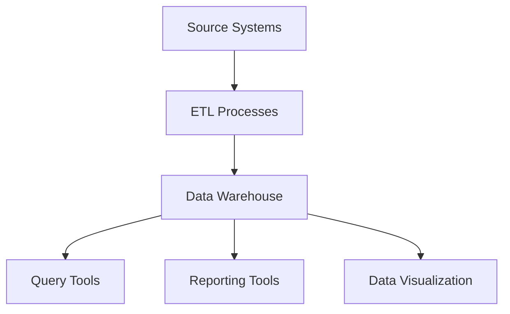

## 10.1 Introduction to Data Warehousing Concepts

In the realm of modern data architecture, data warehousing stands as a pivotal concept that enables organizations to harness the power of data for strategic decision-making. As expert software engineers and architects, understanding the intricacies of data warehousing is essential for designing systems that are not only efficient but also scalable and insightful. In this section, we will delve into the core concepts of data warehousing, exploring its purpose, characteristics, and key components.

### Purpose of Data Warehousing

A data warehouse serves as a centralized repository for integrated data analysis. It is designed to consolidate data from various sources, providing a unified platform for querying and reporting. The primary purpose of a data warehouse is to support business intelligence activities, enabling organizations to make informed decisions based on comprehensive data analysis.

- **Centralized Repository**: A data warehouse aggregates data from disparate sources, such as transactional databases, external data feeds, and legacy systems, into a single, coherent repository. This centralization facilitates easier access to data for analysis and reporting.

- **Integrated Data Analysis**: By integrating data from multiple sources, a data warehouse provides a holistic view of the organization's operations. This integration is crucial for identifying trends, patterns, and anomalies that can inform strategic decisions.

### Characteristics of Data Warehousing

Data warehouses are characterized by four key attributes: subject-oriented, integrated, non-volatile, and time-variant. These characteristics distinguish data warehouses from other types of databases and are essential for their role in data analysis.

- **Subject-Oriented**: Data warehouses are organized around key subjects or business areas, such as sales, finance, or customer data. This subject orientation allows for focused analysis and reporting on specific aspects of the business.

- **Integrated**: Integration is a fundamental characteristic of data warehouses. Data from various sources is cleansed, transformed, and consolidated to ensure consistency and accuracy. This integration process resolves discrepancies in data formats, naming conventions, and units of measure.

- **Non-Volatile**: Once data is entered into a data warehouse, it is not typically altered or deleted. This non-volatility ensures that historical data remains intact, providing a reliable basis for trend analysis and forecasting.

- **Time-Variant**: Data warehouses maintain historical data, capturing changes over time. This time-variant nature allows for the analysis of trends and patterns across different time periods, supporting long-term strategic planning.

### Components of Data Warehousing

A data warehouse is composed of several key components, each playing a vital role in the overall architecture. These components include ETL processes, data storage, and the presentation layer.

#### ETL Processes

ETL (Extract, Transform, Load) processes are the backbone of data warehousing, responsible for extracting data from source systems, transforming it into a suitable format, and loading it into the data warehouse.

- **Extract**: The extraction phase involves retrieving data from various source systems. This data can come from transactional databases, flat files, or external data feeds. The goal is to gather all relevant data needed for analysis.

- **Transform**: During the transformation phase, data is cleansed, normalized, and aggregated. This step ensures that the data is consistent and suitable for analysis. Common transformations include data type conversions, deduplication, and the application of business rules.

- **Load**: The final phase involves loading the transformed data into the data warehouse. This process may involve incremental loading, where only new or changed data is added, or full loading, where the entire dataset is refreshed.

#### Data Storage

The data storage component of a data warehouse is designed to efficiently store large volumes of data while supporting fast query performance. This component typically includes a combination of relational databases, columnar storage, and in-memory databases.

- **Relational Databases**: Traditional relational databases are often used for data warehousing due to their robust support for SQL queries and transactions. They provide a familiar environment for data analysts and support complex querying capabilities.

- **Columnar Storage**: Columnar storage is optimized for read-heavy workloads, making it ideal for data warehousing. By storing data in columns rather than rows, columnar databases can achieve significant performance improvements for analytical queries.

- **In-Memory Databases**: In-memory databases store data in RAM, providing ultra-fast access times. They are particularly useful for real-time analytics and scenarios where low-latency data access is critical.

#### Presentation Layer

The presentation layer of a data warehouse is responsible for delivering data to end-users in a meaningful and accessible format. This layer includes tools for querying, reporting, and data visualization.

- **Query Tools**: Query tools allow users to interact with the data warehouse, executing SQL queries to retrieve specific data sets. These tools often include features for building complex queries and performing ad-hoc analysis.

- **Reporting Tools**: Reporting tools generate structured reports based on data from the warehouse. These reports can be scheduled for regular delivery or generated on-demand, providing insights into key business metrics.

- **Data Visualization**: Data visualization tools transform raw data into graphical representations, such as charts and dashboards. These visualizations make it easier for users to understand complex data sets and identify trends.

### Visualizing Data Warehousing Architecture

To better understand the architecture of a data warehouse, let's visualize the flow of data from source systems to end-users using a Mermaid.js diagram.



**Diagram Description**: This diagram illustrates the flow of data in a data warehousing system. Data is extracted from source systems, processed through ETL processes, and stored in the data warehouse. End-users access the data through query tools, reporting tools, and data visualization platforms.

### Code Example: ETL Process

Let's explore a simple ETL process using SQL to extract, transform, and load data into a data warehouse.

```sql
-- Extract data from the source system
SELECT customer_id, order_date, total_amount
INTO TEMPORARY TABLE temp_orders
FROM source_orders
WHERE order_date >= '2024-01-01';

-- Transform data by calculating the total sales per customer
SELECT customer_id, SUM(total_amount) AS total_sales
INTO TEMPORARY TABLE transformed_orders
FROM temp_orders
GROUP BY customer_id;

-- Load transformed data into the data warehouse
INSERT INTO warehouse_sales (customer_id, total_sales, load_date)
SELECT customer_id, total_sales, CURRENT_DATE
FROM transformed_orders;
```

**Code Explanation**:
- **Extract**: We extract data from the `source_orders` table, filtering for orders placed after January 1, 2024.
- **Transform**: We calculate the total sales per customer by summing the `total_amount` for each `customer_id`.
- **Load**: We insert the transformed data into the `warehouse_sales` table in the data warehouse, along with the current date.

### Try It Yourself

Experiment with the ETL process by modifying the SQL code to include additional transformations, such as filtering for specific product categories or calculating average order values. This hands-on approach will deepen your understanding of ETL processes and their role in data warehousing.

### Key Takeaways

- **Data Warehousing Purpose**: Centralized repository for integrated data analysis, supporting business intelligence activities.
- **Characteristics**: Subject-oriented, integrated, non-volatile, and time-variant, distinguishing data warehouses from other databases.
- **Components**: ETL processes, data storage, and presentation layer, each playing a crucial role in the data warehousing architecture.

### References and Further Reading

- [Data Warehousing Concepts - Oracle](https://docs.oracle.com/en/database/oracle/oracle-database/19/dwhsg/introduction-to-data-warehousing.html)
- [Introduction to Data Warehousing - IBM](https://www.ibm.com/cloud/learn/data-warehouse)
- [Data Warehousing - Microsoft Azure](https://azure.microsoft.com/en-us/solutions/data-warehousing/)

### Embrace the Journey

Remember, mastering data warehousing is a journey. As you progress, you'll build more complex data architectures and analytical solutions. Keep experimenting, stay curious, and enjoy the journey!

## Quiz Time!



### What is the primary purpose of a data warehouse?

- [x] To serve as a centralized repository for integrated data analysis
- [ ] To store transactional data for real-time processing
- [ ] To replace all operational databases in an organization
- [ ] To provide a backup solution for data recovery

> **Explanation:** The primary purpose of a data warehouse is to serve as a centralized repository for integrated data analysis, supporting business intelligence activities.

### Which characteristic of data warehousing ensures historical data remains intact?

- [ ] Subject-oriented
- [ ] Integrated
- [x] Non-volatile
- [ ] Time-variant

> **Explanation:** The non-volatile characteristic of data warehousing ensures that once data is entered, it is not typically altered or deleted, preserving historical data.

### What is the role of ETL processes in data warehousing?

- [x] To extract, transform, and load data into the data warehouse
- [ ] To generate reports and visualizations
- [ ] To manage user access and security
- [ ] To provide real-time data processing

> **Explanation:** ETL processes are responsible for extracting data from source systems, transforming it into a suitable format, and loading it into the data warehouse.

### Which component of a data warehouse is optimized for read-heavy workloads?

- [ ] Relational Databases
- [x] Columnar Storage
- [ ] In-Memory Databases
- [ ] Presentation Layer

> **Explanation:** Columnar storage is optimized for read-heavy workloads, making it ideal for data warehousing and analytical queries.

### What is a key benefit of using data visualization tools in a data warehouse?

- [x] They transform raw data into graphical representations for easier understanding
- [ ] They provide real-time data processing capabilities
- [ ] They manage data storage and retrieval
- [ ] They automate ETL processes

> **Explanation:** Data visualization tools transform raw data into graphical representations, such as charts and dashboards, making it easier for users to understand complex data sets.

### What does the 'subject-oriented' characteristic of data warehousing refer to?

- [ ] Data is stored in columns rather than rows
- [x] Data is organized around key subjects or business areas
- [ ] Data is stored in-memory for fast access
- [ ] Data is encrypted for security

> **Explanation:** The 'subject-oriented' characteristic refers to how data warehouses are organized around key subjects or business areas, such as sales or finance, allowing for focused analysis.

### How does the 'time-variant' characteristic of data warehousing support analysis?

- [ ] By ensuring data is encrypted for security
- [ ] By organizing data around key subjects
- [x] By maintaining historical data for trend analysis
- [ ] By providing real-time data processing

> **Explanation:** The 'time-variant' characteristic allows data warehouses to maintain historical data, supporting the analysis of trends and patterns across different time periods.

### What is the final phase of the ETL process?

- [ ] Extract
- [ ] Transform
- [x] Load
- [ ] Analyze

> **Explanation:** The final phase of the ETL process is 'Load,' where transformed data is loaded into the data warehouse.

### Which tool is part of the presentation layer in a data warehouse?

- [x] Query Tools
- [ ] ETL Processes
- [ ] Columnar Storage
- [ ] In-Memory Databases

> **Explanation:** Query tools are part of the presentation layer, allowing users to interact with the data warehouse and execute SQL queries.

### True or False: Data warehouses are typically used for real-time data processing.

- [ ] True
- [x] False

> **Explanation:** False. Data warehouses are designed for integrated data analysis and are not typically used for real-time data processing.


