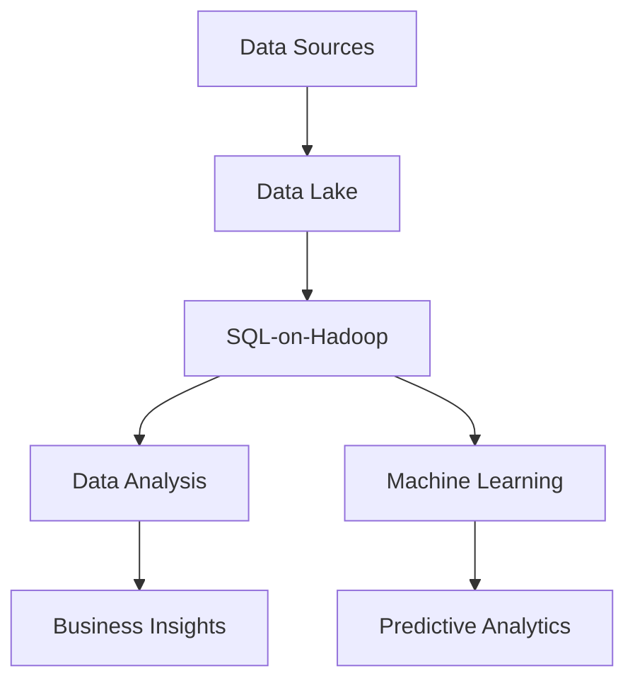

## 10.10 Big Data Integration with SQL

In the modern data-driven world, the ability to integrate and analyze vast amounts of data is crucial for businesses to gain insights and make informed decisions. Big Data Integration with SQL is a powerful approach that combines the scalability of big data technologies with the familiarity and robustness of SQL. This section will guide you through the concepts, tools, and challenges of integrating big data with SQL, focusing on data lakes, SQL-on-Hadoop, and the tools that make it possible.

### Understanding Data Lakes

**Data Lakes** are centralized repositories that allow you to store all your structured and unstructured data at any scale. Unlike traditional data warehouses, which require data to be structured and processed before storage, data lakes store raw data in its native format. This flexibility makes data lakes ideal for big data analytics, as they can accommodate a wide variety of data types and sources.

#### Key Characteristics of Data Lakes

- **Scalability**: Data lakes can scale to accommodate petabytes of data, making them suitable for big data applications.
- **Flexibility**: They support a wide range of data types, including structured, semi-structured, and unstructured data.
- **Cost-Effectiveness**: By using commodity hardware and open-source software, data lakes offer a cost-effective solution for storing large volumes of data.
- **Accessibility**: Data lakes provide easy access to data for various analytics and machine learning applications.

### SQL-on-Hadoop: Bridging SQL and Big Data

**SQL-on-Hadoop** refers to the ability to query big data stored in Hadoop using SQL syntax. This approach leverages the power of Hadoop's distributed computing framework while providing the familiarity and ease of use of SQL. SQL-on-Hadoop enables data analysts and engineers to perform complex queries and analytics on large datasets without needing to learn new programming languages.

#### Key Tools for SQL-on-Hadoop

1. **Apache Hive**: A data warehouse infrastructure built on top of Hadoop, Hive provides a SQL-like interface to query and manage large datasets. It translates SQL queries into MapReduce jobs, allowing for efficient processing of big data.

2. **Spark SQL**: Part of the Apache Spark ecosystem, Spark SQL allows for querying structured data using SQL. It provides a unified interface for working with structured data, enabling seamless integration with other Spark components.

3. **Presto**: An open-source distributed SQL query engine, Presto is designed for fast, interactive queries on large datasets. It supports a wide range of data sources, including Hadoop, relational databases, and cloud storage.

### Challenges in Big Data Integration with SQL

Integrating big data with SQL presents several challenges, including performance tuning, data governance, and ensuring data quality. Let's explore these challenges in detail:

#### Performance Tuning

- **Query Optimization**: Optimizing SQL queries for big data environments is crucial for achieving high performance. Techniques such as indexing, partitioning, and caching can significantly improve query execution times.
- **Resource Management**: Efficiently managing resources such as CPU, memory, and disk I/O is essential for maintaining performance in distributed computing environments.
- **Data Skew**: Uneven distribution of data across nodes can lead to performance bottlenecks. Techniques such as data partitioning and bucketing can help mitigate data skew.

#### Data Governance

- **Data Quality**: Ensuring data quality is critical for accurate analytics. Implementing data validation and cleansing processes can help maintain data integrity.
- **Security and Compliance**: Protecting sensitive data and ensuring compliance with regulations such as GDPR and HIPAA is essential. Implementing access controls and encryption can help secure data in data lakes.
- **Metadata Management**: Managing metadata is crucial for understanding and organizing data in data lakes. Tools such as Apache Atlas and AWS Glue can help automate metadata management.

### Code Examples: Querying Big Data with SQL

Let's explore some code examples to demonstrate how SQL can be used to query big data stored in Hadoop using tools like Apache Hive and Spark SQL.

#### Example 1: Querying Data with Apache Hive

```sql
-- Create a Hive table to store sales data
CREATE TABLE sales_data (
    transaction_id STRING,
    product_id STRING,
    quantity INT,
    price DECIMAL(10, 2),
    transaction_date DATE
)
ROW FORMAT DELIMITED
FIELDS TERMINATED BY ','
STORED AS TEXTFILE;

-- Load data into the Hive table
LOAD DATA INPATH '/user/hive/warehouse/sales_data.csv' INTO TABLE sales_data;

-- Query to calculate total sales for each product
SELECT product_id, SUM(quantity * price) AS total_sales
FROM sales_data
GROUP BY product_id;
```

#### Example 2: Querying Data with Spark SQL

```python
from pyspark.sql import SparkSession

spark = SparkSession.builder \
    .appName("Big Data Integration with SQL") \
    .getOrCreate()

sales_data = spark.read.csv("/path/to/sales_data.csv", header=True, inferSchema=True)

sales_data.createOrReplaceTempView("sales_data")

total_sales = spark.sql("""
    SELECT product_id, SUM(quantity * price) AS total_sales
    FROM sales_data
    GROUP BY product_id
""")

total_sales.show()
```

### Visualizing Big Data Integration with SQL

To better understand the architecture and data flow in big data integration with SQL, let's visualize the process using a diagram.



**Diagram Description**: This diagram illustrates the flow of data from various sources into a data lake, where it is queried using SQL-on-Hadoop tools. The results are used for data analysis, business insights, and machine learning applications.

### Try It Yourself

Experiment with the code examples provided by modifying the queries to suit your data and analysis needs. For instance, try adding filters to the queries to analyze sales data for specific time periods or product categories. This hands-on approach will help you gain a deeper understanding of how SQL can be used to query big data.

### References and Further Reading

- [Apache Hive Documentation](https://cwiki.apache.org/confluence/display/Hive/Home)
- [Spark SQL Guide](https://spark.apache.org/docs/latest/sql-programming-guide.html)
- [Presto Documentation](https://prestodb.io/docs/current/)

### Knowledge Check

- What are the key characteristics of data lakes?
- How does SQL-on-Hadoop enable querying of big data?
- What are some common challenges in big data integration with SQL?
- How can performance be optimized in SQL-on-Hadoop environments?
- What tools are commonly used for SQL-on-Hadoop?

### Embrace the Journey

Remember, integrating big data with SQL is a powerful way to unlock insights from vast datasets. As you explore these concepts and tools, keep experimenting and learning. The journey of mastering big data integration with SQL is filled with opportunities to innovate and drive business value.

## Quiz Time!



### What is a key characteristic of data lakes?

- [x] They store raw data in its native format.
- [ ] They require data to be structured before storage.
- [ ] They are limited to structured data only.
- [ ] They are more expensive than traditional data warehouses.

> **Explanation:** Data lakes store raw data in its native format, allowing for flexibility in handling various data types.

### Which tool is used for SQL-on-Hadoop?

- [x] Apache Hive
- [ ] MySQL
- [ ] Oracle Database
- [ ] MongoDB

> **Explanation:** Apache Hive is a tool used for SQL-on-Hadoop, providing a SQL-like interface for querying big data.

### What is a common challenge in big data integration with SQL?

- [x] Performance tuning
- [ ] Lack of data
- [ ] Limited data types
- [ ] High cost of storage

> **Explanation:** Performance tuning is a common challenge due to the complexity and scale of big data environments.

### How can data skew be mitigated in SQL-on-Hadoop environments?

- [x] Data partitioning and bucketing
- [ ] Increasing hardware resources
- [ ] Reducing data volume
- [ ] Using a single node for processing

> **Explanation:** Data partitioning and bucketing help distribute data evenly across nodes, mitigating data skew.

### What is the role of metadata management in data lakes?

- [x] Organizing and understanding data
- [ ] Storing raw data
- [ ] Increasing data volume
- [ ] Reducing storage costs

> **Explanation:** Metadata management is crucial for organizing and understanding data in data lakes.

### Which tool is part of the Apache Spark ecosystem for SQL queries?

- [x] Spark SQL
- [ ] Apache Flink
- [ ] Apache Cassandra
- [ ] Apache Kafka

> **Explanation:** Spark SQL is part of the Apache Spark ecosystem, enabling SQL queries on structured data.

### What is a benefit of using data lakes?

- [x] Scalability and flexibility
- [ ] Limited to structured data
- [ ] High cost of implementation
- [ ] Requires data preprocessing

> **Explanation:** Data lakes offer scalability and flexibility, accommodating various data types and volumes.

### What is a key advantage of SQL-on-Hadoop?

- [x] Familiarity of SQL syntax
- [ ] Requires new programming languages
- [ ] Limited to small datasets
- [ ] High latency in queries

> **Explanation:** SQL-on-Hadoop allows users to query big data using familiar SQL syntax, making it accessible to data analysts.

### Which of the following is a SQL-on-Hadoop tool?

- [x] Presto
- [ ] PostgreSQL
- [ ] SQLite
- [ ] Redis

> **Explanation:** Presto is a SQL-on-Hadoop tool designed for fast, interactive queries on large datasets.

### True or False: Data lakes are more expensive than traditional data warehouses.

- [ ] True
- [x] False

> **Explanation:** Data lakes are generally more cost-effective than traditional data warehouses due to their use of commodity hardware and open-source software.


