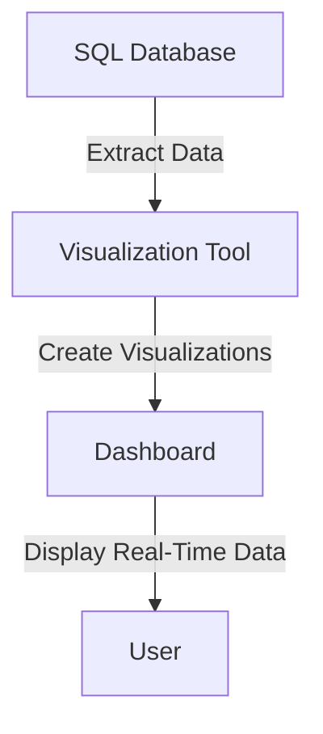
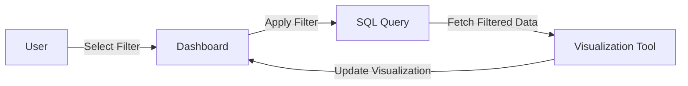
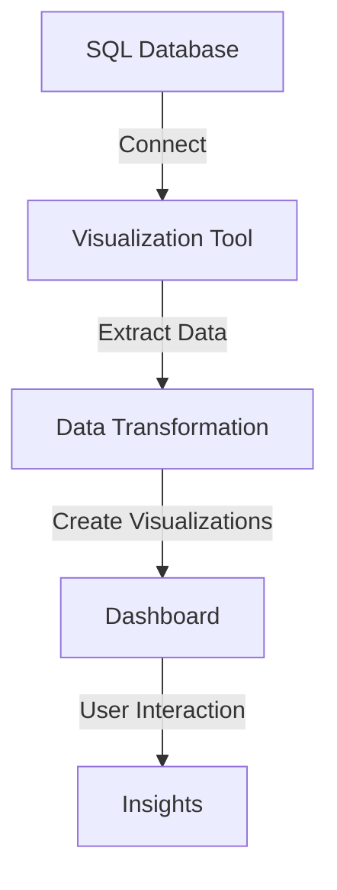

## 10.11 Data Visualization Integration

In today's data-driven world, the ability to transform raw data into actionable insights is crucial for businesses and organizations. Data visualization plays a pivotal role in this transformation by providing intuitive and interactive ways to explore and understand data. In this section, we will delve into the integration of SQL databases with data visualization tools, focusing on the creation of dashboards, enabling interactivity, and adhering to best practices for designing effective visualizations.

### Introduction to Data Visualization Integration

Data visualization integration involves connecting SQL databases to visualization software to create dynamic and interactive representations of data. This integration allows users to gain insights from complex datasets, identify trends, and make informed decisions. The process typically involves extracting data from SQL databases, transforming it into a suitable format, and presenting it through visualization tools.

#### Key Concepts

- **Reporting Tools**: Software applications that connect to databases and generate visual reports.
- **Dashboards**: Interactive platforms that display real-time data in a visually appealing manner.
- **Interactivity**: Features that allow users to interact with data visualizations, such as filtering, zooming, and drilling down into details.

### Connecting Databases to Visualization Software

To effectively integrate SQL databases with visualization tools, it's essential to understand the connection process and the role of various components involved.

#### Establishing Connections

1. **Database Drivers**: Use appropriate database drivers (e.g., ODBC, JDBC) to establish a connection between the SQL database and the visualization tool.
2. **Data Source Configuration**: Configure the data source within the visualization tool by specifying connection parameters such as server address, database name, user credentials, and authentication methods.
3. **Data Extraction**: Extract data from the SQL database using SQL queries. Ensure that queries are optimized for performance and return only the necessary data.

#### Example: Connecting SQL to Tableau

```sql
-- Sample SQL query to extract sales data
SELECT
    order_date,
    product_category,
    sales_amount
FROM
    sales_data
WHERE
    order_date BETWEEN '2024-01-01' AND '2024-12-31';
```

In Tableau, configure the data source by selecting the appropriate database driver, entering connection details, and importing the data using the SQL query above.

### Dashboards: Real-Time Data Presentation

Dashboards are powerful tools for presenting data in real-time. They provide a consolidated view of key metrics and KPIs, enabling users to monitor performance and make data-driven decisions.

#### Designing Effective Dashboards

1. **Define Objectives**: Clearly define the purpose of the dashboard and the key metrics it should display.
2. **Select Visualizations**: Choose appropriate visualization types (e.g., bar charts, line graphs, pie charts) based on the data and the insights you want to convey.
3. **Layout and Design**: Organize visualizations logically and ensure a clean, uncluttered design. Use consistent colors and fonts to enhance readability.
4. **Real-Time Updates**: Implement mechanisms to refresh data automatically, ensuring that the dashboard always displays the latest information.

#### Example: Creating a Sales Dashboard



In this example, data is extracted from the SQL database, visualizations are created in the tool, and the dashboard displays real-time data to the user.

### Interactivity: Allowing User-Driven Data Exploration

Interactivity is a crucial aspect of modern data visualizations, allowing users to explore data dynamically and gain deeper insights.

#### Implementing Interactivity

1. **Filters**: Enable users to filter data based on specific criteria, such as date ranges or categories.
2. **Drill-Down**: Allow users to drill down into detailed data by clicking on specific elements within the visualization.
3. **Tooltips**: Provide additional information through tooltips that appear when users hover over data points.
4. **Responsive Design**: Ensure that visualizations are responsive and adapt to different screen sizes and devices.

#### Example: Interactive Sales Dashboard



In this interactive dashboard, users can select filters, which trigger SQL queries to fetch filtered data and update the visualization.

### Best Practices: Designing Effective Visualizations for Insights

To maximize the impact of data visualizations, it's essential to adhere to best practices that enhance clarity, usability, and insight generation.

#### Key Best Practices

1. **Simplicity**: Keep visualizations simple and focused on conveying the most important information.
2. **Consistency**: Use consistent colors, fonts, and styles across all visualizations to create a cohesive look.
3. **Context**: Provide context for the data by including labels, legends, and annotations.
4. **Accessibility**: Ensure that visualizations are accessible to all users, including those with disabilities.
5. **Performance**: Optimize visualizations for performance, especially when dealing with large datasets.

#### Example: Best Practices in Action

Consider a dashboard displaying sales data. Use bar charts to compare sales across different regions, line graphs to show sales trends over time, and pie charts to illustrate the distribution of sales by product category. Ensure that each visualization is labeled clearly and includes tooltips for additional context.

### Try It Yourself

To deepen your understanding of data visualization integration, try creating your own dashboard using a visualization tool of your choice. Experiment with different visualization types, implement interactivity, and apply best practices to enhance the effectiveness of your dashboard.

### Visualizing SQL Data Integration

To better understand how SQL data integrates with visualization tools, let's look at a flowchart representing the process.



This flowchart illustrates the steps involved in integrating SQL data with visualization tools, from establishing a connection to generating insights through user interaction.

### References and Links

- [Tableau Documentation](https://www.tableau.com/learn/training)
- [Power BI Documentation](https://docs.microsoft.com/en-us/power-bi/)
- [D3.js Documentation](https://d3js.org/)

### Knowledge Check

1. Explain the importance of interactivity in data visualizations.
2. Describe the process of connecting a SQL database to a visualization tool.
3. List three best practices for designing effective dashboards.

### Embrace the Journey

Remember, integrating SQL data with visualization tools is just the beginning. As you continue to explore and experiment, you'll discover new ways to unlock insights and drive data-driven decision-making. Stay curious, keep learning, and enjoy the journey!

## Quiz Time!



### What is the primary purpose of data visualization integration?

- [x] To transform raw data into actionable insights
- [ ] To replace SQL databases
- [ ] To eliminate the need for data analysis
- [ ] To automate data entry

> **Explanation:** Data visualization integration aims to transform raw data into actionable insights by providing intuitive and interactive representations of data.

### Which component is essential for establishing a connection between SQL databases and visualization tools?

- [x] Database drivers
- [ ] Data warehouses
- [ ] Data lakes
- [ ] Cloud storage

> **Explanation:** Database drivers, such as ODBC and JDBC, are essential for establishing a connection between SQL databases and visualization tools.

### What is a key feature of dashboards?

- [x] Real-time data presentation
- [ ] Static data reports
- [ ] Manual data entry
- [ ] Data encryption

> **Explanation:** Dashboards are known for their ability to present real-time data, allowing users to monitor performance and make informed decisions.

### How can users interact with data visualizations?

- [x] By applying filters and drilling down into details
- [ ] By editing SQL queries directly
- [ ] By modifying database schemas
- [ ] By changing database drivers

> **Explanation:** Users can interact with data visualizations by applying filters, drilling down into details, and using tooltips for additional information.

### Which of the following is a best practice for designing effective visualizations?

- [x] Keeping visualizations simple and focused
- [ ] Using as many colors as possible
- [ ] Including all available data points
- [ ] Avoiding labels and annotations

> **Explanation:** Keeping visualizations simple and focused is a best practice that enhances clarity and usability.

### What is the role of tooltips in data visualizations?

- [x] To provide additional information when users hover over data points
- [ ] To encrypt data
- [ ] To replace SQL queries
- [ ] To automate data extraction

> **Explanation:** Tooltips provide additional information when users hover over data points, enhancing the interactivity of visualizations.

### What should be considered when designing a dashboard layout?

- [x] Logical organization and clean design
- [ ] Random placement of visualizations
- [ ] Maximizing the number of visualizations
- [ ] Using different fonts for each visualization

> **Explanation:** A logical organization and clean design are essential for creating effective dashboards that are easy to navigate and understand.

### How can real-time updates be implemented in dashboards?

- [x] By refreshing data automatically
- [ ] By manually entering new data
- [ ] By using static data files
- [ ] By disabling database connections

> **Explanation:** Real-time updates can be implemented by refreshing data automatically, ensuring that dashboards always display the latest information.

### What is the benefit of using consistent colors and fonts in visualizations?

- [x] To create a cohesive look and enhance readability
- [ ] To confuse users
- [ ] To highlight random data points
- [ ] To increase data processing time

> **Explanation:** Using consistent colors and fonts creates a cohesive look and enhances readability, making visualizations more effective.

### True or False: Interactivity in data visualizations allows users to modify database schemas.

- [ ] True
- [x] False

> **Explanation:** Interactivity in data visualizations allows users to explore data dynamically, but it does not involve modifying database schemas.


