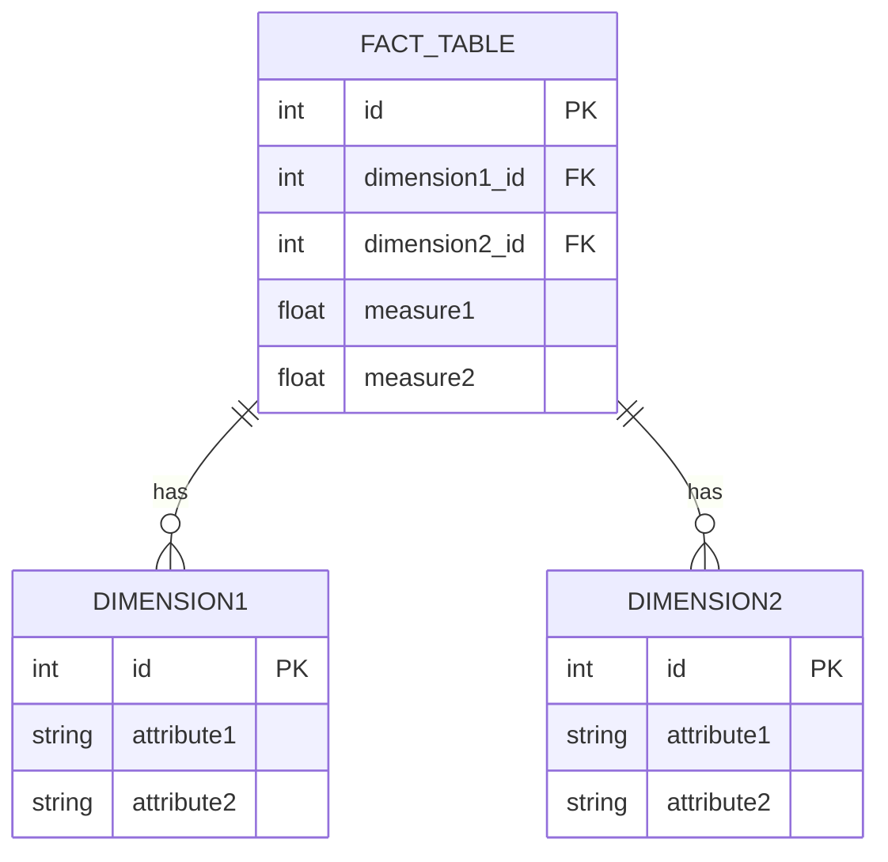
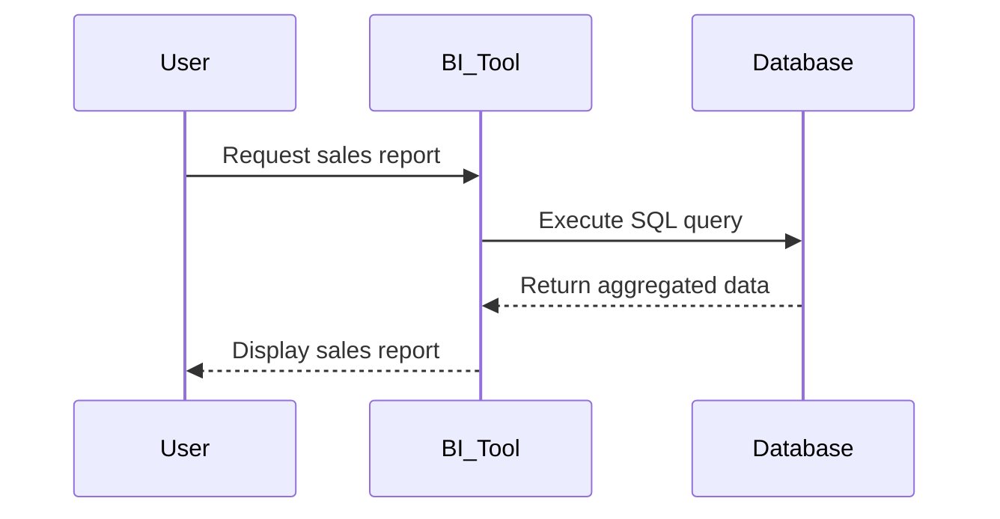

## 10.2.1 Star Schema

In the realm of data warehousing and analytics, the Star Schema stands as a fundamental design pattern that empowers organizations to efficiently manage and analyze vast amounts of data. This section delves into the intricacies of the Star Schema, exploring its structure, advantages, use cases, and implementation strategies. By the end of this guide, you will have a comprehensive understanding of how to leverage the Star Schema to optimize your data warehousing solutions.

### Design Pattern Name

**Star Schema**

### Category

Dimensional Modeling

### Intent

The Star Schema is designed to simplify complex queries and enhance performance in data warehousing environments. It achieves this by organizing data into a central fact table surrounded by dimension tables, creating a star-like structure. This pattern is particularly effective for analytical tasks, enabling efficient data retrieval and aggregation.

### Diagrams

To better understand the Star Schema, let's visualize its structure using a Hugo-compatible Mermaid.js diagram:



*Diagram 1: Star Schema Structure*

This diagram illustrates the central fact table connected to multiple dimension tables, forming a star-like pattern. Each dimension table contains attributes that describe the data in the fact table.

### Key Participants

- **Fact Table**: The central table in the Star Schema, containing quantitative data (measures) and foreign keys referencing dimension tables.
- **Dimension Tables**: Surrounding tables that provide descriptive attributes related to the measures in the fact table.

### Applicability

The Star Schema is suitable for scenarios where:

- **Analytical Queries**: You need to perform complex analytical queries that involve aggregations and filtering.
- **Simplified Data Model**: A straightforward and intuitive data model is desired for ease of understanding and maintenance.
- **Performance Optimization**: High query performance is a priority, especially in read-heavy environments.

### Sample Code Snippet

Let's explore a sample SQL implementation of a Star Schema for a retail sales data warehouse:

```sql
-- Create the fact table
CREATE TABLE sales_fact (
    sale_id INT PRIMARY KEY,
    product_id INT,
    store_id INT,
    time_id INT,
    sales_amount DECIMAL(10, 2),
    quantity_sold INT,
    FOREIGN KEY (product_id) REFERENCES product_dimension(product_id),
    FOREIGN KEY (store_id) REFERENCES store_dimension(store_id),
    FOREIGN KEY (time_id) REFERENCES time_dimension(time_id)
);

-- Create the product dimension table
CREATE TABLE product_dimension (
    product_id INT PRIMARY KEY,
    product_name VARCHAR(255),
    category VARCHAR(255),
    brand VARCHAR(255)
);

-- Create the store dimension table
CREATE TABLE store_dimension (
    store_id INT PRIMARY KEY,
    store_name VARCHAR(255),
    location VARCHAR(255),
    region VARCHAR(255)
);

-- Create the time dimension table
CREATE TABLE time_dimension (
    time_id INT PRIMARY KEY,
    date DATE,
    month VARCHAR(50),
    quarter VARCHAR(50),
    year INT
);
```

*Code Example 1: SQL Implementation of a Star Schema*

In this example, the `sales_fact` table serves as the fact table, while `product_dimension`, `store_dimension`, and `time_dimension` are dimension tables. The fact table contains foreign keys referencing the primary keys of the dimension tables.

### Design Considerations

When implementing a Star Schema, consider the following:

- **Denormalization**: Dimension tables are typically denormalized to improve query performance. This means that redundant data may be stored to avoid complex joins.
- **Indexing**: Proper indexing of foreign keys and frequently queried columns can significantly enhance query performance.
- **Data Volume**: The Star Schema is well-suited for large volumes of data, but careful consideration of storage and processing resources is essential.

### Differences and Similarities

The Star Schema is often compared to the Snowflake Schema, another dimensional modeling pattern. Key differences include:

- **Denormalization**: The Star Schema is more denormalized, while the Snowflake Schema normalizes dimension tables to reduce redundancy.
- **Complexity**: The Star Schema is simpler and easier to understand, whereas the Snowflake Schema can become complex due to additional normalization.

### Advantages of the Star Schema

1. **Simplified Queries**: The straightforward structure of the Star Schema allows for simpler SQL queries, making it easier for analysts to retrieve and analyze data.

2. **Faster Performance**: By reducing the number of joins required, the Star Schema enhances query performance, especially in read-heavy environments.

3. **Intuitive Design**: The star-like structure is intuitive and easy to understand, making it accessible to both technical and non-technical users.

4. **Scalability**: The Star Schema can handle large volumes of data, making it suitable for enterprise-level data warehousing solutions.

### Use Cases

The Star Schema is ideal for:

- **Business Intelligence**: Supporting business intelligence tools and dashboards that require fast and efficient data retrieval.
- **Reporting**: Generating reports that involve aggregations, such as sales summaries and performance metrics.
- **Data Analysis**: Enabling data analysts to perform complex analyses on large datasets with ease.

### Try It Yourself

To deepen your understanding of the Star Schema, try modifying the sample code to include additional dimensions, such as a `customer_dimension` table. Experiment with different queries to explore how the Star Schema facilitates data retrieval and analysis.

### Visualizing the Star Schema in Action

To further illustrate the Star Schema's capabilities, let's visualize a typical query workflow using a Mermaid.js sequence diagram:



*Diagram 2: Star Schema Query Workflow*

This diagram depicts the interaction between a user, a business intelligence tool, and the database, highlighting the role of the Star Schema in facilitating efficient data retrieval.

### References and Links

For further reading on the Star Schema and dimensional modeling, consider the following resources:

- [Kimball Group's Dimensional Modeling Techniques](https://www.kimballgroup.com/)
- [Data Warehousing Concepts on Oracle](https://docs.oracle.com/en/database/oracle/oracle-database/19/dwhsg/introduction-to-data-warehousing.html)
- [Microsoft SQL Server Data Warehousing](https://docs.microsoft.com/en-us/sql/ssdt/how-to-create-a-data-warehouse?view=sql-server-ver15)

### Knowledge Check

To reinforce your understanding of the Star Schema, consider the following questions:

- What are the key components of a Star Schema?
- How does the Star Schema improve query performance?
- In what scenarios would you choose a Star Schema over a Snowflake Schema?

### Embrace the Journey

Remember, mastering the Star Schema is just the beginning of your journey into the world of data warehousing and analytics. As you continue to explore and experiment, you'll uncover new ways to optimize your data solutions. Stay curious, keep learning, and enjoy the journey!

### Quiz Time!



### What is the primary advantage of using a Star Schema in data warehousing?

- [x] Simplified queries and faster performance
- [ ] Reduced data redundancy
- [ ] Enhanced data security
- [ ] Increased data normalization

> **Explanation:** The Star Schema is designed to simplify queries and enhance performance by organizing data into a central fact table surrounded by dimension tables.

### Which component of the Star Schema contains quantitative data?

- [x] Fact Table
- [ ] Dimension Table
- [ ] Index Table
- [ ] Metadata Table

> **Explanation:** The fact table in a Star Schema contains quantitative data, such as measures and foreign keys referencing dimension tables.

### How does the Star Schema improve query performance?

- [x] By reducing the number of joins required
- [ ] By increasing data normalization
- [ ] By enhancing data security
- [ ] By minimizing data redundancy

> **Explanation:** The Star Schema improves query performance by reducing the number of joins required, thanks to its denormalized structure.

### What is a key difference between the Star Schema and the Snowflake Schema?

- [x] The Star Schema is more denormalized
- [ ] The Star Schema is more normalized
- [ ] The Star Schema is more complex
- [ ] The Star Schema is less intuitive

> **Explanation:** The Star Schema is more denormalized compared to the Snowflake Schema, which normalizes dimension tables to reduce redundancy.

### In what scenarios is the Star Schema most suitable?

- [x] Analytical queries and reporting
- [ ] Transactional processing
- [ ] Real-time data updates
- [ ] Data encryption

> **Explanation:** The Star Schema is most suitable for analytical queries and reporting, where fast and efficient data retrieval is essential.

### What is the role of dimension tables in a Star Schema?

- [x] Provide descriptive attributes related to the fact table
- [ ] Store quantitative data
- [ ] Enhance data security
- [ ] Reduce data redundancy

> **Explanation:** Dimension tables in a Star Schema provide descriptive attributes related to the measures in the fact table.

### How can you enhance query performance in a Star Schema?

- [x] By proper indexing of foreign keys
- [ ] By increasing data normalization
- [ ] By reducing data redundancy
- [ ] By enhancing data security

> **Explanation:** Proper indexing of foreign keys and frequently queried columns can significantly enhance query performance in a Star Schema.

### What is a common use case for the Star Schema?

- [x] Business intelligence and reporting
- [ ] Real-time data processing
- [ ] Data encryption
- [ ] Transactional processing

> **Explanation:** A common use case for the Star Schema is business intelligence and reporting, where efficient data retrieval is crucial.

### True or False: The Star Schema is more complex than the Snowflake Schema.

- [ ] True
- [x] False

> **Explanation:** The Star Schema is simpler and more intuitive than the Snowflake Schema, which can become complex due to additional normalization.

### Which of the following is a key participant in a Star Schema?

- [x] Fact Table
- [ ] Index Table
- [ ] Metadata Table
- [ ] Security Table

> **Explanation:** The fact table is a key participant in a Star Schema, containing quantitative data and foreign keys referencing dimension tables.



By mastering the Star Schema, you are well on your way to becoming an expert in data warehousing and analytical patterns. Keep exploring and experimenting to unlock the full potential of your data solutions!
