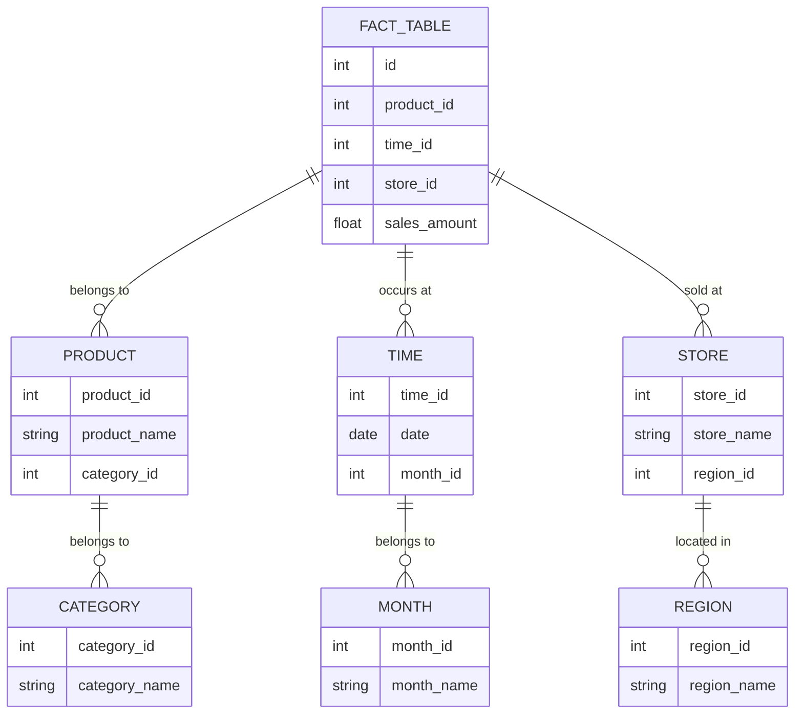

## 10.2.2 Snowflake Schema

In the realm of data warehousing and analytical processing, the Snowflake Schema stands out as a sophisticated extension of the star schema. It is designed to optimize data storage and retrieval by normalizing dimension tables, thereby reducing redundancy and improving data integrity. This section will delve into the intricacies of the Snowflake Schema, exploring its structure, advantages, considerations, and implementation strategies.

### Structure of the Snowflake Schema

The Snowflake Schema is a logical arrangement of tables in a multidimensional database that resembles a snowflake shape. This schema is an extension of the star schema, where dimension tables are normalized into multiple related tables. This normalization process involves breaking down large dimension tables into smaller, more manageable pieces, which are then linked together through foreign keys.

#### Key Components

1. **Fact Table**: The central table in the schema, containing quantitative data for analysis. It is linked to dimension tables through foreign keys.
   
2. **Dimension Tables**: These tables store descriptive attributes related to the fact data. In a snowflake schema, dimension tables are normalized, meaning they are split into additional tables to eliminate redundancy.

3. **Hierarchical Structure**: Dimension tables are organized in a hierarchical manner, with each level of the hierarchy representing a different level of granularity.

#### Visual Representation

To better understand the structure of a Snowflake Schema, let's visualize it using a Mermaid.js diagram:



### Advantages of the Snowflake Schema

The Snowflake Schema offers several benefits, particularly in environments where data integrity and storage efficiency are paramount.

1. **Reduced Data Redundancy**: By normalizing dimension tables, the Snowflake Schema minimizes data duplication, leading to more efficient storage utilization.

2. **Improved Data Integrity**: Normalization ensures that data is stored in a consistent and non-redundant manner, reducing the risk of anomalies and inconsistencies.

3. **Scalability**: The hierarchical structure of the Snowflake Schema allows for easy expansion and modification of the database as new data requirements emerge.

4. **Enhanced Query Performance**: Although the Snowflake Schema involves more complex queries due to additional joins, it can lead to faster query performance in certain scenarios by reducing the amount of data processed.

### Considerations and Challenges

While the Snowflake Schema offers numerous advantages, it also presents certain challenges that must be carefully considered.

1. **Complexity of Queries**: The normalization of dimension tables results in more complex SQL queries, as multiple joins are required to retrieve data. This can increase the complexity of query optimization and maintenance.

2. **Increased Join Operations**: The additional joins required in a Snowflake Schema can lead to longer query execution times, particularly in large datasets.

3. **Design and Maintenance Overhead**: Designing and maintaining a Snowflake Schema requires a deeper understanding of the data and its relationships, which can increase the time and effort required for database management.

### Implementing the Snowflake Schema

Implementing a Snowflake Schema involves several steps, from designing the schema to writing and optimizing SQL queries. Let's explore these steps in detail.

#### Designing the Schema

1. **Identify Fact and Dimension Tables**: Begin by identifying the central fact table and the associated dimension tables. Determine the attributes that will be stored in each table.

2. **Normalize Dimension Tables**: Break down large dimension tables into smaller, related tables to eliminate redundancy. Ensure that each table contains only attributes that are directly related to the primary key.

3. **Establish Relationships**: Define foreign key relationships between the fact table and the normalized dimension tables. Ensure that each relationship accurately represents the data hierarchy.

#### Writing SQL Queries

Once the schema is designed, the next step is to write SQL queries to retrieve data. Here is an example of a query that retrieves sales data from a Snowflake Schema:

```sql
SELECT 
    f.sales_amount,
    p.product_name,
    c.category_name,
    t.date,
    m.month_name,
    s.store_name,
    r.region_name
FROM 
    FACT_TABLE f
JOIN 
    PRODUCT p ON f.product_id = p.product_id
JOIN 
    CATEGORY c ON p.category_id = c.category_id
JOIN 
    TIME t ON f.time_id = t.time_id
JOIN 
    MONTH m ON t.month_id = m.month_id
JOIN 
    STORE s ON f.store_id = s.store_id
JOIN 
    REGION r ON s.region_id = r.region_id
WHERE 
    m.month_name = 'January'
AND 
    r.region_name = 'North America';
```

#### Optimizing Query Performance

To optimize query performance in a Snowflake Schema, consider the following strategies:

1. **Indexing**: Create indexes on foreign keys and frequently queried columns to speed up join operations and data retrieval.

2. **Partitioning**: Partition large tables to improve query performance by reducing the amount of data scanned during query execution.

3. **Materialized Views**: Use materialized views to precompute and store complex query results, reducing the need for repeated computation.

### Differences and Similarities with Star Schema

The Snowflake Schema is often compared to the Star Schema, as both are used in dimensional modeling. Here are some key differences and similarities:

- **Normalization**: The primary difference is that the Snowflake Schema normalizes dimension tables, while the Star Schema keeps them denormalized.

- **Query Complexity**: Snowflake Schemas involve more complex queries due to additional joins, whereas Star Schemas have simpler queries.

- **Data Redundancy**: Snowflake Schemas reduce data redundancy through normalization, while Star Schemas may have redundant data in dimension tables.

- **Performance**: Star Schemas generally offer faster query performance due to fewer joins, but Snowflake Schemas can be more efficient in terms of storage and data integrity.

### Design Considerations

When deciding whether to use a Snowflake Schema, consider the following factors:

- **Data Volume and Complexity**: For large datasets with complex relationships, a Snowflake Schema may be more suitable due to its scalability and reduced redundancy.

- **Query Performance Requirements**: If query performance is a critical factor, consider the potential impact of additional joins in a Snowflake Schema.

- **Data Integrity Needs**: If maintaining data integrity and consistency is a priority, the normalization offered by a Snowflake Schema can be beneficial.

### Try It Yourself

To gain hands-on experience with the Snowflake Schema, try modifying the provided SQL query to retrieve data for a different month or region. Experiment with adding new dimension tables or attributes to the schema and observe how it affects query complexity and performance.

### Conclusion

The Snowflake Schema is a powerful tool for data warehousing and analytical processing, offering numerous advantages in terms of data integrity, scalability, and storage efficiency. By understanding its structure, advantages, and implementation strategies, you can effectively leverage the Snowflake Schema to optimize your data warehouse design.

Remember, mastering the Snowflake Schema is just one step on your journey to becoming an expert in SQL design patterns. Keep exploring, experimenting, and learning to unlock the full potential of your data.

## Quiz Time!



### What is the primary advantage of using a Snowflake Schema?

- [x] Reduced data redundancy
- [ ] Simpler queries
- [ ] Faster query performance
- [ ] Increased data redundancy

> **Explanation:** The Snowflake Schema reduces data redundancy by normalizing dimension tables.

### Which component is central to the Snowflake Schema?

- [x] Fact Table
- [ ] Dimension Table
- [ ] Hierarchical Table
- [ ] Index Table

> **Explanation:** The Fact Table is central to the Snowflake Schema, containing quantitative data for analysis.

### What is a key challenge when using a Snowflake Schema?

- [x] Complexity of queries
- [ ] Lack of scalability
- [ ] Data redundancy
- [ ] Limited data integrity

> **Explanation:** The normalization of dimension tables in a Snowflake Schema results in more complex queries due to additional joins.

### How does the Snowflake Schema improve data integrity?

- [x] By normalizing dimension tables
- [ ] By denormalizing dimension tables
- [ ] By using fewer joins
- [ ] By increasing data redundancy

> **Explanation:** The Snowflake Schema improves data integrity by normalizing dimension tables, ensuring consistent and non-redundant data storage.

### What is a common strategy to optimize query performance in a Snowflake Schema?

- [x] Indexing
- [ ] Denormalization
- [ ] Increasing joins
- [ ] Reducing foreign keys

> **Explanation:** Indexing is a common strategy to optimize query performance by speeding up join operations and data retrieval.

### Which schema is often compared to the Snowflake Schema?

- [x] Star Schema
- [ ] Hierarchical Schema
- [ ] Network Schema
- [ ] Flat Schema

> **Explanation:** The Snowflake Schema is often compared to the Star Schema, as both are used in dimensional modeling.

### What is a key difference between Snowflake and Star Schemas?

- [x] Normalization of dimension tables
- [ ] Use of fact tables
- [ ] Data redundancy
- [ ] Query simplicity

> **Explanation:** The Snowflake Schema normalizes dimension tables, while the Star Schema keeps them denormalized.

### What is a benefit of using materialized views in a Snowflake Schema?

- [x] Reduced need for repeated computation
- [ ] Increased data redundancy
- [ ] Simpler queries
- [ ] Faster data loading

> **Explanation:** Materialized views precompute and store complex query results, reducing the need for repeated computation.

### What should be considered when deciding to use a Snowflake Schema?

- [x] Data volume and complexity
- [ ] Lack of data integrity
- [ ] Simplicity of queries
- [ ] Limited scalability

> **Explanation:** Data volume and complexity should be considered when deciding to use a Snowflake Schema due to its scalability and reduced redundancy.

### True or False: The Snowflake Schema is more suitable for small datasets with simple relationships.

- [ ] True
- [x] False

> **Explanation:** The Snowflake Schema is more suitable for large datasets with complex relationships due to its scalability and reduced redundancy.


