## 10.3 Fact and Dimension Tables

In the realm of data warehousing, Fact and Dimension Tables are fundamental components that enable efficient data analysis and reporting. They form the backbone of analytical databases, allowing organizations to derive insights from vast amounts of data. In this section, we will delve into the intricacies of Fact and Dimension Tables, exploring their structure, purpose, and how they work together to support data warehousing and analytical processes.

### Understanding Fact Tables

**Fact Tables** are central to the data warehousing model. They store quantitative data for analysis and are typically composed of numeric measures that are linked to various dimensions. These tables are designed to capture the metrics of a business process, such as sales revenue, order quantities, or transaction amounts.

#### Key Characteristics of Fact Tables

1. **Content**: Fact Tables primarily contain numeric measures that are used for analysis. These measures are often aggregated to provide insights into business performance.

2. **Types of Fact Tables**:
   - **Transactional Fact Tables**: Capture data at the most granular level, recording individual transactions or events. They are ideal for detailed analysis.
   - **Snapshot Fact Tables**: Capture data at specific points in time, providing a snapshot of the data at that moment. They are useful for tracking changes over time.
   - **Accumulating Fact Tables**: Track the progress of a process over time, accumulating data as the process progresses. They are commonly used in workflow or process-oriented environments.

3. **Granularity**: The level of detail in a Fact Table is referred to as its granularity. Higher granularity means more detailed data, while lower granularity means more aggregated data.

4. **Additive, Semi-Additive, and Non-Additive Measures**:
   - **Additive Measures**: Can be summed across all dimensions (e.g., sales revenue).
   - **Semi-Additive Measures**: Can be summed across some dimensions but not others (e.g., account balances).
   - **Non-Additive Measures**: Cannot be summed across any dimensions (e.g., ratios or percentages).

#### Designing Fact Tables

When designing Fact Tables, it is crucial to consider the business processes they will support. The design should align with the analytical needs of the organization, ensuring that the tables can efficiently support the required queries and reports.

```sql
-- Example of a Transactional Fact Table
CREATE TABLE SalesFact (
    SaleID INT PRIMARY KEY,
    ProductID INT,
    CustomerID INT,
    StoreID INT,
    DateID INT,
    QuantitySold INT,
    TotalRevenue DECIMAL(10, 2)
);
```

In this example, the `SalesFact` table captures sales data, with measures such as `QuantitySold` and `TotalRevenue`. Each row represents a transaction, linked to various dimensions like `ProductID`, `CustomerID`, `StoreID`, and `DateID`.

### Exploring Dimension Tables

**Dimension Tables** provide the descriptive attributes that are used to filter, group, and categorize the data in Fact Tables. They contain textual or categorical data that adds context to the numeric measures in Fact Tables.

#### Key Characteristics of Dimension Tables

1. **Content**: Dimension Tables contain descriptive attributes, such as product names, customer demographics, or geographical locations. These attributes are used to slice and dice the data in Fact Tables.

2. **Denormalization**: Dimension Tables are often denormalized to improve query performance. This means that they may contain redundant data to reduce the complexity of joins and speed up query execution.

3. **Hierarchies**: Dimension Tables can contain hierarchical data, allowing users to drill down or roll up data in reports. For example, a time dimension might include hierarchies for year, quarter, month, and day.

4. **Surrogate Keys**: Dimension Tables often use surrogate keys as primary keys. These are artificial keys that are not derived from the business data, ensuring uniqueness and simplifying joins with Fact Tables.

#### Designing Dimension Tables

The design of Dimension Tables should focus on providing rich, descriptive attributes that enhance the analytical capabilities of the data warehouse. Consider the following example:

```sql
-- Example of a Dimension Table
CREATE TABLE ProductDimension (
    ProductID INT PRIMARY KEY,
    ProductName VARCHAR(255),
    Category VARCHAR(100),
    Brand VARCHAR(100),
    LaunchDate DATE
);
```

In this example, the `ProductDimension` table provides descriptive attributes for products, such as `ProductName`, `Category`, `Brand`, and `LaunchDate`. These attributes can be used to filter and group sales data in the `SalesFact` table.

### The Relationship Between Fact and Dimension Tables

Fact and Dimension Tables work together to form a star schema or snowflake schema, which are common data modeling techniques in data warehousing.

#### Star Schema

In a star schema, the Fact Table is at the center, surrounded by Dimension Tables. This simple design allows for efficient querying and is easy to understand.


#### Snowflake Schema

A snowflake schema is a more normalized version of the star schema, where Dimension Tables are further normalized into additional tables. This design can reduce data redundancy but may complicate queries.


### Best Practices for Fact and Dimension Tables

1. **Define Clear Business Requirements**: Understand the analytical needs of the organization to design Fact and Dimension Tables that support those needs.

2. **Choose the Right Granularity**: Determine the appropriate level of detail for Fact Tables based on the types of analysis required.

3. **Use Surrogate Keys**: Implement surrogate keys in Dimension Tables to simplify joins and ensure data integrity.

4. **Optimize for Query Performance**: Denormalize Dimension Tables where necessary to improve query performance, but balance this with the need to maintain data integrity.

5. **Implement Hierarchies**: Design Dimension Tables with hierarchies to support drill-down and roll-up operations in reports.

6. **Regularly Update and Maintain**: Keep Fact and Dimension Tables up-to-date with the latest data and maintain them to ensure optimal performance.

### Try It Yourself

To deepen your understanding of Fact and Dimension Tables, try modifying the code examples provided. For instance, add a new dimension, such as a `TimeDimension`, to the `SalesFact` table and explore how it affects your queries. Experiment with different types of Fact Tables and observe how they impact data analysis.

### Visualizing Fact and Dimension Tables

To further illustrate the relationship between Fact and Dimension Tables, consider the following diagram:

```mermaid
erDiagram
    FACT_TABLE {
        int SaleID
        int ProductID
        int CustomerID
        int StoreID
        int DateID
        int QuantitySold
        decimal TotalRevenue
    }
    PRODUCT_DIMENSION {
        int ProductID
        varchar ProductName
        varchar Category
        varchar Brand
        date LaunchDate
    }
    CUSTOMER_DIMENSION {
        int CustomerID
        varchar CustomerName
        varchar CustomerType
        varchar Region
    }
    STORE_DIMENSION {
        int StoreID
        varchar StoreName
        varchar Location
        varchar StoreType
    }
    DATE_DIMENSION {
        int DateID
        date FullDate
        int Year
        int Quarter
        int Month
        int Day
    }
    FACT_TABLE ||--o{ PRODUCT_DIMENSION : "ProductID"
    FACT_TABLE ||--o{ CUSTOMER_DIMENSION : "CustomerID"
    FACT_TABLE ||--o{ STORE_DIMENSION : "StoreID"
    FACT_TABLE ||--o{ DATE_DIMENSION : "DateID"
```



This diagram represents a star schema, with the `SalesFact` table at the center, linked to various Dimension Tables. Each Dimension Table provides descriptive attributes that enhance the analytical capabilities of the data warehouse.

### References and Further Reading

For more information on Fact and Dimension Tables, consider exploring the following resources:

- [Kimball Group's Data Warehouse Toolkit](https://www.kimballgroup.com/)
- [Microsoft's Data Warehousing Guide](https://docs.microsoft.com/en-us/sql/bi/data-warehousing/data-warehousing-guide)
- [Oracle's Data Warehousing Concepts](https://docs.oracle.com/en/database/oracle/oracle-database/19/dwhsg/data-warehousing-concepts.html)

### Knowledge Check

To reinforce your understanding of Fact and Dimension Tables, consider the following questions:

- What are the key differences between Transactional, Snapshot, and Accumulating Fact Tables?
- How do Dimension Tables enhance the analytical capabilities of a data warehouse?
- Why is denormalization often used in Dimension Tables?
- What role do surrogate keys play in Dimension Tables?
- How do star and snowflake schemas differ in terms of design and performance?

### Embrace the Journey

Remember, mastering Fact and Dimension Tables is just the beginning of your journey into data warehousing and analytics. As you progress, you'll build more complex data models and analytical solutions. Keep experimenting, stay curious, and enjoy the journey!

## Quiz Time!



### What is the primary purpose of a Fact Table in a data warehouse?

- [x] To store quantitative data for analysis
- [ ] To provide descriptive attributes for filtering
- [ ] To normalize data for storage efficiency
- [ ] To manage database transactions

> **Explanation:** Fact Tables store quantitative data, such as sales revenue or transaction amounts, which are used for analysis.

### Which type of Fact Table captures data at specific points in time?

- [ ] Transactional Fact Table
- [x] Snapshot Fact Table
- [ ] Accumulating Fact Table
- [ ] Dimensional Fact Table

> **Explanation:** Snapshot Fact Tables capture data at specific points in time, providing a snapshot of the data at that moment.

### What is a key characteristic of Dimension Tables?

- [ ] They contain only numeric measures.
- [x] They provide descriptive attributes.
- [ ] They are always normalized.
- [ ] They use natural keys as primary keys.

> **Explanation:** Dimension Tables provide descriptive attributes that are used to filter, group, and categorize data in Fact Tables.

### In a star schema, what is at the center of the design?

- [x] Fact Table
- [ ] Dimension Table
- [ ] Surrogate Key
- [ ] Hierarchy

> **Explanation:** In a star schema, the Fact Table is at the center, surrounded by Dimension Tables.

### What is the benefit of using surrogate keys in Dimension Tables?

- [x] Simplifies joins and ensures uniqueness
- [ ] Increases data redundancy
- [ ] Reduces query performance
- [ ] Normalizes the data

> **Explanation:** Surrogate keys simplify joins and ensure uniqueness, making them ideal for use in Dimension Tables.

### Which schema design is more normalized, reducing data redundancy?

- [ ] Star Schema
- [x] Snowflake Schema
- [ ] Dimensional Schema
- [ ] Hierarchical Schema

> **Explanation:** A snowflake schema is more normalized than a star schema, reducing data redundancy.

### What type of measure can be summed across all dimensions?

- [x] Additive Measure
- [ ] Semi-Additive Measure
- [ ] Non-Additive Measure
- [ ] Descriptive Measure

> **Explanation:** Additive measures can be summed across all dimensions, such as sales revenue.

### How do hierarchies in Dimension Tables enhance reporting?

- [x] They support drill-down and roll-up operations.
- [ ] They increase data redundancy.
- [ ] They simplify joins.
- [ ] They normalize the data.

> **Explanation:** Hierarchies in Dimension Tables support drill-down and roll-up operations, enhancing reporting capabilities.

### What is the role of a Time Dimension in a data warehouse?

- [x] To provide temporal context for analysis
- [ ] To store transaction amounts
- [ ] To normalize data
- [ ] To manage database transactions

> **Explanation:** A Time Dimension provides temporal context for analysis, allowing users to analyze data over time.

### True or False: Dimension Tables are always normalized to improve query performance.

- [ ] True
- [x] False

> **Explanation:** Dimension Tables are often denormalized to improve query performance, despite the potential for data redundancy.


