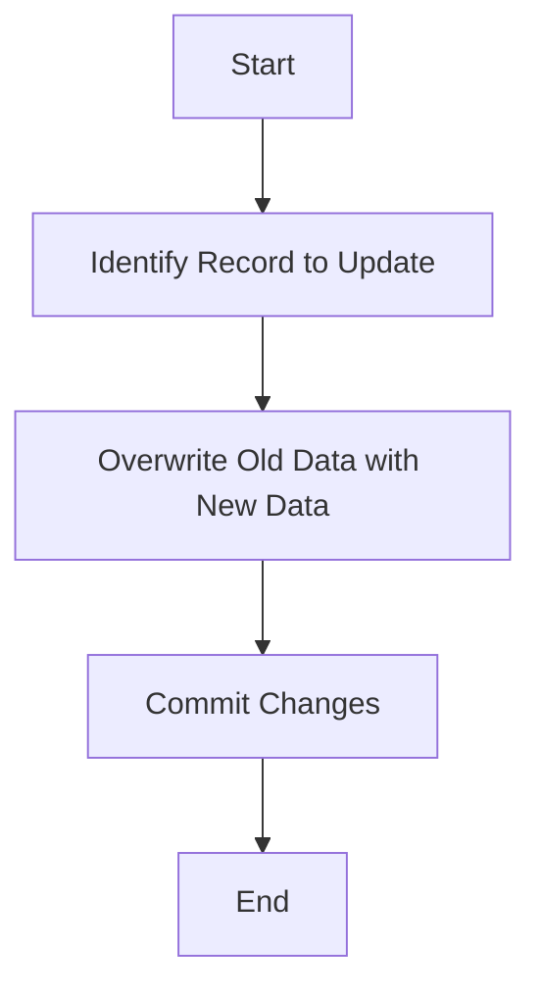

## 10.4.1 Type 1: Overwrite

In the realm of data warehousing, managing changes in dimension data is a critical task. Dimensions often contain attributes that change over time, and how these changes are handled can significantly impact the accuracy and usability of analytical reports. This section delves into the Type 1: Overwrite method for handling Slowly Changing Dimensions (SCDs), a straightforward approach that updates dimension records by overwriting old data with new values.

### Understanding Slowly Changing Dimensions

Before diving into the specifics of Type 1: Overwrite, it's essential to understand the concept of Slowly Changing Dimensions (SCDs). In data warehousing, dimensions are structures that categorize facts and measures to enable users to answer business questions. These dimensions can change slowly over time, and managing these changes is crucial for maintaining data integrity and accuracy.

### Type 1: Overwrite Approach

**Approach**: The Type 1: Overwrite method involves updating the dimension record by overwriting the old data with the new data. This approach does not maintain any history of changes; instead, it keeps only the most recent data.

#### Use Cases

- **When Historical Changes Are Not Important**: Type 1 is suitable when the historical accuracy of the data is not critical. For instance, if a customer's address changes, and the business only needs the current address for shipping purposes, Type 1 is appropriate.
- **Simplifying Data Management**: This method simplifies data management by avoiding the complexity of maintaining historical records.
- **Performance Considerations**: Since Type 1 does not require additional storage for historical data, it can be more performant in terms of storage and retrieval.

### Key Characteristics of Type 1: Overwrite

- **No Historical Tracking**: The primary characteristic of Type 1 is that it does not track historical changes. Once a record is updated, the previous data is lost.
- **Simplicity**: The implementation of Type 1 is straightforward, making it easy to manage and maintain.
- **Data Integrity**: While it simplifies data management, it may not be suitable for scenarios where historical data is crucial for analysis.

### Implementing Type 1: Overwrite

Let's explore how to implement the Type 1: Overwrite method in SQL. We'll use a simple example of a customer dimension table to illustrate the process.

#### Sample Schema

Consider a `Customer` dimension table with the following schema:

```sql
CREATE TABLE Customer (
    CustomerID INT PRIMARY KEY,
    FirstName VARCHAR(50),
    LastName VARCHAR(50),
    Email VARCHAR(100),
    Address VARCHAR(255),
    City VARCHAR(50),
    State VARCHAR(50),
    ZipCode VARCHAR(10)
);
```

#### Updating Records

To implement Type 1: Overwrite, you simply update the existing record with new data. Here's an example SQL statement to update a customer's address:

```sql
UPDATE Customer
SET Address = '123 New Street',
    City = 'New City',
    State = 'NC',
    ZipCode = '12345'
WHERE CustomerID = 1;
```

In this example, the customer's address is updated, and the old address is overwritten. There is no record of the previous address.

#### Considerations for Implementation

- **Data Consistency**: Ensure that updates are consistent and do not lead to partial updates, which can cause data integrity issues.
- **Concurrency Control**: Implement appropriate locking mechanisms to handle concurrent updates and prevent data corruption.
- **Backup Strategies**: Regular backups are essential since historical data is not retained in the database.

### Advantages of Type 1: Overwrite

- **Simplicity**: The method is easy to implement and manage, making it suitable for scenarios where simplicity is a priority.
- **Performance**: By not storing historical data, Type 1 can improve performance in terms of storage and retrieval.
- **Cost-Effective**: Reduces storage costs by maintaining only the current state of the data.

### Limitations of Type 1: Overwrite

- **Loss of Historical Data**: The most significant limitation is the loss of historical data, which can be a drawback for analytical purposes.
- **Limited Analytical Capabilities**: Without historical data, certain types of analysis, such as trend analysis, are not possible.
- **Potential Data Integrity Issues**: If not managed properly, updates can lead to data integrity issues, especially in concurrent environments.

### Visualizing the Type 1: Overwrite Process

To better understand the Type 1: Overwrite process, let's visualize it using a simple flowchart.



**Description**: This flowchart illustrates the Type 1: Overwrite process, where the old data is identified, overwritten with new data, and changes are committed.

### When to Use Type 1: Overwrite

- **Non-Critical Historical Data**: Use Type 1 when historical data is not critical for business operations or analysis.
- **Simplified Data Management**: When the goal is to simplify data management and reduce complexity.
- **Cost and Performance Considerations**: In scenarios where storage costs and performance are a priority.

### Differences and Similarities with Other SCD Types

- **Type 2: Add New Row**: Unlike Type 1, Type 2 maintains historical data by adding new rows for each change. This allows for historical tracking but increases complexity and storage requirements.
- **Type 3: Add New Column**: Type 3 tracks limited historical data by adding new columns for changes. It provides a balance between Type 1 and Type 2 but is limited in its historical tracking capabilities.

### Design Considerations

- **Assess Business Requirements**: Before implementing Type 1, assess whether historical data is necessary for your business needs.
- **Plan for Data Recovery**: Since historical data is not retained, ensure that you have a robust backup and recovery strategy.
- **Monitor Data Quality**: Regularly monitor data quality to ensure that updates do not lead to inconsistencies or data corruption.

### Try It Yourself

To get hands-on experience with Type 1: Overwrite, try modifying the sample code to update different attributes of the `Customer` table. Experiment with different scenarios to see how the updates affect the data.

### Knowledge Check

- **Question**: What is the primary characteristic of Type 1: Overwrite?
- **Exercise**: Implement a Type 1 update for a different dimension table in your data warehouse.

### Embrace the Journey

Remember, mastering SQL design patterns is a journey. As you explore different approaches to handling Slowly Changing Dimensions, you'll gain a deeper understanding of how to manage data effectively. Keep experimenting, stay curious, and enjoy the process!

## Quiz Time!



### What is the primary characteristic of Type 1: Overwrite?

- [x] It overwrites old data with new data.
- [ ] It maintains historical data.
- [ ] It adds new columns for changes.
- [ ] It adds new rows for changes.

> **Explanation:** Type 1: Overwrite updates the dimension record by overwriting old data with new data, without maintaining historical data.

### When is Type 1: Overwrite most suitable?

- [x] When historical changes are not important.
- [ ] When historical changes are critical.
- [ ] When you need to track every change.
- [ ] When you need to add new columns for changes.

> **Explanation:** Type 1: Overwrite is suitable when historical changes are not important, as it does not maintain a history of changes.

### What is a key advantage of Type 1: Overwrite?

- [x] Simplicity and ease of implementation.
- [ ] It tracks historical data.
- [ ] It requires additional storage.
- [ ] It adds complexity to data management.

> **Explanation:** Type 1: Overwrite is simple and easy to implement, making it advantageous when historical data is not needed.

### What is a limitation of Type 1: Overwrite?

- [x] Loss of historical data.
- [ ] Complexity in implementation.
- [ ] High storage costs.
- [ ] Difficult to manage.

> **Explanation:** The main limitation of Type 1: Overwrite is the loss of historical data, which can be a drawback for analytical purposes.

### How does Type 1: Overwrite differ from Type 2?

- [x] Type 1 overwrites data, while Type 2 adds new rows.
- [ ] Type 1 adds new rows, while Type 2 overwrites data.
- [ ] Both Type 1 and Type 2 overwrite data.
- [ ] Both Type 1 and Type 2 add new rows.

> **Explanation:** Type 1 overwrites old data with new data, while Type 2 maintains historical data by adding new rows for each change.

### What should be considered when implementing Type 1: Overwrite?

- [x] Data consistency and concurrency control.
- [ ] Adding new columns for changes.
- [ ] Maintaining historical data.
- [ ] Increasing storage capacity.

> **Explanation:** When implementing Type 1: Overwrite, ensure data consistency and implement concurrency control to prevent data corruption.

### What is a common use case for Type 1: Overwrite?

- [x] Updating non-critical historical data.
- [ ] Tracking every change in data.
- [ ] Maintaining a detailed history of changes.
- [ ] Adding new columns for changes.

> **Explanation:** Type 1: Overwrite is commonly used when updating non-critical historical data, as it does not maintain a history of changes.

### What is a key benefit of using Type 1: Overwrite?

- [x] Improved performance due to reduced storage needs.
- [ ] Increased complexity in data management.
- [ ] Detailed historical tracking.
- [ ] High storage costs.

> **Explanation:** By not storing historical data, Type 1: Overwrite can improve performance due to reduced storage needs.

### What is a design consideration for Type 1: Overwrite?

- [x] Assessing business requirements for historical data.
- [ ] Adding new columns for changes.
- [ ] Maintaining a detailed history of changes.
- [ ] Increasing storage capacity.

> **Explanation:** Before implementing Type 1: Overwrite, assess whether historical data is necessary for your business needs.

### True or False: Type 1: Overwrite is suitable for scenarios where historical data is critical.

- [ ] True
- [x] False

> **Explanation:** Type 1: Overwrite is not suitable for scenarios where historical data is critical, as it does not maintain a history of changes.




