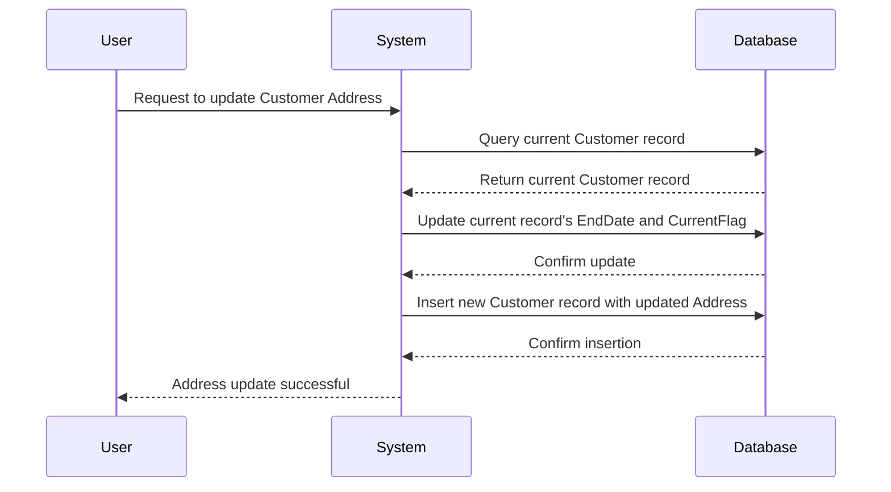

## 10.4.2 Type 2: Add Row

In the realm of data warehousing and analytics, handling changes in dimension data is a critical task. The Type 2 Slowly Changing Dimension (SCD) pattern, also known as the "Add Row" approach, is a powerful method for preserving historical data. This section delves into the intricacies of the Type 2 pattern, providing expert software engineers and architects with the knowledge needed to implement it effectively.

### Understanding Slowly Changing Dimensions

Before diving into the Type 2 pattern, it's essential to understand the concept of Slowly Changing Dimensions (SCDs). In data warehousing, dimensions are attributes or descriptive data that provide context to facts. Over time, these dimensions may change, and how we handle these changes is crucial for maintaining data integrity and historical accuracy.

### Type 2: Add Row - An Overview

The Type 2 SCD pattern involves adding a new row to the dimension table whenever a change occurs. This approach allows us to maintain a complete history of changes, providing a comprehensive view of the data over time. By preserving historical records, we can perform time-based analyses and gain insights into trends and patterns.

#### Key Characteristics of Type 2 SCD

- **Historical Tracking**: Each change in a dimension results in a new row, capturing the state of the data at that point in time.
- **Versioning**: Rows are versioned, often using start and end dates or a version number, to indicate the validity period of each record.
- **Data Integrity**: Ensures that historical data remains intact, allowing for accurate reporting and analysis.

### Implementing Type 2 SCD in SQL

To implement the Type 2 SCD pattern, we need to design our dimension tables to accommodate historical data. This involves adding additional columns for versioning and managing the insertion of new rows when changes occur.

#### Designing the Dimension Table

A typical dimension table for a Type 2 SCD might include the following columns:

- **ID**: A unique identifier for the dimension.
- **Attributes**: The descriptive data for the dimension (e.g., name, address).
- **Start Date**: The date when the record became effective.
- **End Date**: The date when the record was superseded (often set to a high value for current records).
- **Current Flag**: A boolean flag indicating whether the record is the current version.

Here's an example of a dimension table schema:

```sql
CREATE TABLE CustomerDimension (
    CustomerID INT PRIMARY KEY,
    CustomerName VARCHAR(100),
    Address VARCHAR(255),
    StartDate DATE,
    EndDate DATE,
    CurrentFlag BOOLEAN
);
```

#### Inserting New Rows

When a change occurs, we insert a new row with updated attributes and adjust the end date of the previous record. Let's consider a scenario where a customer's address changes:

```sql
-- Assume the current record for CustomerID 1 is:
-- CustomerID: 1, CustomerName: 'John Doe', Address: '123 Elm St', StartDate: '2023-01-01', EndDate: '9999-12-31', CurrentFlag: TRUE

-- Update the current record to set the end date and current flag
UPDATE CustomerDimension
SET EndDate = '2024-11-01', CurrentFlag = FALSE
WHERE CustomerID = 1 AND CurrentFlag = TRUE;

-- Insert the new record with the updated address
INSERT INTO CustomerDimension (CustomerID, CustomerName, Address, StartDate, EndDate, CurrentFlag)
VALUES (1, 'John Doe', '456 Oak St', '2024-11-02', '9999-12-31', TRUE);
```

### Visualizing the Type 2 SCD Process

To better understand the Type 2 SCD process, let's visualize it using a sequence diagram. This diagram illustrates the steps involved in updating a dimension record and inserting a new row.



### Advantages of Type 2 SCD

The Type 2 SCD pattern offers several advantages, making it a popular choice for handling dimension changes:

- **Comprehensive History**: By maintaining a complete history of changes, we can perform time-based analyses and gain insights into trends and patterns.
- **Data Integrity**: Ensures that historical data remains intact, allowing for accurate reporting and analysis.
- **Flexibility**: Supports complex queries and analyses that require historical context.

### Design Considerations

While the Type 2 SCD pattern is powerful, it also comes with certain design considerations:

- **Storage Requirements**: As each change results in a new row, the dimension table can grow significantly over time. It's important to plan for sufficient storage and consider archiving strategies.
- **Complexity**: Managing multiple versions of a record can increase the complexity of queries and data management. Proper indexing and query optimization are essential.
- **Performance**: Inserting new rows and updating existing records can impact performance, especially in high-volume environments. Consider using batch processing and efficient indexing strategies.

### Differences and Similarities with Other SCD Types

The Type 2 SCD pattern is often compared with other SCD types:

- **Type 1 (Overwrite)**: In Type 1, changes overwrite the existing record, with no historical tracking. This is simpler but lacks historical context.
- **Type 3 (Add Column)**: Type 3 adds a column to track changes, but only retains limited history. It's less comprehensive than Type 2.

### Code Example: Implementing Type 2 SCD

Let's walk through a complete example of implementing the Type 2 SCD pattern in SQL. We'll use a `ProductDimension` table to track changes in product attributes.

```sql
-- Create the ProductDimension table
CREATE TABLE ProductDimension (
    ProductID INT PRIMARY KEY,
    ProductName VARCHAR(100),
    Category VARCHAR(50),
    StartDate DATE,
    EndDate DATE,
    CurrentFlag BOOLEAN
);

-- Insert an initial product record
INSERT INTO ProductDimension (ProductID, ProductName, Category, StartDate, EndDate, CurrentFlag)
VALUES (101, 'Widget A', 'Gadgets', '2023-01-01', '9999-12-31', TRUE);

-- Update the product category
-- Step 1: Update the current record
UPDATE ProductDimension
SET EndDate = '2024-11-01', CurrentFlag = FALSE
WHERE ProductID = 101 AND CurrentFlag = TRUE;

-- Step 2: Insert the new record with the updated category
INSERT INTO ProductDimension (ProductID, ProductName, Category, StartDate, EndDate, CurrentFlag)
VALUES (101, 'Widget A', 'Electronics', '2024-11-02', '9999-12-31', TRUE);
```

### Try It Yourself

To deepen your understanding of the Type 2 SCD pattern, try modifying the code examples above. Experiment with different scenarios, such as:

- Adding additional attributes to the dimension table.
- Implementing a version number instead of start and end dates.
- Creating a trigger to automate the update and insert process.

### Knowledge Check

Let's reinforce what we've learned with a few questions:

- What are the key characteristics of the Type 2 SCD pattern?
- How does the Type 2 pattern differ from Type 1 and Type 3 SCDs?
- What are some design considerations when implementing Type 2 SCD?

### Embrace the Journey

Remember, mastering the Type 2 SCD pattern is just one step in your journey as a data warehousing expert. As you continue to explore SQL design patterns, you'll gain the skills needed to build robust, scalable, and insightful data solutions. Keep experimenting, stay curious, and enjoy the journey!

## Quiz Time!



### What is the primary advantage of using the Type 2 SCD pattern?

- [x] It provides full historical tracking of dimension changes.
- [ ] It minimizes storage requirements.
- [ ] It simplifies query complexity.
- [ ] It eliminates the need for versioning.

> **Explanation:** The Type 2 SCD pattern is designed to provide full historical tracking of dimension changes by adding new rows for each change.

### Which columns are typically added to a dimension table for Type 2 SCD implementation?

- [x] Start Date and End Date
- [ ] Change Date and Change Type
- [ ] Update Date and Update Type
- [ ] Version Number and Change Flag

> **Explanation:** Start Date and End Date columns are used to track the validity period of each record in a Type 2 SCD implementation.

### How does the Type 2 SCD pattern handle changes in dimension data?

- [x] By inserting a new row for each change
- [ ] By overwriting the existing record
- [ ] By adding a new column for each change
- [ ] By deleting the old record

> **Explanation:** The Type 2 SCD pattern handles changes by inserting a new row for each change, preserving the historical data.

### What is a potential drawback of the Type 2 SCD pattern?

- [x] Increased storage requirements
- [ ] Loss of historical data
- [ ] Inability to track changes
- [ ] Simplified data management

> **Explanation:** The Type 2 SCD pattern can lead to increased storage requirements due to the addition of new rows for each change.

### Which SQL command is used to update the current record's end date in a Type 2 SCD implementation?

- [x] UPDATE
- [ ] INSERT
- [ ] DELETE
- [ ] SELECT

> **Explanation:** The UPDATE command is used to modify the current record's end date in a Type 2 SCD implementation.

### What is the purpose of the CurrentFlag column in a Type 2 SCD table?

- [x] To indicate whether the record is the current version
- [ ] To store the version number of the record
- [ ] To track the change type
- [ ] To store the change date

> **Explanation:** The CurrentFlag column is used to indicate whether the record is the current version in a Type 2 SCD table.

### How does the Type 2 SCD pattern differ from the Type 1 SCD pattern?

- [x] Type 2 preserves historical data, while Type 1 overwrites it.
- [ ] Type 2 overwrites data, while Type 1 preserves it.
- [ ] Type 2 adds columns, while Type 1 adds rows.
- [ ] Type 2 deletes old records, while Type 1 keeps them.

> **Explanation:** The Type 2 SCD pattern preserves historical data by adding new rows, while the Type 1 SCD pattern overwrites existing data.

### What is a common use case for the Type 2 SCD pattern?

- [x] Tracking changes in customer addresses over time
- [ ] Storing real-time sensor data
- [ ] Managing temporary data
- [ ] Aggregating sales data

> **Explanation:** The Type 2 SCD pattern is commonly used to track changes in customer addresses or other dimension attributes over time.

### Which SQL command is used to insert a new record in a Type 2 SCD implementation?

- [x] INSERT
- [ ] UPDATE
- [ ] DELETE
- [ ] SELECT

> **Explanation:** The INSERT command is used to add a new record in a Type 2 SCD implementation.

### True or False: The Type 2 SCD pattern is suitable for scenarios where historical data is not important.

- [ ] True
- [x] False

> **Explanation:** False. The Type 2 SCD pattern is specifically designed for scenarios where preserving historical data is important.


