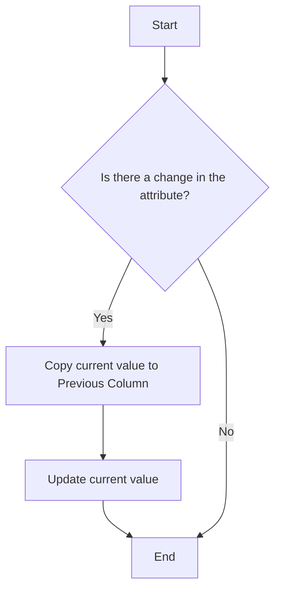

## 10.4.3 Type 3: Add Column

In the realm of data warehousing, handling changes in dimension data is a critical task. Slowly Changing Dimensions (SCD) are dimensions that change slowly over time, rather than changing on a regular schedule, time-base, or in real-time. The Type 3 Add Column approach is one of the methods used to manage these changes. This method involves adding new columns to track changes, allowing for a limited history of changes to be stored.

### Understanding Slowly Changing Dimensions

Before diving into the Type 3 Add Column approach, let's briefly revisit the concept of Slowly Changing Dimensions (SCD). Dimensions are attributes or characteristics of data that provide context to facts in a data warehouse. For example, in a sales database, dimensions might include product, customer, and time. Over time, these dimensions can change. For instance, a customer might change their address or a product might be rebranded.

Handling these changes efficiently is crucial for maintaining the accuracy and relevance of data in a warehouse. There are several types of SCDs, each with its own method for managing changes:

- **Type 1**: Overwrite the old data with new data.
- **Type 2**: Add a new row to capture changes, preserving historical data.
- **Type 3**: Add a new column to track changes, allowing for a limited history.

### Type 3 Add Column: An Overview

The Type 3 Add Column approach is a compromise between Type 1 and Type 2. It allows for tracking changes by adding additional columns to the dimension table. This method is particularly useful when you need to track only a limited history of changes, such as the previous value of an attribute.

#### Key Characteristics of Type 3 Add Column

- **Limited History**: Type 3 tracks only a limited history of changes, usually the current and one previous value.
- **Additional Columns**: New columns are added to store historical values.
- **Simplified Queries**: Queries can be simplified as they don't need to join multiple rows to get historical data.
- **Space Efficiency**: More space-efficient than Type 2, as it doesn't require additional rows for each change.

### Implementing Type 3 Add Column

To implement the Type 3 Add Column approach, follow these steps:

1. **Identify the Attributes**: Determine which attributes in your dimension table are subject to change and need historical tracking.
2. **Add New Columns**: For each attribute you want to track, add a new column to store the previous value.
3. **Update Logic**: Implement logic to update these columns whenever a change occurs.

#### Example Scenario

Consider a customer dimension table where we want to track changes in the customer's city. Initially, the table might look like this:

```sql
CREATE TABLE Customer (
    CustomerID INT PRIMARY KEY,
    CustomerName VARCHAR(100),
    City VARCHAR(100)
);
```

To implement Type 3, we add a new column to track the previous city:

```sql
ALTER TABLE Customer
ADD PreviousCity VARCHAR(100);
```

When a customer's city changes, the update logic would look like this:

```sql
UPDATE Customer
SET PreviousCity = City,
    City = 'NewCity'
WHERE CustomerID = 1;
```

### Visualizing the Type 3 Add Column Approach

To better understand how the Type 3 Add Column approach works, let's visualize the process using a flowchart.



**Figure 1**: Flowchart illustrating the Type 3 Add Column process.

### Benefits of Type 3 Add Column

- **Simplicity**: Easy to implement and understand.
- **Efficiency**: More space-efficient than Type 2, as it doesn't require additional rows.
- **Performance**: Queries can be faster since they don't need to join multiple rows to get historical data.

### Limitations of Type 3 Add Column

- **Limited History**: Only tracks a limited history of changes, typically the current and one previous value.
- **Scalability**: Not suitable for attributes that change frequently or require extensive historical tracking.
- **Complexity**: Can become complex if many attributes require tracking, leading to a large number of additional columns.

### Applicability of Type 3 Add Column

The Type 3 Add Column approach is best suited for scenarios where:

- You need to track only a limited history of changes.
- The attributes change infrequently.
- Space efficiency is a concern.
- Simplicity and performance are prioritized over extensive historical tracking.

### Sample Code Snippet

Let's look at a complete example of implementing the Type 3 Add Column approach in a customer dimension table.

```sql
-- Create the Customer table
CREATE TABLE Customer (
    CustomerID INT PRIMARY KEY,
    CustomerName VARCHAR(100),
    City VARCHAR(100),
    PreviousCity VARCHAR(100)
);

-- Insert initial data
INSERT INTO Customer (CustomerID, CustomerName, City)
VALUES (1, 'John Doe', 'New York');

-- Update the City and track the previous value
UPDATE Customer
SET PreviousCity = City,
    City = 'Los Angeles'
WHERE CustomerID = 1;

-- Query to see the changes
SELECT CustomerID, CustomerName, City, PreviousCity
FROM Customer;
```

### Design Considerations

When implementing the Type 3 Add Column approach, consider the following:

- **Attribute Selection**: Carefully select which attributes require historical tracking.
- **Column Management**: Manage the additional columns to avoid cluttering the table.
- **Update Logic**: Ensure the update logic is efficient and correctly implemented.

### Differences and Similarities with Other SCD Types

- **Type 1 vs. Type 3**: Type 1 overwrites data, losing history, while Type 3 retains limited history.
- **Type 2 vs. Type 3**: Type 2 adds new rows for each change, preserving full history, while Type 3 adds columns, preserving limited history.

### Try It Yourself

To deepen your understanding of the Type 3 Add Column approach, try modifying the example code to:

- Track changes for multiple attributes, such as `State` or `Country`.
- Implement logic to revert to the previous value if needed.
- Experiment with different scenarios to see how the approach handles various changes.

### Conclusion

The Type 3 Add Column approach offers a balanced solution for tracking changes in dimension data, providing a limited history while maintaining simplicity and efficiency. By understanding its benefits and limitations, you can effectively apply this method in your data warehousing projects.

### References and Further Reading

- [Slowly Changing Dimensions](https://en.wikipedia.org/wiki/Slowly_changing_dimension)
- [Data Warehousing Concepts](https://www.oracle.com/database/what-is-a-data-warehouse/)
- [SQL ALTER TABLE Statement](https://www.w3schools.com/sql/sql_alter.asp)

### Knowledge Check

Let's reinforce what we've learned with some questions and exercises.

## Quiz Time!



### What is the primary characteristic of the Type 3 Add Column approach?

- [x] It tracks a limited history of changes by adding new columns.
- [ ] It overwrites old data with new data.
- [ ] It adds new rows for each change.
- [ ] It tracks changes using a separate history table.

> **Explanation:** The Type 3 Add Column approach tracks a limited history by adding new columns to store previous values.

### Which of the following is a limitation of the Type 3 Add Column approach?

- [x] It only tracks a limited history of changes.
- [ ] It requires additional rows for each change.
- [ ] It overwrites old data, losing history.
- [ ] It is complex to implement.

> **Explanation:** The Type 3 Add Column approach is limited in that it only tracks a limited history, typically the current and one previous value.

### In the Type 3 Add Column approach, what is typically added to the dimension table?

- [x] New columns to store previous values.
- [ ] New rows for each change.
- [ ] A separate history table.
- [ ] A timestamp column.

> **Explanation:** New columns are added to store previous values, allowing for limited historical tracking.

### What is a benefit of the Type 3 Add Column approach?

- [x] It is more space-efficient than Type 2.
- [ ] It tracks a full history of changes.
- [ ] It is suitable for attributes that change frequently.
- [ ] It requires no changes to the table structure.

> **Explanation:** The Type 3 Add Column approach is more space-efficient than Type 2, as it doesn't require additional rows for each change.

### How does the Type 3 Add Column approach differ from Type 1?

- [x] Type 3 retains limited history, while Type 1 overwrites data.
- [ ] Type 3 adds new rows, while Type 1 adds new columns.
- [ ] Type 3 uses a separate history table, while Type 1 overwrites data.
- [ ] Type 3 overwrites data, while Type 1 retains limited history.

> **Explanation:** Type 3 retains limited history by adding columns, while Type 1 overwrites data, losing history.

### Which scenario is best suited for the Type 3 Add Column approach?

- [x] When you need to track only a limited history of changes.
- [ ] When you need to track a full history of changes.
- [ ] When attributes change frequently.
- [ ] When space efficiency is not a concern.

> **Explanation:** The Type 3 Add Column approach is best suited for scenarios where only a limited history of changes is needed.

### What should be considered when implementing the Type 3 Add Column approach?

- [x] Attribute selection and column management.
- [ ] Adding new rows for each change.
- [ ] Using a separate history table.
- [ ] Overwriting old data with new data.

> **Explanation:** Attribute selection and column management are important considerations when implementing the Type 3 Add Column approach.

### What is a potential drawback of using the Type 3 Add Column approach?

- [x] It can become complex if many attributes require tracking.
- [ ] It requires additional rows for each change.
- [ ] It overwrites old data, losing history.
- [ ] It is not space-efficient.

> **Explanation:** The approach can become complex if many attributes require tracking, leading to a large number of additional columns.

### How does the Type 3 Add Column approach handle changes in dimension data?

- [x] By adding new columns to store previous values.
- [ ] By adding new rows for each change.
- [ ] By overwriting old data with new data.
- [ ] By using a separate history table.

> **Explanation:** Changes are handled by adding new columns to store previous values, allowing for limited historical tracking.

### True or False: The Type 3 Add Column approach is suitable for tracking extensive historical changes.

- [ ] True
- [x] False

> **Explanation:** False. The Type 3 Add Column approach is not suitable for tracking extensive historical changes, as it only tracks a limited history.



Remember, mastering the Type 3 Add Column approach is just one step in your journey to becoming an expert in SQL design patterns. Keep experimenting, stay curious, and enjoy the process of learning and applying these concepts in your projects!
