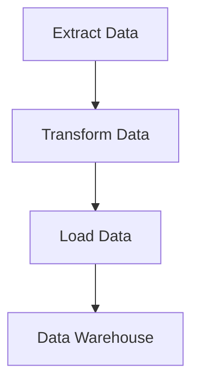

## 10.5 ETL (Extract, Transform, Load) Processes

In the realm of data warehousing and analytics, ETL (Extract, Transform, Load) processes play a pivotal role in ensuring that data is accurately and efficiently moved from various sources into a centralized data warehouse. This section delves into the intricacies of ETL processes, providing expert software engineers and architects with the knowledge needed to design and implement robust ETL pipelines.

### Understanding ETL Processes

ETL processes are essential for consolidating data from disparate sources, transforming it into a consistent format, and loading it into a data warehouse for analysis. Let's break down each component of ETL:

#### Extraction

**Extraction** is the first step in the ETL process, where data is pulled from various source systems. These sources can include databases, flat files, APIs, and more. The goal is to gather all relevant data needed for analysis.

- **Data Sources**: Identify and connect to the data sources. These could be relational databases, NoSQL databases, cloud storage, or external APIs.
- **Data Extraction Techniques**: Use techniques such as full extraction, incremental extraction, and change data capture (CDC) to efficiently retrieve data.
- **Challenges**: Handle issues like data format inconsistencies, network latency, and data volume.

```sql
-- Example of extracting data from a SQL database
SELECT * FROM source_table WHERE last_modified > '2024-01-01';
```

#### Transformation

**Transformation** involves cleaning, enriching, and preparing the extracted data for analysis. This step is crucial for ensuring data quality and consistency.

- **Data Cleaning**: Remove duplicates, handle missing values, and correct data types.
- **Data Enrichment**: Add derived columns, perform calculations, and integrate data from multiple sources.
- **Data Standardization**: Convert data into a consistent format, such as standardizing date formats or currency units.

```sql
-- Example of transforming data
SELECT 
    id, 
    UPPER(name) AS name, 
    DATE_FORMAT(birth_date, '%Y-%m-%d') AS birth_date 
FROM 
    extracted_data;
```

#### Loading

**Loading** is the final step, where transformed data is inserted into the target data warehouse. This step must be optimized for performance to handle large volumes of data efficiently.

- **Data Loading Techniques**: Use bulk loading, partitioning, and indexing to optimize performance.
- **Data Validation**: Ensure data integrity by validating constraints and relationships.
- **Error Handling**: Implement mechanisms to handle load failures and ensure data consistency.

```sql
-- Example of loading data into a target table
INSERT INTO target_table (id, name, birth_date)
SELECT id, name, birth_date FROM transformed_data;
```

### Tools and Technologies

Several tools and technologies can be used to implement ETL processes. These range from dedicated ETL software to scripting languages and SQL-based solutions.

- **ETL Tools**: Tools like Apache NiFi, Talend, and Informatica provide comprehensive ETL capabilities with user-friendly interfaces.
- **Scripting Languages**: Python, R, and Java can be used to script custom ETL processes, offering flexibility and control.
- **SQL-Based Solutions**: SQL can be used for data transformation and loading, especially when working with relational databases.

### Best Practices for ETL Processes

To ensure efficient and reliable ETL processes, consider the following best practices:

- **Error Handling**: Implement robust error handling mechanisms to manage extraction, transformation, and loading errors.
- **Data Validation**: Validate data at each stage to ensure accuracy and consistency.
- **Performance Optimization**: Optimize ETL processes for performance by using parallel processing, indexing, and partitioning.
- **Scalability**: Design ETL processes to scale with increasing data volumes and complexity.
- **Documentation**: Maintain comprehensive documentation of ETL processes for maintenance and troubleshooting.

### Visualizing ETL Processes

To better understand the flow of data through ETL processes, let's visualize a typical ETL pipeline using a flowchart.



**Figure 1**: A flowchart illustrating the ETL process, from data extraction to loading into a data warehouse.

### Try It Yourself

To gain hands-on experience with ETL processes, try modifying the code examples provided. Experiment with different data sources, transformation logic, and loading techniques to see how they impact the overall process.

### Knowledge Check

- **Question**: What are the main components of an ETL process?
- **Challenge**: Implement a simple ETL pipeline using SQL to extract data from a source table, transform it by standardizing date formats, and load it into a target table.

### Embrace the Journey

Remember, mastering ETL processes is a journey. As you progress, you'll encounter new challenges and opportunities to optimize your data pipelines. Stay curious, keep experimenting, and enjoy the process of transforming raw data into valuable insights.

## Quiz Time!



### What is the primary purpose of the extraction phase in ETL?

- [x] To gather data from various source systems
- [ ] To clean and transform data
- [ ] To load data into the data warehouse
- [ ] To validate data integrity

> **Explanation:** The extraction phase focuses on gathering data from various source systems.

### Which technique is used to efficiently retrieve only changed data during extraction?

- [ ] Full extraction
- [x] Incremental extraction
- [ ] Data validation
- [ ] Data enrichment

> **Explanation:** Incremental extraction retrieves only the data that has changed since the last extraction.

### What is a common challenge during the transformation phase?

- [ ] Network latency
- [x] Data format inconsistencies
- [ ] Data loading failures
- [ ] Data validation errors

> **Explanation:** Data format inconsistencies are a common challenge during the transformation phase.

### Which tool is known for providing comprehensive ETL capabilities with a user-friendly interface?

- [ ] Python
- [ ] SQL
- [x] Talend
- [ ] Java

> **Explanation:** Talend is known for its comprehensive ETL capabilities and user-friendly interface.

### What is the purpose of data validation during the loading phase?

- [ ] To gather data from sources
- [ ] To clean and transform data
- [x] To ensure data integrity
- [ ] To optimize performance

> **Explanation:** Data validation during the loading phase ensures data integrity.

### Which of the following is a best practice for optimizing ETL performance?

- [ ] Using single-threaded processing
- [x] Using parallel processing
- [ ] Avoiding indexing
- [ ] Ignoring data validation

> **Explanation:** Using parallel processing is a best practice for optimizing ETL performance.

### What is the role of error handling in ETL processes?

- [ ] To gather data from sources
- [x] To manage extraction, transformation, and loading errors
- [ ] To enrich data
- [ ] To standardize data formats

> **Explanation:** Error handling manages errors during extraction, transformation, and loading.

### Which scripting language is commonly used for custom ETL processes?

- [ ] SQL
- [x] Python
- [ ] Talend
- [ ] Informatica

> **Explanation:** Python is commonly used for scripting custom ETL processes.

### What is the final step in the ETL process?

- [ ] Extraction
- [ ] Transformation
- [x] Loading
- [ ] Validation

> **Explanation:** Loading is the final step in the ETL process.

### True or False: ETL processes are only used for relational databases.

- [ ] True
- [x] False

> **Explanation:** ETL processes can be used for various data sources, not just relational databases.




