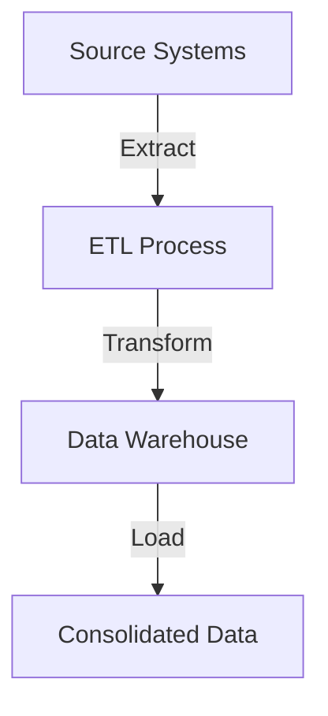
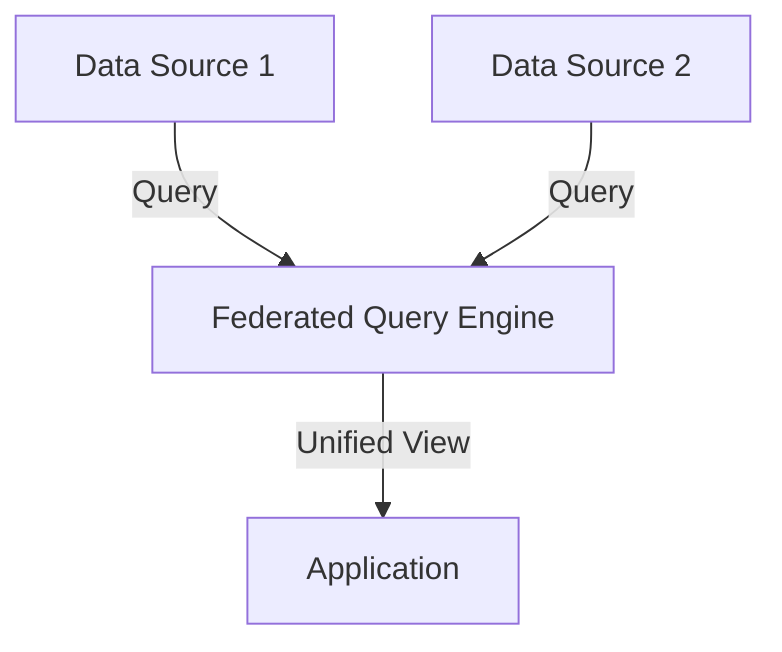
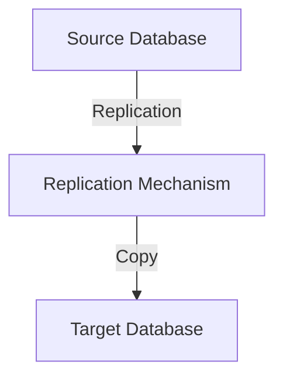

## 10.6 Data Integration Patterns

In the realm of modern data architecture, data integration is a cornerstone for building robust, scalable, and efficient systems. As organizations increasingly rely on diverse data sources, the need for seamless integration becomes paramount. In this section, we will delve into the intricacies of data integration patterns, focusing on data consolidation, data federation, and data propagation. These patterns are essential for expert software engineers and architects aiming to optimize data warehousing and analytical processes.

### Introduction to Data Integration

Data integration involves combining data from different sources to provide a unified view. This process is crucial for decision-making, analytics, and operational efficiency. Let's explore the key patterns that facilitate effective data integration.

### Data Consolidation

**Data Consolidation** refers to the process of combining data from multiple sources into a single, centralized data store. This pattern is often used in data warehousing, where data from various operational systems is aggregated into a data warehouse for analysis and reporting.

#### Intent

The primary intent of data consolidation is to create a single source of truth, enabling consistent and accurate reporting and analysis. By consolidating data, organizations can eliminate data silos and ensure that all stakeholders have access to the same information.

#### Key Participants

- **Source Systems**: These are the original data sources, such as transactional databases, CRM systems, and ERP systems.
- **Data Warehouse**: The centralized repository where consolidated data is stored.
- **ETL Processes**: Extract, Transform, Load (ETL) processes are used to extract data from source systems, transform it into a suitable format, and load it into the data warehouse.

#### Applicability

Data consolidation is applicable in scenarios where:

- There is a need for comprehensive reporting and analytics.
- Data from multiple sources must be combined for a holistic view.
- Consistency and accuracy of data are critical.

#### Sample Code Snippet

Below is a simple example of an ETL process using SQL to consolidate data from two source tables into a data warehouse table.

```sql
-- Extract data from source tables
SELECT * INTO #TempCustomerData
FROM SourceDB.dbo.Customers;

SELECT * INTO #TempOrderData
FROM SourceDB.dbo.Orders;

-- Transform data (e.g., join and aggregate)
SELECT c.CustomerID, c.CustomerName, SUM(o.OrderAmount) AS TotalSpent
INTO #ConsolidatedData
FROM #TempCustomerData c
JOIN #TempOrderData o ON c.CustomerID = o.CustomerID
GROUP BY c.CustomerID, c.CustomerName;

-- Load data into the data warehouse
INSERT INTO DataWarehouse.dbo.CustomerSpending (CustomerID, CustomerName, TotalSpent)
SELECT CustomerID, CustomerName, TotalSpent
FROM #ConsolidatedData;
```

#### Design Considerations

- **Data Quality**: Ensure data quality by implementing validation and cleansing processes during the ETL phase.
- **Performance**: Optimize ETL processes to handle large volumes of data efficiently.
- **Scalability**: Design the data warehouse to scale with increasing data volumes and user demands.

#### Differences and Similarities

Data consolidation is often confused with data federation. While both aim to provide a unified view of data, consolidation physically moves data into a central repository, whereas federation provides a virtual view without moving data.

### Data Federation

**Data Federation** is a virtual integration pattern that allows querying and accessing data from multiple sources without physically moving the data. This approach is useful when real-time access to data is required, and moving data is impractical or unnecessary.

#### Intent

The intent of data federation is to provide a unified view of data across disparate sources, enabling real-time access and analysis without the overhead of data movement.

#### Key Participants

- **Federated Query Engine**: A system that executes queries across multiple data sources and combines the results.
- **Data Sources**: The original data repositories, which remain unchanged.

#### Applicability

Data federation is applicable in scenarios where:

- Real-time data access is required.
- Data movement is impractical due to size, security, or latency concerns.
- A unified view is needed without altering the source systems.

#### Sample Code Snippet

Here's an example of a federated query using SQL Server's linked servers to access data from two different databases.

```sql
-- Query data from two different databases using linked servers
SELECT c.CustomerID, c.CustomerName, o.OrderDate, o.OrderAmount
FROM [Server1].SalesDB.dbo.Customers c
JOIN [Server2].OrdersDB.dbo.Orders o ON c.CustomerID = o.CustomerID
WHERE o.OrderDate > '2024-01-01';
```

#### Design Considerations

- **Performance**: Federated queries can be slower due to network latency and the need to aggregate results from multiple sources.
- **Security**: Ensure secure access to all data sources involved in federation.
- **Consistency**: Be aware of potential consistency issues due to the lack of a single source of truth.

#### Differences and Similarities

Data federation differs from data consolidation in that it does not involve moving data. Instead, it provides a virtual view, making it suitable for real-time access. However, it may not be ideal for scenarios requiring historical data analysis.

### Data Propagation

**Data Propagation** involves copying data between databases, either in real-time or in batch mode. This pattern is often used for data synchronization, replication, and distribution across multiple systems.

#### Intent

The intent of data propagation is to ensure that data is consistently available across multiple systems, enabling redundancy, load balancing, and disaster recovery.

#### Key Participants

- **Source Database**: The original database from which data is copied.
- **Target Database**: The database where data is propagated.
- **Replication Mechanism**: The process or tool used to copy data between databases.

#### Applicability

Data propagation is applicable in scenarios where:

- Data needs to be synchronized across multiple systems.
- Redundancy and high availability are required.
- Load balancing is necessary to distribute data access.

#### Sample Code Snippet

Below is an example of a SQL Server replication setup using transactional replication to propagate data from a source to a target database.

```sql
-- Set up transactional replication
-- Publisher: SourceDB
-- Subscriber: TargetDB

-- Step 1: Create a publication on the source database
EXEC sp_addpublication @publication = 'SalesDataPublication', @status = 'active';

-- Step 2: Add articles (tables) to the publication
EXEC sp_addarticle @publication = 'SalesDataPublication', @article = 'Orders', @source_object = 'Orders';

-- Step 3: Create a subscription on the target database
EXEC sp_addsubscription @publication = 'SalesDataPublication', @subscriber = 'TargetDB', @destination_db = 'TargetDB';

-- Step 4: Start the replication agents
EXEC sp_startpublication_snapshot @publication = 'SalesDataPublication';
```

#### Design Considerations

- **Latency**: Consider the latency introduced by data propagation, especially in real-time scenarios.
- **Conflict Resolution**: Implement conflict resolution mechanisms for scenarios where data changes in multiple locations.
- **Network Bandwidth**: Ensure sufficient network bandwidth to handle data propagation without impacting performance.

#### Differences and Similarities

Data propagation is similar to data consolidation in that it involves moving data. However, propagation focuses on synchronizing data across systems, whereas consolidation aims to create a single source of truth.

### Visualizing Data Integration Patterns

To better understand the relationships and processes involved in data integration patterns, let's visualize them using Mermaid.js diagrams.

#### Data Consolidation Process



*Diagram Description*: This flowchart illustrates the data consolidation process, where data is extracted from source systems, transformed, and loaded into a data warehouse.

#### Data Federation Architecture



*Diagram Description*: This diagram shows the data federation architecture, where a federated query engine provides a unified view by querying multiple data sources.

#### Data Propagation Workflow



*Diagram Description*: This workflow diagram represents data propagation, where data is copied from a source database to a target database using a replication mechanism.

### References and Links

- [MDN Web Docs on Data Integration](https://developer.mozilla.org/en-US/docs/Web/Guide/Integration)
- [W3Schools SQL Tutorial](https://www.w3schools.com/sql/)
- [Microsoft SQL Server Replication](https://docs.microsoft.com/en-us/sql/replication/sql-server-replication)

### Knowledge Check

To reinforce your understanding of data integration patterns, consider the following questions:

1. What are the key differences between data consolidation and data federation?
2. How does data propagation ensure data consistency across multiple systems?
3. What are the potential challenges of using federated queries?

### Embrace the Journey

Remember, mastering data integration patterns is a journey. As you progress, you'll gain the skills to design more complex and efficient data architectures. Keep experimenting, stay curious, and enjoy the journey!

### Quiz Time!



### What is the primary intent of data consolidation?

- [x] To create a single source of truth for consistent reporting
- [ ] To provide real-time access to data without moving it
- [ ] To synchronize data across multiple systems
- [ ] To replicate data for redundancy

> **Explanation:** Data consolidation aims to create a single source of truth by combining data from multiple sources into a centralized repository.

### Which pattern involves virtual integration without moving data?

- [ ] Data Consolidation
- [x] Data Federation
- [ ] Data Propagation
- [ ] Data Replication

> **Explanation:** Data federation provides a virtual view of data across multiple sources without physically moving the data.

### What is a key participant in data propagation?

- [ ] Federated Query Engine
- [x] Replication Mechanism
- [ ] Data Warehouse
- [ ] ETL Process

> **Explanation:** A replication mechanism is essential in data propagation for copying data between databases.

### Which pattern is best suited for real-time data access?

- [ ] Data Consolidation
- [x] Data Federation
- [ ] Data Propagation
- [ ] Data Synchronization

> **Explanation:** Data federation is ideal for real-time data access as it provides a unified view without moving data.

### What is a common challenge of federated queries?

- [ ] Data Quality
- [x] Performance
- [ ] Scalability
- [ ] Data Redundancy

> **Explanation:** Federated queries can be slower due to network latency and the need to aggregate results from multiple sources.

### Which pattern is used to ensure data availability across systems?

- [ ] Data Consolidation
- [ ] Data Federation
- [x] Data Propagation
- [ ] Data Transformation

> **Explanation:** Data propagation ensures data is consistently available across multiple systems through synchronization.

### What is a design consideration for data consolidation?

- [ ] Network Bandwidth
- [ ] Conflict Resolution
- [x] Data Quality
- [ ] Real-Time Access

> **Explanation:** Ensuring data quality is crucial during the ETL process in data consolidation.

### Which pattern involves copying data in real-time or batch mode?

- [ ] Data Consolidation
- [ ] Data Federation
- [x] Data Propagation
- [ ] Data Virtualization

> **Explanation:** Data propagation involves copying data between databases in real-time or batch mode.

### What is the role of ETL processes in data consolidation?

- [x] To extract, transform, and load data into a data warehouse
- [ ] To provide a virtual view of data
- [ ] To replicate data across systems
- [ ] To ensure real-time data access

> **Explanation:** ETL processes are used to extract data from source systems, transform it, and load it into a data warehouse for consolidation.

### True or False: Data federation physically moves data to a central repository.

- [ ] True
- [x] False

> **Explanation:** Data federation does not move data; it provides a virtual view of data across multiple sources.


