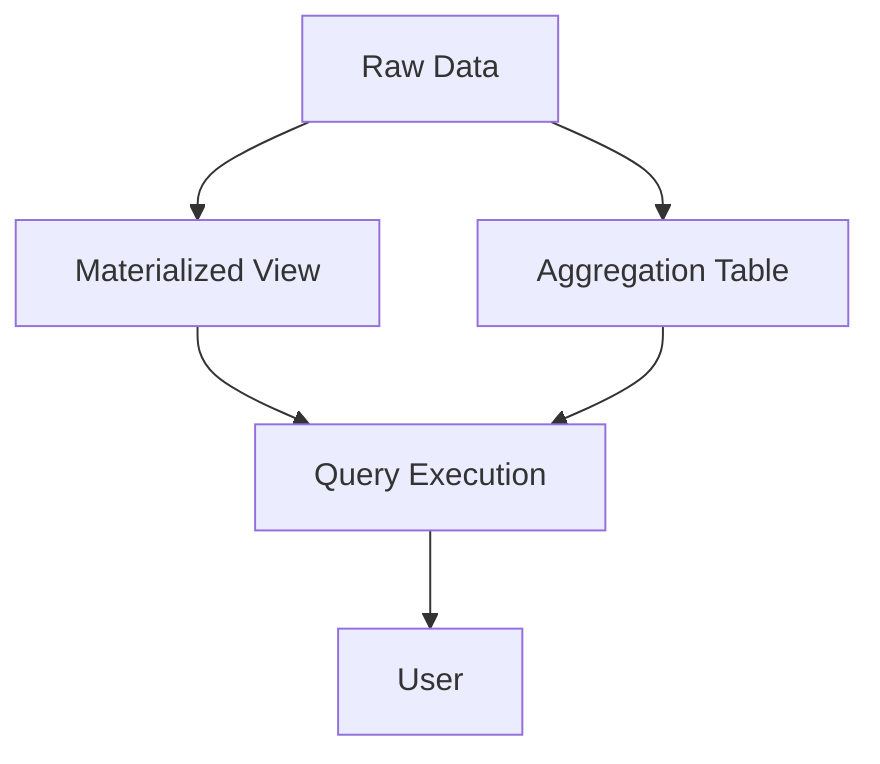

## 10.7 Materialized Views and Aggregations

In the realm of SQL and database management, materialized views and aggregations play a pivotal role in enhancing performance and efficiency. As expert software engineers and architects, understanding these concepts is crucial for designing systems that can handle complex queries and large datasets with ease. This section will delve into the intricacies of materialized views and aggregations, providing you with the knowledge to implement these powerful tools effectively.

### Introduction to Materialized Views

**Materialized Views** are database objects that store the result of a query physically. Unlike regular views, which are virtual and compute their results on-the-fly, materialized views precompute and store the data, allowing for faster query responses. This is particularly beneficial in scenarios where the underlying data does not change frequently, and the cost of recomputing the query is high.

#### Key Benefits of Materialized Views

1. **Performance Improvement**: By storing precomputed results, materialized views reduce the need for complex joins and aggregations at query time, significantly improving performance.
2. **Reduced Load**: Offloading complex computations to materialized views reduces the load on the database server during query execution.
3. **Simplified Querying**: Users can query materialized views directly, simplifying the SQL required for complex data retrieval.

### Creating and Managing Materialized Views

To create a materialized view, you use the `CREATE MATERIALIZED VIEW` statement. Here’s a basic example:

```sql
CREATE MATERIALIZED VIEW sales_summary AS
SELECT product_id, SUM(quantity) AS total_quantity, SUM(price) AS total_revenue
FROM sales
GROUP BY product_id;
```

In this example, the materialized view `sales_summary` stores aggregated sales data, precomputed for each product.

#### Refreshing Materialized Views

Materialized views can become stale as the underlying data changes. Therefore, they need to be refreshed periodically. There are two main strategies for refreshing materialized views:

- **Complete Refresh**: Recomputes the entire view from scratch.
- **Incremental Refresh**: Updates only the changed data, which is more efficient but requires additional setup.

```sql
-- Complete Refresh
REFRESH MATERIALIZED VIEW sales_summary;

-- Incremental Refresh (requires materialized view logs)
REFRESH MATERIALIZED VIEW sales_summary WITH DATA;
```

### Aggregation Tables

**Aggregation Tables** are specialized tables designed to store summarized data. They are similar to materialized views but are manually managed and updated. Aggregation tables are particularly useful in data warehousing environments where pre-aggregated data can significantly speed up analytical queries.

#### Designing Aggregation Tables

When designing aggregation tables, consider the following:

- **Identify Key Metrics**: Determine which metrics are frequently queried and would benefit from pre-aggregation.
- **Granularity**: Decide on the level of detail required. More granular data provides flexibility but increases storage requirements.
- **Update Frequency**: Balance the need for up-to-date data with the cost of frequent updates.

### Use Cases for Materialized Views and Aggregations

1. **Data Warehousing**: Materialized views and aggregation tables are staples in data warehousing, where they help manage large volumes of data and complex analytical queries.
2. **Reporting**: Precomputed views and tables enable faster generation of reports by reducing the computational overhead.
3. **Business Intelligence**: BI tools can leverage materialized views to provide real-time insights without impacting database performance.

### Performance Considerations

While materialized views and aggregation tables offer significant performance benefits, they also introduce some overhead:

- **Storage Costs**: Storing precomputed data requires additional disk space.
- **Maintenance Overhead**: Regularly refreshing materialized views and updating aggregation tables can be resource-intensive.

### Best Practices

- **Use Indexes**: Index materialized views and aggregation tables to further enhance query performance.
- **Monitor Usage**: Regularly review the usage patterns to ensure that the benefits outweigh the maintenance costs.
- **Automate Refreshes**: Use database scheduling tools to automate the refresh process, ensuring data remains up-to-date without manual intervention.

### Code Example: Implementing Materialized Views

Let's explore a practical example of using materialized views in a retail database:

```sql
-- Create a materialized view for monthly sales summary
CREATE MATERIALIZED VIEW monthly_sales_summary AS
SELECT EXTRACT(YEAR FROM sale_date) AS year,
       EXTRACT(MONTH FROM sale_date) AS month,
       product_id,
       SUM(quantity) AS total_quantity,
       SUM(price) AS total_revenue
FROM sales
GROUP BY EXTRACT(YEAR FROM sale_date), EXTRACT(MONTH FROM sale_date), product_id;

-- Query the materialized view
SELECT * FROM monthly_sales_summary WHERE year = 2023 AND month = 10;
```

In this example, the `monthly_sales_summary` materialized view aggregates sales data by year and month, allowing for efficient querying of monthly sales performance.

### Visualizing Materialized Views and Aggregations

To better understand the role of materialized views and aggregations, consider the following diagram:



**Diagram Description**: This diagram illustrates the flow of data from raw data sources to materialized views and aggregation tables, which are then queried to provide results to the user.

### Try It Yourself

Experiment with the code examples provided. Try modifying the `monthly_sales_summary` materialized view to include additional dimensions, such as region or sales channel. Observe how these changes impact query performance and storage requirements.

### References and Further Reading

- [PostgreSQL Documentation on Materialized Views](https://www.postgresql.org/docs/current/rules-materializedviews.html)
- [Oracle Materialized Views Concepts](https://docs.oracle.com/en/database/oracle/oracle-database/19/dwhsg/creating-and-maintaining-materialized-views.html)
- [SQL Server Indexed Views](https://docs.microsoft.com/en-us/sql/relational-databases/views/create-indexed-views)

### Knowledge Check

- What are the primary benefits of using materialized views?
- How do materialized views differ from regular views?
- What are the trade-offs associated with using aggregation tables?

### Embrace the Journey

Remember, mastering materialized views and aggregations is a journey. As you continue to explore these concepts, you'll unlock new levels of performance and efficiency in your SQL applications. Stay curious, keep experimenting, and enjoy the process!

## Quiz Time!



### What is a materialized view?

- [x] A database object that stores the result of a query physically.
- [ ] A virtual table that computes results on-the-fly.
- [ ] A type of index used for query optimization.
- [ ] A temporary table used for session-specific data.

> **Explanation:** A materialized view is a database object that stores the result of a query physically, unlike regular views which are virtual.

### How does a complete refresh of a materialized view work?

- [x] It recomputes the entire view from scratch.
- [ ] It updates only the changed data.
- [ ] It deletes the view and recreates it.
- [ ] It merges new data with existing data.

> **Explanation:** A complete refresh recomputes the entire view from scratch, ensuring all data is up-to-date.

### What is the main advantage of using aggregation tables?

- [x] They store summarized data for faster query performance.
- [ ] They reduce the need for indexes.
- [ ] They eliminate the need for joins.
- [ ] They automatically update with new data.

> **Explanation:** Aggregation tables store summarized data, which speeds up query performance by reducing the need for complex calculations.

### Which of the following is a key benefit of materialized views?

- [x] Improved query response times.
- [ ] Reduced storage requirements.
- [ ] Automatic data synchronization.
- [ ] Simplified database schema.

> **Explanation:** Materialized views improve query response times by storing precomputed results.

### What is a common use case for materialized views?

- [x] Data warehousing and reporting.
- [ ] Real-time transaction processing.
- [ ] Temporary data storage.
- [ ] Schema migration.

> **Explanation:** Materialized views are commonly used in data warehousing and reporting to handle large datasets efficiently.

### What is the purpose of indexing materialized views?

- [x] To enhance query performance.
- [ ] To reduce storage costs.
- [ ] To automate refresh processes.
- [ ] To simplify query syntax.

> **Explanation:** Indexing materialized views enhances query performance by allowing faster data retrieval.

### How do materialized views differ from aggregation tables?

- [x] Materialized views are database objects, while aggregation tables are manually managed.
- [ ] Materialized views are virtual, while aggregation tables are physical.
- [ ] Materialized views require indexes, while aggregation tables do not.
- [ ] Materialized views are temporary, while aggregation tables are permanent.

> **Explanation:** Materialized views are database objects that store precomputed results, whereas aggregation tables are manually managed and updated.

### What is a potential drawback of using materialized views?

- [x] Increased storage requirements.
- [ ] Reduced query performance.
- [ ] Complexity in query syntax.
- [ ] Difficulty in data visualization.

> **Explanation:** Materialized views require additional storage to hold precomputed data, which can be a drawback.

### What is the role of a complete refresh in maintaining materialized views?

- [x] It ensures the view is up-to-date by recomputing all data.
- [ ] It merges new data with existing data.
- [ ] It deletes outdated data from the view.
- [ ] It optimizes the view for better performance.

> **Explanation:** A complete refresh ensures the materialized view is up-to-date by recomputing all data.

### True or False: Materialized views automatically update when the underlying data changes.

- [ ] True
- [x] False

> **Explanation:** Materialized views do not automatically update; they require manual or scheduled refreshes to stay current.


