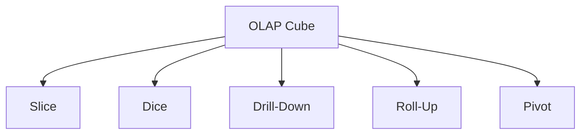

## 10.8 OLAP Cubes and Analytical Functions

In the realm of data warehousing and analytics, OLAP (Online Analytical Processing) cubes and analytical functions play a pivotal role in enabling complex data analysis and decision-making. This section delves into the intricacies of OLAP cubes, their operations, and the powerful analytical functions available in SQL that facilitate advanced data analysis.

### Understanding OLAP Cubes

**Concept**: OLAP cubes are multidimensional data structures that allow for the efficient querying and analysis of data across multiple dimensions. They are designed to provide a fast response to analytical queries, making them ideal for business intelligence applications.

#### Key Characteristics of OLAP Cubes

- **Multidimensionality**: OLAP cubes allow data to be modeled and viewed in multiple dimensions, such as time, geography, and product categories.
- **Pre-aggregation**: Data is often pre-aggregated in OLAP cubes, which speeds up query performance by reducing the need for on-the-fly calculations.
- **Complex Queries**: OLAP cubes support complex queries that involve aggregations, calculations, and data slicing and dicing.

#### OLAP Operations

1. **Slice**: Extract a single dimension from a cube, creating a new sub-cube.
2. **Dice**: Select two or more dimensions to create a sub-cube.
3. **Drill-Down**: Navigate from less detailed data to more detailed data.
4. **Roll-Up**: Aggregate data along a dimension, reducing the level of detail.
5. **Pivot**: Rotate the data axes to provide an alternative presentation of data.

#### Example: Visualizing OLAP Cube Operations



**Caption**: This diagram illustrates the various operations that can be performed on an OLAP cube, enabling dynamic data analysis.

### Implementing OLAP Cubes in SQL

While traditional OLAP cubes are often implemented in specialized OLAP servers, SQL databases can simulate OLAP functionality using advanced SQL queries and data modeling techniques.

#### Creating a Simple OLAP Cube in SQL

Consider a sales database with dimensions such as time, product, and region. We can create a simple OLAP-like structure using SQL views and aggregate functions.

```sql
CREATE VIEW SalesCube AS
SELECT
    TimeDimension.Year,
    ProductDimension.ProductCategory,
    RegionDimension.RegionName,
    SUM(Sales.FactAmount) AS TotalSales
FROM
    Sales
JOIN
    TimeDimension ON Sales.TimeID = TimeDimension.TimeID
JOIN
    ProductDimension ON Sales.ProductID = ProductDimension.ProductID
JOIN
    RegionDimension ON Sales.RegionID = RegionDimension.RegionID
GROUP BY
    TimeDimension.Year,
    ProductDimension.ProductCategory,
    RegionDimension.RegionName;
```

**Explanation**: This SQL view aggregates sales data across multiple dimensions, simulating an OLAP cube structure.

### Analytical Functions in SQL

SQL provides a rich set of analytical functions that enable complex data analysis, including ranking, statistical calculations, and more.

#### Ranking Functions

Ranking functions assign a rank to each row within a partition of a result set. They are useful for generating ordered lists and identifying top performers.

- **RANK()**: Assigns a unique rank to each row, with gaps in rank values for ties.
- **DENSE_RANK()**: Similar to RANK(), but without gaps in rank values.
- **NTILE(n)**: Distributes rows into a specified number of groups, assigning a group number to each row.

**Example: Using Ranking Functions**

```sql
SELECT
    EmployeeID,
    Salary,
    RANK() OVER (ORDER BY Salary DESC) AS SalaryRank,
    DENSE_RANK() OVER (ORDER BY Salary DESC) AS DenseSalaryRank,
    NTILE(4) OVER (ORDER BY Salary DESC) AS SalaryQuartile
FROM
    Employees;
```

**Explanation**: This query ranks employees by salary, using different ranking functions to illustrate their behavior.

#### Statistical Functions

SQL's statistical functions provide insights into data distributions and variability.

- **MEDIAN()**: Calculates the median value of a set of values.
- **MODE()**: Identifies the most frequently occurring value.
- **VARIANCE()**: Measures the variability of a set of values.

**Example: Using Statistical Functions**

```sql
SELECT
    MEDIAN(Salary) AS MedianSalary,
    MODE() WITHIN GROUP (ORDER BY Salary) AS ModeSalary,
    VARIANCE(Salary) AS SalaryVariance
FROM
    Employees;
```

**Explanation**: This query calculates statistical measures for employee salaries, providing insights into salary distribution.

### Try It Yourself

Experiment with the provided SQL examples by modifying the dimensions, measures, and functions. For instance, try creating an OLAP cube for a different dataset or using additional analytical functions to gain deeper insights.

### Visualizing Analytical Functions

```mermaid
graph TD;
    A[Data Set] --> B[Ranking Functions]
    A --> C[Statistical Functions]
    B --> D[RANK()]
    B --> E[DENSE_RANK()]
    B --> F[NTILE()]
    C --> G[MEDIAN()]
    C --> H[MODE()]
    C --> I[VARIANCE()]
```

**Caption**: This diagram illustrates the relationship between a data set and the various analytical functions that can be applied to it.

### References and Further Reading

- [MDN Web Docs on SQL](https://developer.mozilla.org/en-US/docs/Web/SQL)
- [W3Schools SQL Tutorial](https://www.w3schools.com/sql/)
- [OLAP and Data Warehousing Concepts](https://www.olap.com/)

### Knowledge Check

- Explain the difference between RANK() and DENSE_RANK().
- Demonstrate how to create a simple OLAP cube using SQL.
- Provide examples of when to use MEDIAN() and VARIANCE() functions.

### Embrace the Journey

Remember, mastering OLAP cubes and analytical functions is a journey. As you progress, you'll unlock the full potential of SQL for data analysis. Keep experimenting, stay curious, and enjoy the journey!

## Quiz Time!



### What is an OLAP cube?

- [x] A multidimensional data structure for complex analysis
- [ ] A single-dimensional data structure for simple queries
- [ ] A type of SQL function for ranking data
- [ ] A database management system

> **Explanation:** OLAP cubes are designed for complex analysis across multiple dimensions.

### Which operation is used to navigate from less detailed data to more detailed data in OLAP?

- [ ] Slice
- [ ] Dice
- [x] Drill-Down
- [ ] Roll-Up

> **Explanation:** Drill-Down is used to navigate to more detailed data.

### What does the RANK() function do?

- [x] Assigns a unique rank to each row with gaps for ties
- [ ] Assigns a rank without gaps for ties
- [ ] Distributes rows into a specified number of groups
- [ ] Calculates the median value

> **Explanation:** RANK() assigns a unique rank with gaps for ties.

### Which SQL function calculates the median value?

- [ ] MODE()
- [x] MEDIAN()
- [ ] VARIANCE()
- [ ] NTILE()

> **Explanation:** MEDIAN() calculates the median value of a set of values.

### What is the purpose of the NTILE(n) function?

- [ ] Assigns a unique rank to each row
- [ ] Calculates the mode value
- [x] Distributes rows into a specified number of groups
- [ ] Measures variability

> **Explanation:** NTILE(n) distributes rows into groups, assigning a group number to each row.

### Which OLAP operation is used to create a sub-cube by selecting two or more dimensions?

- [ ] Slice
- [x] Dice
- [ ] Drill-Down
- [ ] Roll-Up

> **Explanation:** Dice selects multiple dimensions to create a sub-cube.

### What does the VARIANCE() function measure?

- [ ] The most frequently occurring value
- [ ] The median value
- [x] The variability of a set of values
- [ ] The rank of a value

> **Explanation:** VARIANCE() measures the variability of a set of values.

### Which SQL function identifies the most frequently occurring value?

- [x] MODE()
- [ ] MEDIAN()
- [ ] VARIANCE()
- [ ] NTILE()

> **Explanation:** MODE() identifies the most frequently occurring value.

### What is the purpose of the Roll-Up operation in OLAP?

- [ ] Navigate to more detailed data
- [ ] Create a sub-cube by selecting dimensions
- [x] Aggregate data along a dimension
- [ ] Rotate data axes

> **Explanation:** Roll-Up aggregates data, reducing the level of detail.

### True or False: OLAP cubes are only implemented in specialized OLAP servers.

- [ ] True
- [x] False

> **Explanation:** OLAP functionality can be simulated in SQL databases using advanced queries and data modeling.


