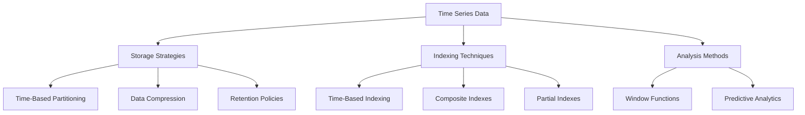

## 10.9 Time Series Data Handling

Time series data is ubiquitous in modern applications, ranging from financial markets and IoT devices to web analytics and healthcare monitoring. Handling such data efficiently in SQL databases involves mastering storage strategies, indexing techniques, and analytical methods. This section will guide you through these aspects, providing insights and practical knowledge to optimize your time series data handling.

### Understanding Time Series Data

Time series data consists of sequences of data points collected or recorded at specific time intervals. Each data point is typically associated with a timestamp, making it crucial to handle time-based queries efficiently. The key challenges in managing time series data include:

- **Volume**: Large datasets due to frequent data collection.
- **Velocity**: High-speed data ingestion and retrieval.
- **Variety**: Diverse data types and sources.

### Storage Strategies for Time Series Data

Efficient storage of time series data is critical to ensure quick access and retrieval. Here are some strategies:

#### 1. Data Partitioning

Partitioning involves dividing a database into smaller, more manageable pieces. For time series data, time-based partitioning is highly effective.

- **Time-Based Partitioning**: Split data into partitions based on time intervals (e.g., daily, monthly). This approach improves query performance by allowing the database to scan only relevant partitions.

```sql
CREATE TABLE sensor_data (
    sensor_id INT,
    timestamp TIMESTAMP,
    value FLOAT
) PARTITION BY RANGE (timestamp);

CREATE PARTITION TABLE sensor_data_2024_01 FOR VALUES FROM ('2024-01-01') TO ('2024-02-01');
CREATE PARTITION TABLE sensor_data_2024_02 FOR VALUES FROM ('2024-02-01') TO ('2024-03-01');
```

#### 2. Data Compression

Compressing time series data can significantly reduce storage requirements and improve I/O performance.

- **Columnar Storage**: Use columnar storage formats like Parquet or ORC for better compression and faster query performance on analytical workloads.

#### 3. Retention Policies

Implement retention policies to manage the lifecycle of time series data, automatically archiving or deleting old data.

```sql
CREATE POLICY delete_old_data
ON sensor_data
FOR DELETE
USING (timestamp < NOW() - INTERVAL '1 year');
```

### Indexing Time Series Data

Indexing is crucial for optimizing query performance on time series data. Here are some indexing strategies:

#### 1. Time-Based Indexing

Create indexes on timestamp columns to speed up time-based queries.

```sql
CREATE INDEX idx_timestamp ON sensor_data (timestamp);
```

#### 2. Composite Indexes

For queries involving multiple columns, use composite indexes to improve performance.

```sql
CREATE INDEX idx_sensor_timestamp ON sensor_data (sensor_id, timestamp);
```

#### 3. Partial Indexes

Use partial indexes to index only a subset of data, reducing index size and improving performance.

```sql
CREATE INDEX idx_recent_data ON sensor_data (timestamp)
WHERE timestamp > NOW() - INTERVAL '1 month';
```

### Analyzing Time Series Data

Analyzing time series data involves using SQL's advanced features to extract insights and perform predictive analytics.

#### 1. Window Functions

Window functions allow you to perform calculations across a set of table rows related to the current row.

- **Moving Averages**: Calculate moving averages to smooth out short-term fluctuations.

```sql
SELECT
    timestamp,
    AVG(value) OVER (ORDER BY timestamp ROWS BETWEEN 4 PRECEDING AND CURRENT ROW) AS moving_avg
FROM sensor_data;
```

- **Cumulative Sums**: Compute cumulative sums to track running totals.

```sql
SELECT
    timestamp,
    SUM(value) OVER (ORDER BY timestamp) AS cumulative_sum
FROM sensor_data;
```

#### 2. Predictive Analytics

Leverage SQL for basic predictive analytics, such as trend analysis and anomaly detection.

- **Trend Analysis**: Identify trends using linear regression.

```sql
SELECT
    timestamp,
    value,
    REGR_SLOPE(value, EXTRACT(EPOCH FROM timestamp)) OVER () AS trend_slope
FROM sensor_data;
```

- **Anomaly Detection**: Detect anomalies by identifying outliers.

```sql
SELECT
    timestamp,
    value
FROM sensor_data
WHERE value > (SELECT AVG(value) + 3 * STDDEV(value) FROM sensor_data);
```

### Visualizing Time Series Data

Visualizing time series data helps in understanding patterns and trends. Use tools like Grafana or Tableau for interactive visualizations. Here's a simple example using SQL to prepare data for visualization:

```sql
SELECT
    DATE_TRUNC('day', timestamp) AS day,
    AVG(value) AS avg_value
FROM sensor_data
GROUP BY day
ORDER BY day;
```

### Design Considerations

When handling time series data, consider the following:

- **Scalability**: Ensure your storage and indexing strategies can handle increasing data volumes.
- **Performance**: Optimize queries with appropriate indexing and partitioning.
- **Retention**: Implement data retention policies to manage storage costs.
- **Security**: Protect sensitive data with encryption and access controls.

### Differences and Similarities with Other Patterns

Time series data handling shares similarities with other data warehousing patterns, such as partitioning and indexing. However, it differs in its focus on time-based queries and analysis. Unlike traditional OLAP systems, time series databases prioritize high-speed data ingestion and retrieval.

### Try It Yourself

Experiment with the provided SQL code examples by modifying the partitioning intervals, index configurations, and window function parameters. Observe how these changes impact query performance and storage efficiency.

### Visualizing Time Series Data Handling



### Further Reading

- [Time Series Database Concepts](https://en.wikipedia.org/wiki/Time_series_database)
- [SQL Window Functions](https://www.postgresql.org/docs/current/tutorial-window.html)
- [Data Compression in SQL](https://docs.microsoft.com/en-us/sql/relational-databases/data-compression)

### Key Takeaways

- Efficient storage and indexing are critical for handling large volumes of time series data.
- Use SQL's advanced features like window functions for powerful time-based analysis.
- Implement data retention policies to manage storage costs and maintain performance.

## Quiz Time!



### What is the primary challenge of handling time series data?

- [x] Volume and velocity of data
- [ ] Lack of data variety
- [ ] Inconsistent data formats
- [ ] Limited data sources

> **Explanation:** Time series data is characterized by large volumes and high velocity due to frequent data collection.

### Which SQL feature is used to perform calculations across a set of table rows related to the current row?

- [ ] Subqueries
- [x] Window functions
- [ ] Joins
- [ ] Indexes

> **Explanation:** Window functions allow calculations across a set of table rows related to the current row.

### What is the purpose of time-based partitioning in time series data handling?

- [x] To improve query performance by scanning only relevant partitions
- [ ] To compress data for storage efficiency
- [ ] To encrypt data for security
- [ ] To normalize data for consistency

> **Explanation:** Time-based partitioning improves query performance by allowing the database to scan only relevant partitions.

### Which SQL clause is used to create a moving average?

- [ ] GROUP BY
- [ ] HAVING
- [x] OVER
- [ ] WHERE

> **Explanation:** The OVER clause is used with window functions to create moving averages.

### What is a composite index?

- [x] An index on multiple columns
- [ ] An index on a single column
- [ ] An index on a partitioned table
- [ ] An index on a view

> **Explanation:** A composite index is an index on multiple columns, improving performance for queries involving those columns.

### Which SQL function can be used for trend analysis in time series data?

- [ ] AVG
- [ ] COUNT
- [x] REGR_SLOPE
- [ ] SUM

> **Explanation:** The REGR_SLOPE function is used for linear regression, which is helpful for trend analysis.

### What is the benefit of using partial indexes?

- [x] They reduce index size and improve performance by indexing only a subset of data.
- [ ] They increase index size for better coverage.
- [ ] They allow indexing of encrypted data.
- [ ] They provide automatic index updates.

> **Explanation:** Partial indexes reduce index size and improve performance by indexing only a subset of data.

### How can anomalies be detected in time series data?

- [ ] By using subqueries
- [x] By identifying outliers
- [ ] By normalizing data
- [ ] By partitioning data

> **Explanation:** Anomalies can be detected by identifying outliers in the data.

### What is the role of retention policies in time series data handling?

- [x] To manage the lifecycle of data by archiving or deleting old data
- [ ] To encrypt data for security
- [ ] To compress data for storage efficiency
- [ ] To normalize data for consistency

> **Explanation:** Retention policies manage the lifecycle of data by archiving or deleting old data.

### True or False: Time series data handling is primarily concerned with data normalization.

- [ ] True
- [x] False

> **Explanation:** Time series data handling focuses on efficient storage, indexing, and analysis, rather than normalization.



Remember, mastering time series data handling in SQL is an ongoing journey. As you continue to explore and experiment, you'll gain deeper insights and develop more efficient solutions. Stay curious and keep pushing the boundaries of what's possible with SQL!
