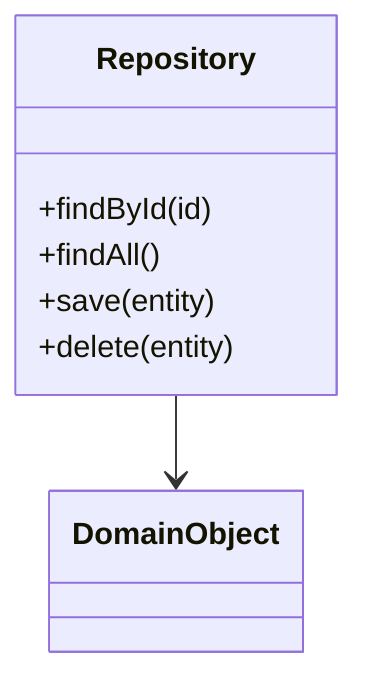
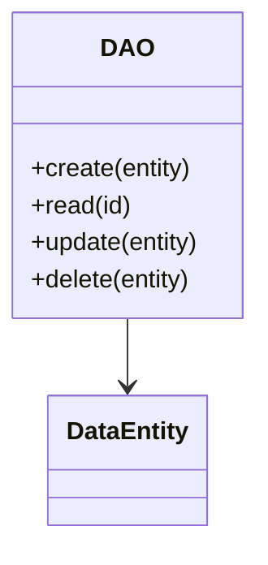
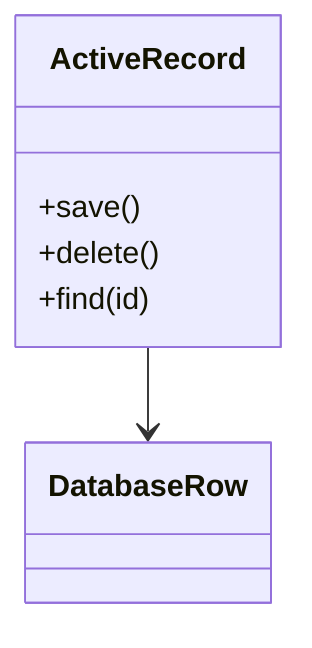
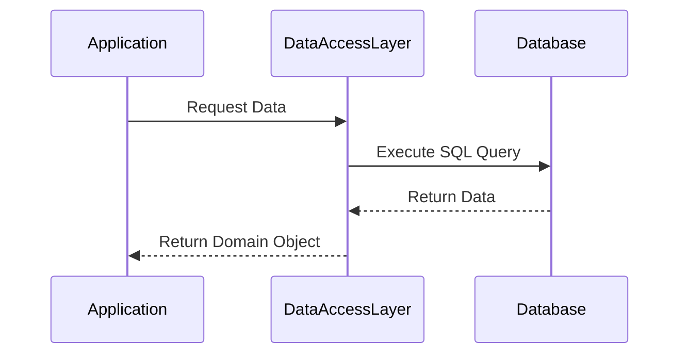

## 11.1 Design Patterns for Data Access Layers

In the realm of software development, the separation of concerns is a fundamental principle that enhances the maintainability, testability, and scalability of applications. One critical area where this principle is applied is in the design of data access layers. This section delves into the design patterns that facilitate the abstraction of database interactions, thereby decoupling application logic from data access logic. By employing these patterns, developers can create robust systems that are easier to manage and evolve over time.

### Purpose

The primary purpose of data access layer design patterns is to abstract and encapsulate the complexities of database interactions. This abstraction allows developers to focus on business logic without being bogged down by the intricacies of SQL queries or database schema changes. By isolating data access code, these patterns also enhance the testability of applications, as they allow for easier mocking and stubbing of database interactions during unit testing.

### Key Patterns

Let's explore three key design patterns commonly used in the implementation of data access layers: the Repository Pattern, the DAO (Data Access Object) Pattern, and the Active Record Pattern.

#### Repository Pattern

**Category**: Structural

**Intent**: The Repository Pattern provides a collection-like interface for accessing domain objects. It acts as an intermediary between the domain and data mapping layers, offering a more object-oriented view of the persistence layer.

**Diagrams**:


**Key Participants**:
- **Repository**: The interface or abstract class defining the operations for accessing domain objects.
- **Concrete Repository**: The implementation of the repository interface, containing the actual data access logic.
- **Domain Object**: The business entity that the repository manages.

**Applicability**:
- Use the Repository Pattern when you need to provide a collection-like interface for accessing domain objects.
- It is particularly useful in applications with complex business logic that requires a clear separation between the domain and data access layers.

**Sample Code Snippet**:
```sql
-- SQL Table
CREATE TABLE Products (
    id INT PRIMARY KEY,
    name VARCHAR(255),
    price DECIMAL(10, 2)
);

-- Repository Interface
interface ProductRepository {
    Product findById(int id);
    List<Product> findAll();
    void save(Product product);
    void delete(Product product);
}

-- Concrete Repository Implementation
class SqlProductRepository implements ProductRepository {
    public Product findById(int id) {
        // SQL query to find product by ID
        String sql = "SELECT * FROM Products WHERE id = ?";
        // Execute query and map result to Product object
    }

    public List<Product> findAll() {
        // SQL query to find all products
        String sql = "SELECT * FROM Products";
        // Execute query and map results to list of Product objects
    }

    public void save(Product product) {
        // SQL query to insert or update product
        String sql = "INSERT INTO Products (id, name, price) VALUES (?, ?, ?) ON DUPLICATE KEY UPDATE name = ?, price = ?";
        // Execute query with product data
    }

    public void delete(Product product) {
        // SQL query to delete product
        String sql = "DELETE FROM Products WHERE id = ?";
        // Execute query with product ID
    }
}
```

**Design Considerations**:
- The Repository Pattern is ideal for applications that require a clear separation between business logic and data access logic.
- It simplifies unit testing by allowing developers to mock the repository interface.
- Be cautious of overusing repositories, as they can become bloated with too many methods.

**Differences and Similarities**:
- The Repository Pattern is often confused with the DAO Pattern. While both abstract data access, the Repository Pattern is more focused on domain logic, whereas the DAO Pattern is more concerned with data persistence.

#### DAO (Data Access Object) Pattern

**Category**: Structural

**Intent**: The DAO Pattern separates low-level data accessing API or operations from high-level business services. It provides an abstract interface to some type of database or other persistence mechanism.

**Diagrams**:


**Key Participants**:
- **DAO**: The interface or abstract class defining the operations for accessing data entities.
- **Concrete DAO**: The implementation of the DAO interface, containing the actual data access logic.
- **Data Entity**: The data object that the DAO manages.

**Applicability**:
- Use the DAO Pattern when you need to separate data access logic from business logic.
- It is particularly useful in applications with complex data access requirements that need to be decoupled from business services.

**Sample Code Snippet**:
```sql
-- SQL Table
CREATE TABLE Orders (
    id INT PRIMARY KEY,
    customerName VARCHAR(255),
    orderDate DATE
);

-- DAO Interface
interface OrderDAO {
    void create(Order order);
    Order read(int id);
    void update(Order order);
    void delete(Order order);
}

-- Concrete DAO Implementation
class SqlOrderDAO implements OrderDAO {
    public void create(Order order) {
        // SQL query to insert order
        String sql = "INSERT INTO Orders (id, customerName, orderDate) VALUES (?, ?, ?)";
        // Execute query with order data
    }

    public Order read(int id) {
        // SQL query to read order by ID
        String sql = "SELECT * FROM Orders WHERE id = ?";
        // Execute query and map result to Order object
    }

    public void update(Order order) {
        // SQL query to update order
        String sql = "UPDATE Orders SET customerName = ?, orderDate = ? WHERE id = ?";
        // Execute query with order data
    }

    public void delete(Order order) {
        // SQL query to delete order
        String sql = "DELETE FROM Orders WHERE id = ?";
        // Execute query with order ID
    }
}
```

**Design Considerations**:
- The DAO Pattern is ideal for applications that require a clear separation between data access and business logic.
- It simplifies unit testing by allowing developers to mock the DAO interface.
- Be cautious of creating too many DAOs, as they can lead to code duplication.

**Differences and Similarities**:
- The DAO Pattern is similar to the Repository Pattern, but it is more focused on data persistence rather than domain logic.

#### Active Record Pattern

**Category**: Structural

**Intent**: The Active Record Pattern is an object that wraps a row in a database table or view, encapsulating the database access. It provides methods for CRUD operations directly on the object.

**Diagrams**:


**Key Participants**:
- **Active Record**: The object that represents a row in the database and provides methods for CRUD operations.
- **Database Row**: The actual data stored in the database.

**Applicability**:
- Use the Active Record Pattern when you need a simple and straightforward way to map database rows to objects.
- It is particularly useful in applications with simple data access requirements and minimal business logic.

**Sample Code Snippet**:
```sql
-- SQL Table
CREATE TABLE Customers (
    id INT PRIMARY KEY,
    name VARCHAR(255),
    email VARCHAR(255)
);

-- Active Record Class
class Customer {
    int id;
    String name;
    String email;

    public void save() {
        // SQL query to insert or update customer
        String sql = "INSERT INTO Customers (id, name, email) VALUES (?, ?, ?) ON DUPLICATE KEY UPDATE name = ?, email = ?";
        // Execute query with customer data
    }

    public void delete() {
        // SQL query to delete customer
        String sql = "DELETE FROM Customers WHERE id = ?";
        // Execute query with customer ID
    }

    public static Customer find(int id) {
        // SQL query to find customer by ID
        String sql = "SELECT * FROM Customers WHERE id = ?";
        // Execute query and map result to Customer object
    }
}
```

**Design Considerations**:
- The Active Record Pattern is ideal for applications with simple data access requirements.
- It simplifies the codebase by combining data access and business logic in a single class.
- Be cautious of using the Active Record Pattern in applications with complex business logic, as it can lead to tight coupling between data access and business logic.

**Differences and Similarities**:
- The Active Record Pattern is often confused with the DAO Pattern. While both provide data access, the Active Record Pattern combines data access and business logic in a single class, whereas the DAO Pattern separates them.

### Benefits

By employing these design patterns, developers can achieve several benefits:
- **Improved Maintainability**: By isolating data access logic, changes to the database schema or data access methods can be made without affecting the business logic.
- **Enhanced Testability**: These patterns facilitate unit testing by allowing developers to mock data access interfaces.
- **Increased Flexibility**: By abstracting data access logic, applications can more easily adapt to changes in the underlying database technology.

### Visualizing Data Access Layer Patterns

To better understand how these patterns fit into the overall application architecture, let's visualize the interaction between the application, data access layer, and database.



**Description**: This sequence diagram illustrates the flow of data from the application to the database and back, mediated by the data access layer. The data access layer abstracts the database interactions, providing a clean interface for the application to request and manipulate data.

### Try It Yourself

To deepen your understanding of these patterns, try implementing a simple data access layer using one of the patterns discussed. Experiment with different database operations and see how the pattern affects the structure and maintainability of your code. Consider modifying the code examples provided to suit your specific use case.

### References and Links

For further reading on data access layer design patterns, consider the following resources:
- [Martin Fowler's Patterns of Enterprise Application Architecture](https://martinfowler.com/eaaCatalog/)
- [Repository Pattern on MSDN](https://docs.microsoft.com/en-us/previous-versions/msp-n-p/ff649690(v=pandp.10))
- [DAO Pattern on Oracle](https://www.oracle.com/technical-resources/articles/j2ee/design-patterns-daos.html)

### Knowledge Check

Before moving on, take a moment to reflect on the key concepts covered in this section. Consider how you might apply these patterns in your own projects and what benefits they could bring to your application architecture.

### Embrace the Journey

Remember, mastering design patterns is a journey. As you continue to explore and apply these patterns, you'll gain a deeper understanding of how to build scalable, maintainable, and flexible applications. Keep experimenting, stay curious, and enjoy the process of learning and growing as a software engineer.

## Quiz Time!



### Which pattern provides a collection-like interface for accessing domain objects?

- [x] Repository Pattern
- [ ] DAO Pattern
- [ ] Active Record Pattern
- [ ] Singleton Pattern

> **Explanation:** The Repository Pattern provides a collection-like interface for accessing domain objects, acting as an intermediary between the domain and data mapping layers.

### What is the primary intent of the DAO Pattern?

- [ ] To provide a collection-like interface for domain objects
- [x] To separate low-level data accessing API from high-level business services
- [ ] To wrap a row in a database table
- [ ] To manage database connections

> **Explanation:** The DAO Pattern separates low-level data accessing API or operations from high-level business services, providing an abstract interface to a database.

### Which pattern combines data access and business logic in a single class?

- [ ] Repository Pattern
- [ ] DAO Pattern
- [x] Active Record Pattern
- [ ] Singleton Pattern

> **Explanation:** The Active Record Pattern combines data access and business logic in a single class, encapsulating database access within the object.

### When should you use the Repository Pattern?

- [x] When you need a collection-like interface for domain objects
- [ ] When you need to separate data access from business logic
- [ ] When you need to wrap a row in a database table
- [ ] When you need to manage database connections

> **Explanation:** The Repository Pattern is used when you need to provide a collection-like interface for accessing domain objects, particularly in applications with complex business logic.

### What is a key benefit of using data access layer patterns?

- [x] Improved maintainability
- [ ] Increased database performance
- [ ] Simplified database schema
- [ ] Reduced code complexity

> **Explanation:** Data access layer patterns improve maintainability by isolating data access logic, allowing changes to be made without affecting business logic.

### Which pattern is more focused on data persistence rather than domain logic?

- [ ] Repository Pattern
- [x] DAO Pattern
- [ ] Active Record Pattern
- [ ] Singleton Pattern

> **Explanation:** The DAO Pattern is more focused on data persistence, providing an abstract interface to a database or other persistence mechanism.

### What does the Active Record Pattern encapsulate?

- [ ] A collection of domain objects
- [ ] Low-level data accessing API
- [x] A row in a database table
- [ ] Database connection management

> **Explanation:** The Active Record Pattern encapsulates a row in a database table, providing methods for CRUD operations directly on the object.

### Which pattern is ideal for applications with simple data access requirements?

- [ ] Repository Pattern
- [ ] DAO Pattern
- [x] Active Record Pattern
- [ ] Singleton Pattern

> **Explanation:** The Active Record Pattern is ideal for applications with simple data access requirements, as it provides a straightforward way to map database rows to objects.

### What is a potential pitfall of the Repository Pattern?

- [ ] Tight coupling between data access and business logic
- [x] Repositories becoming bloated with too many methods
- [ ] Difficulty in mocking data access interfaces
- [ ] Increased code complexity

> **Explanation:** A potential pitfall of the Repository Pattern is that repositories can become bloated with too many methods, making them difficult to manage.

### True or False: The DAO Pattern and Repository Pattern are identical in their focus and implementation.

- [ ] True
- [x] False

> **Explanation:** False. While both patterns abstract data access, the DAO Pattern is more focused on data persistence, whereas the Repository Pattern is more focused on domain logic.


