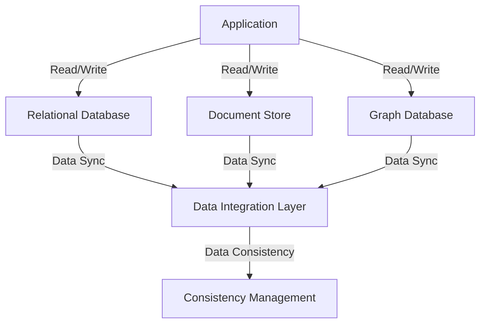

## 11.10 Polyglot Persistence Strategies

In today's rapidly evolving technological landscape, the concept of polyglot persistence has emerged as a powerful strategy for managing diverse data storage needs. As applications grow in complexity, the need to efficiently handle various data types and access patterns becomes paramount. Polyglot persistence refers to the practice of using different data storage technologies, each tailored to specific use cases, within a single application architecture. This approach allows developers to leverage the strengths of multiple database systems, optimizing performance, scalability, and maintainability.

### Understanding Polyglot Persistence

**Definition**: Polyglot persistence is the practice of using multiple data storage technologies to handle diverse data needs within a single application. This strategy involves selecting the best-fit technology for each specific use case, such as relational databases for structured data, document stores for semi-structured data, and graph databases for complex relationships.

#### Key Concepts

- **Best Fit Technology**: The core principle of polyglot persistence is to choose the most suitable database technology for each specific use case. This involves evaluating the nature of the data, the access patterns, and the performance requirements to determine the optimal storage solution.
- **Diverse Data Needs**: Modern applications often need to handle a wide variety of data types, including structured, semi-structured, and unstructured data. Polyglot persistence allows developers to use different databases to efficiently manage these diverse data needs.

### Benefits of Polyglot Persistence

Implementing a polyglot persistence strategy offers several advantages:

- **Efficiency**: By using the most appropriate database technology for each data type, applications can achieve optimal performance and scalability. This ensures that data is stored and retrieved in the most efficient manner possible.
- **Flexibility**: Polyglot persistence provides the flexibility to adapt to changing data requirements and access patterns. This allows developers to easily integrate new data storage technologies as needed.
- **Scalability**: By distributing data across multiple databases, applications can scale more effectively to handle increased workloads and data volumes.
- **Resilience**: Using multiple data storage technologies can enhance the resilience of an application by reducing the risk of a single point of failure.

### Considerations and Challenges

While polyglot persistence offers numerous benefits, it also introduces certain challenges that must be carefully managed:

- **Operational Complexity**: Managing multiple database systems can increase operational complexity, requiring additional resources for maintenance, monitoring, and troubleshooting.
- **Data Consistency**: Ensuring data consistency across different databases can be challenging, particularly in distributed systems. Developers must implement strategies to maintain data integrity and consistency.
- **Integration**: Integrating multiple databases within a single application architecture requires careful planning and coordination to ensure seamless data flow and communication.
- **Cost**: Using multiple data storage technologies can increase costs, both in terms of infrastructure and personnel. Organizations must weigh the benefits against the potential expenses.

### Implementing Polyglot Persistence

To successfully implement a polyglot persistence strategy, developers should follow a structured approach:

#### 1. Analyze Data Requirements

Begin by analyzing the data requirements of the application. Identify the different types of data that need to be stored, the access patterns, and the performance requirements. This analysis will help determine the most suitable database technologies for each use case.

#### 2. Select Appropriate Technologies

Based on the data analysis, select the appropriate database technologies for each use case. Consider factors such as data structure, scalability, consistency, and cost when making these decisions. Common options include:

- **Relational Databases**: Ideal for structured data with complex relationships and transactional requirements.
- **Document Stores**: Suitable for semi-structured data, such as JSON or XML documents, with flexible schema requirements.
- **Graph Databases**: Best for data with complex relationships, such as social networks or recommendation systems.
- **Key-Value Stores**: Useful for simple, fast data retrieval with minimal structure.
- **Column-Family Stores**: Designed for handling large volumes of data with high write and read throughput.

#### 3. Design Data Integration Architecture

Design an architecture that facilitates seamless integration and communication between the different databases. This may involve using data integration tools, middleware, or custom APIs to enable data flow and synchronization.

#### 4. Implement Data Consistency Strategies

Develop strategies to ensure data consistency across the different databases. This may involve using techniques such as eventual consistency, distributed transactions, or data replication to maintain data integrity.

#### 5. Monitor and Optimize

Continuously monitor the performance and scalability of the polyglot persistence architecture. Use performance monitoring tools to identify bottlenecks and optimize the system as needed. Regularly review the data storage technologies to ensure they continue to meet the application's requirements.

### Code Example: Implementing Polyglot Persistence

Let's explore a simple example of implementing polyglot persistence using a combination of SQL and NoSQL databases. In this scenario, we have an e-commerce application that uses a relational database for transactional data and a document store for product catalog information.

```sql
-- SQL: Relational Database for Transactional Data
CREATE TABLE Orders (
    OrderID INT PRIMARY KEY,
    CustomerID INT,
    OrderDate DATE,
    TotalAmount DECIMAL(10, 2)
);

-- Insert sample order data
INSERT INTO Orders (OrderID, CustomerID, OrderDate, TotalAmount)
VALUES (1, 101, '2024-11-01', 150.00);
```

```javascript
// NoSQL: Document Store for Product Catalog
const productCatalog = db.collection('products');

// Insert sample product data
productCatalog.insertOne({
    productId: 'P001',
    name: 'Smartphone',
    description: 'Latest model with advanced features',
    price: 299.99,
    categories: ['Electronics', 'Mobile']
});
```

In this example, the relational database is used to store transactional data such as orders, while the document store is used to manage the product catalog. This approach allows the application to leverage the strengths of both database technologies, optimizing performance and scalability.

### Visualizing Polyglot Persistence Architecture

To better understand the architecture of a polyglot persistence system, let's visualize the integration of multiple databases within an application.



**Diagram Description**: This diagram illustrates a polyglot persistence architecture where an application interacts with multiple databases, including a relational database, a document store, and a graph database. A data integration layer facilitates data synchronization, while a consistency management component ensures data integrity across the system.

### Try It Yourself

Experiment with the code examples provided by modifying the data structures and queries to suit different use cases. For instance, try adding new fields to the document store or creating additional tables in the relational database. This hands-on approach will help reinforce your understanding of polyglot persistence strategies.

### Knowledge Check

To reinforce your understanding of polyglot persistence strategies, consider the following questions:

- What are the key benefits of using polyglot persistence in modern applications?
- How can you ensure data consistency across multiple databases in a polyglot persistence architecture?
- What factors should you consider when selecting database technologies for a polyglot persistence strategy?

### Conclusion

Polyglot persistence is a powerful strategy for managing diverse data storage needs in modern applications. By leveraging the strengths of multiple database technologies, developers can optimize performance, scalability, and maintainability. However, implementing polyglot persistence requires careful planning and management to address the challenges of operational complexity, data consistency, and integration. As you continue to explore and implement polyglot persistence strategies, remember to stay curious, experiment with different technologies, and embrace the journey of mastering diverse data storage solutions.

## Quiz Time!



### What is polyglot persistence?

- [x] Using multiple data storage technologies to handle diverse data needs.
- [ ] Using a single database technology for all data needs.
- [ ] Using only NoSQL databases for data storage.
- [ ] Using only SQL databases for data storage.

> **Explanation:** Polyglot persistence involves using different data storage technologies to handle diverse data needs within a single application architecture.

### Which of the following is a benefit of polyglot persistence?

- [x] Efficiency
- [ ] Increased operational complexity
- [ ] Data inconsistency
- [ ] Higher costs

> **Explanation:** Polyglot persistence allows applications to achieve optimal performance by using the most appropriate database technology for each data type.

### What is a key consideration when implementing polyglot persistence?

- [x] Data consistency
- [ ] Using only one database technology
- [ ] Avoiding data integration
- [ ] Ignoring performance requirements

> **Explanation:** Ensuring data consistency across different databases is a key consideration when implementing polyglot persistence.

### Which database technology is best suited for structured data with complex relationships?

- [x] Relational Databases
- [ ] Document Stores
- [ ] Key-Value Stores
- [ ] Graph Databases

> **Explanation:** Relational databases are ideal for structured data with complex relationships and transactional requirements.

### What is the role of a data integration layer in a polyglot persistence architecture?

- [x] Facilitating data synchronization between databases
- [ ] Storing all application data
- [ ] Replacing all other databases
- [ ] Ignoring data consistency

> **Explanation:** A data integration layer facilitates data synchronization between different databases in a polyglot persistence architecture.

### How can you ensure data consistency in a polyglot persistence system?

- [x] Implementing distributed transactions
- [ ] Ignoring data integrity
- [ ] Using only one database technology
- [ ] Avoiding data synchronization

> **Explanation:** Implementing distributed transactions is one way to ensure data consistency across multiple databases.

### What is a potential challenge of polyglot persistence?

- [x] Increased operational complexity
- [ ] Improved data consistency
- [ ] Reduced flexibility
- [ ] Lower costs

> **Explanation:** Managing multiple database systems can increase operational complexity, requiring additional resources for maintenance and monitoring.

### Which database technology is suitable for semi-structured data?

- [x] Document Stores
- [ ] Relational Databases
- [ ] Key-Value Stores
- [ ] Graph Databases

> **Explanation:** Document stores are suitable for semi-structured data, such as JSON or XML documents, with flexible schema requirements.

### What is the primary goal of polyglot persistence?

- [x] Optimizing performance and scalability
- [ ] Reducing the number of databases
- [ ] Using only SQL databases
- [ ] Avoiding data integration

> **Explanation:** The primary goal of polyglot persistence is to optimize performance and scalability by using the most suitable database technology for each use case.

### True or False: Polyglot persistence can enhance the resilience of an application.

- [x] True
- [ ] False

> **Explanation:** Using multiple data storage technologies can enhance the resilience of an application by reducing the risk of a single point of failure.


