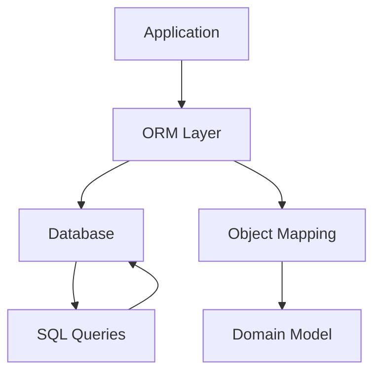

## 11.2 Object-Relational Mapping (ORM) Tools

In the realm of software engineering, Object-Relational Mapping (ORM) tools serve as a crucial bridge between object-oriented programming languages and relational databases. This section delves into the core concepts, popular ORM frameworks, their advantages and challenges, and best practices for integrating them into modern application architectures.

### Understanding Object-Relational Mapping

Object-Relational Mapping (ORM) is a programming technique used to convert data between incompatible type systems in object-oriented programming languages and relational databases. It allows developers to manipulate database records as if they were objects in their programming language, abstracting the complexities of SQL queries and database interactions.

#### Key Concepts

- **Mapping**: The process of linking object-oriented classes with database tables. Each class corresponds to a table, and each object instance corresponds to a row in that table.
- **Persistence**: The ability to save the state of an object to a database and retrieve it later.
- **Abstraction**: ORM provides a high-level abstraction over database operations, allowing developers to focus on business logic rather than SQL syntax.

### Popular ORM Frameworks

Several ORM frameworks have gained popularity due to their robust features and ease of use. Let's explore some of the most widely used ORM tools across different programming languages.

#### Entity Framework (C#/.NET)

Entity Framework is a powerful ORM tool for the .NET ecosystem. It supports Language Integrated Query (LINQ) for querying data, change tracking, and schema migrations. Entity Framework allows developers to work with data using domain-specific objects without focusing on the underlying database tables and columns.

```csharp
// Example of using Entity Framework to query a database
using (var context = new SchoolContext())
{
    var students = context.Students
                          .Where(s => s.Age > 18)
                          .ToList();
    foreach (var student in students)
    {
        Console.WriteLine(student.Name);
    }
}
```

#### Hibernate (Java)

Hibernate is a popular ORM framework for Java applications. It provides a high-level object handling for persistent data, allowing developers to interact with the database using Java objects. Hibernate supports various database systems and offers features like lazy loading, caching, and transaction management.

```java
// Example of using Hibernate to retrieve data
Session session = sessionFactory.openSession();
Transaction tx = session.beginTransaction();
List<Student> students = session.createQuery("FROM Student WHERE age > 18").list();
for (Student student : students) {
    System.out.println(student.getName());
}
tx.commit();
session.close();
```

#### SQLAlchemy (Python)

SQLAlchemy is a comprehensive SQL toolkit and ORM for Python. It provides a full suite of well-known enterprise-level persistence patterns, designed for efficient and high-performing database access. SQLAlchemy is known for its flexibility and the ability to use raw SQL when needed.

```python
from sqlalchemy import create_engine
from sqlalchemy.orm import sessionmaker
from models import Student

engine = create_engine('sqlite:///school.db')
Session = sessionmaker(bind=engine)
session = Session()

students = session.query(Student).filter(Student.age > 18).all()
for student in students:
    print(student.name)
```

### Advantages of Using ORM Tools

ORM tools offer several benefits that make them an attractive choice for developers working with databases.

#### Productivity

ORMs significantly reduce the amount of boilerplate code required for database operations. Developers can perform CRUD (Create, Read, Update, Delete) operations without writing complex SQL queries, allowing them to focus on application logic.

#### Abstraction

By abstracting the database layer, ORMs allow developers to interact with the database using object-oriented paradigms. This abstraction simplifies the development process and makes the codebase more maintainable.

#### Database Independence

ORMs provide a level of database independence, allowing applications to switch between different database systems with minimal changes to the codebase. This flexibility is particularly useful in environments where database systems may change over time.

### Challenges of Using ORM Tools

Despite their advantages, ORM tools also present certain challenges that developers must be aware of.

#### Performance Overhead

ORMs can introduce performance overhead compared to direct SQL queries. The abstraction layer may result in inefficient queries, especially for complex operations. Developers need to be mindful of the performance implications and optimize queries when necessary.

#### Complex Queries

While ORMs handle simple queries well, complex operations may require raw SQL. Developers must strike a balance between using ORM features and writing custom SQL for performance-critical sections of the application.

### Best Practices for Using ORM Tools

To maximize the benefits of ORM tools while mitigating their challenges, consider the following best practices:

#### Understand the ORM's Capabilities

Familiarize yourself with the features and limitations of the ORM framework you are using. Understanding how the ORM translates object operations into SQL queries can help you write more efficient code.

#### Optimize Queries

Monitor the performance of your queries and use ORM features like lazy loading and caching to optimize database access. For complex queries, consider using raw SQL or stored procedures.

#### Use Transactions Wisely

Leverage the ORM's transaction management features to ensure data consistency and integrity. Be cautious with long-running transactions, as they can lead to performance bottlenecks.

#### Keep the Domain Model Clean

Avoid polluting your domain model with database-specific logic. Keep the domain model focused on business logic, and use the ORM's mapping features to handle database interactions.

### Visualizing ORM Architecture

To better understand how ORM tools fit into the application architecture, let's visualize the interaction between the application, ORM, and database.



**Diagram Description**: This diagram illustrates the flow of data in an application using ORM. The application interacts with the ORM layer, which handles object mapping and communicates with the database through SQL queries.

### Try It Yourself

Experiment with the code examples provided for each ORM framework. Try modifying the queries to filter data based on different criteria or update records in the database. This hands-on practice will help solidify your understanding of ORM tools and their capabilities.

### References and Further Reading

- [Entity Framework Documentation](https://docs.microsoft.com/en-us/ef/)
- [Hibernate Documentation](https://hibernate.org/documentation/)
- [SQLAlchemy Documentation](https://docs.sqlalchemy.org/en/14/)

### Knowledge Check

- What are the key advantages of using ORM tools in application development?
- How do ORM tools abstract the database layer for developers?
- What are some common challenges associated with using ORM tools?

### Embrace the Journey

Remember, mastering ORM tools is a journey. As you gain experience, you'll learn to leverage their full potential while navigating their challenges. Keep experimenting, stay curious, and enjoy the process of building efficient and scalable applications.

## Quiz Time!



### What is the primary purpose of ORM tools?

- [x] To map object-oriented classes to database tables
- [ ] To generate random data for testing
- [ ] To replace SQL entirely
- [ ] To manage network connections

> **Explanation:** ORM tools are designed to map object-oriented classes to relational database tables, facilitating data manipulation using objects.

### Which of the following is a popular ORM framework for Java?

- [ ] Entity Framework
- [x] Hibernate
- [ ] SQLAlchemy
- [ ] Django ORM

> **Explanation:** Hibernate is a widely used ORM framework for Java applications, providing robust features for database interaction.

### What is a common advantage of using ORM tools?

- [x] Increased productivity by reducing boilerplate code
- [ ] Guaranteed performance improvement
- [ ] Elimination of all SQL queries
- [ ] Automatic database scaling

> **Explanation:** ORMs increase productivity by reducing the need for repetitive boilerplate code, allowing developers to focus on business logic.

### What is a potential challenge when using ORM tools?

- [x] Performance overhead due to abstraction
- [ ] Lack of support for any SQL databases
- [ ] Inability to handle any database transactions
- [ ] Complete elimination of database schema

> **Explanation:** The abstraction layer in ORMs can introduce performance overhead, especially for complex queries.

### Which ORM framework is known for its flexibility and ability to use raw SQL?

- [ ] Entity Framework
- [ ] Hibernate
- [x] SQLAlchemy
- [ ] Django ORM

> **Explanation:** SQLAlchemy is known for its flexibility and allows developers to use raw SQL when necessary.

### What does the acronym ORM stand for?

- [x] Object-Relational Mapping
- [ ] Object-Resource Management
- [ ] Online Resource Management
- [ ] Object-Relational Model

> **Explanation:** ORM stands for Object-Relational Mapping, a technique for converting data between incompatible systems.

### Which of the following is NOT an advantage of using ORM tools?

- [ ] Abstraction of database operations
- [ ] Database independence
- [x] Guaranteed performance improvement
- [ ] Reduced boilerplate code

> **Explanation:** While ORMs offer many advantages, they do not guarantee performance improvements and may introduce overhead.

### What is a best practice when using ORM tools?

- [x] Optimize queries and use transactions wisely
- [ ] Avoid using transactions altogether
- [ ] Always use raw SQL for all operations
- [ ] Ignore the ORM's capabilities

> **Explanation:** Optimizing queries and using transactions wisely are best practices to ensure efficient use of ORM tools.

### Which diagram component represents the ORM layer in the architecture?

- [x] B[ORM Layer]
- [ ] A[Application]
- [ ] C[Database]
- [ ] E[Domain Model]

> **Explanation:** The ORM Layer is represented by component B in the diagram, handling object mapping and database interaction.

### True or False: ORM tools eliminate the need for SQL entirely.

- [ ] True
- [x] False

> **Explanation:** ORM tools abstract SQL operations but do not eliminate the need for SQL entirely, especially for complex queries.


