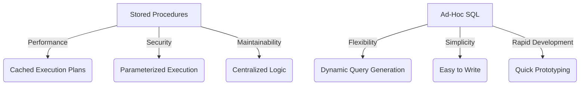

## 11.3 Stored Procedures vs. Ad-Hoc SQL

In the realm of SQL database management, the choice between using stored procedures and ad-hoc SQL is pivotal. Both approaches have their unique advantages and trade-offs, and understanding these can significantly impact the performance, security, and maintainability of your database systems. In this section, we will delve into the intricacies of stored procedures and ad-hoc SQL, providing expert insights and practical guidance for making informed decisions.

### Stored Procedures

#### Definition

Stored procedures are precompiled collections of SQL statements that are stored in the database under a specific name and executed as a unit. They encapsulate business logic within the database, allowing for efficient and secure data processing.

#### Advantages of Stored Procedures

1. **Performance**: 
   - Stored procedures benefit from cached execution plans, which can significantly improve performance for repeated executions. The database engine compiles the SQL statements once and reuses the execution plan, reducing the overhead of parsing and optimizing the query each time it is run.

2. **Security**:
   - By using parameterized execution, stored procedures reduce the risk of SQL injection attacks. Parameters are treated as data, not executable code, which prevents malicious input from altering the query structure.

3. **Maintainability**:
   - Centralizing business logic within stored procedures enhances maintainability. Changes to the logic can be made in one place without altering the application code, simplifying updates and reducing the risk of errors.

4. **Reduced Network Traffic**:
   - Stored procedures can execute complex logic on the server side, minimizing the amount of data transferred between the database and the application. This is particularly beneficial in distributed systems where network latency can be a bottleneck.

#### Sample Code Snippet

```sql
-- Creating a stored procedure to retrieve customer orders
CREATE PROCEDURE GetCustomerOrders
    @CustomerId INT
AS
BEGIN
    SELECT OrderId, OrderDate, TotalAmount
    FROM Orders
    WHERE CustomerId = @CustomerId;
END;
```

#### Design Considerations

- **When to Use**: Stored procedures are ideal for complex business logic, repetitive tasks, and scenarios where security and performance are paramount.
- **Pitfalls**: Over-reliance on stored procedures can lead to tightly coupled systems, making it harder to adapt to changes in business requirements.

### Ad-Hoc SQL

#### Definition

Ad-hoc SQL refers to SQL statements that are constructed and executed at runtime from application code. These queries are typically generated dynamically based on user input or application logic.

#### Advantages of Ad-Hoc SQL

1. **Flexibility**:
   - Ad-hoc SQL allows for dynamic query generation, enabling applications to adapt to varying user inputs and conditions. This flexibility is crucial for applications with complex filtering and sorting requirements.

2. **Simplicity**:
   - For simple queries, ad-hoc SQL can be easier to write and understand. Developers can construct queries directly within the application code, streamlining the development process.

3. **Rapid Development**:
   - Ad-hoc SQL facilitates rapid prototyping and development, allowing developers to quickly test and iterate on query logic without modifying the database schema.

#### Sample Code Snippet

```sql
-- Example of an ad-hoc SQL query in application code
string query = "SELECT OrderId, OrderDate, TotalAmount FROM Orders WHERE CustomerId = " + customerId;
```

#### Design Considerations

- **When to Use**: Ad-hoc SQL is suitable for applications requiring dynamic query generation and rapid development cycles.
- **Pitfalls**: Without proper safeguards, ad-hoc SQL is vulnerable to SQL injection attacks. Always use parameterized queries to mitigate this risk.

### Considerations and Trade-offs

#### Performance vs. Flexibility

- **Stored Procedures**: Offer superior performance for repetitive tasks due to cached execution plans. However, they may lack the flexibility needed for dynamic query generation.
- **Ad-Hoc SQL**: Provides flexibility and adaptability but may incur performance overhead due to the lack of precompiled execution plans.

#### Security

- **Stored Procedures**: Enhance security by encapsulating logic within the database and using parameterized execution.
- **Ad-Hoc SQL**: Requires careful handling to prevent SQL injection. Always use parameterized queries or prepared statements to ensure security.

#### Maintainability

- **Stored Procedures**: Centralize business logic, making it easier to maintain and update. However, changes require database access and may involve downtime.
- **Ad-Hoc SQL**: Allows for quick changes in application code but can lead to scattered logic and increased maintenance complexity.

### Best Practices

1. **Use Parameterized Queries**: Whether using stored procedures or ad-hoc SQL, always employ parameterized queries to prevent SQL injection.
2. **Balance Performance and Flexibility**: Choose stored procedures for performance-critical operations and ad-hoc SQL for dynamic requirements.
3. **Centralize Business Logic**: Consider centralizing complex logic in stored procedures to enhance maintainability and security.
4. **Monitor and Optimize**: Regularly monitor query performance and optimize execution plans to ensure efficient database operations.

### Visualizing the Differences



*Diagram: A comparison of stored procedures and ad-hoc SQL highlighting key advantages.*

### Try It Yourself

Experiment with the following scenarios to deepen your understanding:

1. **Modify the Stored Procedure**: Add a parameter to filter orders by date range and observe the impact on performance.
2. **Enhance Ad-Hoc SQL**: Convert the ad-hoc SQL example to use parameterized queries and test for SQL injection vulnerabilities.

### References and Links

- [SQL Injection Prevention Cheat Sheet](https://cheatsheetseries.owasp.org/cheatsheets/SQL_Injection_Prevention_Cheat_Sheet.html) - OWASP
- [Stored Procedures in SQL Server](https://docs.microsoft.com/en-us/sql/relational-databases/stored-procedures/stored-procedures-database-engine) - Microsoft Docs
- [Parameterized Queries in SQL](https://www.w3schools.com/sql/sql_injection.asp) - W3Schools

### Knowledge Check

- **Question**: What are the primary advantages of using stored procedures over ad-hoc SQL?
- **Exercise**: Create a stored procedure that calculates the total sales for a given product category and compare its performance to an equivalent ad-hoc SQL query.

### Embrace the Journey

Remember, mastering SQL design patterns is a journey. As you explore the nuances of stored procedures and ad-hoc SQL, you'll gain valuable insights into optimizing database performance and security. Keep experimenting, stay curious, and enjoy the process of continuous learning.

## Quiz Time!



### What is a stored procedure?

- [x] A precompiled collection of SQL statements stored in the database
- [ ] A dynamically generated SQL query executed at runtime
- [ ] A type of database index
- [ ] A method for encrypting SQL queries

> **Explanation:** Stored procedures are precompiled collections of SQL statements stored in the database.

### What is a key advantage of stored procedures?

- [x] Cached execution plans improve performance
- [ ] They allow for dynamic query generation
- [ ] They are easier to write for simple queries
- [ ] They require no database access to modify

> **Explanation:** Cached execution plans improve performance by reducing the need to recompile SQL statements.

### How do stored procedures enhance security?

- [x] By using parameterized execution to prevent SQL injection
- [ ] By allowing dynamic query generation
- [ ] By simplifying query syntax
- [ ] By encrypting all SQL statements

> **Explanation:** Stored procedures use parameterized execution, which treats input as data, preventing SQL injection.

### What is a primary advantage of ad-hoc SQL?

- [x] Flexibility in dynamic query generation
- [ ] Improved performance for repetitive tasks
- [ ] Centralized business logic
- [ ] Reduced network traffic

> **Explanation:** Ad-hoc SQL allows for flexibility in generating queries dynamically based on runtime conditions.

### What is a potential pitfall of ad-hoc SQL?

- [x] Vulnerability to SQL injection
- [ ] Difficulty in writing simple queries
- [ ] Lack of flexibility
- [ ] Inability to execute complex logic

> **Explanation:** Ad-hoc SQL can be vulnerable to SQL injection if not properly parameterized.

### When should you use stored procedures?

- [x] For complex business logic and repetitive tasks
- [ ] For rapid prototyping and development
- [ ] For simple queries
- [ ] For dynamic query generation

> **Explanation:** Stored procedures are ideal for complex business logic and repetitive tasks due to their performance benefits.

### What is a best practice when using ad-hoc SQL?

- [x] Use parameterized queries to prevent SQL injection
- [ ] Avoid using parameters to simplify queries
- [ ] Always use SELECT * for simplicity
- [ ] Hardcode all query values

> **Explanation:** Using parameterized queries prevents SQL injection by treating input as data.

### How can stored procedures reduce network traffic?

- [x] By executing complex logic on the server side
- [ ] By generating queries dynamically
- [ ] By simplifying query syntax
- [ ] By encrypting data

> **Explanation:** Stored procedures execute complex logic on the server side, reducing data transfer between the database and application.

### What is a trade-off between stored procedures and ad-hoc SQL?

- [x] Performance vs. Flexibility
- [ ] Security vs. Simplicity
- [ ] Maintainability vs. Complexity
- [ ] Network Traffic vs. Data Integrity

> **Explanation:** Stored procedures offer performance benefits, while ad-hoc SQL provides flexibility.

### True or False: Stored procedures are always the best choice for all database operations.

- [ ] True
- [x] False

> **Explanation:** Stored procedures are not always the best choice; the decision depends on the specific requirements of the application.


