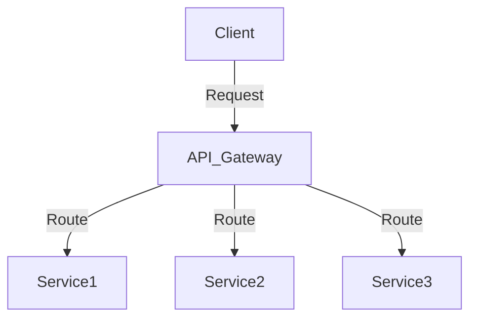
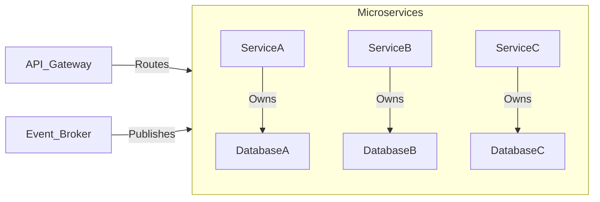

## 11.4 Microservices and Database Design

In the rapidly evolving landscape of software architecture, microservices have emerged as a powerful paradigm for building scalable and maintainable systems. This section delves into the integration of microservices with database design, focusing on SQL patterns and strategies that enable efficient and resilient architectures.

### Understanding Microservices Architecture

**Definition**: Microservices architecture is an architectural style that structures an application as a collection of loosely coupled services. Each service is designed to perform a specific business function and can be developed, deployed, and scaled independently.

- **Characteristics**:
  - **Decentralization**: Each service is autonomous and can be developed using different technologies.
  - **Scalability**: Services can be scaled independently based on demand.
  - **Resilience**: Failure of one service does not affect the entire system.
  - **Continuous Delivery**: Facilitates rapid and frequent deployment of services.

### Database Considerations in Microservices

#### Database per Service

One of the core principles of microservices architecture is that each service should own its database. This ensures loose coupling and allows each service to evolve independently without being constrained by a shared database schema.

- **Advantages**:
  - **Encapsulation**: Services have full control over their data models.
  - **Flexibility**: Each service can choose the database technology that best suits its needs.
  - **Isolation**: Changes in one service's database do not impact others.

- **Challenges**:
  - **Data Duplication**: Data may be duplicated across services, leading to potential inconsistencies.
  - **Complex Queries**: Aggregating data from multiple services can be complex and may require additional layers, such as data lakes or data warehouses.

#### Data Consistency

In a microservices architecture, managing data consistency without distributed transactions is crucial. Often, eventual consistency models are employed to balance consistency and availability.

- **Eventual Consistency**: Data changes are propagated asynchronously, and the system eventually reaches a consistent state.
- **Saga Pattern**: A sequence of local transactions where each service updates its database and publishes an event or message to trigger the next step.

### Patterns in Microservices and Database Design

#### Event-Driven Communication

In microservices, services often communicate asynchronously via events. This decouples services and allows them to operate independently.

- **Benefits**:
  - **Loose Coupling**: Services do not need to know about each other.
  - **Scalability**: Events can be processed in parallel by multiple instances of a service.
  - **Resilience**: Services can continue to operate even if some events are delayed.

- **Implementation**:
  - Use message brokers like Kafka or RabbitMQ to publish and subscribe to events.
  - Design services to be idempotent, ensuring that processing the same event multiple times does not lead to inconsistent states.

```sql
-- Example of an event table in SQL
CREATE TABLE OrderEvents (
    EventID SERIAL PRIMARY KEY,
    OrderID INT NOT NULL,
    EventType VARCHAR(50) NOT NULL,
    EventData JSONB,
    CreatedAt TIMESTAMP DEFAULT CURRENT_TIMESTAMP
);

-- Inserting an event
INSERT INTO OrderEvents (OrderID, EventType, EventData)
VALUES (123, 'OrderCreated', '{"customer_id": 456, "total": 78.90}');
```

#### API Gateway

An API Gateway acts as a centralized entry point to manage and route requests to microservices. It abstracts the complexity of the underlying services and provides a unified interface to clients.

- **Functions**:
  - **Routing**: Directs requests to the appropriate service.
  - **Security**: Enforces authentication and authorization.
  - **Rate Limiting**: Controls the number of requests to prevent overloading services.
  - **Caching**: Reduces load on services by caching responses.

- **Example**:
  - Use tools like NGINX, Kong, or AWS API Gateway to implement an API Gateway.



### Challenges in Microservices and Database Design

#### Distributed Data Management

Managing data across distributed services introduces complexities in querying and transactions.

- **Solutions**:
  - Use CQRS (Command Query Responsibility Segregation) to separate read and write operations.
  - Implement data lakes or warehouses for complex queries that span multiple services.

#### Replication and Synchronization

Keeping data in sync while maintaining service independence is a significant challenge.

- **Strategies**:
  - Use change data capture (CDC) to track and propagate changes across services.
  - Implement eventual consistency models to ensure data consistency over time.

### Design Considerations

When designing databases for microservices, consider the following:

- **Data Ownership**: Clearly define which service owns which data.
- **Data Access**: Limit direct access to a service's database to maintain encapsulation.
- **Schema Evolution**: Plan for schema changes and versioning to avoid breaking changes.
- **Performance**: Optimize queries and indexes for the specific needs of each service.

### Differences and Similarities with Other Patterns

Microservices architecture shares similarities with service-oriented architecture (SOA) but differs in its emphasis on decentralization and autonomy. Unlike monolithic architectures, microservices promote independent scaling and deployment.

### Try It Yourself

Experiment with the following:

- Modify the event table schema to include additional metadata, such as event source or priority.
- Implement a simple API Gateway using a tool like NGINX and configure routing for multiple services.
- Simulate eventual consistency by creating a service that processes events with a delay and observe how the system reaches a consistent state.

### Visualizing Microservices and Database Design



### References and Links

- [Martin Fowler's Microservices Resource Guide](https://martinfowler.com/microservices/)
- [AWS Microservices Architecture](https://aws.amazon.com/microservices/)
- [Event-Driven Architecture on Azure](https://docs.microsoft.com/en-us/azure/architecture/guide/architecture-styles/event-driven)

### Knowledge Check

- What are the key benefits of using a database per service in microservices architecture?
- How does eventual consistency differ from strong consistency?
- What role does an API Gateway play in a microservices architecture?

### Embrace the Journey

Remember, mastering microservices and database design is a journey. As you progress, you'll build more robust and scalable systems. Keep experimenting, stay curious, and enjoy the journey!

## Quiz Time!



### What is a key characteristic of microservices architecture?

- [x] Decentralization
- [ ] Monolithic structure
- [ ] Tight coupling
- [ ] Single database

> **Explanation:** Microservices architecture is characterized by decentralization, allowing services to be developed and deployed independently.

### In microservices, what is the advantage of having a database per service?

- [x] Encapsulation and flexibility
- [ ] Increased complexity
- [ ] Shared schema
- [ ] Centralized control

> **Explanation:** Having a database per service ensures encapsulation and flexibility, allowing each service to control its data model.

### What is eventual consistency?

- [x] A model where data changes are propagated asynchronously
- [ ] A model where data is always consistent
- [ ] A model that requires distributed transactions
- [ ] A model that uses strong consistency

> **Explanation:** Eventual consistency allows data changes to be propagated asynchronously, with the system eventually reaching a consistent state.

### What is the role of an API Gateway in microservices?

- [x] Centralized entry point for managing and routing requests
- [ ] Direct access to databases
- [ ] Service-to-service communication
- [ ] Data storage

> **Explanation:** An API Gateway acts as a centralized entry point for managing and routing requests to microservices.

### Which pattern is used for asynchronous communication in microservices?

- [x] Event-Driven Communication
- [ ] Synchronous Communication
- [ ] Direct Database Access
- [ ] Monolithic Communication

> **Explanation:** Event-Driven Communication is used for asynchronous communication in microservices, allowing services to operate independently.

### What is a challenge in distributed data management?

- [x] Complex queries across services
- [ ] Simple data access
- [ ] Centralized data storage
- [ ] Single point of failure

> **Explanation:** Distributed data management introduces complexities in querying and transactions across services.

### How can data consistency be managed in microservices?

- [x] Using eventual consistency models
- [ ] Using strong consistency models
- [ ] Using centralized databases
- [ ] Using direct service communication

> **Explanation:** Eventual consistency models are often used to manage data consistency in microservices.

### What is the Saga Pattern?

- [x] A sequence of local transactions for managing distributed transactions
- [ ] A centralized transaction model
- [ ] A pattern for direct database access
- [ ] A pattern for synchronous communication

> **Explanation:** The Saga Pattern is a sequence of local transactions where each service updates its database and triggers the next step.

### What is a benefit of using an API Gateway?

- [x] Security and rate limiting
- [ ] Direct database access
- [ ] Service-to-service communication
- [ ] Data storage

> **Explanation:** An API Gateway provides security and rate limiting, among other functions, for managing requests to microservices.

### True or False: Microservices architecture promotes independent scaling and deployment.

- [x] True
- [ ] False

> **Explanation:** Microservices architecture promotes independent scaling and deployment, allowing services to be developed and deployed independently.


