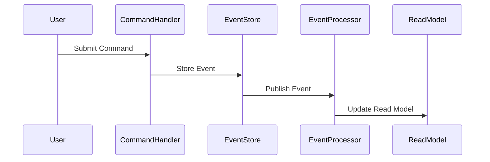
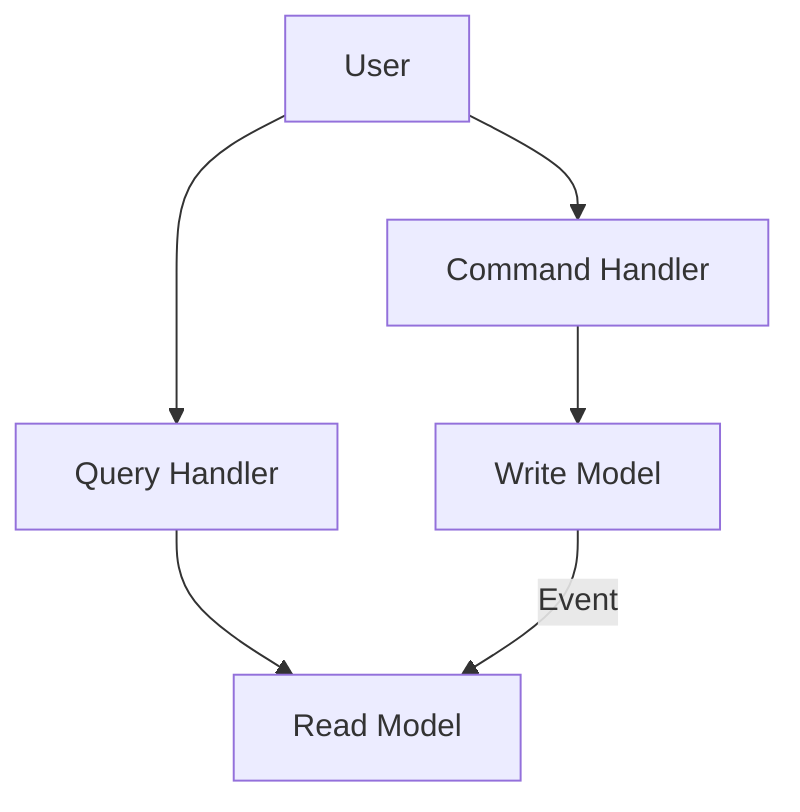

## 11.5 Event Sourcing and CQRS Patterns

In the realm of modern application architectures, **Event Sourcing** and **CQRS (Command Query Responsibility Segregation)** have emerged as powerful patterns that address the challenges of scalability, auditability, and performance. These patterns are particularly relevant in systems where data consistency, historical tracking, and efficient data processing are paramount. Let's delve into these concepts, exploring their benefits, implementation strategies, and how they can be effectively integrated into SQL-based systems.

### Event Sourcing

#### Concept

**Event Sourcing** is a design pattern that involves storing the state changes of an application as a sequence of events. Instead of persisting the current state of an entity, every change to the state is captured as an event. This approach allows the system to reconstruct the current state by replaying the sequence of events from the beginning.

#### Benefits

- **Auditability**: By maintaining a complete history of changes, Event Sourcing provides a robust audit trail. This is invaluable for compliance, debugging, and understanding the evolution of the system's state.
- **Scalability**: Event Sourcing leverages efficient append-only operations, which can be optimized for high throughput and low latency.
- **Flexibility**: The ability to replay events enables the system to support features like temporal queries, debugging, and state reconstruction.

#### Key Participants

- **Event Store**: A specialized database or storage system that captures and persists events.
- **Event Publisher**: A component responsible for broadcasting events to interested subscribers.
- **Event Processor**: A component that reacts to events, updating read models or triggering side effects.

#### Sample Code Snippet

Let's consider a simple example of an Event Sourcing implementation using SQL. We'll model a banking application where account transactions are stored as events.

```sql
-- Create a table to store events
CREATE TABLE AccountEvents (
    EventID INT PRIMARY KEY AUTO_INCREMENT,
    AccountID INT NOT NULL,
    EventType VARCHAR(50) NOT NULL,
    Amount DECIMAL(10, 2),
    Timestamp DATETIME DEFAULT CURRENT_TIMESTAMP
);

-- Insert a deposit event
INSERT INTO AccountEvents (AccountID, EventType, Amount) VALUES (1, 'Deposit', 100.00);

-- Insert a withdrawal event
INSERT INTO AccountEvents (AccountID, EventType, Amount) VALUES (1, 'Withdrawal', 50.00);

-- Query to reconstruct the account balance
SELECT SUM(CASE WHEN EventType = 'Deposit' THEN Amount ELSE -Amount END) AS Balance
FROM AccountEvents
WHERE AccountID = 1;
```

In this example, each transaction is recorded as an event, and the account balance is reconstructed by summing the events.

#### Design Considerations

- **Event Schema**: Carefully design the schema for events to ensure they capture all necessary information.
- **Event Versioning**: Plan for changes in event structure over time, implementing versioning strategies to handle schema evolution.
- **Performance**: Optimize the event store for high write throughput and efficient querying.

### CQRS (Command Query Responsibility Segregation)

#### Principle

**CQRS** is a pattern that separates read and write operations into different models or systems. This segregation allows each model to be optimized for its specific purpose, enhancing performance and scalability.

#### Advantages

- **Performance**: By optimizing read and write models differently, CQRS can significantly improve system efficiency. Read models can be denormalized for fast querying, while write models can focus on data integrity.
- **Scalability**: The independent scaling of read and write components allows the system to handle varying loads effectively.
- **Flexibility**: CQRS supports complex business logic and workflows by decoupling command processing from query handling.

#### Key Participants

- **Command Model**: Handles write operations, ensuring data integrity and enforcing business rules.
- **Query Model**: Handles read operations, optimized for fast data retrieval.
- **Command Handler**: Processes commands, updating the write model.
- **Query Handler**: Processes queries, retrieving data from the read model.

#### Sample Code Snippet

Consider a CQRS implementation for a simple e-commerce application. We'll separate the command and query models for managing product inventory.

```sql
-- Command model: Product table for write operations
CREATE TABLE Products (
    ProductID INT PRIMARY KEY,
    Name VARCHAR(100),
    Quantity INT
);

-- Query model: Denormalized view for read operations
CREATE VIEW ProductInventory AS
SELECT ProductID, Name, Quantity
FROM Products
WHERE Quantity > 0;

-- Command to update product quantity
UPDATE Products SET Quantity = Quantity - 1 WHERE ProductID = 1 AND Quantity > 0;

-- Query to get available products
SELECT * FROM ProductInventory;
```

In this example, the `Products` table serves as the command model, while the `ProductInventory` view acts as the query model.

#### Design Considerations

- **Consistency**: Implement mechanisms to keep the read and write models synchronized, such as event-driven updates or eventual consistency strategies.
- **Complexity**: Be mindful of the increased architectural complexity introduced by CQRS, ensuring that the benefits outweigh the costs.
- **Data Duplication**: Accept that data may be duplicated across models, and plan for efficient synchronization.

### Visualizing Event Sourcing and CQRS

To better understand the flow and interaction of Event Sourcing and CQRS, let's visualize these patterns using Mermaid.js diagrams.

#### Event Sourcing Flow



**Description**: This diagram illustrates the flow of events in an Event Sourcing system. A user submits a command, which is processed by the command handler. The resulting event is stored in the event store and published to the event processor, which updates the read model.

#### CQRS Architecture



**Description**: This diagram represents the CQRS architecture, where the command handler updates the write model, and the query handler retrieves data from the read model. Events from the write model are used to update the read model.

### Implementation Considerations

#### Complexity

Implementing Event Sourcing and CQRS introduces architectural complexity. It's essential to weigh the benefits against the added complexity and ensure that the system's requirements justify the use of these patterns.

#### Consistency

Maintaining consistency between the read and write models is crucial. Consider using eventual consistency strategies, where the read model is updated asynchronously based on events from the write model.

#### Scalability

Both Event Sourcing and CQRS enhance scalability by allowing independent scaling of components. Ensure that the infrastructure supports horizontal scaling and efficient load balancing.

### Differences and Similarities

While Event Sourcing and CQRS are often used together, they are distinct patterns:

- **Event Sourcing** focuses on capturing state changes as events, providing a complete history of changes.
- **CQRS** separates read and write operations, optimizing each for its specific purpose.

Both patterns complement each other, with Event Sourcing providing the event stream that CQRS can use to update read models.

### Try It Yourself

To deepen your understanding, try implementing a simple Event Sourcing and CQRS system. Start with a basic domain, such as a task management application, and experiment with storing task events and separating read and write models. Modify the code examples provided to suit your domain and explore the impact of different design choices.

### References and Links

- [Martin Fowler on Event Sourcing](https://martinfowler.com/eaaDev/EventSourcing.html)
- [CQRS Documentation on Microsoft Docs](https://docs.microsoft.com/en-us/azure/architecture/patterns/cqrs)
- [Event Sourcing and CQRS with Axon Framework](https://axoniq.io/)

### Knowledge Check

- Explain the benefits of using Event Sourcing in a system.
- Describe how CQRS improves system performance and scalability.
- Discuss the challenges of maintaining consistency in a CQRS architecture.

### Embrace the Journey

Remember, mastering Event Sourcing and CQRS is a journey. As you experiment and implement these patterns, you'll gain insights into their strengths and limitations. Stay curious, keep learning, and enjoy the process of building robust, scalable systems.

## Quiz Time!



### What is the primary benefit of Event Sourcing?

- [x] Auditability and historical tracking
- [ ] Simplified data models
- [ ] Reduced storage requirements
- [ ] Faster read operations

> **Explanation:** Event Sourcing provides a complete history of changes, enhancing auditability and historical tracking.

### How does CQRS improve system performance?

- [x] By separating read and write operations into different models
- [ ] By reducing the number of database tables
- [ ] By eliminating the need for indexes
- [ ] By using a single data model for all operations

> **Explanation:** CQRS separates read and write operations, allowing each to be optimized for performance.

### What is a key challenge of implementing Event Sourcing?

- [x] Managing event schema evolution
- [ ] Reducing database size
- [ ] Simplifying data access
- [ ] Eliminating data redundancy

> **Explanation:** Event schema evolution is a challenge as the structure of events may change over time.

### In CQRS, what is the role of the Command Handler?

- [x] To process commands and update the write model
- [ ] To retrieve data from the read model
- [ ] To store events in the event store
- [ ] To synchronize read and write models

> **Explanation:** The Command Handler processes commands and updates the write model.

### What is a common strategy for maintaining consistency in CQRS?

- [x] Eventual consistency
- [ ] Immediate consistency
- [ ] Synchronous updates
- [ ] Data replication

> **Explanation:** Eventual consistency allows the read model to be updated asynchronously based on events.

### Which pattern focuses on capturing state changes as events?

- [x] Event Sourcing
- [ ] CQRS
- [ ] Data Replication
- [ ] Sharding

> **Explanation:** Event Sourcing captures state changes as events, providing a complete history.

### What is a potential downside of using CQRS?

- [x] Increased architectural complexity
- [ ] Reduced system performance
- [ ] Limited scalability
- [ ] Lack of auditability

> **Explanation:** CQRS introduces architectural complexity, which can be a downside if not managed properly.

### How can Event Sourcing enhance scalability?

- [x] By leveraging efficient append-only operations
- [ ] By reducing the number of events stored
- [ ] By simplifying data models
- [ ] By eliminating the need for a read model

> **Explanation:** Event Sourcing enhances scalability through efficient append-only operations.

### What is the relationship between Event Sourcing and CQRS?

- [x] They are distinct patterns that complement each other
- [ ] They are the same pattern with different names
- [ ] They cannot be used together
- [ ] They are mutually exclusive

> **Explanation:** Event Sourcing and CQRS are distinct patterns that complement each other, often used together.

### True or False: CQRS requires the use of Event Sourcing.

- [ ] True
- [x] False

> **Explanation:** CQRS does not require Event Sourcing; they are separate patterns that can be used independently.


