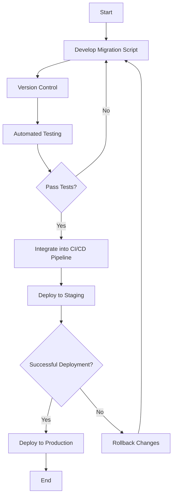

## 11.6 Database Versioning and Migration Tools

In the dynamic world of software development, databases are not static entities. As applications evolve, so too must their underlying databases. This evolution requires careful management of database schema changes to ensure data integrity, application stability, and seamless user experiences. Database versioning and migration tools are essential for managing these changes in a controlled and trackable manner. In this section, we will explore the purpose of these tools, delve into some of the most popular options available, and discuss best practices for their use.

### Purpose of Database Versioning and Migration Tools

The primary purpose of database versioning and migration tools is to manage changes to database schemas in a systematic way. These tools allow developers to:

- **Track Changes**: Maintain a history of all changes made to the database schema, enabling easy rollback if necessary.
- **Ensure Consistency**: Apply the same changes across different environments (development, testing, production) to ensure consistency.
- **Facilitate Collaboration**: Allow multiple developers to work on the database schema simultaneously without conflict.
- **Automate Deployments**: Integrate schema changes into automated deployment pipelines, reducing the risk of human error.

### Popular Database Versioning and Migration Tools

#### Flyway

Flyway is a popular open-source database migration tool that uses SQL scripts for versioned migrations. It is known for its simplicity and ease of use.

- **Key Features**:
  - **SQL-Based Migrations**: Flyway uses plain SQL scripts to define database changes, making it easy for developers familiar with SQL to use.
  - **Version Control**: Each migration script is assigned a version number, allowing Flyway to track the order of changes.
  - **Support for Multiple Databases**: Flyway supports a wide range of databases, including MySQL, PostgreSQL, Oracle, and SQL Server.
  - **Command-Line Interface**: Flyway provides a simple command-line interface for executing migrations.

- **Sample Flyway Migration Script**:
  ```sql
  -- V1__Create_users_table.sql
  CREATE TABLE users (
      id INT PRIMARY KEY,
      username VARCHAR(50) NOT NULL,
      email VARCHAR(100) NOT NULL
  );
  ```

- **Usage**:
  To apply migrations using Flyway, you can use the following command:
  ```bash
  flyway migrate
  ```

#### Liquibase

Liquibase is another popular database migration tool that offers more flexibility in defining database changes. It allows changes to be defined in XML, YAML, JSON, or SQL formats.

- **Key Features**:
  - **Flexible Change Formats**: Liquibase supports multiple formats for defining changes, allowing developers to choose the format that best suits their needs.
  - **Rollback Support**: Liquibase provides built-in support for rolling back changes, making it easy to revert to a previous state if necessary.
  - **Database Independence**: Liquibase abstracts database-specific details, allowing the same change sets to be applied to different database systems.
  - **Integration with CI/CD**: Liquibase can be easily integrated into continuous integration and deployment pipelines.

- **Sample Liquibase ChangeSet**:
  ```xml
  <changeSet id="1" author="developer">
      <createTable tableName="users">
          <column name="id" type="int" autoIncrement="true">
              <constraints primaryKey="true"/>
          </column>
          <column name="username" type="varchar(50)">
              <constraints nullable="false"/>
          </column>
          <column name="email" type="varchar(100)">
              <constraints nullable="false"/>
          </column>
      </createTable>
  </changeSet>
  ```

- **Usage**:
  To apply changes using Liquibase, you can use the following command:
  ```bash
  liquibase update
  ```

#### Alembic (for SQLAlchemy)

Alembic is a lightweight database migration tool for use with SQLAlchemy, a popular Python SQL toolkit and Object-Relational Mapping (ORM) library.

- **Key Features**:
  - **Python Integration**: Alembic is tightly integrated with SQLAlchemy, making it a natural choice for Python developers using SQLAlchemy.
  - **Script Generation**: Alembic can automatically generate migration scripts based on changes to SQLAlchemy models.
  - **Version Control**: Alembic uses a version control system to track changes, allowing for easy upgrades and downgrades.

- **Sample Alembic Migration Script**:
  ```python
  from alembic import op
  import sqlalchemy as sa

  # Revision identifiers, used by Alembic.
  revision = '1'
  down_revision = None

  def upgrade():
      op.create_table(
          'users',
          sa.Column('id', sa.Integer, primary_key=True),
          sa.Column('username', sa.String(50), nullable=False),
          sa.Column('email', sa.String(100), nullable=False)
      )

  def downgrade():
      op.drop_table('users')
  ```

- **Usage**:
  To apply migrations using Alembic, you can use the following command:
  ```bash
  alembic upgrade head
  ```

### Best Practices for Database Versioning and Migration

Implementing database versioning and migration tools effectively requires adherence to certain best practices:

#### Version Control

- **Keep Migration Scripts in Source Control**: Store all migration scripts in a version control system (e.g., Git) to maintain a history of changes and facilitate collaboration among developers.
- **Use Semantic Versioning**: Adopt a versioning scheme that clearly communicates the nature of changes (e.g., major, minor, patch).

#### Automation

- **Integrate Migrations into CI/CD Pipelines**: Automate the execution of migration scripts as part of your continuous integration and deployment processes to ensure consistency across environments.
- **Automated Testing**: Implement automated tests to verify that migrations are applied correctly and do not introduce errors.

#### Rollback Strategies

- **Plan for Downgrades**: Design migration scripts with the ability to roll back changes in case of issues after deployment. This may involve writing separate rollback scripts or using tools with built-in rollback support.
- **Test Rollbacks**: Regularly test rollback procedures to ensure they work as expected and do not result in data loss or corruption.

#### Collaboration and Communication

- **Document Changes**: Clearly document the purpose and impact of each migration to facilitate understanding and communication among team members.
- **Coordinate with Stakeholders**: Communicate schema changes to relevant stakeholders (e.g., developers, DBAs, product managers) to ensure alignment and avoid conflicts.

### Visualizing Database Migration Workflow

To better understand the workflow of database migrations, let's visualize the process using a Mermaid.js flowchart:



**Description**: This flowchart illustrates the typical workflow for database migrations, starting from the development of a migration script, through version control and automated testing, to deployment in staging and production environments. Rollback procedures are also included in case of deployment failures.

### Try It Yourself

To gain hands-on experience with database versioning and migration tools, try the following exercises:

1. **Set Up Flyway**: Download and install Flyway, then create a simple migration script to add a new table to your database. Execute the migration and verify the changes.

2. **Experiment with Liquibase**: Define a change set in XML format to modify an existing table. Apply the changes using Liquibase and explore the rollback functionality.

3. **Use Alembic with SQLAlchemy**: Create a new SQLAlchemy model and use Alembic to generate a migration script. Apply the migration and test the upgrade and downgrade processes.

### References and Links

- [Flyway Documentation](https://flywaydb.org/documentation/)
- [Liquibase Documentation](https://www.liquibase.org/documentation/)
- [Alembic Documentation](https://alembic.sqlalchemy.org/en/latest/)

### Knowledge Check

- **Question**: What is the primary purpose of database versioning and migration tools?
- **Exercise**: Implement a simple migration using one of the tools discussed and document the process.

### Embrace the Journey

Remember, mastering database versioning and migration tools is an ongoing journey. As you gain experience, you'll develop a deeper understanding of how to manage database changes effectively and efficiently. Keep experimenting, stay curious, and enjoy the process of continuous learning and improvement.

## Quiz Time!



### What is the primary purpose of database versioning and migration tools?

- [x] To manage changes to database schemas in a controlled and trackable manner
- [ ] To automate database backups
- [ ] To improve database query performance
- [ ] To monitor database health

> **Explanation:** Database versioning and migration tools are designed to manage changes to database schemas in a systematic way, ensuring consistency and trackability.

### Which tool uses SQL scripts for versioned migrations?

- [x] Flyway
- [ ] Liquibase
- [ ] Alembic
- [ ] Django Migrations

> **Explanation:** Flyway uses plain SQL scripts to define database changes, making it easy for developers familiar with SQL to use.

### What format does Liquibase NOT support for defining changes?

- [ ] XML
- [ ] YAML
- [ ] JSON
- [x] CSV

> **Explanation:** Liquibase supports XML, YAML, JSON, and SQL formats for defining changes, but not CSV.

### Which tool is tightly integrated with SQLAlchemy?

- [ ] Flyway
- [ ] Liquibase
- [x] Alembic
- [ ] Django Migrations

> **Explanation:** Alembic is a lightweight database migration tool specifically designed for use with SQLAlchemy.

### What is a best practice for managing migration scripts?

- [x] Keep them in source control
- [ ] Store them on a local machine
- [ ] Share them via email
- [ ] Use a shared network drive

> **Explanation:** Keeping migration scripts in a version control system ensures a history of changes and facilitates collaboration.

### What should be integrated into CI/CD pipelines?

- [x] Database migrations
- [ ] Manual testing
- [ ] Database backups
- [ ] User interface updates

> **Explanation:** Integrating database migrations into CI/CD pipelines ensures consistency across environments and reduces the risk of human error.

### What is a key feature of Flyway?

- [x] SQL-based migrations
- [ ] JSON-based migrations
- [ ] Python-based migrations
- [ ] CSV-based migrations

> **Explanation:** Flyway uses plain SQL scripts to define database changes, making it easy for developers familiar with SQL to use.

### What should be planned for in case of issues after deployment?

- [x] Rollback strategies
- [ ] Data backups
- [ ] Performance tuning
- [ ] User feedback

> **Explanation:** Planning for rollbacks ensures that changes can be reverted if issues arise after deployment.

### What is a common format for Liquibase change sets?

- [x] XML
- [ ] CSV
- [ ] PDF
- [ ] DOCX

> **Explanation:** Liquibase supports XML, YAML, JSON, and SQL formats for defining changes.

### True or False: Alembic can automatically generate migration scripts based on changes to SQLAlchemy models.

- [x] True
- [ ] False

> **Explanation:** Alembic can automatically generate migration scripts based on changes to SQLAlchemy models, making it a powerful tool for Python developers.




