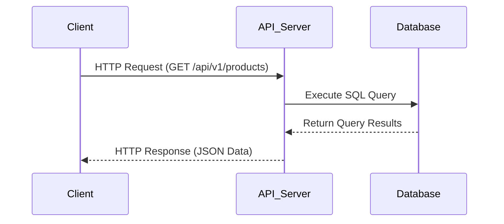

## 11.7 API Development with SQL Backends

In today's digital landscape, APIs (Application Programming Interfaces) serve as the backbone of modern software architectures, enabling seamless interaction between different software components. When it comes to developing APIs with SQL backends, understanding the intricacies of database interaction, query optimization, and security is crucial. This section delves into the essential aspects of API development with SQL backends, focusing on designing efficient and secure APIs that leverage the power of SQL databases.

### Designing APIs

APIs are designed to provide a standardized way for different software systems to communicate. When integrating SQL backends, two popular approaches are RESTful services and GraphQL. Each has its own strengths and use cases, and understanding these can help you choose the right architecture for your application.

#### RESTful Services

**Representational State Transfer (REST)** is an architectural style that uses HTTP requests to access and manipulate data. RESTful services are stateless, meaning each request from a client contains all the information needed to process it. This statelessness is a key feature, allowing for scalability and reliability.

- **Resource-Based**: RESTful APIs are centered around resources, which are identified by URLs. Each resource can be accessed using standard HTTP methods such as GET, POST, PUT, DELETE, etc.
  
- **Stateless Communication**: Each request from a client to a server must contain all the information the server needs to fulfill that request. This means no client context is stored on the server between requests.

- **Cacheable**: Responses from RESTful services can be cached to improve performance, reducing the need for repeated database queries.

- **Layered System**: REST allows for a layered architecture where intermediaries such as load balancers and caches can be used to improve scalability and performance.

**Example of a RESTful API Endpoint**:

```http
GET /api/v1/products
Host: example.com
Accept: application/json
```

This endpoint retrieves a list of products from the database. The server processes the request, executes the necessary SQL queries, and returns the data in JSON format.

#### GraphQL

**GraphQL** is a query language for APIs and a runtime for executing those queries by using a type system you define for your data. Unlike REST, GraphQL allows clients to request exactly the data they need, reducing over-fetching and under-fetching of data.

- **Flexible Queries**: Clients can specify exactly what data they need, which can reduce the amount of data transferred over the network.

- **Single Endpoint**: Unlike REST, which typically has multiple endpoints for different resources, GraphQL APIs expose a single endpoint that can handle a variety of queries.

- **Strongly Typed Schema**: GraphQL APIs are defined by a schema that specifies the types of data that can be queried, providing a clear contract between client and server.

**Example of a GraphQL Query**:

```graphql
{
  products {
    id
    name
    price
  }
}
```

This query requests the `id`, `name`, and `price` fields of all products. The server interprets the query, executes the necessary SQL commands, and returns the data in the requested format.

### Database Interaction Patterns

Efficient database interaction is crucial for API performance. This involves optimizing SQL queries and handling bulk operations effectively.

#### Optimizing Queries

Optimizing SQL queries is essential for ensuring that your API performs well under load. Poorly optimized queries can lead to slow response times and increased server load.

- **Indexing**: Ensure that your database tables are properly indexed to speed up query execution. Use indexes on columns that are frequently used in WHERE clauses and JOIN operations.

- **Query Caching**: Implement caching mechanisms to store the results of frequently executed queries, reducing the need to hit the database repeatedly.

- **Use of Stored Procedures**: Stored procedures can encapsulate complex SQL logic, reducing the amount of data transferred between the application and the database.

- **Avoiding N+1 Query Problem**: This common issue occurs when an application executes a separate query for each item in a list. Use JOINs or subqueries to fetch related data in a single query.

**Example of an Optimized SQL Query**:

```sql
SELECT p.id, p.name, p.price, c.name AS category_name
FROM products p
JOIN categories c ON p.category_id = c.id
WHERE p.price > 100
ORDER BY p.name;
```

This query retrieves product details along with their category names, filtering products with a price greater than 100 and ordering them by name.

#### Bulk Operations

Handling bulk operations efficiently is important for APIs that need to process large amounts of data, such as batch inserts or updates.

- **Batch Inserts**: Use SQL's batch insert capabilities to insert multiple rows in a single query, reducing the number of database round-trips.

- **Bulk Updates**: Similar to inserts, perform bulk updates in a single query to minimize database interactions.

- **Transaction Management**: Use transactions to ensure data integrity during bulk operations. This ensures that either all changes are committed or none are, in case of an error.

**Example of a Bulk Insert Operation**:

```sql
INSERT INTO products (name, price, category_id) VALUES
('Product A', 150, 1),
('Product B', 200, 2),
('Product C', 250, 3);
```

This query inserts three products into the database in a single operation.

### Security Considerations

Security is a critical aspect of API development. Ensuring that your API is secure involves input validation, rate limiting, and other best practices.

#### Input Validation

Input validation is essential to prevent SQL injection attacks and ensure data integrity. Always validate and sanitize user inputs before using them in SQL queries.

- **Parameterized Queries**: Use parameterized queries or prepared statements to prevent SQL injection attacks. This ensures that user inputs are treated as data, not executable code.

- **Data Validation**: Validate data types, lengths, and formats before processing them. This helps prevent unexpected errors and data corruption.

**Example of a Parameterized Query**:

```python
import sqlite3

conn = sqlite3.connect('example.db')
cursor = conn.cursor()

product_id = 1
cursor.execute("SELECT name, price FROM products WHERE id = ?", (product_id,))

result = cursor.fetchone()
print(result)

conn.close()
```

In this example, the `?` placeholder is used to safely insert the `product_id` into the query, preventing SQL injection.

#### Rate Limiting

Rate limiting is a technique used to control the number of requests a client can make to an API within a given time period. This helps protect your backend from excessive load and potential abuse.

- **Throttling**: Implement throttling to limit the number of requests a client can make. This can be done using API gateways or middleware.

- **Quota Management**: Set quotas for different clients or users to ensure fair usage of resources.

- **Monitoring and Alerts**: Monitor API usage patterns and set up alerts for unusual activity, which could indicate a potential attack.

**Example of Rate Limiting with Express.js**:

```javascript
const express = require('express');
const rateLimit = require('express-rate-limit');

const app = express();

// Define rate limit
const limiter = rateLimit({
  windowMs: 15 * 60 * 1000, // 15 minutes
  max: 100, // Limit each IP to 100 requests per windowMs
  message: "Too many requests from this IP, please try again later."
});

// Apply rate limit to all requests
app.use(limiter);

app.get('/api/v1/products', (req, res) => {
  // Handle the request
  res.send('Product list');
});

app.listen(3000, () => {
  console.log('Server running on port 3000');
});
```

In this example, the `express-rate-limit` middleware is used to limit the number of requests a client can make to the `/api/v1/products` endpoint.

### Visualizing API and SQL Backend Interaction

To better understand the interaction between APIs and SQL backends, let's visualize the process using a sequence diagram.



**Diagram Description**: This sequence diagram illustrates the flow of a typical API request to an SQL backend. The client sends an HTTP request to the API server, which then executes an SQL query on the database. The database returns the query results to the API server, which formats the data as JSON and sends it back to the client.

### Try It Yourself

Experiment with the code examples provided in this section. Try modifying the SQL queries to include additional filters or join different tables. Implement rate limiting in your own API using different libraries or frameworks. By experimenting with these concepts, you'll gain a deeper understanding of how to develop efficient and secure APIs with SQL backends.

### References and Links

- [MDN Web Docs: REST](https://developer.mozilla.org/en-US/docs/Glossary/REST)
- [GraphQL Official Website](https://graphql.org/)
- [OWASP SQL Injection Prevention Cheat Sheet](https://cheatsheetseries.owasp.org/cheatsheets/SQL_Injection_Prevention_Cheat_Sheet.html)
- [Express Rate Limit Middleware](https://www.npmjs.com/package/express-rate-limit)

### Knowledge Check

To reinforce your understanding of API development with SQL backends, consider the following questions and challenges:

- What are the key differences between RESTful services and GraphQL?
- How can you optimize SQL queries to improve API performance?
- What techniques can be used to prevent SQL injection attacks?
- Implement a bulk insert operation in your own database and measure its performance.
- Set up rate limiting for an API endpoint using a different framework or library.

### Embrace the Journey

Remember, mastering API development with SQL backends is a journey. As you continue to explore and experiment with these concepts, you'll become more adept at designing efficient, scalable, and secure APIs. Keep learning, stay curious, and enjoy the process!

## Quiz Time!



### What is a key feature of RESTful services?

- [x] Stateless communication
- [ ] Strongly typed schema
- [ ] Single endpoint
- [ ] Flexible queries

> **Explanation:** RESTful services are stateless, meaning each request contains all the information needed to process it.

### What is a benefit of using GraphQL over REST?

- [x] Clients can request exactly the data they need
- [ ] Uses multiple endpoints for different resources
- [ ] Requires less server-side processing
- [ ] Automatically caches responses

> **Explanation:** GraphQL allows clients to specify exactly what data they need, reducing over-fetching and under-fetching.

### Which SQL feature helps prevent SQL injection attacks?

- [x] Parameterized queries
- [ ] Indexing
- [ ] Query caching
- [ ] Stored procedures

> **Explanation:** Parameterized queries ensure that user inputs are treated as data, not executable code, preventing SQL injection.

### What is the purpose of rate limiting in API development?

- [x] To control the number of requests a client can make
- [ ] To increase server response time
- [ ] To reduce data transfer over the network
- [ ] To simplify API design

> **Explanation:** Rate limiting helps protect the backend from excessive load and potential abuse by controlling the number of requests a client can make.

### Which of the following is a bulk operation in SQL?

- [x] Batch inserts
- [ ] Single row update
- [x] Bulk updates
- [ ] Query caching

> **Explanation:** Batch inserts and bulk updates are operations that handle multiple rows in a single query to minimize database interactions.

### What is a common issue that can occur with poorly optimized SQL queries?

- [x] Slow response times
- [ ] Increased data accuracy
- [ ] Reduced server load
- [ ] Improved scalability

> **Explanation:** Poorly optimized queries can lead to slow response times and increased server load.

### How can you ensure data integrity during bulk operations?

- [x] Use transactions
- [ ] Use parameterized queries
- [x] Implement input validation
- [ ] Use query caching

> **Explanation:** Transactions ensure that either all changes are committed or none are, maintaining data integrity during bulk operations.

### What is a characteristic of RESTful APIs?

- [x] Resource-based
- [ ] Strongly typed schema
- [ ] Single endpoint
- [ ] Flexible queries

> **Explanation:** RESTful APIs are centered around resources, which are identified by URLs.

### What is a benefit of using stored procedures in SQL?

- [x] Encapsulate complex SQL logic
- [ ] Automatically cache query results
- [ ] Reduce data transfer over the network
- [ ] Simplify API design

> **Explanation:** Stored procedures can encapsulate complex SQL logic, reducing the amount of data transferred between the application and the database.

### True or False: GraphQL APIs expose multiple endpoints for different resources.

- [ ] True
- [x] False

> **Explanation:** GraphQL APIs expose a single endpoint that can handle a variety of queries.




