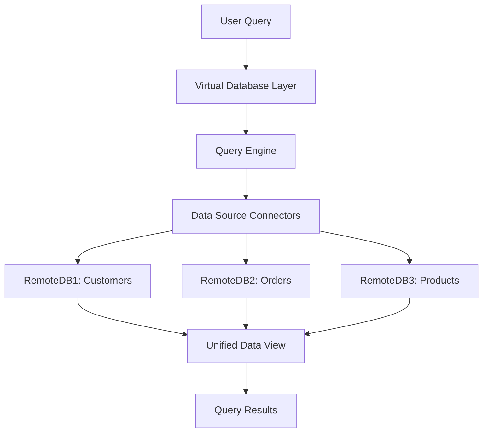

## 11.8 Data Federation and Virtualization

In today's data-driven world, organizations often face the challenge of integrating data from multiple sources to provide a unified view for decision-making and analytics. Data Federation and Virtualization are two powerful techniques that address this challenge by enabling seamless access to disparate data sources without the need for physical data consolidation. In this section, we will delve into these concepts, exploring their functionalities, benefits, challenges, and how they can be effectively implemented in SQL-based systems.

### Understanding Data Federation

**Data Federation** is a method that creates a virtual database layer, allowing users to access and query data from multiple disparate sources as if they were a single database. This approach abstracts the complexity of dealing with different data formats, locations, and access methods, providing a unified interface for data retrieval.

#### Key Concepts of Data Federation

- **Virtual Database Layer**: Acts as an intermediary that connects to various data sources, translating queries into the native language of each source.
- **Unified Query Interface**: Allows users to write queries in a single language (e.g., SQL), which are then executed across multiple data sources.
- **Data Abstraction**: Hides the underlying complexity of data source heterogeneity, presenting a consistent view to the user.

#### Benefits of Data Federation

- **Single Source of Truth**: Provides a unified access layer, ensuring consistency and accuracy of data across the organization.
- **Agility**: Facilitates rapid integration of new data sources without the need for extensive ETL (Extract, Transform, Load) processes.
- **Cost Efficiency**: Reduces the need for data replication and storage, lowering infrastructure costs.

#### Challenges of Data Federation

- **Performance**: Query execution may experience latency due to remote data access and network overhead.
- **Complexity**: Managing security, access controls, and data consistency across multiple systems can be challenging.
- **Scalability**: As the number of data sources grows, maintaining performance and reliability becomes more complex.

### Exploring Data Virtualization

**Data Virtualization** provides real-time access to data without the need for physical data movement. It allows users to access and manipulate data from various sources as if it were stored in a single location, enabling real-time analytics and decision-making.

#### Key Features of Data Virtualization

- **Real-Time Data Access**: Enables instant access to data, supporting up-to-date analytics and reporting.
- **Data Abstraction Layer**: Similar to data federation, it abstracts the complexity of accessing different data sources.
- **Integration with BI Tools**: Seamlessly integrates with Business Intelligence (BI) tools, providing a consistent data view for analysis.

#### Benefits of Data Virtualization

- **Flexibility**: Easily adapt to changing data requirements and integrate new data sources.
- **Reduced Data Redundancy**: Eliminates the need for data duplication, ensuring data integrity and reducing storage costs.
- **Enhanced Decision-Making**: Provides timely access to data, enabling informed and agile decision-making.

#### Challenges of Data Virtualization

- **Performance Overhead**: Real-time data access can introduce latency, especially with complex queries or large datasets.
- **Security Concerns**: Ensuring secure access to sensitive data across multiple sources is critical.
- **Complexity in Implementation**: Setting up and maintaining a data virtualization layer requires careful planning and expertise.

### Implementing Data Federation and Virtualization in SQL

To effectively implement data federation and virtualization in SQL-based systems, it is essential to understand the architectural components and design patterns that facilitate these processes.

#### Architectural Components

1. **Data Source Connectors**: Interfaces that connect to various data sources, enabling data retrieval and manipulation.
2. **Query Engine**: Translates and optimizes queries for execution across multiple data sources.
3. **Metadata Repository**: Stores information about data sources, schemas, and mappings, facilitating query translation and optimization.
4. **Security Layer**: Manages authentication, authorization, and data access controls to ensure secure data access.

#### Design Patterns for Data Federation and Virtualization

- **Mediator Pattern**: Acts as an intermediary between the user and data sources, coordinating query execution and data retrieval.
- **Adapter Pattern**: Translates queries into the native language of each data source, ensuring compatibility and efficient execution.
- **Facade Pattern**: Provides a simplified interface for accessing complex data sources, hiding the underlying complexity from the user.

#### Sample Code Snippet

Below is a sample SQL code snippet demonstrating a simple data federation query using a virtual database layer:

```sql
-- Define a virtual table that federates data from multiple sources
CREATE VIEW UnifiedCustomerData AS
SELECT
    c1.CustomerID,
    c1.Name,
    c1.Email,
    o.OrderID,
    o.OrderDate,
    p.ProductName
FROM
    RemoteDB1.Customers c1
JOIN
    RemoteDB2.Orders o ON c1.CustomerID = o.CustomerID
JOIN
    RemoteDB3.Products p ON o.ProductID = p.ProductID;

-- Query the virtual table to retrieve unified customer data
SELECT * FROM UnifiedCustomerData
WHERE OrderDate > '2024-01-01';
```

In this example, the `UnifiedCustomerData` view federates data from three different remote databases, providing a unified view for querying.

### Visualizing Data Federation and Virtualization

To better understand the flow of data and query execution in a federated and virtualized environment, let's visualize the architecture using a Mermaid.js diagram.



**Diagram Description**: This flowchart illustrates the process of executing a user query in a data federation and virtualization environment. The query is processed by the virtual database layer, translated by the query engine, and executed across multiple remote databases. The results are then unified and presented to the user.

### Design Considerations

When implementing data federation and virtualization, consider the following:

- **Performance Optimization**: Use query optimization techniques and caching mechanisms to minimize latency and improve response times.
- **Security Management**: Implement robust security measures to protect sensitive data and ensure compliance with data protection regulations.
- **Scalability Planning**: Design the architecture to accommodate future growth in data sources and query complexity.

### Differences and Similarities

While data federation and virtualization share similarities in providing unified data access, they differ in their approach to data integration. Data federation focuses on creating a virtual database layer, while data virtualization emphasizes real-time data access without physical data movement. Both techniques aim to simplify data access and integration, but their implementation and use cases may vary.

### Try It Yourself

To gain hands-on experience with data federation and virtualization, try modifying the sample code snippet to include additional data sources or apply different query conditions. Experiment with different SQL functions and observe how they affect query performance and results.

### References and Further Reading

- [Data Virtualization: A Primer](https://www.dataversity.net/what-is-data-virtualization/)
- [Understanding Data Federation](https://www.ibm.com/cloud/learn/data-federation)
- [SQL Federation in Practice](https://docs.microsoft.com/en-us/sql/relational-databases/sql-server-federation)

### Knowledge Check

To reinforce your understanding of data federation and virtualization, consider the following questions and exercises:

- What are the key differences between data federation and data virtualization?
- How can you optimize query performance in a federated environment?
- Design a simple data federation architecture for a hypothetical organization with multiple data sources.

### Embrace the Journey

Remember, mastering data federation and virtualization is a journey that requires continuous learning and experimentation. As you explore these concepts, you'll discover new ways to integrate and access data, enhancing your ability to build efficient and scalable database solutions. Keep experimenting, stay curious, and enjoy the journey!

## Quiz Time!



### What is the primary goal of data federation?

- [x] To create a virtual database layer that unifies multiple disparate data sources.
- [ ] To physically consolidate data into a single database.
- [ ] To replicate data across multiple databases.
- [ ] To eliminate the need for data security.

> **Explanation:** Data federation aims to create a virtual database layer that provides a unified interface for accessing data from multiple disparate sources.

### Which of the following is a key feature of data virtualization?

- [x] Real-time access to data without physical data movement.
- [ ] Data replication across multiple sources.
- [ ] Physical data consolidation.
- [ ] Data encryption.

> **Explanation:** Data virtualization provides real-time access to data without the need for physical data movement, enabling seamless integration and analysis.

### What is a common challenge associated with data federation?

- [x] Performance latency due to remote data access.
- [ ] Lack of data redundancy.
- [ ] High storage costs.
- [ ] Inability to integrate new data sources.

> **Explanation:** Data federation can experience performance latency due to the need to access data from remote sources, which can introduce network overhead.

### In a federated data environment, what role does the query engine play?

- [x] Translates and optimizes queries for execution across multiple data sources.
- [ ] Stores metadata about data sources.
- [ ] Manages authentication and authorization.
- [ ] Physically consolidates data into a single database.

> **Explanation:** The query engine in a federated data environment translates and optimizes queries for execution across multiple data sources, ensuring efficient data retrieval.

### What is a benefit of using data virtualization?

- [x] Reduced data redundancy and storage costs.
- [ ] Increased data replication.
- [ ] Physical data consolidation.
- [ ] Elimination of data security concerns.

> **Explanation:** Data virtualization reduces data redundancy by providing real-time access to data without the need for physical data duplication, lowering storage costs.

### Which design pattern acts as an intermediary between the user and data sources in a federated environment?

- [x] Mediator Pattern
- [ ] Singleton Pattern
- [ ] Observer Pattern
- [ ] Factory Pattern

> **Explanation:** The Mediator Pattern acts as an intermediary between the user and data sources, coordinating query execution and data retrieval in a federated environment.

### What is a key consideration when implementing data federation and virtualization?

- [x] Performance optimization and security management.
- [ ] Data replication and redundancy.
- [ ] Physical data consolidation.
- [ ] Elimination of data access controls.

> **Explanation:** When implementing data federation and virtualization, it's important to focus on performance optimization and security management to ensure efficient and secure data access.

### How does data virtualization enhance decision-making?

- [x] By providing timely access to data for informed and agile decision-making.
- [ ] By physically consolidating data into a single database.
- [ ] By replicating data across multiple sources.
- [ ] By eliminating the need for data security.

> **Explanation:** Data virtualization enhances decision-making by providing timely access to data, enabling informed and agile decision-making without the need for physical data consolidation.

### What is a common architectural component in data federation?

- [x] Data Source Connectors
- [ ] Data Replication Tools
- [ ] Physical Data Consolidation
- [ ] Data Encryption Algorithms

> **Explanation:** Data Source Connectors are common architectural components in data federation, enabling data retrieval and manipulation from various data sources.

### True or False: Data federation and virtualization eliminate the need for data security.

- [ ] True
- [x] False

> **Explanation:** Data federation and virtualization do not eliminate the need for data security. Ensuring secure access to sensitive data across multiple sources is critical.


