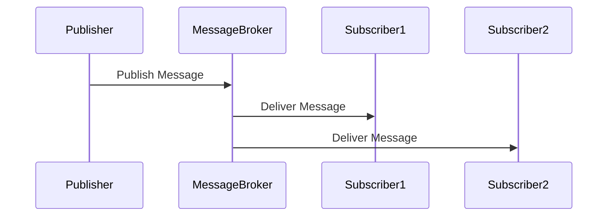
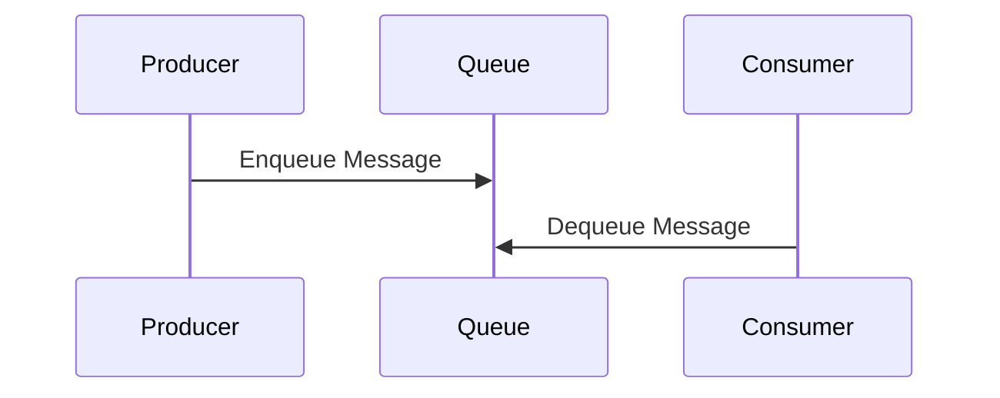
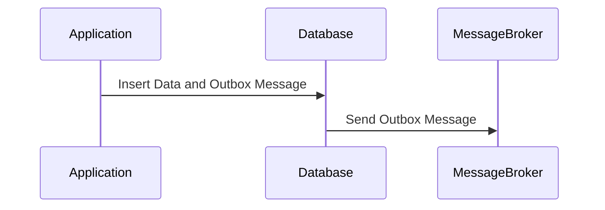
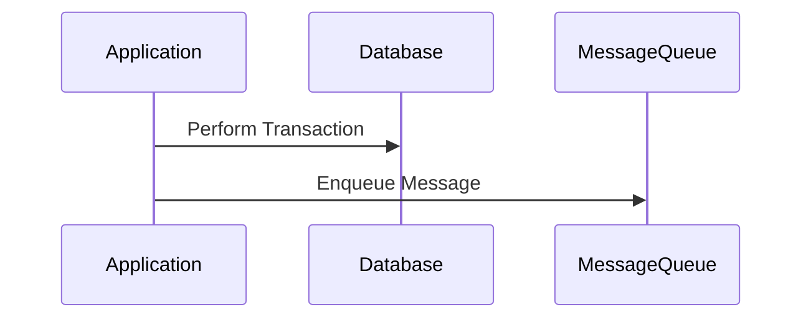
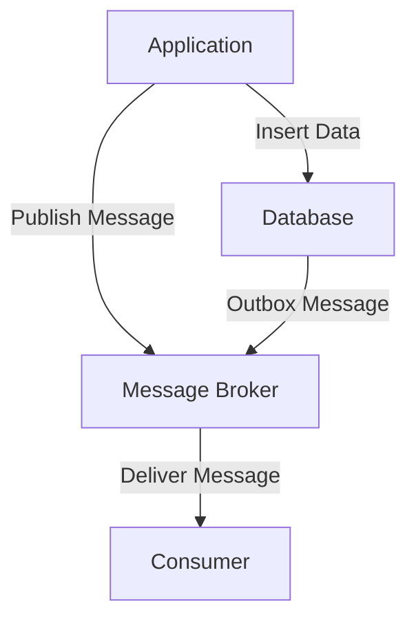

## 11.9 Messaging and Integration Patterns

In the modern landscape of software architecture, integrating databases with messaging systems is crucial for building scalable, reliable, and decoupled applications. This section delves into the essential messaging and integration patterns that expert software engineers and architects can leverage to enhance SQL database interactions within distributed systems.

### Messaging Systems

**Purpose**: Messaging systems are designed to facilitate asynchronous communication between different components of a system. They enable decoupling of services, allowing them to communicate without being directly connected. This is particularly useful in microservices architectures where services need to interact with each other in a non-blocking manner.

**Examples**: Popular message brokers include Apache Kafka, RabbitMQ, and Amazon SQS. These systems provide the infrastructure for message passing, ensuring messages are delivered reliably and in the correct order.

#### Key Concepts in Messaging Systems

- **Asynchronous Communication**: Unlike synchronous communication, where the sender waits for the receiver to process the message, asynchronous communication allows the sender to continue processing other tasks while the message is being handled.
- **Decoupling**: By using messaging systems, services can be developed, deployed, and scaled independently, leading to more flexible and maintainable architectures.
- **Scalability**: Messaging systems can handle large volumes of messages, making them suitable for high-throughput applications.

### Integration Patterns

Integration patterns define how different components of a system interact with each other. They provide solutions to common integration challenges, ensuring that systems work together seamlessly.

#### Publish-Subscribe Pattern

**Intent**: The publish-subscribe pattern decouples message producers (publishers) from message consumers (subscribers). Publishers send messages to a topic, and subscribers receive messages from that topic.

**Diagrams**:



**Key Participants**:
- **Publisher**: The component that sends messages.
- **Subscriber**: The component that receives messages.
- **Message Broker**: The intermediary that routes messages from publishers to subscribers.

**Applicability**: Use the publish-subscribe pattern when you need to broadcast messages to multiple consumers without knowing their identities.

**Sample Code Snippet**:

```sql
-- Example of a simple publish-subscribe implementation using PostgreSQL
CREATE TABLE messages (
    id SERIAL PRIMARY KEY,
    topic VARCHAR(255),
    content TEXT,
    created_at TIMESTAMP DEFAULT CURRENT_TIMESTAMP
);

-- Publisher inserts a message into the messages table
INSERT INTO messages (topic, content) VALUES ('order_updates', 'Order #1234 has been shipped');

-- Subscriber queries messages from the messages table
SELECT * FROM messages WHERE topic = 'order_updates';
```

**Design Considerations**: Ensure that your message broker supports the necessary features for your use case, such as message persistence, ordering, and delivery guarantees.

#### Message Queues

**Intent**: Message queues ensure reliable delivery and processing order of messages. They are used to decouple the sender and receiver, allowing them to operate at different speeds.

**Diagrams**:



**Key Participants**:
- **Producer**: The component that sends messages to the queue.
- **Consumer**: The component that processes messages from the queue.
- **Queue**: The data structure that holds messages until they are processed.

**Applicability**: Use message queues when you need to ensure that messages are processed in a specific order or when the producer and consumer operate at different speeds.

**Sample Code Snippet**:

```sql
-- Example of a simple message queue implementation using PostgreSQL
CREATE TABLE message_queue (
    id SERIAL PRIMARY KEY,
    content TEXT,
    processed BOOLEAN DEFAULT FALSE,
    created_at TIMESTAMP DEFAULT CURRENT_TIMESTAMP
);

-- Producer inserts a message into the queue
INSERT INTO message_queue (content) VALUES ('Process this task');

-- Consumer retrieves and processes messages from the queue
UPDATE message_queue SET processed = TRUE WHERE id = (
    SELECT id FROM message_queue WHERE processed = FALSE ORDER BY created_at LIMIT 1
);
```

**Design Considerations**: Consider the trade-offs between message durability and performance. Ensure that your queue implementation can handle the expected message volume and processing speed.

### Database Integration

Integrating messaging systems with databases is a common requirement in distributed systems. This integration ensures that data consistency is maintained across different components.

#### Outbox Pattern

**Intent**: The outbox pattern ensures that messages are sent as part of a database transaction. This pattern is used to achieve atomicity between database operations and message sending.

**Diagrams**:



**Key Participants**:
- **Application**: The component that performs database operations and sends messages.
- **Database**: Stores both the application data and the outbox messages.
- **Message Broker**: Receives messages from the outbox and delivers them to consumers.

**Applicability**: Use the outbox pattern when you need to ensure that messages are sent only if the database transaction is successful.

**Sample Code Snippet**:

```sql
-- Example of the outbox pattern using PostgreSQL
CREATE TABLE orders (
    id SERIAL PRIMARY KEY,
    status VARCHAR(255)
);

CREATE TABLE outbox (
    id SERIAL PRIMARY KEY,
    message TEXT,
    processed BOOLEAN DEFAULT FALSE
);

-- Application inserts an order and an outbox message in a transaction
BEGIN;
INSERT INTO orders (status) VALUES ('shipped');
INSERT INTO outbox (message) VALUES ('Order #1234 has been shipped');
COMMIT;

-- Separate process sends messages from the outbox
UPDATE outbox SET processed = TRUE WHERE id = (
    SELECT id FROM outbox WHERE processed = FALSE LIMIT 1
);
```

**Design Considerations**: Ensure that the outbox table is regularly cleaned up to prevent it from growing indefinitely. Consider using a separate process to send messages from the outbox to the message broker.

#### Transactional Messaging

**Intent**: Transactional messaging combines database operations with message queuing to ensure data consistency across systems.

**Diagrams**:



**Key Participants**:
- **Application**: The component that performs database operations and enqueues messages.
- **Database**: Stores application data.
- **Message Queue**: Holds messages until they are processed.

**Applicability**: Use transactional messaging when you need to ensure that database operations and message queuing are part of the same transaction.

**Sample Code Snippet**:

```sql
-- Example of transactional messaging using PostgreSQL
CREATE TABLE tasks (
    id SERIAL PRIMARY KEY,
    description TEXT,
    completed BOOLEAN DEFAULT FALSE
);

CREATE TABLE task_queue (
    id SERIAL PRIMARY KEY,
    task_id INT,
    enqueued BOOLEAN DEFAULT FALSE
);

-- Application performs a transaction and enqueues a message
BEGIN;
INSERT INTO tasks (description) VALUES ('Complete this task');
INSERT INTO task_queue (task_id, enqueued) VALUES (LASTVAL(), TRUE);
COMMIT;

-- Consumer processes messages from the task queue
UPDATE task_queue SET enqueued = FALSE WHERE id = (
    SELECT id FROM task_queue WHERE enqueued = TRUE LIMIT 1
);
```

**Design Considerations**: Ensure that your database and message queue support transactional operations. Consider the impact of transaction isolation levels on performance and consistency.

### Visualizing Messaging and Integration Patterns

To better understand how these patterns work together, let's visualize a typical architecture that incorporates messaging and integration patterns.



**Description**: This diagram illustrates how an application interacts with a database and a message broker. The application inserts data into the database and publishes messages to the message broker. The database also sends outbox messages to the message broker, which delivers them to consumers.

### References and Links

- [Apache Kafka Documentation](https://kafka.apache.org/documentation/)
- [RabbitMQ Documentation](https://www.rabbitmq.com/documentation.html)
- [Amazon SQS Documentation](https://docs.aws.amazon.com/sqs/)
- [PostgreSQL Documentation](https://www.postgresql.org/docs/)

### Knowledge Check

- Explain the purpose of messaging systems in distributed architectures.
- Describe the publish-subscribe pattern and its key participants.
- Provide an example of how message queues ensure reliable message delivery.
- Discuss the outbox pattern and its role in database integration.
- Illustrate how transactional messaging combines database operations with message queuing.

### Embrace the Journey

Remember, mastering messaging and integration patterns is a journey. As you explore these patterns, you'll gain a deeper understanding of how to build robust, scalable, and decoupled systems. Keep experimenting, stay curious, and enjoy the process!

## Quiz Time!



### What is the primary purpose of messaging systems in distributed architectures?

- [x] Facilitate asynchronous communication between services
- [ ] Ensure synchronous communication between services
- [ ] Provide direct connections between services
- [ ] Increase the complexity of service interactions

> **Explanation:** Messaging systems are designed to facilitate asynchronous communication, allowing services to interact without being directly connected.

### Which pattern decouples message producers from consumers?

- [x] Publish-Subscribe
- [ ] Message Queues
- [ ] Outbox Pattern
- [ ] Transactional Messaging

> **Explanation:** The publish-subscribe pattern decouples message producers from consumers by using a message broker to route messages.

### What is the role of a message broker in the publish-subscribe pattern?

- [x] Route messages from publishers to subscribers
- [ ] Store messages permanently
- [ ] Process messages on behalf of subscribers
- [ ] Directly connect publishers and subscribers

> **Explanation:** A message broker routes messages from publishers to subscribers, ensuring they receive the messages they are interested in.

### How do message queues ensure reliable message delivery?

- [x] By holding messages until they are processed
- [ ] By directly connecting producers and consumers
- [ ] By discarding unprocessed messages
- [ ] By processing messages in parallel

> **Explanation:** Message queues hold messages until they are processed, ensuring reliable delivery and processing order.

### What is the outbox pattern used for?

- [x] Ensuring messages are sent as part of a database transaction
- [ ] Decoupling message producers from consumers
- [ ] Storing messages permanently
- [ ] Processing messages in parallel

> **Explanation:** The outbox pattern ensures that messages are sent only if the database transaction is successful, maintaining data consistency.

### Which component stores both application data and outbox messages in the outbox pattern?

- [x] Database
- [ ] Message Broker
- [ ] Application
- [ ] Consumer

> **Explanation:** In the outbox pattern, the database stores both application data and outbox messages.

### What is the primary benefit of using transactional messaging?

- [x] Ensuring data consistency across systems
- [ ] Increasing message processing speed
- [ ] Simplifying message routing
- [ ] Reducing the number of messages sent

> **Explanation:** Transactional messaging ensures data consistency by combining database operations with message queuing.

### Which component enqueues messages in transactional messaging?

- [x] Application
- [ ] Database
- [ ] Message Queue
- [ ] Consumer

> **Explanation:** In transactional messaging, the application enqueues messages as part of the transaction.

### What should be considered when implementing message queues?

- [x] Trade-offs between message durability and performance
- [ ] Direct connections between producers and consumers
- [ ] Permanent storage of messages
- [ ] Processing messages in parallel

> **Explanation:** When implementing message queues, consider the trade-offs between message durability and performance to ensure they meet the application's needs.

### True or False: The publish-subscribe pattern is suitable for broadcasting messages to multiple consumers.

- [x] True
- [ ] False

> **Explanation:** The publish-subscribe pattern is designed for broadcasting messages to multiple consumers, allowing them to receive messages from a topic they are interested in.


