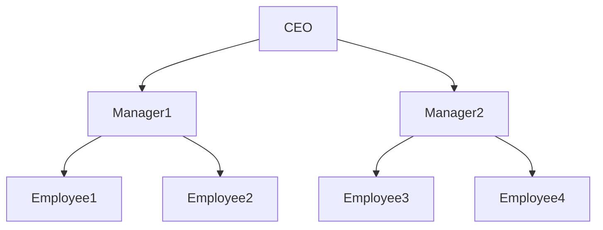

## 12.1 Recursive Queries and Graph Traversal

In the realm of SQL and database management, handling hierarchical and graph-based data structures is a common yet complex task. Recursive queries and graph traversal techniques are pivotal in efficiently managing such data. This section delves into the intricacies of these advanced SQL patterns, providing expert software engineers and architects with the knowledge to implement and optimize these techniques in their database solutions.

### Understanding Recursive Queries

Recursive queries are essential for processing hierarchical data structures, such as organizational charts, file systems, and bill of materials. They allow us to query data that is inherently recursive in nature, using a structured approach.

#### Implementation Using Common Table Expressions (CTEs)

Common Table Expressions (CTEs) provide a powerful way to implement recursive queries in SQL. A recursive CTE consists of two parts: the anchor member and the recursive member. The anchor member initializes the recursion, while the recursive member defines the recursive relationship.

**Example: Organizational Chart**

Consider an organizational chart where each employee reports to a manager. We can represent this hierarchy in a table with columns for employee ID, employee name, and manager ID.

```sql
WITH RECURSIVE OrgChart AS (
    -- Anchor member: Select the top-level manager
    SELECT EmployeeID, EmployeeName, ManagerID, 1 AS Level
    FROM Employees
    WHERE ManagerID IS NULL

    UNION ALL

    -- Recursive member: Select employees reporting to the current level
    SELECT e.EmployeeID, e.EmployeeName, e.ManagerID, oc.Level + 1
    FROM Employees e
    INNER JOIN OrgChart oc ON e.ManagerID = oc.EmployeeID
)
SELECT * FROM OrgChart;
```

In this example, the anchor member selects the top-level manager (where `ManagerID` is `NULL`), and the recursive member joins the `Employees` table with the `OrgChart` CTE to find employees reporting to the current level.

#### Key Concepts in Recursive Queries

- **Anchor Member**: The initial query that sets the starting point for recursion.
- **Recursive Member**: The query that references the CTE itself to continue the recursion.
- **Termination Condition**: Implicitly defined by the recursive member's inability to find more rows to process.

### Graph Traversal Techniques

Graph traversal involves navigating through nodes and edges in a graph structure. SQL databases can handle graph-like data using adjacency lists or specialized graph extensions.

#### Navigating Connected Data Sets

**Adjacency List Model**

The adjacency list model represents graph data using a table where each row contains a node and its adjacent nodes.

**Example: Folder Structure**

```sql
CREATE TABLE Folders (
    FolderID INT PRIMARY KEY,
    FolderName VARCHAR(255),
    ParentFolderID INT
);

WITH RECURSIVE FolderHierarchy AS (
    SELECT FolderID, FolderName, ParentFolderID, 1 AS Depth
    FROM Folders
    WHERE ParentFolderID IS NULL

    UNION ALL

    SELECT f.FolderID, f.FolderName, f.ParentFolderID, fh.Depth + 1
    FROM Folders f
    INNER JOIN FolderHierarchy fh ON f.ParentFolderID = fh.FolderID
)
SELECT * FROM FolderHierarchy;
```

This query retrieves a hierarchical view of folders, starting from the root folder.

#### SQL Graph Extensions

Some RDBMS, like SQL Server and Oracle, offer native support for graph data models, providing specialized features for graph traversal.

**Features of SQL Graph Extensions**

- **Node and Edge Tables**: Separate tables for nodes and edges, allowing for efficient graph representation.
- **Graph-Specific Functions**: Functions to traverse and analyze graph structures, such as shortest path and connectivity.

### Use Cases for Recursive Queries and Graph Traversal

- **Social Networks**: Modeling relationships and connections between users.
- **Recommendation Engines**: Analyzing user preferences and interactions.
- **Network Topology**: Mapping and managing network devices and connections.

### Visualizing Recursive Queries and Graph Traversal

To better understand these concepts, let's visualize a simple organizational chart using a Mermaid.js diagram.



**Diagram Description**: This diagram represents a hierarchical organizational structure, with a CEO at the top, two managers reporting to the CEO, and employees reporting to each manager.

### Design Considerations

- **Performance**: Recursive queries can be resource-intensive. Optimize by indexing key columns and limiting recursion depth.
- **Termination**: Ensure recursive queries have a clear termination condition to prevent infinite loops.
- **Graph Extensions**: Consider using graph extensions for complex graph operations, as they offer optimized performance and additional features.

### Differences and Similarities

Recursive queries and graph traversal share similarities in handling hierarchical data but differ in their approach and use cases. Recursive queries are ideal for tree-like structures, while graph traversal is suited for more complex, interconnected data.

### Try It Yourself

Experiment with the provided examples by modifying the hierarchy or adding new nodes and edges. Observe how changes affect the query results and explore different traversal techniques.

### References and Links

- [MDN Web Docs on SQL](https://developer.mozilla.org/en-US/docs/Web/SQL)
- [W3Schools SQL Tutorial](https://www.w3schools.com/sql/)
- [Microsoft SQL Server Graph Extensions](https://docs.microsoft.com/en-us/sql/graph/sql-graph-overview?view=sql-server-ver15)

### Knowledge Check

- What is the purpose of the anchor member in a recursive CTE?
- How can graph extensions improve graph traversal performance?
- What are some common use cases for recursive queries?

### Embrace the Journey

Remember, mastering recursive queries and graph traversal is a journey. As you explore these techniques, you'll uncover new ways to optimize and enhance your database solutions. Keep experimenting, stay curious, and enjoy the journey!

## Quiz Time!



### What is the primary purpose of a recursive query in SQL?

- [x] To process hierarchical data structures
- [ ] To perform basic CRUD operations
- [ ] To manage transaction control
- [ ] To enforce data integrity

> **Explanation:** Recursive queries are used to process hierarchical data structures, such as organizational charts or folder hierarchies.

### Which SQL feature is commonly used to implement recursive queries?

- [x] Common Table Expressions (CTEs)
- [ ] Stored Procedures
- [ ] Indexes
- [ ] Triggers

> **Explanation:** Common Table Expressions (CTEs) are used to implement recursive queries in SQL.

### What is the role of the anchor member in a recursive CTE?

- [x] It initializes the recursion
- [ ] It terminates the recursion
- [ ] It defines the recursive relationship
- [ ] It optimizes the query

> **Explanation:** The anchor member initializes the recursion by providing the starting point for the recursive query.

### In graph traversal, what does the adjacency list model represent?

- [x] Nodes and their adjacent nodes
- [ ] A single node with multiple edges
- [ ] A complete graph structure
- [ ] A tree hierarchy

> **Explanation:** The adjacency list model represents nodes and their adjacent nodes in a graph structure.

### Which RDBMS offers native support for graph data models?

- [x] SQL Server
- [x] Oracle
- [ ] MySQL
- [ ] SQLite

> **Explanation:** SQL Server and Oracle offer native support for graph data models, providing specialized features for graph traversal.

### What is a common use case for graph traversal in SQL?

- [x] Social networks
- [ ] Basic CRUD operations
- [ ] Transaction management
- [ ] Data normalization

> **Explanation:** Graph traversal is commonly used in social networks to model relationships and connections between users.

### How can you optimize recursive queries for performance?

- [x] Index key columns
- [x] Limit recursion depth
- [ ] Use more joins
- [ ] Avoid using CTEs

> **Explanation:** Optimizing recursive queries involves indexing key columns and limiting recursion depth to improve performance.

### What is a key difference between recursive queries and graph traversal?

- [x] Recursive queries handle tree-like structures, while graph traversal handles interconnected data
- [ ] Recursive queries are faster than graph traversal
- [ ] Graph traversal is only used for social networks
- [ ] Recursive queries are used for basic CRUD operations

> **Explanation:** Recursive queries handle tree-like structures, while graph traversal is suited for interconnected data.

### What should you ensure when designing recursive queries?

- [x] Clear termination condition
- [ ] Use of triggers
- [ ] Multiple anchor members
- [ ] Avoid using indexes

> **Explanation:** Ensuring a clear termination condition is crucial to prevent infinite loops in recursive queries.

### True or False: Graph extensions in SQL provide functions for shortest path analysis.

- [x] True
- [ ] False

> **Explanation:** Graph extensions in SQL provide functions for analyzing graph structures, including shortest path analysis.


