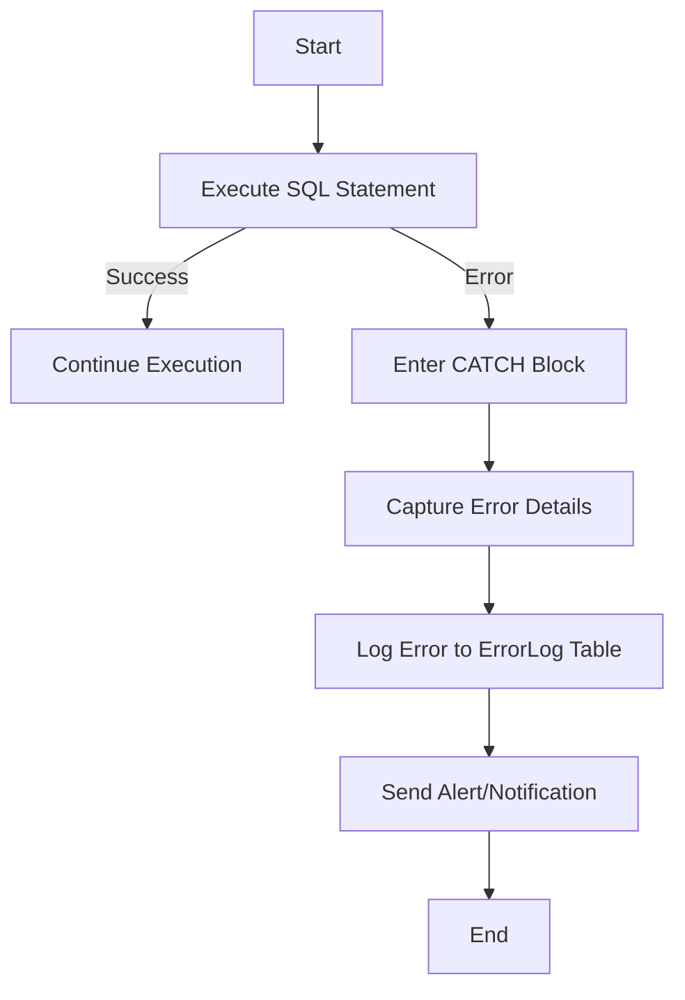

## 12.10 Advanced Error Handling and Logging

In the realm of SQL database management, robust error handling and logging mechanisms are crucial for maintaining the integrity and reliability of your systems. As expert software engineers and architects, understanding and implementing advanced error handling and logging strategies will empower you to create resilient and maintainable database solutions. In this section, we will delve into structured error handling, custom error messages, logging strategies, and monitoring tools to equip you with the knowledge needed to handle errors effectively and keep your systems running smoothly.

### Structured Error Handling

Structured error handling in SQL involves using specific constructs to manage exceptions and ensure that your database operations can gracefully handle unexpected situations. Let's explore some of the key techniques for structured error handling.

#### TRY...CATCH Blocks

The TRY...CATCH construct is a powerful mechanism for handling exceptions within SQL procedures. It allows you to define a block of code to be executed and a separate block to handle any exceptions that occur during execution.

```sql
BEGIN TRY
    -- Attempt to execute a SQL statement
    INSERT INTO Employees (EmployeeID, Name, Position)
    VALUES (101, 'John Doe', 'Developer');
END TRY
BEGIN CATCH
    -- Handle the error
    DECLARE @ErrorMessage NVARCHAR(4000);
    DECLARE @ErrorSeverity INT;
    DECLARE @ErrorState INT;

    SELECT 
        @ErrorMessage = ERROR_MESSAGE(),
        @ErrorSeverity = ERROR_SEVERITY(),
        @ErrorState = ERROR_STATE();

    -- Log the error details
    INSERT INTO ErrorLog (ErrorMessage, ErrorSeverity, ErrorState, ErrorTime)
    VALUES (@ErrorMessage, @ErrorSeverity, @ErrorState, GETDATE());

    -- Optionally, re-throw the error
    THROW;
END CATCH;
```

**Explanation:**
- **TRY Block**: Contains the SQL statements that may cause an error.
- **CATCH Block**: Executes if an error occurs in the TRY block. It captures error details using functions like `ERROR_MESSAGE()`, `ERROR_SEVERITY()`, and `ERROR_STATE()`.
- **Logging**: The error details are inserted into an `ErrorLog` table for further analysis.

### Custom Error Messages

Custom error messages allow you to provide meaningful feedback to users and developers when an error occurs. SQL Server provides the `RAISERROR` and `THROW` statements for generating user-defined error messages.

#### RAISERROR

The `RAISERROR` statement is used to generate an error message with a specific severity level and state.

```sql
RAISERROR ('Custom error message: %s', 16, 1, 'Invalid operation') WITH LOG;
```

**Explanation:**
- **Message**: A custom error message with placeholders for dynamic content.
- **Severity**: An integer value indicating the severity of the error (16 is commonly used for user-defined errors).
- **State**: An integer value that can be used to identify the location in the code where the error occurred.
- **WITH LOG**: Logs the error in the SQL Server error log.

#### THROW

The `THROW` statement is a more modern alternative to `RAISERROR`, introduced in SQL Server 2012. It simplifies error handling by automatically capturing the error message, severity, and state.

```sql
THROW 50001, 'An error occurred while processing your request.', 1;
```

**Explanation:**
- **Error Number**: A user-defined error number (greater than 50000).
- **Message**: A custom error message.
- **State**: An integer value representing the state.

### Logging Strategies

Effective logging strategies are essential for capturing error details and ensuring that you have the information needed to diagnose and resolve issues. Let's explore some common logging strategies.

#### Error Tables

Error tables are dedicated tables used to capture error details for later analysis. They typically include columns for the error message, severity, state, and timestamp.

```sql
CREATE TABLE ErrorLog (
    ErrorLogID INT IDENTITY(1,1) PRIMARY KEY,
    ErrorMessage NVARCHAR(4000),
    ErrorSeverity INT,
    ErrorState INT,
    ErrorTime DATETIME
);
```

**Explanation:**
- **ErrorLogID**: A unique identifier for each error log entry.
- **ErrorMessage**: The error message captured during the exception.
- **ErrorSeverity**: The severity level of the error.
- **ErrorState**: The state of the error.
- **ErrorTime**: The timestamp when the error occurred.

#### Event Logs

Event logs leverage built-in logging mechanisms provided by the database management system. These logs capture a wide range of events, including errors, warnings, and informational messages.

**Example: SQL Server Error Log**

SQL Server maintains an error log that records system-level events, including errors and warnings. You can view the error log using SQL Server Management Studio (SSMS) or query it using T-SQL.

```sql
EXEC xp_readerrorlog;
```

**Explanation:**
- **xp_readerrorlog**: A system stored procedure that reads the SQL Server error log.

### Monitoring Tools

Monitoring tools provide real-time alerts and notifications, enabling you to respond quickly to critical issues. Let's explore some common monitoring tools and techniques.

#### Alerts and Notifications

Alerts and notifications are essential for immediate awareness of critical issues. SQL Server Agent provides a robust alerting mechanism that can be configured to send notifications via email, pager, or other methods.

**Example: Configuring an Alert**

```sql
-- Create an alert for severity 16 errors
EXEC msdb.dbo.sp_add_alert
    @name = N'Severity 16 Error Alert',
    @message_id = 0,
    @severity = 16,
    @notification_message = N'A severity 16 error has occurred.',
    @job_id = NULL;

-- Add a notification to send an email
EXEC msdb.dbo.sp_add_notification
    @alert_name = N'Severity 16 Error Alert',
    @operator_name = N'DBA Operator',
    @notification_method = 1; -- Email
```

**Explanation:**
- **sp_add_alert**: Creates an alert for a specific severity level or error message.
- **sp_add_notification**: Adds a notification method (e.g., email) to the alert.

### Visualizing Error Handling and Logging

To better understand the flow of error handling and logging, let's visualize the process using a flowchart.



**Description:**
- **Start**: The process begins with executing a SQL statement.
- **Execute SQL Statement**: The SQL statement is executed.
- **Success**: If the execution is successful, continue with normal execution.
- **Error**: If an error occurs, enter the CATCH block.
- **Capture Error Details**: Capture error details using SQL functions.
- **Log Error to ErrorLog Table**: Insert error details into the `ErrorLog` table.
- **Send Alert/Notification**: Send an alert or notification to the appropriate personnel.
- **End**: The process ends.

### Try It Yourself

To reinforce your understanding of advanced error handling and logging, try modifying the code examples provided in this section. Experiment with different error scenarios, custom error messages, and logging strategies. Consider creating additional error tables or configuring alerts for different severity levels.

### References and Links

- [SQL Server TRY...CATCH](https://docs.microsoft.com/en-us/sql/t-sql/language-elements/try-catch-transact-sql)
- [RAISERROR (Transact-SQL)](https://docs.microsoft.com/en-us/sql/t-sql/language-elements/raiserror-transact-sql)
- [THROW (Transact-SQL)](https://docs.microsoft.com/en-us/sql/t-sql/language-elements/throw-transact-sql)
- [SQL Server Error Log](https://docs.microsoft.com/en-us/sql/relational-databases/logs/view-the-sql-server-error-log)

### Knowledge Check

1. Explain the purpose of the TRY...CATCH construct in SQL.
2. Describe how custom error messages can be generated using RAISERROR and THROW.
3. Discuss the advantages of using error tables for logging error details.
4. Explain how SQL Server Agent alerts can be configured to send notifications.

### Embrace the Journey

Remember, mastering advanced error handling and logging is an ongoing journey. As you continue to develop your skills, you'll gain a deeper understanding of how to create resilient and maintainable database solutions. Keep experimenting, stay curious, and enjoy the journey!

### Quiz Time!



### What is the primary purpose of TRY...CATCH blocks in SQL?

- [x] To handle exceptions within SQL procedures
- [ ] To optimize query performance
- [ ] To format SQL code
- [ ] To create database backups

> **Explanation:** TRY...CATCH blocks are used to handle exceptions within SQL procedures, allowing for structured error handling.

### Which SQL statement is used to generate custom error messages with a specific severity level?

- [x] RAISERROR
- [ ] SELECT
- [ ] INSERT
- [ ] UPDATE

> **Explanation:** RAISERROR is used to generate custom error messages with a specific severity level and state.

### What is the advantage of using error tables for logging?

- [x] They capture error details for later analysis
- [ ] They improve query performance
- [ ] They reduce database size
- [ ] They enhance data security

> **Explanation:** Error tables capture error details for later analysis, providing valuable information for diagnosing and resolving issues.

### How can SQL Server Agent alerts be configured to send notifications?

- [x] By using the sp_add_alert and sp_add_notification stored procedures
- [ ] By modifying the SQL Server configuration file
- [ ] By creating a new database
- [ ] By executing a SELECT statement

> **Explanation:** SQL Server Agent alerts can be configured using the sp_add_alert and sp_add_notification stored procedures to send notifications via email or other methods.

### What is the role of the THROW statement in SQL?

- [x] To generate custom error messages
- [ ] To create database indexes
- [ ] To execute stored procedures
- [ ] To update table records

> **Explanation:** The THROW statement is used to generate custom error messages, similar to RAISERROR, but with a simpler syntax.

### Which function is used to capture the error message in a CATCH block?

- [x] ERROR_MESSAGE()
- [ ] ERROR_SEVERITY()
- [ ] ERROR_STATE()
- [ ] ERROR_NUMBER()

> **Explanation:** ERROR_MESSAGE() is used to capture the error message in a CATCH block.

### What does the WITH LOG option do in the RAISERROR statement?

- [x] Logs the error in the SQL Server error log
- [ ] Deletes the error log
- [ ] Updates the error log
- [ ] Creates a new error log

> **Explanation:** The WITH LOG option in the RAISERROR statement logs the error in the SQL Server error log.

### Which monitoring tool provides real-time alerts and notifications in SQL Server?

- [x] SQL Server Agent
- [ ] SQL Profiler
- [ ] Database Tuning Advisor
- [ ] SQL Server Management Studio

> **Explanation:** SQL Server Agent provides real-time alerts and notifications, allowing for immediate awareness of critical issues.

### What is the purpose of the xp_readerrorlog stored procedure?

- [x] To read the SQL Server error log
- [ ] To create a new error log
- [ ] To delete the error log
- [ ] To update the error log

> **Explanation:** The xp_readerrorlog stored procedure is used to read the SQL Server error log.

### True or False: The THROW statement was introduced in SQL Server 2012.

- [x] True
- [ ] False

> **Explanation:** The THROW statement was introduced in SQL Server 2012 as a more modern alternative to RAISERROR.


