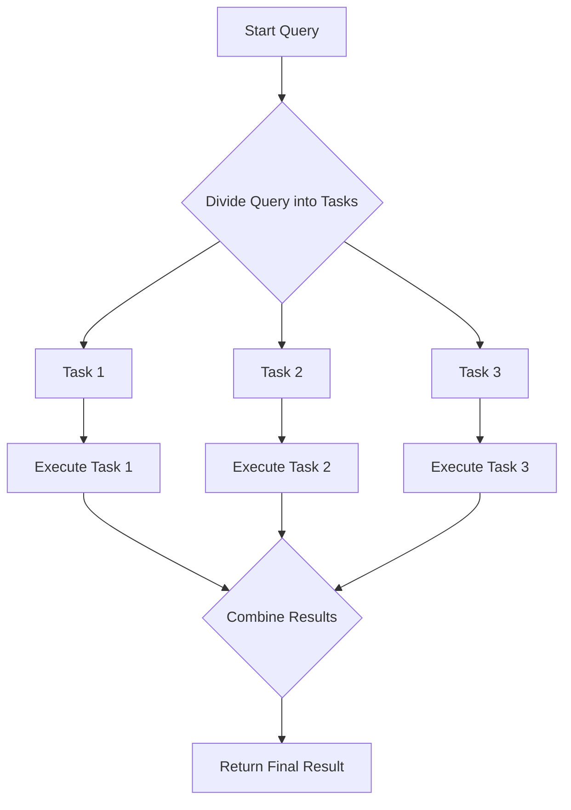

## 12.11 Parallel Query Processing

In the realm of SQL and database management, parallel query processing stands as a pivotal technique for enhancing performance and efficiency. By dividing queries into sub-tasks that can be executed concurrently, this approach leverages the power of modern multi-core processors to reduce query execution time, especially for large datasets. In this section, we will delve into the concept of parallel query processing, its benefits, configuration, limitations, and practical applications.

### Understanding Parallel Query Processing

Parallel query processing involves breaking down a SQL query into smaller, independent tasks that can be executed simultaneously across multiple CPU cores. This technique is particularly beneficial for complex queries that involve large datasets, as it can significantly reduce the time required for execution.

#### Key Concepts

- **Task Division**: Queries are divided into smaller tasks, each of which can be processed independently.
- **Concurrency**: Multiple tasks are executed concurrently, utilizing available CPU cores.
- **Synchronization**: Results from parallel tasks are synchronized and combined to produce the final output.

### Benefits of Parallel Query Processing

Parallel query processing offers several advantages, particularly in environments where performance and efficiency are critical.

#### Performance Enhancement

- **Reduced Execution Time**: By distributing the workload across multiple processors, parallel query processing can dramatically decrease the time required to execute complex queries.
- **Scalability**: As datasets grow, parallel processing allows for scalable performance improvements without requiring significant changes to the underlying database architecture.

#### Resource Utilization

- **Efficient CPU Usage**: By leveraging multiple cores, parallel processing ensures that CPU resources are utilized effectively, preventing idle time and maximizing throughput.

### Configuring Parallel Query Processing

To harness the full potential of parallel query processing, it is essential to configure the system appropriately. This involves setting parameters that control how parallelism is applied.

#### Degree of Parallelism

The degree of parallelism (DOP) refers to the number of processors that can be used to execute a query. Configuring the DOP involves balancing performance gains with resource availability.

- **Setting DOP**: Determine the optimal number of processors based on the system's capabilities and the complexity of the queries.
- **Automatic vs. Manual Configuration**: Some database systems offer automatic configuration of DOP, while others require manual tuning.

#### Example Configuration

```sql
-- Example of setting the degree of parallelism in SQL Server
ALTER DATABASE SCOPED CONFIGURATION
SET MAXDOP = 4; -- Use up to 4 processors for parallel query execution
```

### Limitations of Parallel Query Processing

While parallel query processing offers significant benefits, it also comes with limitations that must be considered.

#### Resource Contention

- **System Bottlenecks**: Overuse of parallel processing can lead to contention for CPU and memory resources, resulting in bottlenecks that degrade overall system performance.

#### Overhead Considerations

- **Parallelism Overhead**: For smaller queries, the overhead associated with managing parallel tasks may outweigh the performance benefits, leading to longer execution times.

### Practical Applications

Parallel query processing is widely used in various applications where performance and efficiency are paramount.

#### Data Warehousing

In data warehousing environments, parallel query processing is essential for handling large volumes of data and complex analytical queries.

- **Example**: Executing a complex aggregation query across a large dataset can be significantly accelerated using parallel processing.

#### Real-Time Analytics

For real-time analytics applications, parallel query processing enables rapid data retrieval and analysis, supporting timely decision-making.

### Code Example: Parallel Query Execution

Let's explore a practical example of parallel query processing using SQL Server.

```sql
-- Example of a parallel query execution in SQL Server
SELECT OrderID, SUM(Quantity) AS TotalQuantity
FROM Orders
GROUP BY OrderID
OPTION (MAXDOP 4); -- Use up to 4 processors for this query
```

In this example, the `OPTION (MAXDOP 4)` hint instructs SQL Server to use up to four processors to execute the query, potentially reducing execution time.

### Visualizing Parallel Query Processing

To better understand how parallel query processing works, let's visualize the process using a flowchart.



**Figure 1: Parallel Query Processing Flowchart**

This flowchart illustrates the process of dividing a query into tasks, executing them concurrently, and combining the results to produce the final output.

### Try It Yourself

To gain hands-on experience with parallel query processing, try modifying the code example provided. Experiment with different degrees of parallelism and observe the impact on query performance.

### References and Further Reading

- [Microsoft Docs: Parallel Query Processing](https://docs.microsoft.com/en-us/sql/relational-databases/performance/parallel-query-processing)
- [Oracle Database: Parallel Execution](https://docs.oracle.com/en/database/oracle/oracle-database/19/dwhsg/parallel-execution.html)
- [PostgreSQL: Parallel Query](https://www.postgresql.org/docs/current/parallel-query.html)

### Knowledge Check

To reinforce your understanding of parallel query processing, consider the following questions and exercises.

- What are the key benefits of parallel query processing?
- How does the degree of parallelism affect query performance?
- Experiment with different configurations of parallel query processing in your database system.

### Embrace the Journey

Remember, mastering parallel query processing is a journey. As you explore and experiment with different configurations and applications, you'll gain deeper insights into optimizing SQL performance. Stay curious, keep learning, and enjoy the process!

## Quiz Time!



### What is the primary benefit of parallel query processing?

- [x] Reduced query execution time
- [ ] Increased query complexity
- [ ] Simplified query syntax
- [ ] Enhanced data security

> **Explanation:** The primary benefit of parallel query processing is reduced query execution time, especially for large datasets.

### What does the degree of parallelism (DOP) refer to?

- [x] The number of processors used for query execution
- [ ] The number of queries executed simultaneously
- [ ] The size of the dataset being queried
- [ ] The complexity of the query syntax

> **Explanation:** The degree of parallelism (DOP) refers to the number of processors used to execute a query.

### What is a potential limitation of parallel query processing?

- [x] Resource contention
- [ ] Simplified query syntax
- [ ] Enhanced data security
- [ ] Increased query complexity

> **Explanation:** A potential limitation of parallel query processing is resource contention, which can lead to system bottlenecks.

### How can parallel query processing be configured in SQL Server?

- [x] Using the MAXDOP option
- [ ] Using the SELECT * syntax
- [ ] Using the JOIN clause
- [ ] Using the WHERE clause

> **Explanation:** In SQL Server, parallel query processing can be configured using the MAXDOP option.

### What is the role of synchronization in parallel query processing?

- [x] Combining results from parallel tasks
- [ ] Dividing queries into tasks
- [ ] Executing tasks concurrently
- [ ] Simplifying query syntax

> **Explanation:** Synchronization in parallel query processing involves combining results from parallel tasks to produce the final output.

### Why might parallelism overhead negate benefits for smaller queries?

- [x] The overhead of managing parallel tasks can outweigh performance gains
- [ ] Smaller queries are inherently complex
- [ ] Parallelism is only beneficial for security
- [ ] Smaller queries require more processors

> **Explanation:** For smaller queries, the overhead of managing parallel tasks can outweigh the performance gains, making parallelism less beneficial.

### In which environment is parallel query processing particularly beneficial?

- [x] Data warehousing
- [ ] Small-scale applications
- [ ] Simple CRUD operations
- [ ] Static websites

> **Explanation:** Parallel query processing is particularly beneficial in data warehousing environments where large volumes of data are handled.

### What is a common use case for parallel query processing?

- [x] Real-time analytics
- [ ] Static content delivery
- [ ] Simple CRUD operations
- [ ] Basic arithmetic calculations

> **Explanation:** A common use case for parallel query processing is real-time analytics, where rapid data retrieval and analysis are required.

### Which SQL hint is used to specify the degree of parallelism in SQL Server?

- [x] OPTION (MAXDOP)
- [ ] OPTION (JOIN)
- [ ] OPTION (SELECT)
- [ ] OPTION (WHERE)

> **Explanation:** The OPTION (MAXDOP) hint is used in SQL Server to specify the degree of parallelism for a query.

### True or False: Parallel query processing always results in faster query execution.

- [ ] True
- [x] False

> **Explanation:** False. While parallel query processing can result in faster execution for large queries, the overhead may negate benefits for smaller queries.


