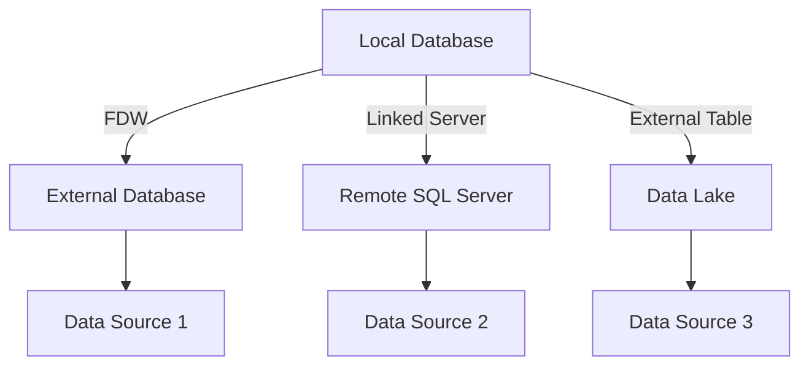

## 12.12 Working with External Data Sources

In today's interconnected world, databases rarely operate in isolation. The ability to access and integrate data from external sources is crucial for building comprehensive and dynamic applications. This section delves into the advanced SQL patterns that enable seamless interaction with external data sources, focusing on Foreign Data Wrappers, Linked Servers, and External Tables. We will explore their purposes, functionalities, and considerations, including performance and security aspects.

### Foreign Data Wrappers

**Purpose**: Foreign Data Wrappers (FDWs) allow SQL databases to access data from various external sources, such as other databases, files, or web services, as if they were local tables. This capability is particularly useful for integrating disparate data systems without the need for complex ETL processes.

#### Key Concepts

- **Data Virtualization**: FDWs provide a virtual view of external data, enabling queries without physically importing the data.
- **Extensibility**: Many databases, like PostgreSQL, support FDWs, allowing developers to create custom wrappers for specific data sources.

#### Implementation

To demonstrate the use of FDWs, let's consider PostgreSQL, which offers robust support for this feature.

```sql
-- Load the foreign data wrapper extension
CREATE EXTENSION postgres_fdw;

-- Create a server object for the external data source
CREATE SERVER foreign_server
  FOREIGN DATA WRAPPER postgres_fdw
  OPTIONS (host 'remote_host', dbname 'remote_db', port '5432');

-- Create a user mapping for authentication
CREATE USER MAPPING FOR local_user
  SERVER foreign_server
  OPTIONS (user 'remote_user', password 'remote_password');

-- Import foreign schema or tables
IMPORT FOREIGN SCHEMA public
  FROM SERVER foreign_server
  INTO local_schema;
```

In this example, we establish a connection to a remote PostgreSQL database, allowing us to query its tables as if they were part of the local database.

#### Design Considerations

- **Performance**: Query performance can be affected by network latency and the performance of the external data source. Optimize queries and consider caching strategies where possible.
- **Security**: Ensure secure transmission of credentials and data. Use encrypted connections and manage permissions carefully.

### Linked Servers

**Functionality**: In SQL Server, Linked Servers enable querying data from OLE DB data sources, such as other SQL Server instances, Oracle databases, or even Excel files. This feature facilitates cross-database queries and data integration.

#### Key Concepts

- **Distributed Queries**: Linked Servers allow executing queries across multiple databases, enabling data aggregation and analysis from diverse sources.
- **OLE DB Providers**: SQL Server uses OLE DB providers to communicate with different data sources.

#### Implementation

Here's how to set up a Linked Server in SQL Server:

```sql
-- Create a linked server
EXEC sp_addlinkedserver 
  @server = 'RemoteServer', 
  @srvproduct = '', 
  @provider = 'SQLNCLI', 
  @datasrc = 'remote_host';

-- Configure login mapping
EXEC sp_addlinkedsrvlogin 
  @rmtsrvname = 'RemoteServer', 
  @useself = 'false', 
  @rmtuser = 'remote_user', 
  @rmtpassword = 'remote_password';

-- Query the linked server
SELECT * FROM RemoteServer.remote_db.dbo.remote_table;
```

This setup allows querying a remote SQL Server instance as if it were part of the local server.

#### Design Considerations

- **Performance**: Distributed queries can be resource-intensive. Optimize by filtering data at the source and minimizing data transfer.
- **Security**: Manage credentials securely and restrict access to linked servers to authorized users only.

### External Tables

**Usage**: External Tables are used in databases like Oracle and SQL Data Warehouse to query data stored in external files, such as CSV or Parquet, without loading them into the database. This approach is ideal for handling large datasets efficiently.

#### Key Concepts

- **Data Lake Integration**: External Tables enable seamless querying of data stored in data lakes or cloud storage.
- **Schema-on-Read**: Unlike traditional tables, external tables apply schema definitions at query time, allowing flexible data exploration.

#### Implementation

Let's explore how to create an External Table in Oracle:

```sql
-- Create a directory object for the external file
CREATE DIRECTORY ext_dir AS '/path/to/external/files';

-- Define the external table
CREATE TABLE external_table (
  id NUMBER,
  name VARCHAR2(50),
  data_date DATE
)
ORGANIZATION EXTERNAL (
  TYPE ORACLE_LOADER
  DEFAULT DIRECTORY ext_dir
  ACCESS PARAMETERS (
    RECORDS DELIMITED BY NEWLINE
    FIELDS TERMINATED BY ','
    MISSING FIELD VALUES ARE NULL
  )
  LOCATION ('data.csv')
);

-- Query the external table
SELECT * FROM external_table;
```

This setup allows querying a CSV file as if it were a regular table in Oracle.

#### Design Considerations

- **Performance**: External Tables are read-only and rely on the performance of the underlying storage system. Optimize by indexing and partitioning where applicable.
- **Security**: Ensure secure access to external files and directories. Use access controls and encryption to protect sensitive data.

### Considerations for Working with External Data Sources

#### Performance

- **Network Latency**: Minimize latency by optimizing network configurations and using efficient data transfer protocols.
- **Source Performance**: The performance of external queries is often limited by the capabilities of the source system. Monitor and optimize source systems to improve query performance.

#### Security

- **Credential Management**: Use secure methods for storing and transmitting credentials. Consider using environment variables or secure vaults.
- **Access Control**: Implement strict access controls to ensure only authorized users can query external data sources.
- **Data Encryption**: Use encryption for data in transit and at rest to protect sensitive information.

### Visualizing External Data Source Integration

To better understand how these components interact, let's visualize the integration of external data sources using a Mermaid.js diagram.



**Diagram Description**: This diagram illustrates how a local database can integrate with various external data sources using Foreign Data Wrappers, Linked Servers, and External Tables. Each arrow represents a connection method, highlighting the flexibility and power of SQL in accessing diverse data environments.

### Try It Yourself

Experiment with the provided code examples by modifying connection parameters, querying different tables, or integrating additional data sources. Consider setting up a test environment to explore the impact of network latency and security configurations on query performance.

### References and Further Reading

- [PostgreSQL Foreign Data Wrappers](https://www.postgresql.org/docs/current/postgres-fdw.html)
- [SQL Server Linked Servers](https://docs.microsoft.com/en-us/sql/relational-databases/linked-servers/linked-servers-database-engine)
- [Oracle External Tables](https://docs.oracle.com/en/database/oracle/oracle-database/19/sqlrf/CREATE-TABLE.html#GUID-5A8C3A1A-6B3F-4C1A-8D3D-1A5F3E3B3B7C)

### Knowledge Check

- Explain the purpose of Foreign Data Wrappers and how they facilitate data integration.
- Demonstrate setting up a Linked Server in SQL Server and querying data from a remote source.
- Provide an example of using External Tables in Oracle to query data from a CSV file.
- Discuss the performance and security considerations when working with external data sources.

### Embrace the Journey

Remember, integrating external data sources is a powerful capability that enhances the versatility of your database systems. As you experiment and learn, you'll uncover new ways to leverage SQL's capabilities to build robust, scalable, and secure data architectures. Keep exploring, stay curious, and enjoy the journey!

## Quiz Time!



### What is the primary purpose of Foreign Data Wrappers?

- [x] To access external data sources as if they were local tables
- [ ] To create backups of local databases
- [ ] To encrypt data within the database
- [ ] To manage user permissions

> **Explanation:** Foreign Data Wrappers allow SQL databases to access external data sources as if they were local tables, facilitating data integration.

### Which SQL Server feature allows querying data from OLE DB data sources?

- [ ] Foreign Data Wrappers
- [x] Linked Servers
- [ ] External Tables
- [ ] Data Views

> **Explanation:** Linked Servers in SQL Server enable querying data from OLE DB data sources, such as other databases or files.

### What is a key advantage of using External Tables?

- [x] They allow querying external files without loading them into the database
- [ ] They automatically optimize queries for performance
- [ ] They provide built-in encryption for data
- [ ] They simplify user authentication

> **Explanation:** External Tables allow querying data stored in external files without importing them into the database, making them ideal for large datasets.

### What is a common performance consideration when working with external data sources?

- [ ] Data redundancy
- [x] Network latency
- [ ] User authentication
- [ ] Data encryption

> **Explanation:** Network latency can impact the performance of queries against external data sources, making it a key consideration.

### How can security be enhanced when working with external data sources?

- [x] By using encrypted connections and managing permissions carefully
- [ ] By storing credentials in plain text
- [ ] By allowing unrestricted access to all users
- [ ] By disabling user authentication

> **Explanation:** Security can be enhanced by using encrypted connections and managing permissions carefully to protect sensitive data.

### Which of the following is NOT a method for integrating external data sources?

- [ ] Foreign Data Wrappers
- [ ] Linked Servers
- [ ] External Tables
- [x] Data Encryption

> **Explanation:** Data Encryption is a security measure, not a method for integrating external data sources.

### What is the role of OLE DB providers in SQL Server?

- [x] To facilitate communication with different data sources
- [ ] To encrypt data within the database
- [ ] To manage user permissions
- [ ] To create backups of databases

> **Explanation:** OLE DB providers facilitate communication with different data sources in SQL Server, enabling Linked Servers.

### What does the term "Schema-on-Read" refer to?

- [x] Applying schema definitions at query time
- [ ] Storing schema definitions within the database
- [ ] Encrypting schema information
- [ ] Creating schema backups

> **Explanation:** "Schema-on-Read" refers to applying schema definitions at query time, allowing flexible data exploration.

### True or False: External Tables are read-only.

- [x] True
- [ ] False

> **Explanation:** External Tables are read-only, meaning they allow querying but not modifying the external data.

### Which diagramming tool is used to visualize the integration of external data sources in this guide?

- [ ] UML
- [ ] Visio
- [x] Mermaid.js
- [ ] Lucidchart

> **Explanation:** Mermaid.js is used in this guide to create diagrams that visualize the integration of external data sources.


