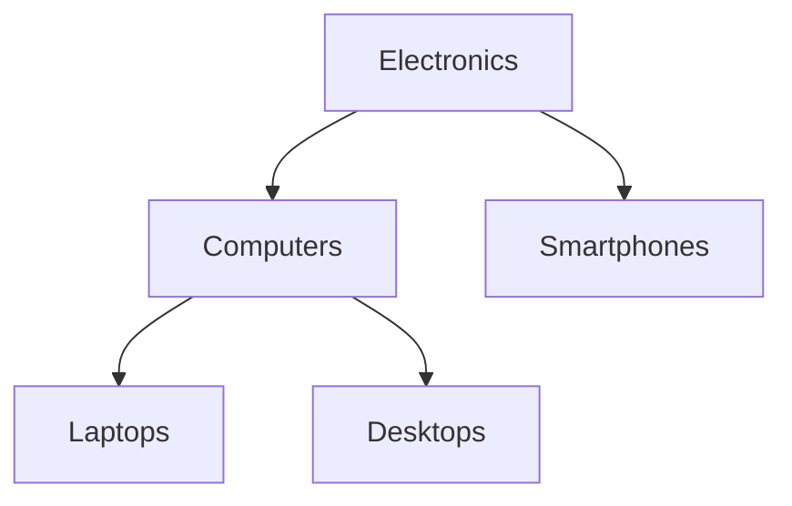

## 12.2 Handling Hierarchical and Network Data

In the realm of database design, handling hierarchical and network data efficiently is crucial for building robust applications. Hierarchical data structures, such as organizational charts, file systems, and product categories, are common in many applications. Similarly, network data structures, like social networks and transportation systems, require specialized handling to ensure efficient querying and management.

In this section, we will explore various models and techniques for managing hierarchical and network data in SQL databases. We will delve into the following models:

- **Adjacency List**: Each record contains a reference to its parent.
- **Nested Sets**: Representing hierarchy using left and right boundaries.
- **Materialized Path**: Storing the full path from the root to each node.
- **Closure Table**: A separate table that stores all ancestor-descendant relationships.

We will also discuss considerations such as performance and complexity, helping you choose the right model based on your application's read/write patterns and data update requirements.

### Understanding Hierarchical Data

Hierarchical data is structured in a tree-like format, where each node has a parent-child relationship. This structure is prevalent in various domains, such as:

- **Organizational Structures**: Employees reporting to managers.
- **Product Categories**: Subcategories nested under main categories.
- **File Systems**: Directories containing subdirectories and files.

### Models for Handling Hierarchical Data

#### 1. Adjacency List

**Intent**: The adjacency list model is the simplest way to represent hierarchical data. Each record in the table contains a reference to its parent node.

**Key Participants**:
- **Node**: Represents an entity in the hierarchy.
- **Parent**: A reference to the node's parent.

**Sample Code Snippet**:

```sql
CREATE TABLE categories (
    id INT PRIMARY KEY,
    name VARCHAR(255),
    parent_id INT,
    FOREIGN KEY (parent_id) REFERENCES categories(id)
);

-- Insert sample data
INSERT INTO categories (id, name, parent_id) VALUES
(1, 'Electronics', NULL),
(2, 'Computers', 1),
(3, 'Laptops', 2),
(4, 'Desktops', 2),
(5, 'Smartphones', 1);
```

**Design Considerations**:
- **Simplicity**: Easy to implement and understand.
- **Query Complexity**: Recursive queries are needed to retrieve hierarchical data.

**Applicability**: Use when the hierarchy is shallow and changes infrequently.

**Visualizing Adjacency List Model**:



#### 2. Nested Sets

**Intent**: The nested sets model represents hierarchical data using left and right boundaries, allowing efficient querying of entire subtrees.

**Key Participants**:
- **Node**: Represents an entity in the hierarchy.
- **Left and Right Boundaries**: Define the position of the node in the hierarchy.

**Sample Code Snippet**:

```sql
CREATE TABLE nested_categories (
    id INT PRIMARY KEY,
    name VARCHAR(255),
    lft INT,
    rgt INT
);

-- Insert sample data
INSERT INTO nested_categories (id, name, lft, rgt) VALUES
(1, 'Electronics', 1, 10),
(2, 'Computers', 2, 7),
(3, 'Laptops', 3, 4),
(4, 'Desktops', 5, 6),
(5, 'Smartphones', 8, 9);
```

**Design Considerations**:
- **Efficiency**: Fast retrieval of subtrees.
- **Complexity**: Updates require recalculating boundaries.

**Applicability**: Suitable for read-heavy applications where the hierarchy changes infrequently.

**Visualizing Nested Sets Model**:


#### 3. Materialized Path

**Intent**: The materialized path model stores the full path from the root to each node, simplifying certain queries.

**Key Participants**:
- **Node**: Represents an entity in the hierarchy.
- **Path**: A string representing the path from the root to the node.

**Sample Code Snippet**:

```sql
CREATE TABLE path_categories (
    id INT PRIMARY KEY,
    name VARCHAR(255),
    path VARCHAR(255)
);

-- Insert sample data
INSERT INTO path_categories (id, name, path) VALUES
(1, 'Electronics', '/1/'),
(2, 'Computers', '/1/2/'),
(3, 'Laptops', '/1/2/3/'),
(4, 'Desktops', '/1/2/4/'),
(5, 'Smartphones', '/1/5/');
```

**Design Considerations**:
- **Simplicity**: Easy to implement and query.
- **Scalability**: Path strings can become long in deep hierarchies.

**Applicability**: Ideal for applications where hierarchy depth is limited.

**Visualizing Materialized Path Model**:


#### 4. Closure Table

**Intent**: The closure table model stores all ancestor-descendant relationships in a separate table, allowing efficient querying of hierarchical data.

**Key Participants**:
- **Node**: Represents an entity in the hierarchy.
- **Ancestor-Descendant Relationship**: A record in the closure table.

**Sample Code Snippet**:

```sql
CREATE TABLE closure_table (
    ancestor INT,
    descendant INT,
    PRIMARY KEY (ancestor, descendant)
);

-- Insert sample data
INSERT INTO closure_table (ancestor, descendant) VALUES
(1, 1), (1, 2), (1, 3), (1, 4), (1, 5),
(2, 2), (2, 3), (2, 4),
(3, 3),
(4, 4),
(5, 5);
```

**Design Considerations**:
- **Flexibility**: Supports complex queries efficiently.
- **Complexity**: Requires maintaining a separate table.

**Applicability**: Best for complex hierarchies with frequent updates.

**Visualizing Closure Table Model**:


### Considerations for Choosing a Model

When selecting a model for handling hierarchical data, consider the following factors:

- **Performance**: Evaluate the read and write patterns of your application. Some models are optimized for fast reads, while others handle updates more efficiently.
- **Complexity**: Balance the simplicity of queries against the overhead of maintaining the data structure.
- **Scalability**: Consider the depth and breadth of the hierarchy. Some models handle deep hierarchies better than others.
- **Flexibility**: Determine the need for complex queries, such as retrieving all descendants or ancestors of a node.

### Handling Network Data

Network data structures, such as social networks and transportation systems, require specialized handling to manage relationships between nodes efficiently. SQL databases can handle network data using techniques such as:

- **Graph Databases**: Specialized databases designed for network data.
- **Recursive Queries**: SQL queries that traverse relationships between nodes.

### Conclusion

Handling hierarchical and network data in SQL requires careful consideration of the data model and query patterns. By understanding the strengths and limitations of each model, you can design efficient and scalable database solutions that meet the needs of your application.

Remember, this is just the beginning. As you progress, you'll build more complex and interactive data models. Keep experimenting, stay curious, and enjoy the journey!

## Quiz Time!



### Which model uses left and right boundaries to represent hierarchy?

- [ ] Adjacency List
- [x] Nested Sets
- [ ] Materialized Path
- [ ] Closure Table

> **Explanation:** The Nested Sets model uses left and right boundaries to represent hierarchy, allowing efficient querying of entire subtrees.

### What is a key advantage of the Closure Table model?

- [ ] Simplicity
- [ ] Fast updates
- [x] Efficient complex queries
- [ ] Short path strings

> **Explanation:** The Closure Table model supports efficient complex queries by storing all ancestor-descendant relationships in a separate table.

### Which model is best for shallow hierarchies with infrequent changes?

- [x] Adjacency List
- [ ] Nested Sets
- [ ] Materialized Path
- [ ] Closure Table

> **Explanation:** The Adjacency List model is suitable for shallow hierarchies with infrequent changes due to its simplicity.

### What is a potential drawback of the Materialized Path model?

- [ ] Complex queries
- [ ] Slow reads
- [x] Long path strings
- [ ] Frequent updates

> **Explanation:** The Materialized Path model can result in long path strings in deep hierarchies, which may impact scalability.

### Which model requires maintaining a separate table for ancestor-descendant relationships?

- [ ] Adjacency List
- [ ] Nested Sets
- [ ] Materialized Path
- [x] Closure Table

> **Explanation:** The Closure Table model requires maintaining a separate table for ancestor-descendant relationships.

### What is a common use case for hierarchical data?

- [x] Organizational structures
- [ ] Social networks
- [ ] Transportation systems
- [ ] Graph databases

> **Explanation:** Hierarchical data is commonly used in organizational structures, where employees report to managers.

### Which model is optimized for fast retrieval of subtrees?

- [ ] Adjacency List
- [x] Nested Sets
- [ ] Materialized Path
- [ ] Closure Table

> **Explanation:** The Nested Sets model is optimized for fast retrieval of subtrees due to its use of left and right boundaries.

### What is a key consideration when choosing a model for hierarchical data?

- [ ] Database vendor
- [x] Read/write patterns
- [ ] User interface
- [ ] Programming language

> **Explanation:** When choosing a model for hierarchical data, consider the read/write patterns of your application to ensure optimal performance.

### Which model stores the full path from the root to each node?

- [ ] Adjacency List
- [ ] Nested Sets
- [x] Materialized Path
- [ ] Closure Table

> **Explanation:** The Materialized Path model stores the full path from the root to each node, simplifying certain queries.

### True or False: Graph databases are specialized for handling network data.

- [x] True
- [ ] False

> **Explanation:** Graph databases are specialized for handling network data, providing efficient management of relationships between nodes.


