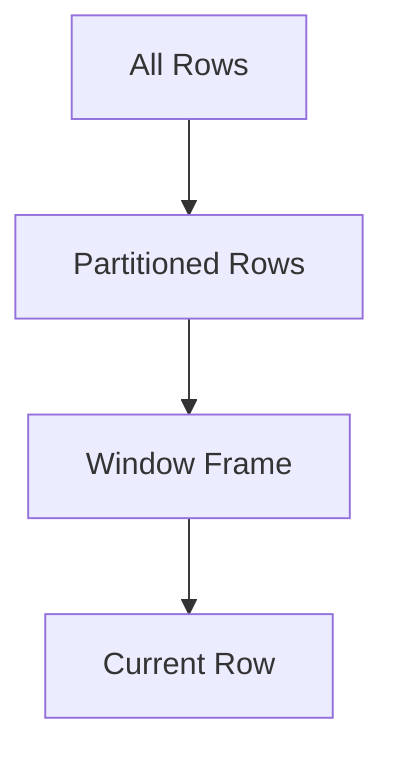

## 12.3 Advanced Window Functions

In the realm of SQL, window functions stand out as a powerful tool for performing complex calculations across sets of rows related to the current row. These functions are indispensable for expert developers and architects aiming to enhance their data analysis capabilities. In this section, we will delve into advanced window functions, exploring their features, applications, and best practices.

### Understanding Window Functions

Window functions allow you to perform calculations across a set of table rows that are somehow related to the current row. Unlike aggregate functions, which return a single value for a group of rows, window functions return a value for each row in the result set.

#### Key Concepts

- **Window**: A set of rows defined by the `OVER()` clause.
- **Partition**: A subset of rows within the window, similar to a group in aggregate functions.
- **Frame**: A subset of rows within the partition, defined by the `ROWS` or `RANGE` clause.

### Analytic Functions

Analytic functions are a subset of window functions that compute an aggregate value based on a group of rows. They are particularly useful for ranking, moving averages, and cumulative sums.

#### Common Analytic Functions

1. **RANK()**: Assigns a unique rank to each distinct row within a partition of a result set.
2. **DENSE_RANK()**: Similar to `RANK()`, but without gaps in ranking values.
3. **NTILE(n)**: Divides the result set into `n` buckets and assigns a bucket number to each row.
4. **LAG()**: Provides access to a row at a given physical offset that comes before the current row.
5. **LEAD()**: Provides access to a row at a given physical offset that comes after the current row.

#### Example: Using RANK() and DENSE_RANK()

```sql
SELECT employee_id, salary,
       RANK() OVER (ORDER BY salary DESC) AS rank,
       DENSE_RANK() OVER (ORDER BY salary DESC) AS dense_rank
FROM employees;
```

In this example, `RANK()` and `DENSE_RANK()` are used to assign ranks to employees based on their salaries. Notice how `DENSE_RANK()` does not skip any ranks when there are ties.

### Framing with ROWS and RANGE

Framing allows you to define a subset of rows within a partition to perform calculations. The `ROWS` and `RANGE` clauses specify the frame.

- **ROWS**: Defines the frame in terms of physical offsets.
- **RANGE**: Defines the frame in terms of logical offsets.

#### Example: Using ROWS and RANGE

```sql
SELECT order_id, order_date, amount,
       SUM(amount) OVER (ORDER BY order_date ROWS BETWEEN 2 PRECEDING AND CURRENT ROW) AS moving_sum
FROM orders;
```

In this example, `ROWS BETWEEN 2 PRECEDING AND CURRENT ROW` calculates a moving sum of the current row and the two preceding rows.

### Applications of Window Functions

Window functions are versatile and can be applied in various scenarios, including time-series analysis and data ranking.

#### Time-Series Analysis

Window functions are ideal for time-series analysis, allowing you to compute moving averages, cumulative sums, and other metrics over time.

##### Example: Moving Average

```sql
SELECT order_date, amount,
       AVG(amount) OVER (ORDER BY order_date ROWS BETWEEN 4 PRECEDING AND CURRENT ROW) AS moving_average
FROM orders;
```

This query calculates a moving average of the `amount` over the current row and the four preceding rows, providing insights into trends over time.

#### Data Ranking

Ranking data within partitions is another common application of window functions. This is useful for generating leaderboards, percentiles, and other ranked data.

##### Example: Percentile Ranking

```sql
SELECT employee_id, salary,
       PERCENT_RANK() OVER (ORDER BY salary DESC) AS percentile_rank
FROM employees;
```

Here, `PERCENT_RANK()` calculates the percentile rank of each employee based on their salary, which can be useful for performance evaluations.

### Best Practices for Using Window Functions

1. **Optimize Performance**: Window functions can be resource-intensive. Use indexes and partitions wisely to optimize performance.
2. **Understand Frame Boundaries**: Clearly define frame boundaries to ensure accurate calculations.
3. **Combine with Other Functions**: Leverage window functions in conjunction with other SQL functions for more complex analyses.

### Visualizing Window Functions

To better understand how window functions operate, let's visualize the concept of a window frame using a diagram.



**Diagram Description**: This diagram illustrates how window functions operate on a subset of rows (window frame) within a partition, focusing on the current row for calculations.

### Try It Yourself

Experiment with the following code examples to deepen your understanding of window functions:

1. Modify the `ROWS` clause to use different offsets and observe the changes in results.
2. Combine `LAG()` and `LEAD()` with other analytic functions to create complex calculations.

### References and Further Reading

- [SQL Window Functions Explained](https://www.sqlshack.com/sql-window-functions/)
- [Advanced SQL Window Functions](https://www.red-gate.com/simple-talk/sql/t-sql-programming/advanced-sql-window-functions/)

### Knowledge Check

Let's reinforce your understanding with a few questions:

1. What is the difference between `RANK()` and `DENSE_RANK()`?
2. How does the `ROWS` clause differ from the `RANGE` clause?
3. Provide an example of a scenario where window functions would be beneficial.

### Embrace the Journey

Remember, mastering window functions is a journey. As you continue to experiment and apply these functions, you'll unlock new insights and capabilities in your data analysis tasks. Keep exploring, stay curious, and enjoy the journey!

## Quiz Time!



### What is the primary purpose of window functions in SQL?

- [x] To perform calculations across sets of rows related to the current row
- [ ] To aggregate data into a single result
- [ ] To filter rows based on conditions
- [ ] To join tables

> **Explanation:** Window functions allow calculations across a set of rows related to the current row, unlike aggregate functions that return a single value for a group of rows.

### Which function assigns a unique rank to each distinct row within a partition?

- [x] RANK()
- [ ] DENSE_RANK()
- [ ] NTILE()
- [ ] LAG()

> **Explanation:** RANK() assigns a unique rank to each distinct row within a partition, with possible gaps in ranking values.

### What does the `ROWS` clause define in a window function?

- [x] The frame in terms of physical offsets
- [ ] The frame in terms of logical offsets
- [ ] The partition of rows
- [ ] The order of rows

> **Explanation:** The `ROWS` clause defines the frame in terms of physical offsets, specifying the subset of rows for calculations.

### Which function provides access to a row at a given physical offset before the current row?

- [x] LAG()
- [ ] LEAD()
- [ ] NTILE()
- [ ] RANK()

> **Explanation:** LAG() provides access to a row at a given physical offset before the current row, useful for comparisons with previous rows.

### How can window functions be optimized for performance?

- [x] By using indexes and partitions wisely
- [ ] By avoiding the use of analytic functions
- [ ] By using only aggregate functions
- [ ] By limiting the number of columns selected

> **Explanation:** Optimizing window functions involves using indexes and partitions wisely to enhance performance.

### What is the purpose of the `PERCENT_RANK()` function?

- [x] To calculate the percentile rank of each row within a partition
- [ ] To assign a unique rank to each row
- [ ] To divide the result set into buckets
- [ ] To provide access to a row after the current row

> **Explanation:** PERCENT_RANK() calculates the percentile rank of each row within a partition, useful for performance evaluations.

### Which clause is used to define a subset of rows within a partition?

- [x] OVER()
- [ ] WHERE
- [ ] GROUP BY
- [ ] HAVING

> **Explanation:** The OVER() clause is used to define a subset of rows within a partition for window functions.

### What is a common application of window functions?

- [x] Time-series analysis
- [ ] Data insertion
- [ ] Table creation
- [ ] Indexing

> **Explanation:** Window functions are commonly used for time-series analysis, allowing calculations like moving averages and cumulative sums.

### True or False: Window functions return a single value for a group of rows.

- [ ] True
- [x] False

> **Explanation:** False. Window functions return a value for each row in the result set, unlike aggregate functions that return a single value for a group of rows.

### Which function divides the result set into `n` buckets?

- [x] NTILE(n)
- [ ] RANK()
- [ ] DENSE_RANK()
- [ ] LEAD()

> **Explanation:** NTILE(n) divides the result set into `n` buckets and assigns a bucket number to each row.


