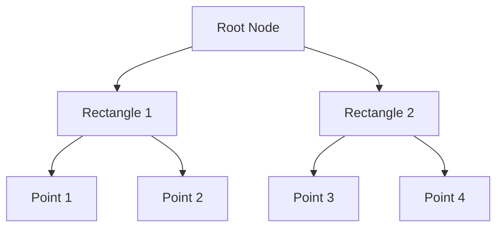

## 12.4 Geospatial Data Types and Queries

In the realm of modern database systems, geospatial data types and queries have become indispensable for applications that require spatial intelligence. From mapping services to location-based applications, the ability to store, query, and manipulate spatial data is crucial. In this section, we delve into the geospatial capabilities of SQL, focusing on data types, spatial indexing, and the powerful functions that enable complex spatial operations.

### Geospatial Support in SQL

Geospatial data refers to information that describes objects, events, or phenomena with a location on the earth's surface. SQL databases have evolved to support geospatial data types and operations, allowing developers to build applications that can efficiently handle spatial data.

#### Data Types: Geometry and Geography

SQL databases typically support two primary geospatial data types: **Geometry** and **Geography**.

- **Geometry Data Type**: This data type is used for planar (flat) spatial data. It is suitable for applications where the curvature of the earth can be ignored, such as city planning or small-scale mapping. The geometry data type supports various shapes like points, lines, polygons, and multi-geometries.

- **Geography Data Type**: This data type is used for spherical spatial data, taking into account the earth's curvature. It is ideal for applications that require accurate distance and area calculations over large distances, such as global mapping services or navigation systems.

#### Spatial Indexing

Spatial indexing is a critical component for optimizing the performance of spatial queries. Without indexing, spatial queries can be computationally expensive and slow. SQL databases offer spatial indexes, such as R-trees, to efficiently manage and query spatial data.

- **R-Tree Index**: An R-tree is a tree data structure used for indexing multi-dimensional information such as geographical coordinates. It allows for efficient querying of spatial data by organizing it into a hierarchy of nested rectangles.

### Spatial Functions

SQL provides a rich set of spatial functions that enable complex geospatial operations. These functions are essential for performing calculations and analyses on spatial data.

#### Calculations

- **Distance**: Calculate the distance between two spatial objects. This is crucial for applications like route planning and proximity searches.
  
  ```sql
  SELECT ST_Distance(geometry1, geometry2) AS distance
  FROM spatial_table;
  ```

- **Area**: Compute the area of a polygon. This is useful for land management and resource allocation.

  ```sql
  SELECT ST_Area(polygon) AS area
  FROM spatial_table;
  ```

- **Intersection**: Determine the intersection of two spatial objects. This is used in applications like geofencing and spatial analysis.

  ```sql
  SELECT ST_Intersection(geometry1, geometry2) AS intersection
  FROM spatial_table;
  ```

- **Containment**: Check if one spatial object contains another. This is important for applications like location-based services and spatial filtering.

  ```sql
  SELECT ST_Contains(geometry1, geometry2) AS contains
  FROM spatial_table;
  ```

### Use Cases

Geospatial data types and queries are foundational for a variety of use cases, particularly in location-based services.

#### Location-Based Services

- **Mapping**: Geospatial queries are used to render maps, overlay data, and provide interactive map features.

- **Route Planning**: Calculate optimal routes between locations, considering distance and travel time.

- **Geofencing**: Create virtual boundaries around geographic areas to trigger actions when entities enter or exit these areas.

### Code Examples

Let's explore some practical code examples to illustrate the use of geospatial data types and queries.

#### Creating a Spatial Table

```sql
CREATE TABLE locations (
    id SERIAL PRIMARY KEY,
    name VARCHAR(100),
    geom GEOMETRY(Point, 4326) -- Using SRID 4326 for WGS 84
);
```

#### Inserting Spatial Data

```sql
INSERT INTO locations (name, geom)
VALUES ('Central Park', ST_GeomFromText('POINT(-73.965355 40.782865)', 4326));
```

#### Querying Spatial Data

Find all locations within a certain distance from a given point.

```sql
SELECT name
FROM locations
WHERE ST_DWithin(geom, ST_GeomFromText('POINT(-73.985428 40.748817)', 4326), 1000);
```

### Visualizing Geospatial Data

To better understand the spatial relationships and operations, let's visualize some concepts using Mermaid.js diagrams.

#### Diagram: Spatial Indexing with R-Tree



*Caption: An R-tree structure organizes spatial data into a hierarchy of nested rectangles, allowing efficient querying.*

### Design Considerations

When working with geospatial data in SQL, consider the following:

- **Choose the Right Data Type**: Use the geometry data type for planar data and the geography data type for spherical data.
- **Leverage Spatial Indexing**: Always create spatial indexes to optimize query performance.
- **Understand SRIDs**: Spatial Reference System Identifiers (SRIDs) define the coordinate system for spatial data. Ensure consistency in SRIDs when performing spatial operations.

### Differences and Similarities

- **Geometry vs. Geography**: Geometry is suitable for flat surfaces, while geography accounts for the earth's curvature.
- **Spatial vs. Non-Spatial Indexing**: Spatial indexing is specifically designed for multi-dimensional data, unlike traditional indexing.

### Try It Yourself

Experiment with the code examples provided. Try modifying the spatial queries to find locations within different distances or using different spatial functions.

### References and Links

- [PostGIS Documentation](https://postgis.net/documentation/)
- [Microsoft SQL Server Spatial Data](https://docs.microsoft.com/en-us/sql/relational-databases/spatial/spatial-data-sql-server)
- [MySQL Spatial Extensions](https://dev.mysql.com/doc/refman/8.0/en/spatial-extensions.html)

### Knowledge Check

- What are the primary geospatial data types in SQL?
- How does spatial indexing improve query performance?
- What is the difference between geometry and geography data types?

### Embrace the Journey

Remember, mastering geospatial data types and queries is a journey. As you explore these concepts, you'll unlock new possibilities for building intelligent, location-aware applications. Keep experimenting, stay curious, and enjoy the journey!

## Quiz Time!



### What are the two primary geospatial data types in SQL?

- [x] Geometry and Geography
- [ ] Point and Polygon
- [ ] Latitude and Longitude
- [ ] Spatial and Non-Spatial

> **Explanation:** Geometry and Geography are the two primary geospatial data types in SQL, used for planar and spherical data, respectively.

### Which spatial index is commonly used for geospatial data?

- [x] R-Tree
- [ ] B-Tree
- [ ] Hash Index
- [ ] Bitmap Index

> **Explanation:** R-Tree is a spatial index commonly used for indexing multi-dimensional geospatial data.

### What function is used to calculate the distance between two spatial objects?

- [x] ST_Distance
- [ ] ST_Area
- [ ] ST_Intersection
- [ ] ST_Contains

> **Explanation:** ST_Distance is the function used to calculate the distance between two spatial objects.

### Which data type should you use for spherical spatial data?

- [x] Geography
- [ ] Geometry
- [ ] Point
- [ ] Polygon

> **Explanation:** The Geography data type is used for spherical spatial data, taking into account the earth's curvature.

### What is the purpose of spatial indexing?

- [x] To optimize the performance of spatial queries
- [ ] To store spatial data
- [ ] To convert spatial data types
- [ ] To visualize spatial data

> **Explanation:** Spatial indexing is used to optimize the performance of spatial queries by efficiently managing and querying spatial data.

### Which function checks if one spatial object contains another?

- [x] ST_Contains
- [ ] ST_Distance
- [ ] ST_Area
- [ ] ST_Intersection

> **Explanation:** ST_Contains is the function used to check if one spatial object contains another.

### What is an SRID?

- [x] Spatial Reference System Identifier
- [ ] Spatial Range Identifier
- [ ] Spatial Rotation Identifier
- [ ] Spatial Resolution Identifier

> **Explanation:** SRID stands for Spatial Reference System Identifier, which defines the coordinate system for spatial data.

### Which data type is suitable for planar spatial data?

- [x] Geometry
- [ ] Geography
- [ ] Point
- [ ] Polygon

> **Explanation:** The Geometry data type is suitable for planar spatial data, where the curvature of the earth can be ignored.

### What is geofencing?

- [x] Creating virtual boundaries around geographic areas
- [ ] Calculating distances between points
- [ ] Visualizing spatial data
- [ ] Indexing spatial data

> **Explanation:** Geofencing involves creating virtual boundaries around geographic areas to trigger actions when entities enter or exit these areas.

### True or False: Spatial functions in SQL can only be used with the Geography data type.

- [ ] True
- [x] False

> **Explanation:** Spatial functions in SQL can be used with both Geometry and Geography data types.




