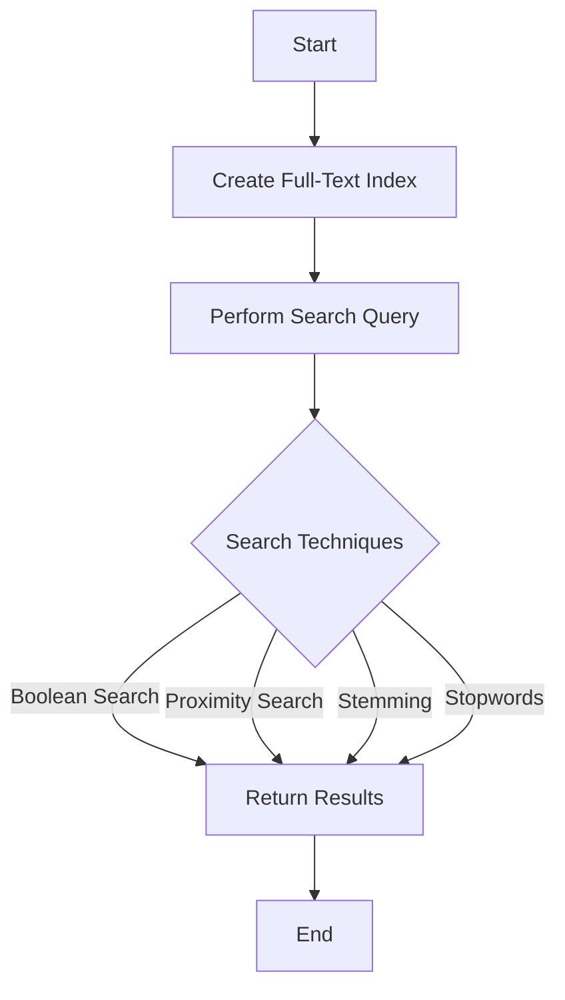

## 12.5 Full-Text Search and Linguistic Analysis

In today's data-driven world, the ability to efficiently search and analyze text data is crucial. Full-text search and linguistic analysis in SQL provide powerful tools for indexing and querying large volumes of text data. This section explores the capabilities of full-text indexing, various search techniques, and linguistic features that enhance search efficiency and accuracy.

### Full-Text Indexing

Full-text indexing is a specialized indexing technique that allows for efficient searching of large text fields. Unlike traditional indexing, which might focus on specific columns or fields, full-text indexing is designed to handle unstructured data, such as documents, emails, and web pages.

#### Capabilities of Full-Text Indexing

1. **Efficient Text Search**: Full-text indexes enable rapid searching of text data by creating an index that maps words to their locations in the text. This allows for quick retrieval of documents containing specific words or phrases.

2. **Scalability**: Full-text indexing can handle large volumes of text data, making it suitable for applications like search engines and document management systems.

3. **Advanced Querying**: Full-text indexes support complex queries, including phrase searches, proximity searches, and Boolean logic.

4. **Language Support**: Many full-text search systems support multiple languages, allowing for linguistic analysis and search optimization across different languages.

#### Creating a Full-Text Index

To create a full-text index in SQL, you typically use the `CREATE FULLTEXT INDEX` statement. Here's an example:

```sql
-- Create a full-text index on the 'content' column of the 'documents' table
CREATE FULLTEXT INDEX ON documents(content)
WITH STOPLIST = SYSTEM;
```

In this example, a full-text index is created on the `content` column of the `documents` table. The `STOPLIST` option specifies a list of common words (stopwords) to ignore during indexing.

### Search Techniques

Full-text search supports a variety of search techniques that enhance the ability to find relevant information quickly and accurately.

#### Boolean Search

Boolean search allows you to combine search terms using logical operators such as AND, OR, and NOT. This enables more precise searches by specifying conditions that must be met.

```sql
-- Search for documents containing 'database' AND 'optimization'
SELECT * FROM documents
WHERE CONTAINS(content, 'database AND optimization');
```

In this query, only documents containing both "database" and "optimization" will be returned.

#### Proximity Search

Proximity search finds words that are near each other within a specified distance. This is useful for finding phrases or related terms that appear close together in the text.

```sql
-- Search for documents where 'SQL' is near 'performance'
SELECT * FROM documents
WHERE CONTAINS(content, 'NEAR((SQL, performance), 5)');
```

This query returns documents where "SQL" and "performance" appear within five words of each other.

### Linguistic Features

Linguistic analysis enhances full-text search by considering the nuances of language, such as word variations and common words.

#### Stemming

Stemming is the process of reducing words to their root form. This allows for matching different forms of a word, such as "run," "running," and "ran."

```sql
-- Search for documents containing any form of the word 'run'
SELECT * FROM documents
WHERE CONTAINS(content, 'FORMSOF(INFLECTIONAL, run)');
```

This query matches documents containing "run," "running," "ran," etc.

#### Stopwords

Stopwords are common words that are often ignored during indexing and searching because they do not add significant meaning to the search. Examples include "the," "is," and "at."

```sql
-- Create a full-text index with a custom stoplist
CREATE FULLTEXT INDEX ON documents(content)
WITH STOPLIST = myStoplist;
```

By using a custom stoplist, you can control which words are ignored during indexing.

### Applications of Full-Text Search

Full-text search and linguistic analysis are used in a variety of applications:

- **Search Engines**: Full-text search is the backbone of search engines, enabling users to find relevant web pages quickly.

- **Document Management Systems**: These systems use full-text search to index and retrieve documents based on their content.

- **Content Management Systems**: Full-text search allows users to search for articles, blog posts, and other content efficiently.

- **E-commerce Platforms**: Full-text search helps users find products by searching product descriptions and reviews.

### Design Considerations

When implementing full-text search, consider the following:

- **Index Maintenance**: Full-text indexes require regular maintenance to ensure optimal performance. This includes updating the index as data changes and rebuilding it periodically.

- **Performance**: Full-text search can be resource-intensive, so it's important to monitor performance and optimize queries as needed.

- **Security**: Ensure that full-text search queries are protected against SQL injection attacks by using parameterized queries and input validation.

### Differences and Similarities

Full-text search is often compared to traditional search techniques. Here are some key differences and similarities:

- **Traditional Indexing vs. Full-Text Indexing**: Traditional indexing focuses on specific columns, while full-text indexing handles unstructured text data.

- **Exact Match vs. Linguistic Analysis**: Traditional search often relies on exact matches, whereas full-text search uses linguistic analysis to match word variations and phrases.

- **Performance**: Full-text search is optimized for large text fields, while traditional search may be faster for smaller, structured data.

### Try It Yourself

Experiment with full-text search by modifying the code examples above. Try creating a full-text index on a different column or using different search techniques, such as proximity search or stemming.

### Visualizing Full-Text Search

To better understand how full-text search works, let's visualize the process using a flowchart.



**Figure 1: Full-Text Search Process Flowchart**

This flowchart illustrates the steps involved in full-text search, from creating the index to performing search queries and returning results.

### References and Links

For further reading on full-text search and linguistic analysis, consider the following resources:

- [Microsoft SQL Server Full-Text Search](https://docs.microsoft.com/en-us/sql/relational-databases/search/full-text-search)
- [MySQL Full-Text Search Functions](https://dev.mysql.com/doc/refman/8.0/en/fulltext-search.html)
- [PostgreSQL Full-Text Search](https://www.postgresql.org/docs/current/textsearch.html)

### Knowledge Check

To reinforce your understanding of full-text search and linguistic analysis, consider the following questions:

1. What is the primary purpose of full-text indexing?
2. How does Boolean search enhance query precision?
3. What is the role of stemming in linguistic analysis?
4. Why are stopwords ignored during indexing?
5. How can proximity search be used to find related terms?

### Embrace the Journey

Remember, mastering full-text search and linguistic analysis is just one step in your journey to becoming an expert in SQL design patterns. Keep experimenting, stay curious, and enjoy the process of learning and discovery!

## Quiz Time!



### What is the primary purpose of full-text indexing?

- [x] To enable efficient searching of large text fields
- [ ] To store binary data
- [ ] To improve data integrity
- [ ] To manage database transactions

> **Explanation:** Full-text indexing is designed to efficiently search large text fields by creating an index that maps words to their locations in the text.

### How does Boolean search enhance query precision?

- [x] By using logical operators like AND, OR, NOT
- [ ] By ignoring common words
- [ ] By reducing words to their root form
- [ ] By finding words near each other

> **Explanation:** Boolean search uses logical operators to combine search terms, allowing for more precise queries.

### What is the role of stemming in linguistic analysis?

- [x] To recognize word variations
- [ ] To ignore common words
- [ ] To find words near each other
- [ ] To combine search terms

> **Explanation:** Stemming reduces words to their root form, allowing for matching different forms of a word.

### Why are stopwords ignored during indexing?

- [x] Because they do not add significant meaning to the search
- [ ] Because they are too long
- [ ] Because they are not in the dictionary
- [ ] Because they are used in Boolean search

> **Explanation:** Stopwords are common words that do not add significant meaning to the search and are often ignored to improve search efficiency.

### How can proximity search be used to find related terms?

- [x] By specifying a distance within which words must appear
- [ ] By using logical operators
- [ ] By ignoring common words
- [ ] By reducing words to their root form

> **Explanation:** Proximity search finds words that are near each other within a specified distance, useful for finding related terms.

### What is a common application of full-text search?

- [x] Search engines
- [ ] Data encryption
- [ ] Transaction management
- [ ] Schema design

> **Explanation:** Full-text search is commonly used in search engines to enable users to find relevant web pages quickly.

### What SQL statement is used to create a full-text index?

- [x] CREATE FULLTEXT INDEX
- [ ] CREATE INDEX
- [ ] CREATE TABLE
- [ ] CREATE VIEW

> **Explanation:** The `CREATE FULLTEXT INDEX` statement is used to create a full-text index on a table column.

### What is a benefit of using a custom stoplist?

- [x] To control which words are ignored during indexing
- [ ] To increase the size of the index
- [ ] To improve data integrity
- [ ] To enhance transaction speed

> **Explanation:** A custom stoplist allows you to specify which words are ignored during indexing, improving search efficiency.

### What does the NEAR operator do in a full-text search?

- [x] Finds words that are near each other within a specified distance
- [ ] Combines search terms using logical operators
- [ ] Reduces words to their root form
- [ ] Ignores common words

> **Explanation:** The NEAR operator is used in proximity search to find words that are near each other within a specified distance.

### True or False: Full-text search is optimized for structured data.

- [ ] True
- [x] False

> **Explanation:** Full-text search is optimized for unstructured text data, unlike traditional search techniques that are better suited for structured data.


