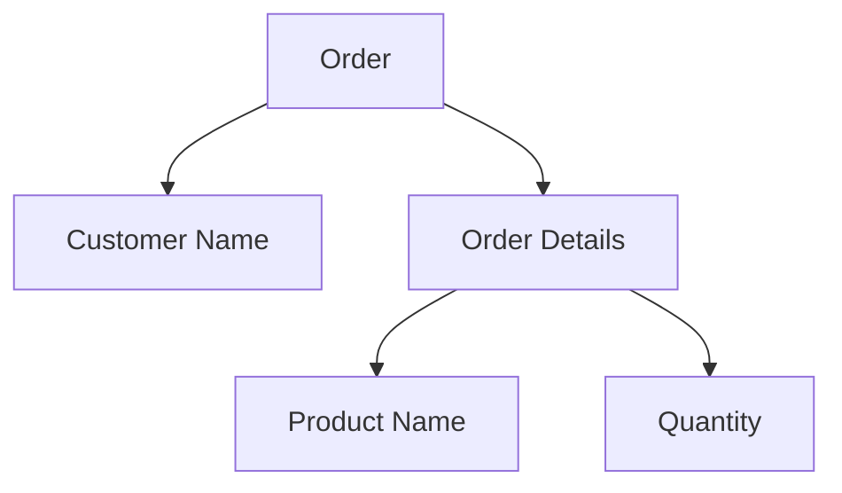
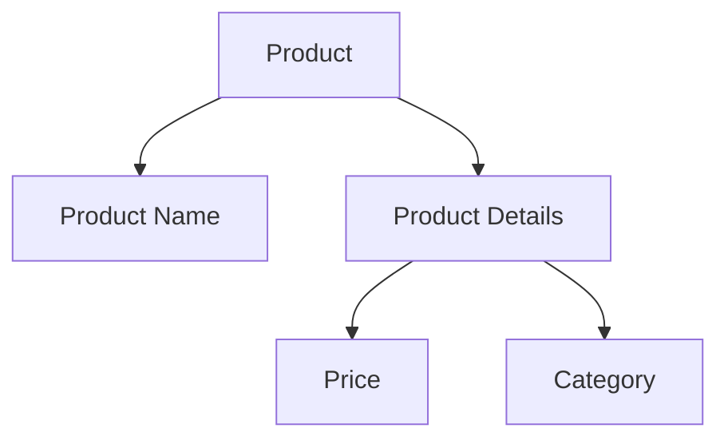

## 12.6 JSON and XML Data Storage and Querying

In the modern landscape of data management, JSON (JavaScript Object Notation) and XML (eXtensible Markup Language) have become pivotal in handling semi-structured data. As software engineers and architects, understanding how to efficiently store and query these data formats within SQL databases is crucial. This section delves into the intricacies of JSON and XML data storage and querying, providing insights into their native support in SQL, querying capabilities, and practical use cases.

### JSON Support in SQL

#### JSON Storage

JSON has become a ubiquitous format for data interchange, particularly in web applications. SQL databases have evolved to support JSON natively, allowing for flexible schema designs and efficient data manipulation.

- **Native JSON Data Types**: Modern SQL databases such as PostgreSQL, MySQL, and SQL Server offer native JSON data types. These data types allow you to store JSON documents directly in your tables, providing benefits such as validation, indexing, and optimized storage.

```sql
-- Example: Creating a table with a JSON column in PostgreSQL
CREATE TABLE orders (
    id SERIAL PRIMARY KEY,
    customer_name VARCHAR(100),
    order_details JSONB
);
```

In this example, the `order_details` column uses the `JSONB` data type, which is a binary representation of JSON in PostgreSQL, offering faster processing and indexing capabilities compared to plain `JSON`.

#### JSON Querying

SQL databases provide a rich set of functions and operators to extract and manipulate JSON data. These capabilities allow you to perform complex queries directly on JSON fields.

- **JSON Functions and Operators**: Functions such as `json_extract_path_text` in PostgreSQL or `JSON_EXTRACT` in MySQL enable you to retrieve specific elements from JSON documents.

```sql
-- Example: Extracting data from a JSON column in PostgreSQL
SELECT customer_name, order_details->>'product_name' AS product
FROM orders
WHERE order_details->>'quantity'::int > 5;
```

In this query, we extract the `product_name` from the `order_details` JSON column and filter orders where the quantity is greater than 5.

- **Indexing JSON Data**: Indexing JSON fields can significantly enhance query performance. PostgreSQL, for instance, supports GIN (Generalized Inverted Index) for JSONB columns.

```sql
-- Example: Creating an index on a JSONB column in PostgreSQL
CREATE INDEX idx_order_details ON orders USING GIN (order_details);
```

This index allows for efficient querying of JSONB data, improving the speed of operations like filtering and searching.

### XML Support in SQL

#### XML Storage

XML is a well-established format for representing structured data. SQL databases provide robust support for XML, enabling the storage of complex documents.

- **XML Data Types**: SQL databases like SQL Server and Oracle offer XML data types, allowing you to store XML documents directly in your tables.

```sql
-- Example: Creating a table with an XML column in SQL Server
CREATE TABLE products (
    id INT PRIMARY KEY,
    product_name NVARCHAR(100),
    product_details XML
);
```

In this example, the `product_details` column is of type `XML`, suitable for storing structured product information.

#### XML Querying

Querying XML data involves using languages like XPath and XQuery, which are designed to navigate and manipulate XML structures.

- **XPath and XQuery**: These languages allow you to perform complex queries on XML data, extracting specific elements or attributes.

```sql
-- Example: Querying XML data in SQL Server using XPath
SELECT product_name, product_details.value('(/Product/Price)[1]', 'decimal(10,2)') AS price
FROM products
WHERE product_details.exist('/Product[Category="Electronics"]') = 1;
```

This query retrieves the price of products in the "Electronics" category by navigating the XML structure using XPath.

- **Indexing XML Data**: XML indexes can improve the performance of queries on XML columns. SQL Server, for example, supports primary and secondary XML indexes.

```sql
-- Example: Creating a primary XML index in SQL Server
CREATE PRIMARY XML INDEX idx_product_details ON products(product_details);
```

This index facilitates efficient querying of XML data, enhancing the speed of operations like searching and filtering.

### Use Cases for JSON and XML

#### API Responses

JSON is the de facto standard for API responses due to its lightweight nature and ease of use. Storing JSON responses in SQL databases allows for seamless integration with web services.

- **Example**: Storing API responses in a JSON column enables you to easily parse and analyze data received from external services.

```sql
-- Example: Inserting an API response into a JSON column
INSERT INTO api_responses (response_data)
VALUES ('{"status": "success", "data": {"id": 1, "name": "John Doe"}}');
```

#### Configuration Data

Both JSON and XML are ideal for storing configuration data due to their flexibility and hierarchical structure.

- **Example**: Using JSON to store application settings allows for dynamic configuration changes without altering the database schema.

```sql
-- Example: Storing configuration data in a JSON column
CREATE TABLE app_config (
    id SERIAL PRIMARY KEY,
    config_data JSONB
);

INSERT INTO app_config (config_data)
VALUES ('{"theme": "dark", "language": "en", "notifications": {"email": true, "sms": false}}');
```

### Visualizing JSON and XML Data Structures

Understanding the structure of JSON and XML data is crucial for effective querying and manipulation. Let's visualize these structures using Mermaid.js diagrams.

#### JSON Structure



**Diagram Description**: This diagram represents a JSON structure for an order, highlighting the hierarchical relationship between the order, customer name, and order details.

#### XML Structure



**Diagram Description**: This diagram illustrates an XML structure for a product, showing the nested elements for product details, including price and category.

### Try It Yourself

Experiment with the provided code examples by modifying the JSON and XML structures. Try adding new fields or changing the query conditions to see how the results change. This hands-on approach will deepen your understanding of JSON and XML data handling in SQL.

### References and Links

- [PostgreSQL JSON Functions and Operators](https://www.postgresql.org/docs/current/functions-json.html)
- [MySQL JSON Functions](https://dev.mysql.com/doc/refman/8.0/en/json-functions.html)
- [SQL Server XML Data Type](https://docs.microsoft.com/en-us/sql/relational-databases/xml/xml-data-sql-server?view=sql-server-ver15)
- [XPath and XQuery](https://www.w3schools.com/xml/xpath_intro.asp)

### Knowledge Check

- What are the benefits of using native JSON data types in SQL databases?
- How can indexing improve the performance of JSON and XML queries?
- What are some common use cases for storing JSON and XML data in SQL databases?

### Embrace the Journey

Remember, mastering JSON and XML data storage and querying is a journey. As you explore these concepts, you'll unlock new possibilities for data management and integration. Keep experimenting, stay curious, and enjoy the process!

## Quiz Time!



### What is a key advantage of using native JSON data types in SQL databases?

- [x] They allow for flexible schema designs.
- [ ] They are faster than all other data types.
- [ ] They eliminate the need for indexing.
- [ ] They automatically optimize queries.

> **Explanation:** Native JSON data types enable flexible schema designs, allowing for dynamic data structures.

### Which SQL function is used to extract data from a JSON column in PostgreSQL?

- [ ] JSON_VALUE
- [x] json_extract_path_text
- [ ] JSON_QUERY
- [ ] JSON_TABLE

> **Explanation:** The `json_extract_path_text` function is used in PostgreSQL to extract data from JSON columns.

### What is the purpose of indexing JSON and XML data in SQL databases?

- [x] To improve query performance.
- [ ] To increase storage capacity.
- [ ] To simplify data structures.
- [ ] To automatically validate data.

> **Explanation:** Indexing JSON and XML data enhances query performance by allowing faster data retrieval.

### Which language is used to query XML data in SQL databases?

- [ ] JSONPath
- [ ] SQL
- [x] XPath
- [ ] HTML

> **Explanation:** XPath is a language used to navigate and query XML data structures.

### What is a common use case for storing JSON data in SQL databases?

- [x] API responses
- [ ] Binary data
- [ ] Image files
- [ ] Video streams

> **Explanation:** JSON is commonly used to store API responses due to its lightweight and flexible nature.

### How can you improve the performance of XML queries in SQL Server?

- [x] By creating XML indexes
- [ ] By using JSON functions
- [ ] By converting XML to text
- [ ] By disabling constraints

> **Explanation:** Creating XML indexes in SQL Server enhances the performance of XML queries.

### Which SQL data type is used to store XML documents?

- [ ] JSON
- [ ] TEXT
- [x] XML
- [ ] BLOB

> **Explanation:** The `XML` data type is used to store XML documents in SQL databases.

### What is the benefit of using JSON for configuration data?

- [x] It allows for dynamic configuration changes.
- [ ] It reduces data redundancy.
- [ ] It increases data security.
- [ ] It simplifies data encryption.

> **Explanation:** JSON's flexibility allows for dynamic configuration changes without altering the database schema.

### Which of the following is a JSON indexing method in PostgreSQL?

- [x] GIN index
- [ ] B-Tree index
- [ ] Hash index
- [ ] Bitmap index

> **Explanation:** GIN (Generalized Inverted Index) is used for indexing JSONB columns in PostgreSQL.

### True or False: XML data types are only supported in SQL Server.

- [ ] True
- [x] False

> **Explanation:** XML data types are supported in multiple SQL databases, including SQL Server and Oracle.


