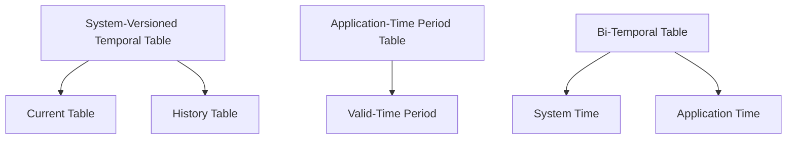

## 12.7 Temporal and Bi-Temporal Data

In the ever-evolving landscape of data management, understanding and implementing temporal and bi-temporal data patterns is crucial for expert software engineers and architects. These patterns allow us to track changes over time, providing a robust framework for historical analysis and data integrity. In this section, we will delve into the concepts of system-versioned temporal tables, application-time period tables, and bi-temporal tables, along with practical examples and best practices.

### Understanding Temporal Data

Temporal data refers to data that is associated with time. In SQL, managing temporal data involves tracking changes to data over time, allowing us to query the state of data at any given point. This capability is essential for applications that require auditing, compliance, and historical analysis.

#### System-Versioned Temporal Tables

**Functionality**: System-versioned temporal tables automatically keep track of data changes over time. They maintain a history of changes by storing both current and historical data within the same table structure.

**Key Concepts**:
- **Current Table**: Stores the current state of the data.
- **History Table**: Automatically generated and maintained by the database to store historical versions of the data.

**Implementation**:
To create a system-versioned temporal table, we define two additional columns: `SysStartTime` and `SysEndTime`, which the database uses to track the validity period of each row.

```sql
CREATE TABLE Employee
(
    EmployeeID INT PRIMARY KEY,
    Name NVARCHAR(100),
    Position NVARCHAR(100),
    Salary DECIMAL(10, 2),
    SysStartTime DATETIME2 GENERATED ALWAYS AS ROW START,
    SysEndTime DATETIME2 GENERATED ALWAYS AS ROW END,
    PERIOD FOR SYSTEM_TIME (SysStartTime, SysEndTime)
) 
WITH (SYSTEM_VERSIONING = ON (HISTORY_TABLE = dbo.EmployeeHistory));
```

**Explanation**:
- The `PERIOD FOR SYSTEM_TIME` clause defines the columns used for tracking the validity period.
- The `SYSTEM_VERSIONING = ON` option enables automatic versioning, creating a history table (`EmployeeHistory`) to store previous versions of the data.

**Use Cases**:
- Auditing changes to sensitive data.
- Maintaining a historical record for compliance purposes.

#### Application-Time Period Tables

**Purpose**: Application-time period tables manage data validity based on application-defined time periods. This approach allows applications to define custom time periods for data validity, independent of system time.

**Key Concepts**:
- **Valid-Time Period**: Represents the time period during which a data record is considered valid according to the application's logic.

**Implementation**:
To implement application-time period tables, we define two columns: `ValidFrom` and `ValidTo`, which represent the validity period of each row.

```sql
CREATE TABLE Project
(
    ProjectID INT PRIMARY KEY,
    ProjectName NVARCHAR(100),
    Budget DECIMAL(10, 2),
    ValidFrom DATE,
    ValidTo DATE,
    PERIOD FOR APPLICATION_TIME (ValidFrom, ValidTo)
);
```

**Explanation**:
- The `PERIOD FOR APPLICATION_TIME` clause defines the columns used for tracking the validity period according to the application's logic.

**Use Cases**:
- Managing contracts or agreements with specific validity periods.
- Handling data that is valid only during certain business cycles.

#### Bi-Temporal Tables

**Combination**: Bi-temporal tables incorporate both system and application time periods, providing a comprehensive framework for managing data changes and validity.

**Key Concepts**:
- **System Time**: Tracks changes to data over time automatically.
- **Application Time**: Defines custom validity periods for data according to business logic.

**Implementation**:
To create a bi-temporal table, we combine the concepts of system-versioned and application-time period tables.

```sql
CREATE TABLE OrderDetails
(
    OrderID INT PRIMARY KEY,
    ProductID INT,
    Quantity INT,
    Price DECIMAL(10, 2),
    ValidFrom DATE,
    ValidTo DATE,
    SysStartTime DATETIME2 GENERATED ALWAYS AS ROW START,
    SysEndTime DATETIME2 GENERATED ALWAYS AS ROW END,
    PERIOD FOR SYSTEM_TIME (SysStartTime, SysEndTime),
    PERIOD FOR APPLICATION_TIME (ValidFrom, ValidTo)
) 
WITH (SYSTEM_VERSIONING = ON (HISTORY_TABLE = dbo.OrderDetailsHistory));
```

**Explanation**:
- This table tracks both system and application time, allowing for comprehensive historical analysis and data validity management.

**Use Cases**:
- Complex business scenarios requiring both historical tracking and application-specific validity.
- Financial applications where both transaction time and validity time are critical.

### Querying Temporal and Bi-Temporal Data

Temporal and bi-temporal tables enable powerful querying capabilities, such as time travel and historical analysis.

#### Time Travel Queries

**Objective**: Retrieve data as it existed at a specific point in time.

**Example**:
To retrieve the state of the `Employee` table as of a specific date, we use the `FOR SYSTEM_TIME AS OF` clause.

```sql
SELECT EmployeeID, Name, Position, Salary
FROM Employee
FOR SYSTEM_TIME AS OF '2024-01-01';
```

**Explanation**:
- This query retrieves the state of the `Employee` table as it existed on January 1, 2024.

#### Historical Analysis Queries

**Objective**: Analyze data changes over periods.

**Example**:
To analyze changes in the `Employee` table over a specific period, we use the `FOR SYSTEM_TIME BETWEEN` clause.

```sql
SELECT EmployeeID, Name, Position, Salary, SysStartTime, SysEndTime
FROM Employee
FOR SYSTEM_TIME BETWEEN '2024-01-01' AND '2024-12-31';
```

**Explanation**:
- This query retrieves all versions of the `Employee` table between January 1, 2024, and December 31, 2024.

### Design Considerations

When implementing temporal and bi-temporal data patterns, consider the following:

- **Performance**: Temporal tables can grow significantly over time. Implement indexing strategies to optimize query performance.
- **Storage**: Historical data can consume substantial storage. Plan for efficient storage management.
- **Compliance**: Ensure that temporal data management aligns with regulatory requirements for data retention and auditing.

### Differences and Similarities

- **Temporal vs. Bi-Temporal**: Temporal tables focus on system time, while bi-temporal tables incorporate both system and application time.
- **System-Versioned vs. Application-Time**: System-versioned tables automatically track changes, whereas application-time tables rely on application-defined periods.

### Try It Yourself

Experiment with the following modifications to deepen your understanding:

- **Modify the Validity Period**: Change the `ValidFrom` and `ValidTo` dates in the `Project` table and observe how queries are affected.
- **Add Historical Data**: Insert historical data into the `EmployeeHistory` table and query it using time travel queries.
- **Combine System and Application Time**: Create a new bi-temporal table and explore its querying capabilities.

### Visualizing Temporal Data Management



**Diagram Explanation**:
- The diagram illustrates the relationships between system-versioned, application-time, and bi-temporal tables, highlighting their key components.

### References and Further Reading

- [Temporal Tables in SQL Server](https://docs.microsoft.com/en-us/sql/relational-databases/tables/temporal-tables)
- [Managing Temporal Data in Oracle](https://docs.oracle.com/en/database/oracle/oracle-database/19/adjsn/managing-temporal-data.html)
- [Temporal Data in PostgreSQL](https://www.postgresql.org/docs/current/temporal.html)

### Knowledge Check

- **What are the key differences between system-versioned and application-time period tables?**
- **How can bi-temporal tables benefit complex business scenarios?**
- **What are the potential challenges in managing temporal data?**

### Embrace the Journey

Remember, mastering temporal and bi-temporal data management is a journey. As you progress, you'll gain deeper insights into historical analysis and data integrity. Keep experimenting, stay curious, and enjoy the journey!

## Quiz Time!



### What is the primary purpose of system-versioned temporal tables?

- [x] To automatically track data changes over time
- [ ] To manage data validity based on application-defined periods
- [ ] To store only current data
- [ ] To replace application-time period tables

> **Explanation:** System-versioned temporal tables are designed to automatically track changes to data over time, maintaining both current and historical data.

### Which clause is used to define the validity period in application-time period tables?

- [ ] PERIOD FOR SYSTEM_TIME
- [x] PERIOD FOR APPLICATION_TIME
- [ ] VALIDITY PERIOD
- [ ] TIME PERIOD

> **Explanation:** The `PERIOD FOR APPLICATION_TIME` clause is used to define the validity period for application-time period tables.

### What is a key benefit of bi-temporal tables?

- [x] They incorporate both system and application time periods
- [ ] They only track current data
- [ ] They eliminate the need for history tables
- [ ] They are simpler to implement than temporal tables

> **Explanation:** Bi-temporal tables combine both system and application time periods, providing a comprehensive framework for managing data changes and validity.

### How can you retrieve data as it existed at a specific point in time?

- [x] Use the FOR SYSTEM_TIME AS OF clause
- [ ] Use the FOR APPLICATION_TIME AS OF clause
- [ ] Use the SELECT * FROM clause
- [ ] Use the WHERE clause

> **Explanation:** The `FOR SYSTEM_TIME AS OF` clause is used to retrieve data as it existed at a specific point in time.

### What is a potential challenge when managing temporal data?

- [x] Increased storage requirements
- [ ] Simplified data queries
- [ ] Reduced data integrity
- [ ] Elimination of historical data

> **Explanation:** Managing temporal data can lead to increased storage requirements due to the accumulation of historical data.

### Which SQL feature allows for historical analysis of data changes?

- [x] System-versioned temporal tables
- [ ] Application-time period tables
- [ ] Current tables
- [ ] Indexing

> **Explanation:** System-versioned temporal tables enable historical analysis by maintaining a history of data changes.

### What is the role of the history table in system-versioned temporal tables?

- [x] To store historical versions of data
- [ ] To store only current data
- [ ] To replace the current table
- [ ] To manage application-defined periods

> **Explanation:** The history table in system-versioned temporal tables stores historical versions of data, allowing for time travel queries.

### How do application-time period tables differ from system-versioned tables?

- [x] They manage data validity based on application-defined periods
- [ ] They automatically track data changes over time
- [ ] They do not store historical data
- [ ] They are simpler to implement

> **Explanation:** Application-time period tables manage data validity based on application-defined periods, unlike system-versioned tables that automatically track changes.

### What is a common use case for bi-temporal tables?

- [x] Complex business scenarios requiring both historical tracking and application-specific validity
- [ ] Storing only current data
- [ ] Simplifying data queries
- [ ] Eliminating the need for history tables

> **Explanation:** Bi-temporal tables are ideal for complex business scenarios that require both historical tracking and application-specific validity.

### True or False: Temporal data management is only useful for auditing purposes.

- [ ] True
- [x] False

> **Explanation:** Temporal data management is useful for a variety of purposes, including auditing, compliance, historical analysis, and data integrity.


