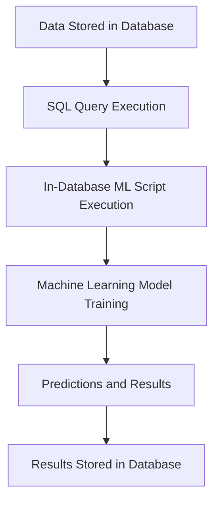

## 12.8 Machine Learning Extensions

In the rapidly evolving landscape of data-driven decision-making, integrating machine learning (ML) capabilities directly within SQL databases has emerged as a powerful paradigm. This approach, known as **In-Database Machine Learning (In-Database ML)**, allows for the execution of machine learning algorithms directly within the database environment. This section will delve into the intricacies of In-Database ML, its advantages, and practical implementations using popular SQL databases like SQL Server and PostgreSQL.

### In-Database ML: An Overview

**In-Database ML** refers to the capability of running machine learning algorithms directly within the database. This integration is achieved by embedding ML scripts or functions within SQL queries, allowing for seamless execution alongside traditional SQL operations. The primary goal of In-Database ML is to leverage the computational power and scalability of database systems to perform complex data analysis and predictive modeling without the need for data movement to external systems.

#### Key Concepts

- **Integration**: In-Database ML involves embedding machine learning algorithms within the database, allowing for direct execution of ML tasks using SQL queries.
- **Performance**: By eliminating the need to transfer data to external systems, In-Database ML significantly reduces latency and enhances performance.
- **Scalability**: Databases are inherently designed to handle large volumes of data and parallel processing, making them ideal for scalable machine learning tasks.

### Advantages of In-Database ML

In-Database ML offers several advantages that make it an attractive option for organizations looking to integrate machine learning capabilities into their data processing workflows:

1. **Reduced Data Movement**: Traditional ML workflows often involve extracting data from databases, processing it in external environments, and then reintegrating the results. In-Database ML eliminates this data movement, reducing latency and potential data security risks.

2. **Improved Performance**: By leveraging the database's native processing capabilities, In-Database ML can execute ML algorithms more efficiently, especially for large datasets.

3. **Scalability**: Databases are designed to handle large-scale data processing tasks. In-Database ML can take advantage of this scalability to process vast amounts of data in parallel, making it suitable for big data applications.

4. **Simplified Architecture**: Integrating ML capabilities within the database simplifies the overall architecture by reducing the need for separate ML infrastructure and tools.

5. **Enhanced Security**: Keeping data within the database environment minimizes exposure to security vulnerabilities associated with data transfer and external processing.

### Practical Examples of In-Database ML

To illustrate the practical implementation of In-Database ML, we will explore two popular SQL databases: SQL Server and PostgreSQL. Both databases offer robust support for integrating machine learning capabilities directly within SQL queries.

#### SQL Server Machine Learning Services

SQL Server Machine Learning Services provides a comprehensive platform for executing R and Python scripts directly within SQL Server. This integration allows data scientists and developers to perform advanced analytics and machine learning tasks without leaving the SQL environment.

**Example: Predictive Modeling with Python in SQL Server**

```sql
-- Enable external scripts execution
EXEC sp_configure 'external scripts enabled', 1;
RECONFIGURE;

-- Create a stored procedure to execute Python script
CREATE PROCEDURE PredictSales
AS
BEGIN
    EXEC sp_execute_external_script
        @language = N'Python',
        @script = N'
import pandas as pd
from sklearn.linear_model import LinearRegression

df = InputDataSet

X = df[["PreviousSales"]]
y = df["CurrentSales"]

model = LinearRegression()
model.fit(X, y)

df["PredictedSales"] = model.predict(X)

OutputDataSet = df
',
        @input_data_1 = N'SELECT PreviousSales, CurrentSales FROM SalesData',
        @output_data_1_name = N'OutputDataSet';
END;
```

In this example, we create a stored procedure `PredictSales` that executes a Python script using SQL Server's `sp_execute_external_script` feature. The script loads sales data, trains a linear regression model, and returns the predicted sales.

#### PostgreSQL PL/Python

PostgreSQL supports embedding Python code within SQL functions using PL/Python, a procedural language extension. This capability allows for the execution of Python scripts directly within PostgreSQL, enabling advanced data analysis and machine learning tasks.

**Example: Clustering with K-Means in PostgreSQL**

```sql
-- Create a function to perform K-Means clustering
CREATE OR REPLACE FUNCTION kmeans_clustering()
RETURNS TABLE(cluster_id INT, data_point JSONB) AS $$
import pandas as pd
from sklearn.cluster import KMeans
import json

data = plpy.execute("SELECT data_point FROM DataPoints")
df = pd.DataFrame([json.loads(row['data_point']) for row in data])

kmeans = KMeans(n_clusters=3)
df['cluster_id'] = kmeans.fit_predict(df)

return df[['cluster_id', 'data_point']].to_dict('records')
$$ LANGUAGE plpythonu;
```

In this example, we define a PostgreSQL function `kmeans_clustering` that performs K-Means clustering using Python's `scikit-learn` library. The function loads data from a PostgreSQL table, applies the clustering algorithm, and returns the results.

### Visualizing In-Database ML Integration

To better understand the integration of machine learning within SQL databases, let's visualize the workflow using a flowchart.



**Figure 1: Workflow of In-Database ML Integration**

This flowchart illustrates the process of executing machine learning tasks directly within the database. Data is stored in the database, and SQL queries are executed to run ML scripts. The scripts train ML models and generate predictions, which are then stored back in the database.

### Design Considerations for In-Database ML

When implementing In-Database ML, several design considerations should be taken into account:

- **Resource Management**: Ensure that the database has sufficient resources (CPU, memory, storage) to handle the additional computational load of ML tasks.
- **Security**: Implement appropriate security measures to protect sensitive data and prevent unauthorized access to ML scripts and results.
- **Performance Tuning**: Optimize SQL queries and ML scripts to minimize execution time and resource usage.
- **Version Compatibility**: Verify compatibility between the database version and the ML libraries or extensions being used.

### Differences and Similarities with Traditional ML Workflows

In-Database ML differs from traditional ML workflows in several ways:

- **Data Movement**: Traditional workflows involve moving data to external environments, while In-Database ML keeps data within the database.
- **Performance**: In-Database ML leverages database resources for improved performance, whereas traditional workflows rely on external computing resources.
- **Complexity**: In-Database ML simplifies architecture by reducing the need for separate ML infrastructure.

However, both approaches share similarities in terms of the underlying ML algorithms and the need for data preprocessing and feature engineering.

### Try It Yourself

To gain hands-on experience with In-Database ML, try modifying the code examples provided above. Experiment with different ML algorithms, such as decision trees or support vector machines, and observe how they perform within the database environment. Additionally, explore the integration of other programming languages, such as R, for executing ML tasks in SQL Server or PostgreSQL.

### References and Links

- [SQL Server Machine Learning Services Documentation](https://docs.microsoft.com/en-us/sql/machine-learning/sql-server-machine-learning-services)
- [PostgreSQL PL/Python Documentation](https://www.postgresql.org/docs/current/plpython.html)
- [scikit-learn: Machine Learning in Python](https://scikit-learn.org/stable/)

### Knowledge Check

1. Explain the concept of In-Database ML and its advantages.
2. Describe how SQL Server Machine Learning Services integrates Python scripts within SQL queries.
3. Discuss the role of PL/Python in enabling machine learning tasks in PostgreSQL.
4. Identify key design considerations when implementing In-Database ML.
5. Compare and contrast In-Database ML with traditional ML workflows.

### Embrace the Journey

Remember, integrating machine learning capabilities within SQL databases is just the beginning. As you explore In-Database ML, you'll discover new ways to enhance data-driven decision-making and unlock the full potential of your database systems. Keep experimenting, stay curious, and enjoy the journey!

## Quiz Time!



### What is In-Database ML?

- [x] Running machine learning algorithms directly within the database
- [ ] Moving data to external systems for machine learning
- [ ] Using SQL queries to generate machine learning models
- [ ] Executing machine learning tasks outside the database

> **Explanation:** In-Database ML refers to the execution of machine learning algorithms directly within the database environment, eliminating the need for data movement to external systems.

### Which of the following is an advantage of In-Database ML?

- [x] Reduced data movement
- [ ] Increased data transfer
- [ ] Decreased performance
- [ ] Complex architecture

> **Explanation:** In-Database ML reduces data movement by executing ML tasks within the database, leading to improved performance and simplified architecture.

### What language does SQL Server Machine Learning Services support for ML scripts?

- [x] Python and R
- [ ] Java and C++
- [ ] Ruby and Perl
- [ ] JavaScript and PHP

> **Explanation:** SQL Server Machine Learning Services supports Python and R for executing machine learning scripts within SQL Server.

### How does PL/Python enhance PostgreSQL's capabilities?

- [x] By embedding Python code within SQL functions
- [ ] By replacing SQL with Python
- [ ] By executing SQL queries in Python
- [ ] By converting SQL data to Python format

> **Explanation:** PL/Python allows embedding Python code within SQL functions, enabling advanced data analysis and machine learning tasks in PostgreSQL.

### What is a key design consideration for In-Database ML?

- [x] Resource management
- [ ] Data extraction
- [ ] External data transfer
- [ ] Manual data processing

> **Explanation:** Resource management is crucial for In-Database ML to ensure the database can handle the additional computational load of ML tasks.

### In-Database ML eliminates the need for:

- [x] Data movement to external systems
- [ ] SQL queries
- [ ] Machine learning algorithms
- [ ] Database storage

> **Explanation:** In-Database ML eliminates the need for data movement to external systems by executing ML tasks directly within the database.

### Which database supports PL/Python for ML tasks?

- [x] PostgreSQL
- [ ] MySQL
- [ ] Oracle
- [ ] SQLite

> **Explanation:** PostgreSQL supports PL/Python, allowing the execution of Python scripts within SQL functions for ML tasks.

### What is a common similarity between In-Database ML and traditional ML workflows?

- [x] Underlying ML algorithms
- [ ] Data movement to external systems
- [ ] Use of external computing resources
- [ ] Complex architecture

> **Explanation:** Both In-Database ML and traditional ML workflows use similar underlying ML algorithms, although their execution environments differ.

### Which of the following is a practical example of In-Database ML?

- [x] SQL Server executing Python scripts for predictive modeling
- [ ] Exporting data to a CSV file for analysis
- [ ] Using Excel for data visualization
- [ ] Running ML tasks on a local machine

> **Explanation:** SQL Server executing Python scripts for predictive modeling is a practical example of In-Database ML, where ML tasks are performed within the database.

### True or False: In-Database ML requires separate ML infrastructure.

- [ ] True
- [x] False

> **Explanation:** False. In-Database ML integrates ML capabilities within the database, eliminating the need for separate ML infrastructure.


