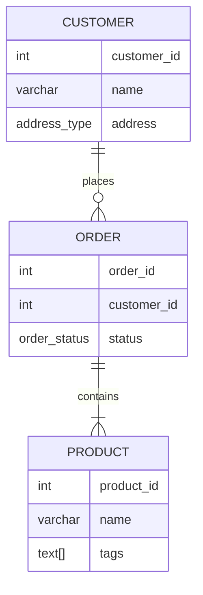

## 12.9 User-Defined Data Types and Structures

In the realm of SQL, user-defined data types (UDTs) and structures offer a powerful means to enforce data integrity and simplify complex data modeling. By allowing developers to create custom data types that encapsulate specific data formats or rules, UDTs enhance the flexibility and robustness of database systems. In this section, we will delve into various aspects of user-defined data types, including composite types, enumerated types, arrays, and domain types, exploring their definitions, usage, and benefits.

### Purpose of User-Defined Data Types

User-defined data types serve as a mechanism to extend the capabilities of SQL beyond its built-in data types. They allow developers to define custom data structures that can encapsulate complex data relationships, enforce specific constraints, and provide a more intuitive representation of data within the database. By leveraging UDTs, you can achieve:

- **Data Integrity**: Enforcing specific formats and constraints at the data type level ensures that only valid data is stored.
- **Simplification**: Complex data models can be simplified by encapsulating related fields into a single logical unit.
- **Reusability**: Custom data types can be reused across multiple tables and applications, promoting consistency and reducing redundancy.

### Composite Types

#### Definition

Composite types in SQL allow you to group multiple fields into a single logical unit. This is particularly useful when you want to represent complex data structures within a single column. Composite types can encapsulate related attributes, making it easier to manage and manipulate data.

#### Example

Consider a scenario where you need to store address information in a database. Instead of creating separate columns for street, city, state, and zip code, you can define a composite type to encapsulate these fields.

```sql
-- Define a composite type for address
CREATE TYPE address_type AS (
    street VARCHAR(100),
    city VARCHAR(50),
    state VARCHAR(20),
    zip_code VARCHAR(10)
);

-- Use the composite type in a table
CREATE TABLE customers (
    customer_id SERIAL PRIMARY KEY,
    name VARCHAR(100),
    address address_type
);
```

In this example, the `address_type` composite type groups the address-related fields into a single unit, simplifying the table structure and making it easier to manage address data.

### Enumerated Types (Enums)

#### Usage

Enumerated types, or enums, define a fixed set of valid values for a column. This is particularly useful when you want to restrict a column to a predefined list of values, such as days of the week, status codes, or categories.

#### Example

Let's define an enumerated type for order status in an e-commerce application.

```sql
-- Define an enumerated type for order status
CREATE TYPE order_status AS ENUM (
    'pending',
    'processing',
    'shipped',
    'delivered',
    'canceled'
);

-- Use the enumerated type in a table
CREATE TABLE orders (
    order_id SERIAL PRIMARY KEY,
    customer_id INT REFERENCES customers(customer_id),
    status order_status
);
```

In this example, the `order_status` enum restricts the status column to one of the predefined values, ensuring data consistency and reducing the risk of invalid entries.

### Arrays and Other Structures

#### Arrays

Arrays in SQL allow you to store collections of values within a single column. This is useful when you need to represent a list of items, such as tags, categories, or attributes, without creating separate tables or columns.

#### Example

Consider a scenario where you need to store a list of tags for each product in a catalog.

```sql
-- Create a table with an array column
CREATE TABLE products (
    product_id SERIAL PRIMARY KEY,
    name VARCHAR(100),
    tags TEXT[]
);

-- Insert a product with tags
INSERT INTO products (name, tags) VALUES
('Laptop', ARRAY['electronics', 'computers', 'gadgets']);
```

In this example, the `tags` column is an array of text values, allowing you to store multiple tags for each product in a single column.

#### Domain Types

Domain types are specialized types with constraints that enforce specific rules. They allow you to define custom data types with additional constraints, such as range checks, pattern matching, or default values.

#### Example

Let's define a domain type for email addresses with a constraint to ensure valid email format.

```sql
-- Define a domain type for email addresses
CREATE DOMAIN email_type AS VARCHAR(255)
CHECK (VALUE ~ '^[A-Za-z0-9._%+-]+@[A-Za-z0-9.-]+\.[A-Za-z]{2,}$');

-- Use the domain type in a table
CREATE TABLE users (
    user_id SERIAL PRIMARY KEY,
    email email_type
);
```

In this example, the `email_type` domain enforces a constraint to ensure that only valid email addresses are stored in the `email` column.

### Benefits of User-Defined Data Types

User-defined data types offer several benefits that enhance the overall design and functionality of a database system:

- **Data Integrity**: By enforcing specific constraints and formats at the data type level, UDTs ensure that only valid data is stored, reducing the risk of data corruption or inconsistency.
- **Simplification**: Complex data models can be simplified by encapsulating related fields into a single logical unit, making it easier to manage and manipulate data.
- **Reusability**: Custom data types can be reused across multiple tables and applications, promoting consistency and reducing redundancy.
- **Flexibility**: UDTs provide the flexibility to define custom data structures that can encapsulate complex data relationships and enforce specific rules.

### Design Considerations

When designing user-defined data types, consider the following:

- **Complexity**: Ensure that the complexity of the UDT is justified by the benefits it provides. Avoid over-engineering simple data structures.
- **Performance**: Consider the performance implications of using UDTs, particularly when dealing with large datasets or complex queries.
- **Compatibility**: Ensure that the UDTs are compatible with the database system and any external applications or tools that interact with the database.
- **Maintainability**: Design UDTs with maintainability in mind, ensuring that they can be easily modified or extended as requirements change.

### Differences and Similarities

User-defined data types share similarities with other data modeling techniques, such as composite keys or foreign key constraints, in that they both aim to enforce data integrity and simplify data relationships. However, UDTs provide a more flexible and reusable approach to defining custom data structures, allowing for greater encapsulation and abstraction.

### Try It Yourself

To gain hands-on experience with user-defined data types, try modifying the examples provided in this section. Experiment with creating your own composite types, enumerated types, arrays, and domain types. Consider how these custom data types can be applied to your own database projects to enhance data integrity and simplify complex data models.

### Visualizing User-Defined Data Types

To better understand the relationships and structures of user-defined data types, let's visualize a simple database schema using Mermaid.js.



This diagram illustrates the relationships between customers, orders, and products, highlighting the use of composite types, enumerated types, and arrays.

### References and Links

For further reading on user-defined data types and structures in SQL, consider the following resources:

- [PostgreSQL Documentation on User-Defined Types](https://www.postgresql.org/docs/current/xtypes.html)
- [MySQL User-Defined Data Types](https://dev.mysql.com/doc/refman/8.0/en/create-type.html)
- [SQL Server User-Defined Types](https://docs.microsoft.com/en-us/sql/relational-databases/user-defined-types)

### Knowledge Check

To reinforce your understanding of user-defined data types and structures, consider the following questions and exercises:

1. What are the benefits of using composite types in SQL?
2. How do enumerated types help enforce data integrity?
3. What are some use cases for arrays in SQL?
4. How can domain types be used to enforce specific constraints?
5. Create a composite type for storing contact information, including phone number and email address.

### Embrace the Journey

Remember, mastering user-defined data types and structures is just one step in your journey to becoming an expert in SQL design patterns. As you progress, you'll discover new ways to leverage these powerful tools to enhance your database systems. Keep experimenting, stay curious, and enjoy the journey!

## Quiz Time!



### What is a primary benefit of using user-defined data types in SQL?

- [x] Enforcing data integrity
- [ ] Increasing query speed
- [ ] Reducing storage requirements
- [ ] Simplifying database installation

> **Explanation:** User-defined data types help enforce data integrity by allowing developers to define specific formats and constraints at the data type level.

### Which SQL feature allows grouping multiple fields into a single logical unit?

- [x] Composite Types
- [ ] Enumerated Types
- [ ] Arrays
- [ ] Domain Types

> **Explanation:** Composite types allow grouping multiple fields into a single logical unit, simplifying complex data structures.

### What is the purpose of enumerated types in SQL?

- [x] Defining a fixed set of valid values for a column
- [ ] Storing collections within a single column
- [ ] Enforcing specific constraints
- [ ] Increasing data retrieval speed

> **Explanation:** Enumerated types define a fixed set of valid values for a column, ensuring data consistency and reducing invalid entries.

### How do arrays in SQL enhance data modeling?

- [x] By allowing storage of collections within a single column
- [ ] By increasing data retrieval speed
- [ ] By reducing storage requirements
- [ ] By simplifying database installation

> **Explanation:** Arrays allow storage of collections within a single column, making it easier to represent lists of items without creating separate tables or columns.

### What is a domain type in SQL?

- [x] A specialized type with constraints
- [ ] A type that stores collections
- [ ] A type that defines a fixed set of values
- [ ] A type that groups multiple fields

> **Explanation:** Domain types are specialized types with constraints that enforce specific rules, such as range checks or pattern matching.

### Which of the following is a benefit of using user-defined data types?

- [x] Reusability across multiple tables
- [ ] Increasing query speed
- [ ] Reducing storage requirements
- [ ] Simplifying database installation

> **Explanation:** User-defined data types can be reused across multiple tables and applications, promoting consistency and reducing redundancy.

### What should be considered when designing user-defined data types?

- [x] Complexity and performance implications
- [ ] Only the storage requirements
- [ ] Only the query speed
- [ ] Only the database installation process

> **Explanation:** When designing user-defined data types, consider complexity, performance implications, compatibility, and maintainability.

### How can user-defined data types simplify complex data models?

- [x] By encapsulating related fields into a single logical unit
- [ ] By increasing data retrieval speed
- [ ] By reducing storage requirements
- [ ] By simplifying database installation

> **Explanation:** User-defined data types simplify complex data models by encapsulating related fields into a single logical unit, making it easier to manage and manipulate data.

### What is a key difference between composite types and enumerated types?

- [x] Composite types group fields, while enumerated types define fixed values
- [ ] Composite types define fixed values, while enumerated types group fields
- [ ] Both group fields into a single unit
- [ ] Both define fixed values for a column

> **Explanation:** Composite types group multiple fields into a single logical unit, while enumerated types define a fixed set of valid values for a column.

### True or False: User-defined data types can only be used in PostgreSQL.

- [ ] True
- [x] False

> **Explanation:** User-defined data types are supported in various SQL database systems, including PostgreSQL, MySQL, and SQL Server.




