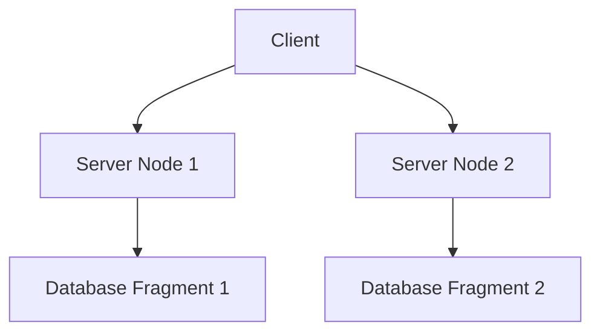

## 13.1 Introduction to Distributed Database Systems

In the ever-evolving landscape of data management, distributed database systems have emerged as a pivotal technology, enabling organizations to manage vast amounts of data across multiple locations efficiently. As expert software engineers and architects, understanding the intricacies of distributed databases is crucial for designing systems that are not only scalable and robust but also capable of meeting the demands of modern applications.

### Definition and Characteristics

**Definition**: A distributed database system is a collection of multiple, logically interrelated databases distributed over a computer network. Unlike traditional databases that reside on a single server, distributed databases spread data across various physical locations, which can be within the same building or across continents.

**Characteristics**:

- **Transparency**: One of the hallmark features of distributed databases is transparency. Users interact with the system as if it were a single database, despite the underlying complexity of data distribution. This transparency extends to various aspects, including location, replication, and fragmentation transparency.

- **Scalability**: Distributed databases are inherently scalable. By adding more nodes to the network, organizations can handle increased loads without significant performance degradation. This horizontal scalability is a key advantage over traditional, vertically scaled systems.

- **Reliability and Availability**: Distributed systems are designed to be fault-tolerant. Data replication across multiple nodes ensures that the system remains operational even if some nodes fail. This redundancy enhances both reliability and availability.

- **Autonomy**: Each node in a distributed database system can operate independently, allowing for localized control and management. This autonomy is beneficial for organizations with geographically dispersed operations.

### Architectural Models

Distributed database systems can be implemented using various architectural models, each with its own set of advantages and trade-offs. Understanding these models is essential for selecting the right architecture based on specific application requirements.

#### Client-Server Model

The client-server model is a traditional architecture where a central server provides services to multiple client nodes. In the context of distributed databases, the server manages the database, while clients send queries and receive responses.

- **Advantages**:
  - Centralized control simplifies management and security.
  - Easier to implement and maintain compared to more complex architectures.

- **Disadvantages**:
  - Potential bottlenecks at the server can limit scalability.
  - Single point of failure unless redundancy is implemented.

#### Peer-to-Peer Model

In a peer-to-peer (P2P) model, all nodes in the network have equal roles and responsibilities. There is no central server; instead, each node can act as both a client and a server.

- **Advantages**:
  - Eliminates single points of failure, enhancing fault tolerance.
  - Naturally scalable as nodes can be added or removed without disrupting the system.

- **Disadvantages**:
  - More complex to manage due to the lack of centralized control.
  - Consistency and coordination can be challenging, especially in large networks.

### Key Concepts in Distributed Database Systems

To fully grasp distributed database systems, it's important to understand several key concepts that underpin their operation.

#### Data Fragmentation

Data fragmentation involves dividing a database into smaller, manageable pieces, known as fragments, which are distributed across different nodes. There are three primary types of fragmentation:

- **Horizontal Fragmentation**: Divides a table into rows, distributing different rows across various nodes.
- **Vertical Fragmentation**: Splits a table into columns, with different columns stored on different nodes.
- **Hybrid Fragmentation**: Combines both horizontal and vertical fragmentation to optimize data distribution.

#### Data Replication

Replication involves maintaining copies of data across multiple nodes to ensure availability and fault tolerance. There are two main types of replication:

- **Synchronous Replication**: Updates are propagated to all replicas simultaneously, ensuring consistency but potentially impacting performance.
- **Asynchronous Replication**: Updates are propagated to replicas after the fact, improving performance but risking temporary inconsistencies.

#### Data Consistency

Ensuring data consistency across distributed nodes is a significant challenge. Various consistency models, such as eventual consistency and strong consistency, dictate how and when updates are propagated and synchronized across the system.

### Benefits of Distributed Database Systems

Distributed database systems offer numerous benefits that make them an attractive choice for modern applications:

- **Improved Performance**: By distributing data closer to where it is needed, distributed databases can reduce latency and improve query performance.
- **Enhanced Flexibility**: Organizations can tailor the distribution of data to match their operational needs, such as placing data near regional offices.
- **Cost Efficiency**: Leveraging commodity hardware and cloud resources can reduce infrastructure costs compared to traditional, centralized systems.

### Challenges and Considerations

While distributed database systems offer significant advantages, they also present unique challenges that must be addressed:

- **Complexity**: Designing and managing distributed systems is inherently more complex than traditional systems. This complexity extends to data consistency, fault tolerance, and network latency.
- **Security**: Ensuring data security across multiple locations requires robust encryption and access control mechanisms.
- **Network Dependency**: Distributed databases rely heavily on network infrastructure, making them susceptible to network-related issues such as latency and partitioning.

### Code Example: Basic Distributed Database Query

To illustrate how distributed databases work, let's consider a simple SQL query executed in a distributed environment. Assume we have a distributed database with two nodes, each storing different fragments of a customer table.

```sql
-- Node 1: Stores customers from the USA
SELECT * FROM Customers WHERE Country = 'USA';

-- Node 2: Stores customers from Europe
SELECT * FROM Customers WHERE Country = 'Europe';

-- Distributed Query: Retrieve all customers
-- This query is executed across both nodes
SELECT * FROM Customers;
```

In this example, the distributed query engine coordinates the execution of the query across both nodes, aggregating the results to present a unified view to the user.

### Visualizing Distributed Database Architecture

To better understand the architecture of distributed database systems, let's visualize a simple distributed database setup using a client-server model.



**Figure 1**: This diagram illustrates a client-server distributed database architecture with two server nodes, each managing a fragment of the database.

### Further Reading and Resources

For those interested in delving deeper into distributed database systems, consider exploring the following resources:

- [Distributed Systems: Principles and Paradigms](https://www.distributed-systems.net/)
- [Database Systems: The Complete Book](https://www.pearson.com/us/higher-education/program/Ullman-Database-Systems-The-Complete-Book-2nd-Edition/PGM33274.html)
- [CAP Theorem and Its Implications](https://en.wikipedia.org/wiki/CAP_theorem)

### Knowledge Check

To reinforce your understanding of distributed database systems, consider the following questions:

1. What are the primary characteristics of distributed database systems?
2. How does the client-server model differ from the peer-to-peer model in distributed databases?
3. What are the benefits and challenges associated with data fragmentation?
4. How does synchronous replication differ from asynchronous replication?
5. What are some common consistency models used in distributed databases?

### Embrace the Journey

As we conclude this introduction to distributed database systems, remember that mastering these concepts is a journey. The knowledge and skills you acquire will empower you to design and implement robust, scalable, and efficient data management solutions. Keep exploring, stay curious, and enjoy the journey!

## Quiz Time!



### What is a distributed database system?

- [x] A collection of multiple, logically interrelated databases distributed over a computer network.
- [ ] A single database stored on a central server.
- [ ] A database system that only supports horizontal scaling.
- [ ] A database system that does not support data replication.

> **Explanation:** A distributed database system consists of multiple databases distributed across a network, providing logical interrelation.

### What is a key characteristic of distributed databases?

- [x] Transparency
- [ ] Centralization
- [ ] Single point of failure
- [ ] Limited scalability

> **Explanation:** Transparency allows users to interact with the system as if it were a single database, despite its distributed nature.

### Which architectural model involves nodes having equal roles?

- [ ] Client-Server
- [x] Peer-to-Peer
- [ ] Master-Slave
- [ ] Centralized

> **Explanation:** In a peer-to-peer model, all nodes have equal roles and responsibilities, unlike the client-server model.

### What is horizontal fragmentation?

- [x] Dividing a table into rows and distributing them across nodes.
- [ ] Dividing a table into columns and distributing them across nodes.
- [ ] Combining rows and columns into a single node.
- [ ] Replicating data across all nodes.

> **Explanation:** Horizontal fragmentation involves distributing different rows of a table across various nodes.

### What is synchronous replication?

- [x] Updates are propagated to all replicas simultaneously.
- [ ] Updates are propagated to replicas after the fact.
- [ ] Data is only replicated during off-peak hours.
- [ ] Replication occurs only when a node fails.

> **Explanation:** Synchronous replication ensures updates are propagated simultaneously, maintaining consistency.

### What is a benefit of distributed databases?

- [x] Improved performance
- [ ] Increased complexity
- [ ] Single point of failure
- [ ] Limited scalability

> **Explanation:** Distributed databases improve performance by reducing latency and enhancing query efficiency.

### What is a challenge of distributed databases?

- [x] Complexity
- [ ] Simplicity
- [ ] Centralized control
- [ ] Limited data distribution

> **Explanation:** Distributed databases are inherently more complex to design and manage than traditional systems.

### What is the role of data replication in distributed databases?

- [x] Ensures availability and fault tolerance.
- [ ] Limits data distribution to a single node.
- [ ] Reduces data redundancy.
- [ ] Increases network latency.

> **Explanation:** Data replication maintains copies across nodes, enhancing availability and fault tolerance.

### What is the primary advantage of the peer-to-peer model?

- [x] Eliminates single points of failure.
- [ ] Centralized control.
- [ ] Simplified management.
- [ ] Limited scalability.

> **Explanation:** The peer-to-peer model enhances fault tolerance by eliminating single points of failure.

### True or False: Distributed databases rely heavily on network infrastructure.

- [x] True
- [ ] False

> **Explanation:** Distributed databases depend on network infrastructure for data distribution and communication between nodes.


