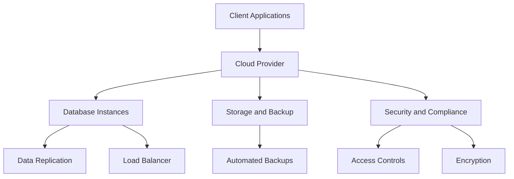

## 13.10 Database as a Service (DBaaS) Patterns

In the ever-evolving landscape of database management, Database as a Service (DBaaS) has emerged as a pivotal solution for organizations seeking to leverage cloud-based infrastructure for their database needs. DBaaS offers a managed database service that abstracts the complexities of physical administration, allowing developers and architects to focus on application development and innovation. In this section, we will delve into the various patterns associated with DBaaS, exploring their benefits, challenges, and best practices for implementation.

### Definition and Core Concepts

**Database as a Service (DBaaS)** refers to cloud-based services that provide database functionality without the need for physical administration. This model allows users to access and manage databases through a cloud provider, eliminating the need for hardware provisioning, software installation, and routine maintenance tasks.

#### Key Features of DBaaS

- **Simplified Management**: DBaaS providers handle the underlying infrastructure, including hardware provisioning, software updates, and backups, allowing users to focus on data and application logic.
- **Automatic Scalability**: Resources can be dynamically adjusted based on workload demands, ensuring optimal performance without manual intervention.
- **High Availability**: Built-in redundancy and failover mechanisms ensure that databases remain accessible and resilient to failures.
- **Security and Compliance**: Providers offer robust security features, including encryption, access controls, and compliance with industry standards.

### Benefits of DBaaS

1. **Cost Efficiency**: By eliminating the need for physical infrastructure and reducing operational overhead, DBaaS can significantly lower costs. Users pay only for the resources they consume, allowing for better budget management.
2. **Rapid Deployment**: With DBaaS, databases can be provisioned and configured in minutes, accelerating development cycles and time-to-market.
3. **Focus on Core Competencies**: By offloading database management tasks to the provider, organizations can concentrate on their core business activities and innovation.
4. **Global Accessibility**: Cloud-based databases can be accessed from anywhere, facilitating collaboration and remote work.

### Considerations and Challenges

While DBaaS offers numerous advantages, there are important considerations and challenges to address:

- **Cost Management**: Understanding the billing models and resource consumption is crucial to avoid unexpected expenses. It's essential to monitor usage and optimize configurations to manage costs effectively.
- **Vendor Lock-In**: Relying on a specific cloud provider can lead to vendor lock-in, making it challenging to switch providers or migrate data. It's important to evaluate the long-term implications and consider multi-cloud strategies.
- **Data Security and Privacy**: Ensuring data security and compliance with regulations is paramount. Organizations must assess the security measures provided by the DBaaS vendor and implement additional safeguards as needed.
- **Performance Variability**: While DBaaS offers scalability, performance can vary based on network latency and shared resources. It's important to conduct performance testing and optimize queries to mitigate these issues.

### DBaaS Patterns and Best Practices

#### 1. Multi-Tenancy Patterns

Multi-tenancy is a key consideration in DBaaS environments, where multiple customers share the same infrastructure. There are several patterns to implement multi-tenancy:

- **Shared Database, Shared Schema**: All tenants share the same database and schema, with tenant-specific data distinguished by a tenant identifier. This pattern is cost-effective but requires careful data isolation and security measures.
- **Shared Database, Separate Schema**: Each tenant has a separate schema within the same database. This pattern provides better data isolation while maintaining cost efficiency.
- **Separate Databases**: Each tenant has a dedicated database, offering the highest level of isolation and security. However, this pattern can be more costly and complex to manage.

#### 2. Elastic Scalability Patterns

DBaaS platforms offer various scalability options to handle fluctuating workloads:

- **Vertical Scaling**: Increasing the resources (CPU, memory) of a single database instance. This is suitable for applications with predictable growth but has limitations in terms of maximum capacity.
- **Horizontal Scaling**: Adding more database instances to distribute the load. This pattern is ideal for applications with unpredictable or rapidly growing workloads, as it allows for virtually unlimited scalability.

#### 3. High Availability and Disaster Recovery Patterns

Ensuring high availability and disaster recovery is critical in DBaaS environments:

- **Replication**: Data is replicated across multiple instances or regions to ensure availability in case of failures. Synchronous replication provides strong consistency, while asynchronous replication offers better performance.
- **Automated Backups**: Regular automated backups ensure data can be restored in case of data loss or corruption. It's important to verify backup integrity and test restore procedures regularly.
- **Failover Mechanisms**: Automatic failover mechanisms detect failures and switch to a standby instance, minimizing downtime and ensuring continuity.

#### 4. Security and Compliance Patterns

Implementing robust security and compliance measures is essential in DBaaS:

- **Encryption**: Data should be encrypted both at rest and in transit to protect against unauthorized access. DBaaS providers typically offer built-in encryption features.
- **Access Controls**: Implement fine-grained access controls to restrict database access based on roles and responsibilities. Regularly review and update access policies.
- **Audit Logging**: Enable audit logging to track database activities and detect suspicious behavior. Logs should be stored securely and reviewed regularly.

### Sample Code Snippet

Let's explore a simple example of connecting to a DBaaS instance using Python and the `psycopg2` library for PostgreSQL:

```python
import psycopg2
from psycopg2 import sql

db_config = {
    'dbname': 'your_database_name',
    'user': 'your_username',
    'password': 'your_password',
    'host': 'your_dbaas_host',
    'port': 'your_dbaas_port'
}

try:
    # Establish a connection to the DBaaS instance
    connection = psycopg2.connect(**db_config)
    cursor = connection.cursor()

    # Execute a simple query
    cursor.execute(sql.SQL("SELECT version();"))
    db_version = cursor.fetchone()
    print(f"Connected to DBaaS - PostgreSQL version: {db_version}")

except Exception as e:
    print(f"An error occurred: {e}")

finally:
    # Close the connection
    if connection:
        cursor.close()
        connection.close()
```

**Try It Yourself**: Modify the connection parameters to match your DBaaS instance and execute different SQL queries to explore the capabilities of your cloud-based database.

### Visualizing DBaaS Architecture

Below is a diagram illustrating a typical DBaaS architecture, highlighting key components such as the cloud provider, database instances, and client applications:



**Diagram Description**: This diagram represents the flow of data and interactions within a DBaaS architecture. Client applications connect to the cloud provider, which manages database instances, storage, security, and compliance. Data replication and load balancing ensure high availability and performance.

### Knowledge Check

To reinforce your understanding of DBaaS patterns, consider the following questions:

- What are the key benefits of using DBaaS over traditional on-premise databases?
- How can organizations mitigate the risk of vendor lock-in when using DBaaS?
- What are the differences between vertical and horizontal scaling in DBaaS environments?
- Why is it important to implement encryption and access controls in a DBaaS setup?

### Embrace the Journey

As you explore the world of DBaaS, remember that this is just the beginning. The cloud offers endless possibilities for innovation and growth. Keep experimenting, stay curious, and enjoy the journey of mastering cloud-based database solutions!

### References and Further Reading

- [AWS RDS Documentation](https://aws.amazon.com/rds/documentation/)
- [Azure SQL Database Overview](https://docs.microsoft.com/en-us/azure/azure-sql/)
- [Google Cloud SQL Documentation](https://cloud.google.com/sql/docs)
- [Database as a Service (DBaaS) Explained](https://www.ibm.com/cloud/learn/dbaas)

## Quiz Time!



### What is a primary benefit of using DBaaS?

- [x] Simplified management
- [ ] Increased hardware costs
- [ ] Manual scalability
- [ ] Reduced security

> **Explanation:** DBaaS simplifies management by handling infrastructure tasks, allowing users to focus on application development.

### Which pattern provides the highest level of data isolation in multi-tenancy?

- [ ] Shared Database, Shared Schema
- [ ] Shared Database, Separate Schema
- [x] Separate Databases
- [ ] Shared Schema, Separate Database

> **Explanation:** Separate Databases provide the highest level of isolation as each tenant has a dedicated database.

### What is a challenge associated with DBaaS?

- [ ] Simplified management
- [x] Vendor lock-in
- [ ] Automatic scalability
- [ ] High availability

> **Explanation:** Vendor lock-in is a challenge as it can make it difficult to switch providers or migrate data.

### What is vertical scaling in DBaaS?

- [x] Increasing resources of a single instance
- [ ] Adding more instances
- [ ] Reducing resources of a single instance
- [ ] Removing instances

> **Explanation:** Vertical scaling involves increasing the resources (CPU, memory) of a single database instance.

### How can organizations ensure data security in DBaaS?

- [x] Implement encryption
- [ ] Ignore access controls
- [ ] Disable audit logging
- [ ] Share credentials

> **Explanation:** Implementing encryption is crucial for protecting data in DBaaS environments.

### What is the role of automated backups in DBaaS?

- [x] Ensure data can be restored
- [ ] Increase data loss
- [ ] Reduce redundancy
- [ ] Eliminate failover

> **Explanation:** Automated backups ensure that data can be restored in case of data loss or corruption.

### Which scaling pattern is suitable for unpredictable workloads?

- [ ] Vertical scaling
- [x] Horizontal scaling
- [ ] Static scaling
- [ ] Manual scaling

> **Explanation:** Horizontal scaling is suitable for unpredictable workloads as it allows for adding more instances to distribute the load.

### What is a key feature of DBaaS?

- [x] High availability
- [ ] Manual updates
- [ ] Increased downtime
- [ ] Reduced accessibility

> **Explanation:** High availability is a key feature of DBaaS, ensuring databases remain accessible and resilient to failures.

### What is the purpose of audit logging in DBaaS?

- [x] Track database activities
- [ ] Increase unauthorized access
- [ ] Reduce compliance
- [ ] Eliminate security

> **Explanation:** Audit logging tracks database activities to detect suspicious behavior and ensure compliance.

### True or False: DBaaS eliminates the need for data encryption.

- [ ] True
- [x] False

> **Explanation:** False. Data encryption is still necessary in DBaaS to protect against unauthorized access.


