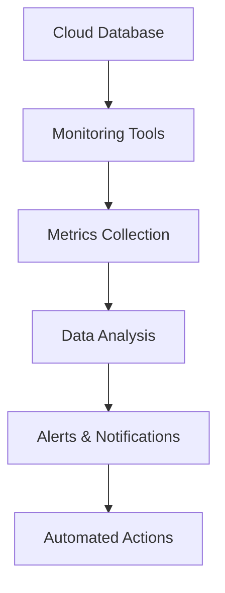

## 13.11 Monitoring and Managing Cloud Databases

In the realm of cloud databases, monitoring and management are critical components that ensure optimal performance, reliability, and scalability. As expert software engineers and architects, understanding the nuances of cloud database monitoring and management is essential for maintaining robust systems. This section delves into the tools, metrics, and strategies necessary for effective cloud database management.

### Introduction to Cloud Database Monitoring

Cloud databases offer flexibility and scalability, but they also introduce complexities in monitoring and management. Unlike traditional on-premises databases, cloud databases require a different approach due to their distributed nature and the dynamic environments they operate in. Monitoring cloud databases involves tracking performance metrics, resource utilization, and system health to ensure they meet the desired service levels.

### Monitoring Tools

Effective monitoring of cloud databases relies on a combination of native cloud tools and third-party solutions. Each tool offers unique features and capabilities, allowing you to tailor your monitoring strategy to your specific needs.

#### Native Cloud Tools

1. **AWS CloudWatch**: AWS CloudWatch is a comprehensive monitoring service that provides data and actionable insights for AWS resources. It allows you to collect and track metrics, set alarms, and automatically react to changes in your AWS resources.

   ```mermaid
   graph TD;
       A[AWS CloudWatch] --> B[Metrics Collection];
       A --> C[Alarms];
       A --> D[Automated Actions];
   ```

   *AWS CloudWatch Workflow: Collects metrics, sets alarms, and triggers automated actions.*

2. **Azure Monitor**: Azure Monitor provides full-stack monitoring for applications and infrastructure, offering insights into application performance, resource utilization, and operational health.

   ```mermaid
   graph TD;
       A[Azure Monitor] --> B[Application Insights];
       A --> C[Log Analytics];
       A --> D[Alerts];
   ```

   *Azure Monitor Components: Application insights, log analytics, and alerts for comprehensive monitoring.*

#### Third-Party Solutions

1. **Datadog**: Datadog is a monitoring and analytics platform for cloud-scale applications. It provides real-time visibility into the performance of your applications and infrastructure.

   ```mermaid
   graph TD;
       A[Datadog] --> B[Real-Time Metrics];
       A --> C[Dashboards];
       A --> D[Alerts & Notifications];
   ```

   *Datadog Features: Real-time metrics, customizable dashboards, and alerting capabilities.*

2. **New Relic**: New Relic offers application performance monitoring and observability, helping you understand how your applications are performing and where improvements can be made.

   ```mermaid
   graph TD;
       A[New Relic] --> B[Application Monitoring];
       A --> C[Infrastructure Monitoring];
       A --> D[User Experience Monitoring];
   ```

   *New Relic Monitoring: Focuses on application, infrastructure, and user experience.*

### Key Metrics for Cloud Database Monitoring

Monitoring cloud databases involves tracking a variety of metrics to ensure optimal performance and resource utilization. Key metrics include:

#### Performance Metrics

- **Latency**: Measures the time taken to process a request. High latency can indicate performance bottlenecks.
- **Throughput**: Represents the number of transactions processed per second. Monitoring throughput helps ensure the database can handle the load.
- **Error Rates**: Tracks the frequency of errors occurring in the database. A high error rate can indicate underlying issues that need attention.

#### Resource Utilization Metrics

- **CPU Utilization**: Indicates the percentage of CPU resources being used. High CPU utilization can lead to performance degradation.
- **Memory Usage**: Monitors the amount of memory being consumed by the database. Insufficient memory can cause slowdowns and crashes.
- **Storage Utilization**: Tracks the amount of storage space used. Running out of storage can lead to data loss and service interruptions.

### Automation in Cloud Database Management

Automation plays a crucial role in managing cloud databases, allowing for efficient scaling, alerting, and resource optimization.

#### Scaling Policies

Implementing scaling policies ensures that your cloud database can automatically adjust resources based on demand. This involves setting thresholds for CPU, memory, and storage utilization, and configuring the system to scale up or down as needed.

```sql
-- Example of setting an auto-scaling policy in AWS RDS
CREATE SCALING_POLICY my_scaling_policy
FOR my_database
WITH
  min_capacity = 2,
  max_capacity = 10,
  target_utilization = 70;
```

*SQL snippet for creating an auto-scaling policy in AWS RDS.*

#### Alerting

Setting up alerts is essential for proactive issue resolution. Alerts notify you when specific metrics exceed predefined thresholds, allowing you to address potential problems before they impact performance.

```sql
-- Example of setting an alert in Azure Monitor
CREATE ALERT my_alert
FOR metric_name = 'CPU Utilization'
WHEN value > 80
THEN notify 'admin@example.com';
```

*SQL snippet for creating an alert in Azure Monitor.*

### Best Practices for Monitoring and Managing Cloud Databases

1. **Regularly Review Metrics**: Continuously monitor key metrics to identify trends and anomalies. Regular reviews help you stay ahead of potential issues.

2. **Optimize Resource Utilization**: Use monitoring data to optimize resource allocation, ensuring that your database operates efficiently without over-provisioning.

3. **Implement Redundancy and Failover**: Ensure high availability by implementing redundancy and failover mechanisms. This minimizes downtime in case of failures.

4. **Conduct Performance Testing**: Regularly test the performance of your cloud database under different loads to identify bottlenecks and optimize configurations.

5. **Stay Informed on Updates**: Keep up-to-date with the latest features and updates from your cloud provider to leverage new capabilities and improvements.

### Visualizing Cloud Database Monitoring

To better understand the monitoring process, let's visualize a typical cloud database monitoring architecture using a flowchart.



*Cloud Database Monitoring Architecture: Involves metrics collection, data analysis, alerts, and automated actions.*

### Try It Yourself

Experiment with setting up monitoring for a cloud database using AWS CloudWatch or Azure Monitor. Modify the scaling policies and alert thresholds to see how they impact performance and resource utilization. This hands-on experience will deepen your understanding of cloud database management.

### References and Further Reading

- [AWS CloudWatch Documentation](https://docs.aws.amazon.com/cloudwatch/)
- [Azure Monitor Documentation](https://docs.microsoft.com/en-us/azure/azure-monitor/)
- [Datadog Monitoring](https://www.datadoghq.com/)
- [New Relic Observability](https://newrelic.com/)

### Knowledge Check

- What are the key performance metrics to monitor in a cloud database?
- How can automation improve cloud database management?
- Why is it important to regularly review monitoring metrics?

### Embrace the Journey

Remember, mastering cloud database monitoring and management is a continuous journey. As you gain experience, you'll develop a deeper understanding of how to optimize performance and ensure reliability. Keep experimenting, stay curious, and enjoy the journey!

## Quiz Time!



### What is the primary purpose of cloud database monitoring?

- [x] To ensure optimal performance and reliability
- [ ] To increase storage capacity
- [ ] To reduce the number of database users
- [ ] To eliminate the need for backups

> **Explanation:** Cloud database monitoring ensures optimal performance and reliability by tracking key metrics and identifying potential issues.

### Which tool is a native monitoring solution for AWS?

- [x] AWS CloudWatch
- [ ] Azure Monitor
- [ ] Datadog
- [ ] New Relic

> **Explanation:** AWS CloudWatch is a native monitoring solution for AWS resources.

### What metric measures the time taken to process a request in a cloud database?

- [x] Latency
- [ ] Throughput
- [ ] Error Rate
- [ ] CPU Utilization

> **Explanation:** Latency measures the time taken to process a request, indicating performance bottlenecks.

### What is the benefit of implementing scaling policies in cloud databases?

- [x] Automatically adjust resources based on demand
- [ ] Increase storage space
- [ ] Reduce the number of users
- [ ] Eliminate the need for monitoring

> **Explanation:** Scaling policies automatically adjust resources based on demand, ensuring efficient resource utilization.

### Which of the following is a third-party monitoring solution?

- [x] Datadog
- [ ] AWS CloudWatch
- [ ] Azure Monitor
- [ ] Google Cloud Monitoring

> **Explanation:** Datadog is a third-party monitoring solution for cloud-scale applications.

### What does CPU utilization indicate in cloud database monitoring?

- [x] The percentage of CPU resources being used
- [ ] The amount of storage space available
- [ ] The number of active users
- [ ] The speed of data transfer

> **Explanation:** CPU utilization indicates the percentage of CPU resources being used, affecting performance.

### Why is it important to set up alerts in cloud database monitoring?

- [x] To notify when specific metrics exceed thresholds
- [ ] To increase database storage
- [ ] To reduce the number of users
- [ ] To eliminate the need for backups

> **Explanation:** Alerts notify when specific metrics exceed thresholds, allowing proactive issue resolution.

### What is a key benefit of using Azure Monitor?

- [x] Full-stack monitoring for applications and infrastructure
- [ ] Increased storage capacity
- [ ] Reduced latency
- [ ] Elimination of backups

> **Explanation:** Azure Monitor provides full-stack monitoring for applications and infrastructure, offering comprehensive insights.

### Which metric represents the number of transactions processed per second?

- [x] Throughput
- [ ] Latency
- [ ] Error Rate
- [ ] Memory Usage

> **Explanation:** Throughput represents the number of transactions processed per second, indicating the database's ability to handle load.

### True or False: Regularly reviewing metrics helps identify trends and anomalies in cloud database performance.

- [x] True
- [ ] False

> **Explanation:** Regularly reviewing metrics helps identify trends and anomalies, allowing for proactive management and optimization.


