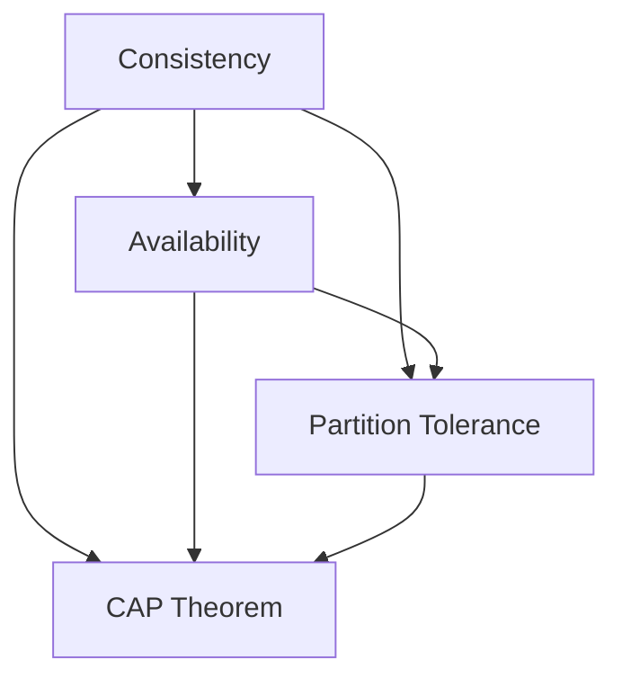

## 13.2 CAP Theorem and Its Implications

The CAP Theorem is a fundamental principle in the design and operation of distributed database systems. It provides a framework for understanding the trade-offs that must be made when designing systems that are distributed across multiple nodes or locations. In this section, we will delve into the CAP Theorem, its components, and the implications it has on distributed database design.

### Understanding the CAP Theorem

The CAP Theorem, introduced by computer scientist Eric Brewer in 2000, states that a distributed data store can only provide two out of the following three guarantees simultaneously:

1. **Consistency (C)**: Every read receives the most recent write or an error. This means that all nodes in the system see the same data at the same time. Consistency ensures that if a system performs a write operation, any subsequent read operation will reflect that write.

2. **Availability (A)**: Every request receives a response, without guarantee that it contains the most recent write. This implies that the system is operational and responsive, even if some nodes are down.

3. **Partition Tolerance (P)**: The system continues to operate despite arbitrary partitioning due to network failures. This means that the system can sustain network failures that split it into multiple isolated partitions.

The theorem posits that in the presence of a network partition, a distributed system must choose between consistency and availability. This is often summarized as "you can only pick two" out of consistency, availability, and partition tolerance.

### Visualizing the CAP Theorem

To better understand the CAP Theorem, let's visualize it using a Venn diagram:



**Diagram Description**: The Venn diagram illustrates the CAP Theorem's three properties: Consistency, Availability, and Partition Tolerance. The intersection of any two properties indicates the trade-offs involved in distributed system design.

### Implications of the CAP Theorem

The CAP Theorem has significant implications for the design and operation of distributed databases. Understanding these implications is crucial for making informed design choices.

#### Trade-offs in Distributed Systems

- **Consistency vs. Availability**: In the event of a network partition, a system must choose between consistency and availability. If consistency is prioritized, the system may become unavailable to ensure that all nodes have the same data. Conversely, if availability is prioritized, the system may return outdated data to ensure responsiveness.

- **Design Choices**: The choice between consistency and availability depends on the specific requirements of the application. For example, a banking system may prioritize consistency to ensure accurate financial transactions, while a social media platform may prioritize availability to ensure a seamless user experience.

#### Design Patterns and Strategies

To navigate the trade-offs imposed by the CAP Theorem, several design patterns and strategies can be employed:

1. **Eventual Consistency**: This approach allows for temporary inconsistencies, with the guarantee that all nodes will eventually converge to the same state. It is commonly used in systems where availability is prioritized over immediate consistency.

2. **Strong Consistency**: This approach ensures that all nodes reflect the most recent write immediately. It is suitable for applications where data accuracy is critical.

3. **Partition Tolerance**: Systems must be designed to handle network partitions gracefully. This can involve techniques such as data replication and sharding to ensure that the system remains operational even if some nodes are isolated.

### Code Example: Implementing Eventual Consistency

Let's explore a simple code example that demonstrates eventual consistency in a distributed system using a key-value store.

```sql
-- Create a table to store key-value pairs
CREATE TABLE KeyValueStore (
    Key VARCHAR(255) PRIMARY KEY,
    Value VARCHAR(255),
    LastUpdated TIMESTAMP
);

-- Insert a key-value pair
INSERT INTO KeyValueStore (Key, Value, LastUpdated)
VALUES ('user123', 'initial_value', CURRENT_TIMESTAMP);

-- Update the value for a key
UPDATE KeyValueStore
SET Value = 'updated_value', LastUpdated = CURRENT_TIMESTAMP
WHERE Key = 'user123';

-- Simulate eventual consistency by allowing a delay in propagation
-- Assume a function propagateChanges() that propagates changes to other nodes
CALL propagateChanges('user123');
```

**Code Explanation**: This SQL code snippet demonstrates a simple key-value store with eventual consistency. The `propagateChanges()` function simulates the propagation of changes to other nodes, allowing for temporary inconsistencies.

### Try It Yourself

Experiment with the code example by modifying the `propagateChanges()` function to introduce different propagation delays. Observe how the system behaves with varying levels of consistency and availability.

### Real-World Applications of the CAP Theorem

The CAP Theorem is not just a theoretical concept; it has practical applications in real-world distributed systems. Here are a few examples:

- **NoSQL Databases**: Many NoSQL databases, such as Cassandra and DynamoDB, are designed with eventual consistency in mind. They prioritize availability and partition tolerance, making them suitable for applications with high availability requirements.

- **Cloud Services**: Cloud-based services often face network partitions due to their distributed nature. Understanding the CAP Theorem helps architects design resilient systems that can handle such partitions gracefully.

- **Microservices Architecture**: In a microservices architecture, different services may have different consistency and availability requirements. The CAP Theorem guides the design of inter-service communication and data consistency strategies.

### Knowledge Check

Let's reinforce our understanding of the CAP Theorem with a few questions:

- What are the three properties of the CAP Theorem?
- How does the CAP Theorem influence the design of distributed databases?
- What is the difference between strong consistency and eventual consistency?

### Embrace the Journey

Remember, mastering the CAP Theorem is just the beginning of your journey in distributed database design. As you progress, you'll encounter more complex scenarios and trade-offs. Keep experimenting, stay curious, and enjoy the journey!

### References and Further Reading

- [CAP Theorem on Wikipedia](https://en.wikipedia.org/wiki/CAP_theorem)
- [Eric Brewer's Original Paper on CAP Theorem](https://www.cs.berkeley.edu/~brewer/cs262b-2004/PODC-keynote.pdf)
- [Consistency Models in Distributed Systems](https://jepsen.io/consistency)

## Quiz Time!



### What are the three properties of the CAP Theorem?

- [x] Consistency, Availability, Partition Tolerance
- [ ] Consistency, Accuracy, Performance
- [ ] Availability, Performance, Scalability
- [ ] Consistency, Scalability, Security

> **Explanation:** The CAP Theorem states that a distributed system can only provide two out of the following three guarantees: Consistency, Availability, and Partition Tolerance.

### In the presence of a network partition, which two properties can a distributed system choose to provide?

- [x] Consistency and Partition Tolerance
- [ ] Availability and Scalability
- [ ] Security and Consistency
- [x] Availability and Partition Tolerance

> **Explanation:** During a network partition, a system can choose to provide either Consistency and Partition Tolerance or Availability and Partition Tolerance, but not all three.

### What is eventual consistency?

- [x] A consistency model where all nodes eventually converge to the same state
- [ ] A model where all nodes are always consistent
- [ ] A model that prioritizes availability over consistency
- [ ] A model that ensures immediate consistency

> **Explanation:** Eventual consistency allows for temporary inconsistencies, with the guarantee that all nodes will eventually converge to the same state.

### Which type of system is likely to prioritize availability over consistency?

- [x] Social media platforms
- [ ] Banking systems
- [ ] Financial trading platforms
- [ ] Medical record systems

> **Explanation:** Social media platforms often prioritize availability to ensure a seamless user experience, even if it means serving slightly outdated data.

### What is the main trade-off described by the CAP Theorem?

- [x] The trade-off between consistency, availability, and partition tolerance
- [ ] The trade-off between performance, scalability, and security
- [ ] The trade-off between accuracy, speed, and reliability
- [ ] The trade-off between cost, efficiency, and flexibility

> **Explanation:** The CAP Theorem describes the trade-off between consistency, availability, and partition tolerance in distributed systems.

### Which of the following is a real-world application of the CAP Theorem?

- [x] NoSQL databases like Cassandra
- [ ] Relational databases like MySQL
- [ ] Single-node applications
- [ ] Standalone desktop applications

> **Explanation:** NoSQL databases like Cassandra are designed with eventual consistency in mind, prioritizing availability and partition tolerance.

### How does the CAP Theorem influence microservices architecture?

- [x] It guides the design of inter-service communication and data consistency strategies
- [ ] It dictates the programming language used for microservices
- [ ] It determines the hardware requirements for microservices
- [ ] It specifies the user interface design for microservices

> **Explanation:** The CAP Theorem influences the design of inter-service communication and data consistency strategies in microservices architecture.

### What is strong consistency?

- [x] A consistency model where all nodes reflect the most recent write immediately
- [ ] A model where all nodes eventually converge to the same state
- [ ] A model that prioritizes availability over consistency
- [ ] A model that ensures temporary inconsistencies

> **Explanation:** Strong consistency ensures that all nodes reflect the most recent write immediately, providing a consistent view of the data.

### Which of the following is NOT a property of the CAP Theorem?

- [x] Scalability
- [ ] Consistency
- [ ] Availability
- [ ] Partition Tolerance

> **Explanation:** Scalability is not one of the properties described by the CAP Theorem. The theorem focuses on consistency, availability, and partition tolerance.

### True or False: The CAP Theorem states that a distributed system can provide all three properties simultaneously.

- [ ] True
- [x] False

> **Explanation:** False. The CAP Theorem states that a distributed system can only provide two out of the three properties simultaneously.


