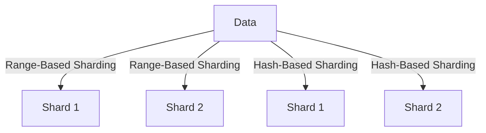

## 13.3 Sharding and Data Distribution Strategies

In the realm of distributed databases, sharding and data distribution strategies play a pivotal role in achieving scalability, performance, and fault tolerance. As data volumes grow, traditional single-node databases struggle to handle the load, necessitating the distribution of data across multiple nodes. This section delves into the concepts, strategies, and considerations of sharding, providing expert software engineers and architects with the knowledge to implement effective data distribution solutions.

### Understanding Sharding

**Sharding** is a database architecture pattern that involves partitioning data horizontally across multiple databases or nodes. Each partition, known as a shard, contains a subset of the total data. Sharding is particularly useful for scaling databases horizontally, allowing them to handle large volumes of data and high transaction loads by distributing the workload across multiple servers.

#### Key Concepts of Sharding

- **Horizontal Partitioning**: Unlike vertical partitioning, which divides data by columns, horizontal partitioning (sharding) divides data by rows. Each shard contains the same schema but a different subset of the data.
- **Shard Key**: A critical element in sharding, the shard key determines how data is distributed across shards. The choice of shard key impacts data distribution, query performance, and system scalability.
- **Shard Management**: Involves the creation, maintenance, and scaling of shards. Effective shard management ensures balanced data distribution and optimal performance.

### Sharding Strategies

Choosing the right sharding strategy is crucial for achieving balanced data distribution and efficient query processing. Two common strategies are range-based sharding and hash-based sharding.

#### Range-Based Sharding

**Range-Based Sharding** partitions data based on ranges of a sharding key. This strategy is intuitive and easy to implement, making it suitable for applications with predictable data access patterns.

- **Implementation**: Define ranges for the shard key and assign each range to a specific shard. For example, if the shard key is a timestamp, you might allocate one shard per month.
- **Advantages**: Simplifies range queries and allows for efficient data retrieval within a specific range.
- **Challenges**: Can lead to uneven data distribution if the data is not uniformly distributed across the ranges. Hotspots may occur if a particular range receives a disproportionate amount of traffic.

```sql
-- Example of range-based sharding
-- Assume we have a table `orders` with a shard key `order_date`
CREATE TABLE orders_shard_1 AS
SELECT * FROM orders WHERE order_date BETWEEN '2024-01-01' AND '2024-06-30';

CREATE TABLE orders_shard_2 AS
SELECT * FROM orders WHERE order_date BETWEEN '2024-07-01' AND '2024-12-31';
```

#### Hash-Based Sharding

**Hash-Based Sharding** uses a hash function to determine the placement of data across shards. This strategy is effective for achieving even data distribution.

- **Implementation**: Apply a hash function to the shard key and use the hash value to assign data to a shard. This approach ensures that data is evenly distributed, reducing the likelihood of hotspots.
- **Advantages**: Provides uniform data distribution and balances the load across shards.
- **Challenges**: Complex range queries may require querying multiple shards, leading to increased latency.

```sql
-- Example of hash-based sharding
-- Assume we have a table `users` with a shard key `user_id`
-- Use a hash function to determine the shard
CREATE TABLE users_shard_1 AS
SELECT * FROM users WHERE MOD(HASH(user_id), 2) = 0;

CREATE TABLE users_shard_2 AS
SELECT * FROM users WHERE MOD(HASH(user_id), 2) = 1;
```

### Considerations for Sharding

Implementing sharding requires careful consideration of several factors to ensure optimal performance and scalability.

#### Shard Key Selection

**Shard Key Selection** is critical for achieving even data distribution and efficient query performance. A well-chosen shard key minimizes data skew and balances the load across shards.

- **Criteria for Choosing a Shard Key**:
  - **Cardinality**: The shard key should have a high cardinality to ensure even distribution.
  - **Access Patterns**: Consider the application's query patterns to choose a shard key that optimizes common queries.
  - **Growth**: Anticipate future data growth and choose a shard key that can accommodate it.

#### Rebalancing Data

**Rebalancing Data** involves redistributing data across shards when adding or removing nodes. This process is essential for maintaining balanced data distribution and performance.

- **Challenges of Rebalancing**:
  - **Data Movement**: Moving data between shards can be resource-intensive and may impact performance.
  - **Consistency**: Ensure data consistency during the rebalancing process to prevent data loss or corruption.
  - **Downtime**: Minimize downtime during rebalancing to maintain service availability.

### Visualizing Sharding Strategies

To better understand sharding strategies, let's visualize the process using Mermaid.js diagrams.



**Diagram Description**: The diagram illustrates how data is distributed across shards using range-based and hash-based sharding strategies. In range-based sharding, data is divided into specific ranges, while in hash-based sharding, a hash function determines the shard placement.

### Design Considerations

When implementing sharding, consider the following design considerations to ensure a successful deployment:

- **Data Distribution**: Aim for even data distribution to prevent hotspots and ensure balanced load across shards.
- **Query Performance**: Optimize shard key selection and indexing strategies to enhance query performance.
- **Scalability**: Design the sharding architecture to accommodate future growth and scaling requirements.
- **Fault Tolerance**: Implement redundancy and failover mechanisms to ensure high availability and fault tolerance.

### Differences and Similarities

Sharding is often compared to other data distribution techniques, such as partitioning and replication. Understanding the differences and similarities can help in choosing the right strategy for your application.

- **Sharding vs. Partitioning**: While both involve dividing data, sharding distributes data across multiple nodes, whereas partitioning typically occurs within a single node.
- **Sharding vs. Replication**: Sharding focuses on distributing data, while replication involves copying data across multiple nodes for redundancy and fault tolerance.

### Try It Yourself

To solidify your understanding of sharding, try implementing a simple sharding strategy in a test environment. Experiment with different shard keys and observe the impact on data distribution and query performance.

- **Modify the Range**: Change the range in the range-based sharding example and observe how it affects data distribution.
- **Alter the Hash Function**: Experiment with different hash functions in the hash-based sharding example to see how it influences shard placement.

### References and Links

For further reading on sharding and data distribution strategies, consider the following resources:

- [Sharding in MongoDB](https://docs.mongodb.com/manual/sharding/)
- [Distributed SQL Databases](https://www.cockroachlabs.com/blog/distributed-sql-databases/)
- [Data Partitioning in Azure Cosmos DB](https://docs.microsoft.com/en-us/azure/cosmos-db/partitioning-overview)

### Knowledge Check

To reinforce your understanding of sharding and data distribution strategies, consider the following questions:

- What are the key differences between range-based and hash-based sharding?
- How does the choice of shard key impact data distribution and query performance?
- What are the challenges associated with rebalancing data across shards?

### Embrace the Journey

Remember, mastering sharding and data distribution strategies is a journey. As you progress, you'll gain a deeper understanding of distributed database architectures and their role in modern application development. Keep experimenting, stay curious, and enjoy the journey!

## Quiz Time!



### What is sharding in the context of databases?

- [x] Partitioning data horizontally across multiple databases
- [ ] Partitioning data vertically within a single database
- [ ] Replicating data across multiple nodes
- [ ] Encrypting data for security

> **Explanation:** Sharding involves partitioning data horizontally across multiple databases or nodes to achieve scalability and performance.

### Which sharding strategy uses a hash function to determine shard placement?

- [ ] Range-Based Sharding
- [x] Hash-Based Sharding
- [ ] Vertical Partitioning
- [ ] Replication

> **Explanation:** Hash-Based Sharding uses a hash function to distribute data evenly across shards.

### What is a shard key?

- [x] A key that determines how data is distributed across shards
- [ ] A key used for encrypting data in a shard
- [ ] A key that identifies a specific shard
- [ ] A key used for indexing data within a shard

> **Explanation:** The shard key is crucial for determining how data is distributed across shards, impacting data distribution and query performance.

### What is a potential disadvantage of range-based sharding?

- [x] Uneven data distribution leading to hotspots
- [ ] Complexity in implementing hash functions
- [ ] Difficulty in querying multiple shards
- [ ] Increased latency due to data replication

> **Explanation:** Range-based sharding can lead to uneven data distribution if the data is not uniformly distributed across the defined ranges.

### What is the primary goal of rebalancing data in a sharded database?

- [ ] To encrypt data for security
- [ ] To replicate data across shards
- [x] To maintain balanced data distribution and performance
- [ ] To partition data vertically

> **Explanation:** Rebalancing data ensures that data is evenly distributed across shards, maintaining balanced load and optimal performance.

### Which of the following is NOT a consideration when selecting a shard key?

- [ ] Cardinality
- [ ] Access Patterns
- [ ] Data Growth
- [x] Encryption Method

> **Explanation:** While cardinality, access patterns, and data growth are important considerations, the encryption method is not directly related to shard key selection.

### How does hash-based sharding achieve even data distribution?

- [ ] By using predefined ranges for data
- [x] By applying a hash function to the shard key
- [ ] By replicating data across all shards
- [ ] By encrypting data before distribution

> **Explanation:** Hash-based sharding applies a hash function to the shard key, ensuring even data distribution across shards.

### What is a common challenge associated with rebalancing data?

- [ ] Simplifying range queries
- [ ] Implementing hash functions
- [x] Data movement and consistency
- [ ] Encrypting data for security

> **Explanation:** Rebalancing data involves moving data between shards, which can be resource-intensive and may impact data consistency.

### Sharding is often compared to which other data distribution technique?

- [x] Partitioning
- [ ] Encryption
- [ ] Indexing
- [ ] Compression

> **Explanation:** Sharding is often compared to partitioning, as both involve dividing data, but sharding distributes data across multiple nodes.

### True or False: Sharding is primarily used for vertical scaling of databases.

- [ ] True
- [x] False

> **Explanation:** Sharding is primarily used for horizontal scaling, distributing data across multiple nodes to handle large volumes and high transaction loads.


