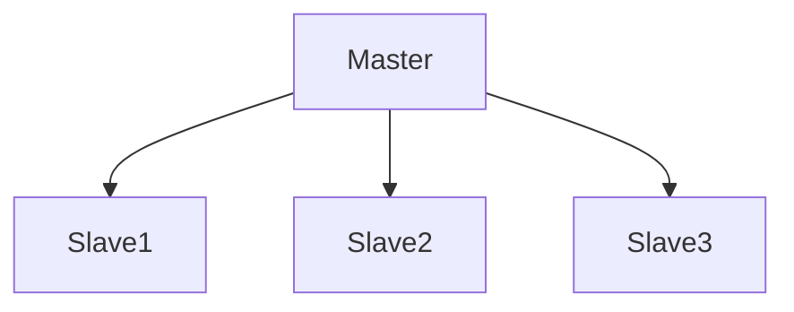
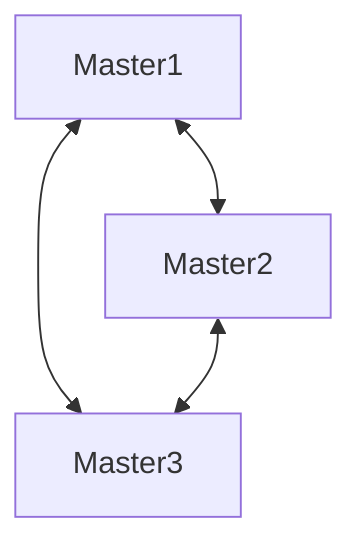
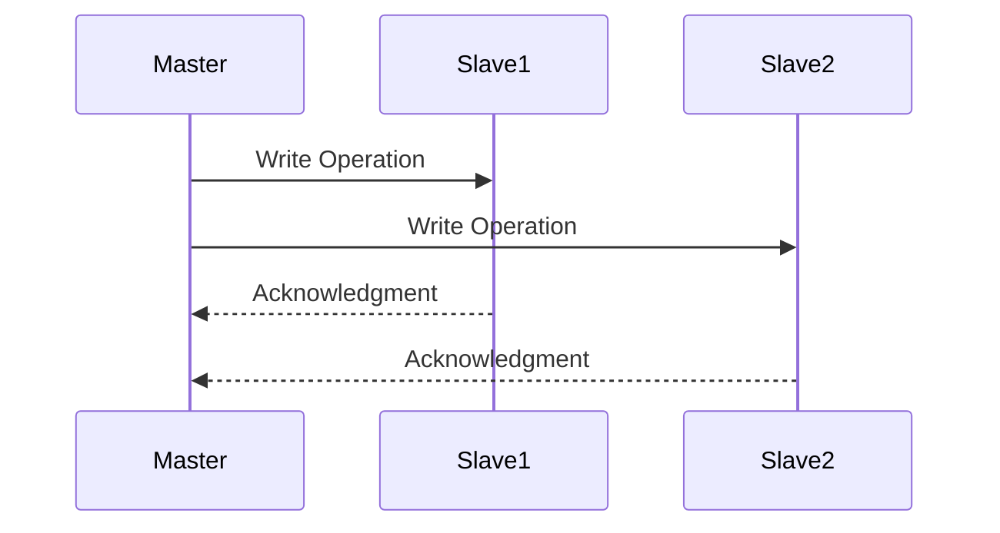
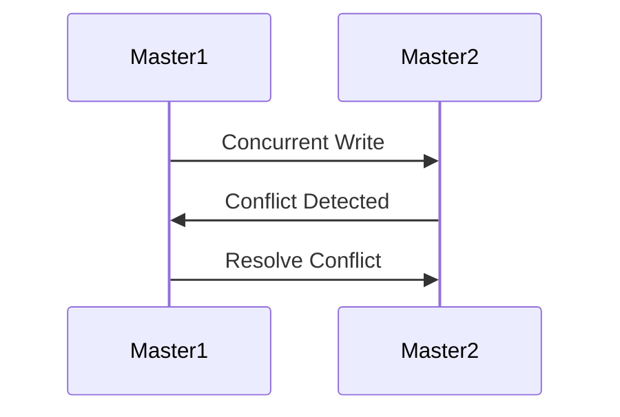

## 13.4 Replication Patterns

In the realm of distributed and cloud databases, replication is a cornerstone for achieving scalability, high availability, and fault tolerance. Replication involves copying and maintaining database objects, such as tables, in multiple database nodes. This section delves into the intricacies of replication patterns, focusing on synchronous and asynchronous replication, and the master-slave and master-master configurations. We will explore their use cases, benefits, and challenges, providing you with a comprehensive understanding of how to implement these patterns effectively.

### Understanding Replication

Replication is the process of sharing information across multiple databases to ensure consistency and reliability. It is a critical component in distributed systems, where data needs to be available across different geographical locations or cloud environments.

#### Key Concepts

- **Data Consistency**: Ensures that all replicas have the same data at any given time.
- **Data Availability**: Guarantees that data is accessible even if some nodes are down.
- **Fault Tolerance**: Allows the system to continue operating in the event of a failure.

### Replication Types

#### Synchronous Replication

Synchronous replication ensures that data is consistent across all nodes by waiting for all replicas to acknowledge the write operation before completing the transaction. This type of replication is ideal for applications where data consistency is paramount, such as financial systems.

**Advantages**:
- Guarantees data consistency.
- Ensures that all nodes have the latest data.

**Disadvantages**:
- Can impact performance due to the wait time for acknowledgments.
- May introduce latency in write operations.

#### Asynchronous Replication

Asynchronous replication allows the primary node to continue processing transactions without waiting for replicas to acknowledge the write. This approach improves performance but may lead to eventual consistency, where replicas might not have the latest data immediately.

**Advantages**:
- Enhances performance by reducing wait times.
- Suitable for applications where eventual consistency is acceptable.

**Disadvantages**:
- Risk of data inconsistency during network failures.
- Requires mechanisms to handle conflicts and data reconciliation.

### Replication Patterns

#### Master-Slave Replication

In the master-slave pattern, one node (the master) handles all write operations, while one or more slave nodes handle read operations. This pattern is widely used for scaling read-heavy applications.

**Diagram: Master-Slave Replication**



**Key Participants**:
- **Master Node**: Handles all write operations and propagates changes to slave nodes.
- **Slave Nodes**: Handle read operations and replicate data from the master.

**Applicability**:
- Ideal for applications with high read-to-write ratios.
- Suitable for scenarios where write operations need to be centralized.

**Design Considerations**:
- Ensure that the master node is robust and capable of handling write loads.
- Implement failover mechanisms to promote a slave to master in case of master failure.

**Sample Code Snippet**:

```sql
-- Example of setting up replication in MySQL
CHANGE MASTER TO
  MASTER_HOST='master_host',
  MASTER_USER='replication_user',
  MASTER_PASSWORD='replication_password',
  MASTER_LOG_FILE='recorded_log_file',
  MASTER_LOG_POS=recorded_log_position;

START SLAVE;
```

**Try It Yourself**:
- Experiment by adding more slave nodes and observe the impact on read performance.
- Simulate a master failure and configure a slave to take over as the new master.

#### Master-Master Replication

The master-master pattern involves multiple nodes that can accept write operations. This pattern is suitable for distributed systems where write operations need to be decentralized.

**Diagram: Master-Master Replication**



**Key Participants**:
- **Master Nodes**: All nodes can handle both read and write operations.

**Applicability**:
- Ideal for applications requiring high availability and fault tolerance.
- Suitable for geographically distributed systems.

**Design Considerations**:
- Implement conflict resolution mechanisms to handle concurrent writes.
- Ensure network reliability to minimize data divergence.

**Sample Code Snippet**:

```sql
-- Example of setting up master-master replication in PostgreSQL
ALTER SYSTEM SET wal_level = 'logical';
ALTER SYSTEM SET max_replication_slots = 4;
ALTER SYSTEM SET max_wal_senders = 4;

-- Create a replication slot
SELECT * FROM pg_create_logical_replication_slot('slot_name', 'output_plugin');
```

**Try It Yourself**:
- Test conflict resolution strategies by simulating concurrent writes.
- Monitor data consistency across nodes and implement reconciliation processes.

### Use Cases

#### Scaling Reads

Replication is an effective strategy for scaling read operations by distributing the load across multiple replicas. This is particularly useful for applications with high read-to-write ratios, such as content delivery networks and social media platforms.

#### High Availability

Replication enhances high availability by providing failover capabilities. In the event of a node failure, another node can take over, ensuring continuous data availability. This is crucial for mission-critical applications where downtime is not an option.

### Visualizing Replication Patterns

To better understand the flow of data in replication patterns, let's visualize the process using Mermaid.js diagrams.

**Diagram: Data Flow in Master-Slave Replication**



**Diagram: Conflict Resolution in Master-Master Replication**



### References and Links

For further reading on replication patterns and their implementation, consider the following resources:

- [MySQL Replication Documentation](https://dev.mysql.com/doc/refman/8.0/en/replication.html)
- [PostgreSQL Replication Documentation](https://www.postgresql.org/docs/current/logical-replication.html)
- [AWS RDS Replication](https://aws.amazon.com/rds/features/replication/)
- [Azure SQL Database Replication](https://docs.microsoft.com/en-us/azure/azure-sql/database/replication-overview)

### Knowledge Check

To reinforce your understanding of replication patterns, consider the following questions:

- What are the main differences between synchronous and asynchronous replication?
- How does the master-slave pattern help in scaling read operations?
- What are the challenges associated with master-master replication?

### Embrace the Journey

Remember, mastering replication patterns is a journey. As you explore these concepts, keep experimenting with different configurations and scenarios. Stay curious, and enjoy the process of building robust and scalable database systems!

## Quiz Time!



### What is the primary advantage of synchronous replication?

- [x] Guarantees data consistency across all nodes
- [ ] Improves write performance
- [ ] Reduces network latency
- [ ] Simplifies conflict resolution

> **Explanation:** Synchronous replication ensures that all nodes have the same data at any given time, which is crucial for applications requiring strong consistency.

### Which replication pattern is best suited for scaling read-heavy applications?

- [x] Master-Slave
- [ ] Master-Master
- [ ] Synchronous
- [ ] Asynchronous

> **Explanation:** The master-slave pattern is ideal for scaling read-heavy applications as it distributes read operations across multiple slave nodes.

### What is a key challenge of master-master replication?

- [x] Conflict resolution
- [ ] High read latency
- [ ] Limited scalability
- [ ] Single point of failure

> **Explanation:** Master-master replication requires mechanisms to handle conflicts that arise from concurrent writes to multiple nodes.

### In asynchronous replication, what is a potential downside?

- [x] Eventual consistency
- [ ] Increased write latency
- [ ] Reduced read performance
- [ ] Simplified setup

> **Explanation:** Asynchronous replication may lead to eventual consistency, where replicas might not have the latest data immediately.

### How does replication contribute to high availability?

- [x] Provides failover capabilities
- [ ] Reduces write latency
- [ ] Simplifies database design
- [ ] Eliminates the need for backups

> **Explanation:** Replication enhances high availability by allowing another node to take over in the event of a failure, ensuring continuous data access.

### What is a common use case for master-slave replication?

- [x] Scaling reads
- [ ] Decentralizing writes
- [ ] Conflict resolution
- [ ] Reducing write latency

> **Explanation:** Master-slave replication is commonly used to scale read operations by distributing the load across multiple slave nodes.

### Which type of replication is more suitable for applications requiring strong consistency?

- [x] Synchronous
- [ ] Asynchronous
- [ ] Master-Slave
- [ ] Master-Master

> **Explanation:** Synchronous replication is more suitable for applications requiring strong consistency as it ensures all nodes have the latest data.

### What is a benefit of asynchronous replication?

- [x] Improved performance
- [ ] Guaranteed data consistency
- [ ] Simplified conflict resolution
- [ ] Reduced network traffic

> **Explanation:** Asynchronous replication improves performance by allowing the primary node to continue processing transactions without waiting for replicas to acknowledge the write.

### In the master-master pattern, what is a critical design consideration?

- [x] Conflict resolution mechanisms
- [ ] Centralized write operations
- [ ] High read latency
- [ ] Single point of failure

> **Explanation:** Implementing conflict resolution mechanisms is critical in master-master replication to handle concurrent writes effectively.

### True or False: Replication can eliminate the need for database backups.

- [ ] True
- [x] False

> **Explanation:** Replication does not eliminate the need for backups. It provides redundancy and high availability but does not replace the need for regular backups to protect against data corruption or accidental deletion.


