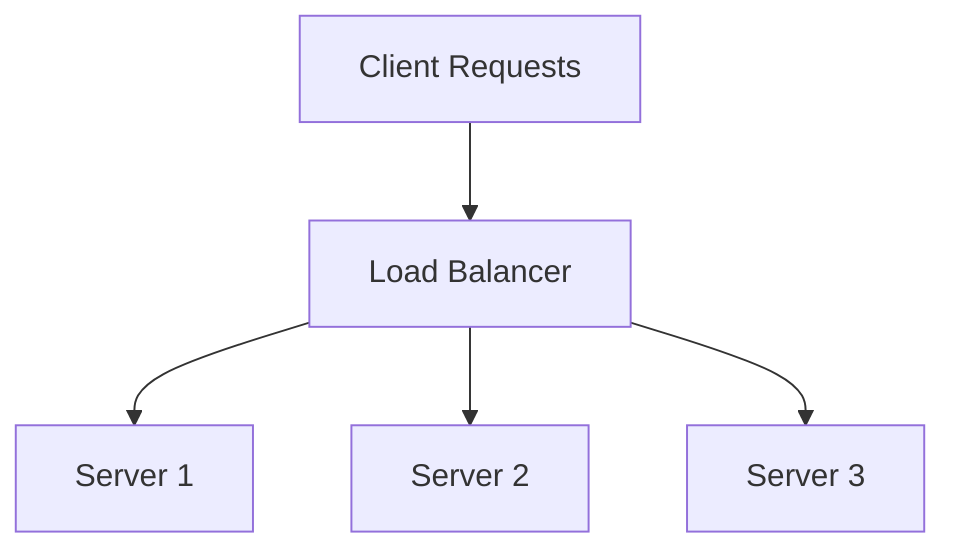
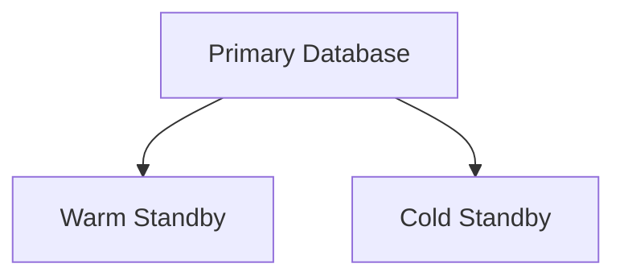
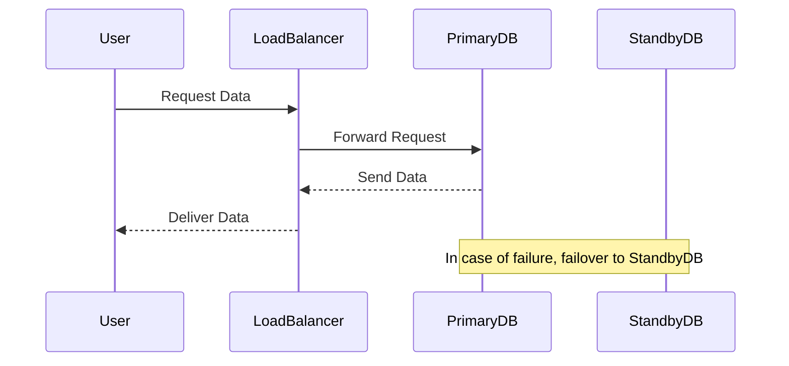

## 13.5 High Availability and Disaster Recovery

In today's digital world, ensuring that your SQL databases are always available and can recover quickly from disasters is crucial. High Availability (HA) and Disaster Recovery (DR) are two key strategies that help achieve this goal. Let's delve into these concepts, explore various techniques, and understand how they can be implemented effectively.

### High Availability (HA)

**High Availability** refers to the systems and processes that ensure a database remains operational and accessible with minimal downtime. The goal is to provide continuous service, even in the face of hardware failures, network issues, or other disruptions.

#### Key Concepts of High Availability

1. **Redundancy**: Duplicate critical components to avoid single points of failure.
2. **Failover**: Automatically switch to a standby system when the primary system fails.
3. **Load Balancing**: Distribute workloads across multiple servers to optimize resource use and avoid overload.
4. **Clustering**: Group multiple servers to work together as a single system, providing redundancy and failover capabilities.

#### Techniques for Achieving High Availability

##### Clustering

Clustering involves connecting multiple servers to act as a single unit. If one server fails, another takes over, ensuring uninterrupted service.

- **Active-Active Clustering**: All nodes are active and share the load. This setup provides better resource utilization and performance.
- **Active-Passive Clustering**: One node is active, while others are on standby. The standby nodes take over if the active node fails.

```sql
-- Example of setting up a basic SQL Server cluster
CREATE CLUSTERED INDEX IX_Cluster ON Orders (OrderID);
```

##### Automatic Failover

Automatic failover ensures that when a primary server fails, a secondary server takes over without manual intervention. This process is crucial for minimizing downtime.

- **Heartbeat Mechanism**: Regularly checks the health of the primary server. If it fails, the system triggers a failover.
- **Failover Time**: The time it takes to switch from the primary to the secondary server.

##### Load Balancing

Load balancing distributes incoming requests across multiple servers, preventing any single server from becoming a bottleneck.

- **Round Robin**: Distributes requests sequentially across servers.
- **Least Connections**: Directs traffic to the server with the fewest active connections.



### Disaster Recovery (DR)

**Disaster Recovery** focuses on restoring database services after catastrophic failures, such as natural disasters, cyber-attacks, or hardware failures. The objective is to minimize data loss and downtime.

#### Key Concepts of Disaster Recovery

1. **Recovery Point Objective (RPO)**: The maximum acceptable amount of data loss measured in time.
2. **Recovery Time Objective (RTO)**: The maximum acceptable downtime after a disaster.
3. **Data Backups**: Regularly saving copies of data to restore in case of loss.
4. **Standby Databases**: Secondary databases that can take over if the primary fails.

#### Strategies for Disaster Recovery

##### Data Backups

Regular backups are the cornerstone of any disaster recovery plan. They ensure that data can be restored to a previous state.

- **Full Backups**: Complete copy of the entire database.
- **Incremental Backups**: Only changes since the last backup are saved.
- **Differential Backups**: Changes since the last full backup are saved.

```sql
-- Example of creating a full backup in SQL Server
BACKUP DATABASE AdventureWorks
TO DISK = 'C:\Backups\AdventureWorks.bak';
```

##### Standby Databases

Standby databases are replicas of the primary database, kept in sync to take over in case of failure.

- **Warm Standby**: Partially active and can take over with minimal delay.
- **Cold Standby**: Not active and requires manual intervention to activate.



##### Replication

Replication involves copying data from one database to another, ensuring that multiple copies are available for recovery.

- **Synchronous Replication**: Data is copied in real-time, ensuring consistency.
- **Asynchronous Replication**: Data is copied with a delay, which may result in some data loss.

```sql
-- Example of setting up replication in SQL Server
EXEC sp_addpublication @publication = 'AdventureWorksPub', @status = N'active';
```

### Implementing High Availability and Disaster Recovery

To implement HA and DR effectively, consider the following steps:

1. **Assess Requirements**: Determine your RPO and RTO based on business needs.
2. **Choose the Right Tools**: Select clustering, failover, and backup solutions that fit your environment.
3. **Regular Testing**: Conduct regular failover and recovery tests to ensure systems work as expected.
4. **Monitor Continuously**: Use monitoring tools to detect issues early and respond quickly.

### Try It Yourself

Experiment with setting up a simple failover cluster using SQL Server. Modify the example code to create different types of backups and test the failover process. This hands-on experience will deepen your understanding of HA and DR strategies.

### Visualizing High Availability and Disaster Recovery



### References and Links

- [Microsoft SQL Server High Availability Solutions](https://docs.microsoft.com/en-us/sql/sql-server/failover-clusters/windows/always-on-availability-groups-sql-server?view=sql-server-ver15)
- [AWS Disaster Recovery Strategies](https://aws.amazon.com/disaster-recovery/)
- [Oracle Data Guard Concepts and Administration](https://docs.oracle.com/en/database/oracle/oracle-database/19/dgbkr/index.html)

### Knowledge Check

- What is the difference between active-active and active-passive clustering?
- How does automatic failover work, and why is it important?
- What are the key differences between full, incremental, and differential backups?

### Embrace the Journey

Remember, mastering high availability and disaster recovery is a journey. As you progress, you'll build more resilient and robust database systems. Keep experimenting, stay curious, and enjoy the journey!

## Quiz Time!



### What is the primary goal of High Availability (HA)?

- [x] Minimize downtime and ensure continuous operation.
- [ ] Maximize data storage capacity.
- [ ] Reduce server costs.
- [ ] Increase database complexity.

> **Explanation:** High Availability aims to minimize downtime and ensure that services remain operational even in the event of failures.

### Which technique involves automatically switching to a standby system when the primary system fails?

- [x] Failover
- [ ] Load Balancing
- [ ] Clustering
- [ ] Replication

> **Explanation:** Failover is the process of automatically switching to a standby system when the primary system fails.

### What is the difference between active-active and active-passive clustering?

- [x] Active-active uses all nodes, while active-passive has standby nodes.
- [ ] Active-passive uses all nodes, while active-active has standby nodes.
- [ ] Both are the same.
- [ ] Active-active is slower than active-passive.

> **Explanation:** In active-active clustering, all nodes are active and share the load, whereas in active-passive clustering, some nodes are on standby.

### What does RPO stand for in the context of disaster recovery?

- [x] Recovery Point Objective
- [ ] Recovery Process Objective
- [ ] Redundancy Point Objective
- [ ] Replication Point Objective

> **Explanation:** RPO stands for Recovery Point Objective, which is the maximum acceptable amount of data loss measured in time.

### Which type of backup saves only the changes since the last backup?

- [x] Incremental Backup
- [ ] Full Backup
- [ ] Differential Backup
- [ ] Synchronous Backup

> **Explanation:** Incremental backups save only the changes since the last backup, making them efficient in terms of storage and time.

### What is the purpose of a warm standby database?

- [x] To be partially active and ready to take over with minimal delay.
- [ ] To be fully active and handle all requests.
- [ ] To be inactive and require manual activation.
- [ ] To store archived data only.

> **Explanation:** A warm standby database is partially active and can take over with minimal delay in case of a primary database failure.

### How does synchronous replication differ from asynchronous replication?

- [x] Synchronous replication copies data in real-time, ensuring consistency.
- [ ] Asynchronous replication copies data in real-time, ensuring consistency.
- [ ] Synchronous replication is slower than asynchronous replication.
- [ ] Asynchronous replication ensures no data loss.

> **Explanation:** Synchronous replication copies data in real-time, ensuring that all copies are consistent, whereas asynchronous replication may have a delay.

### What is the role of a load balancer in high availability?

- [x] Distribute incoming requests across multiple servers.
- [ ] Store backup data.
- [ ] Monitor server health.
- [ ] Encrypt data in transit.

> **Explanation:** A load balancer distributes incoming requests across multiple servers to optimize resource use and prevent overload.

### Which of the following is NOT a key concept of disaster recovery?

- [x] Load Balancing
- [ ] Recovery Point Objective (RPO)
- [ ] Recovery Time Objective (RTO)
- [ ] Data Backups

> **Explanation:** Load balancing is related to high availability, not disaster recovery. Disaster recovery focuses on RPO, RTO, and data backups.

### True or False: High Availability and Disaster Recovery are the same.

- [ ] True
- [x] False

> **Explanation:** High Availability focuses on minimizing downtime and ensuring continuous operation, while Disaster Recovery focuses on restoring services after catastrophic failures.


